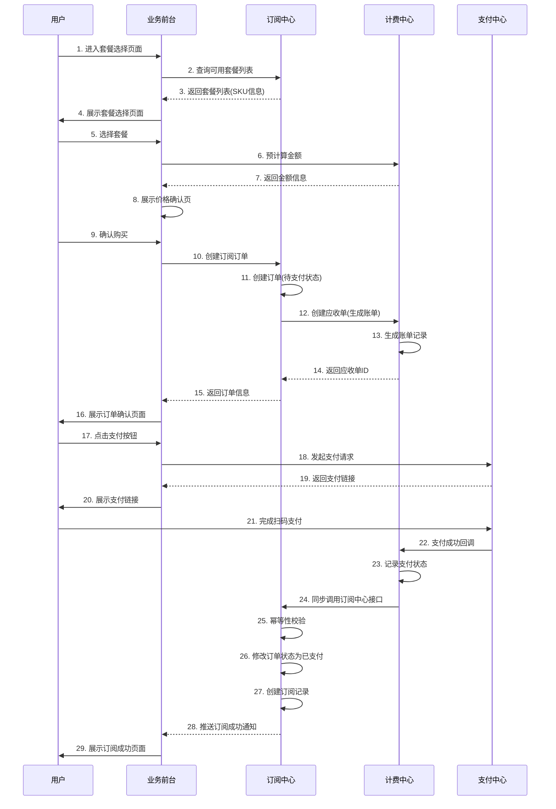
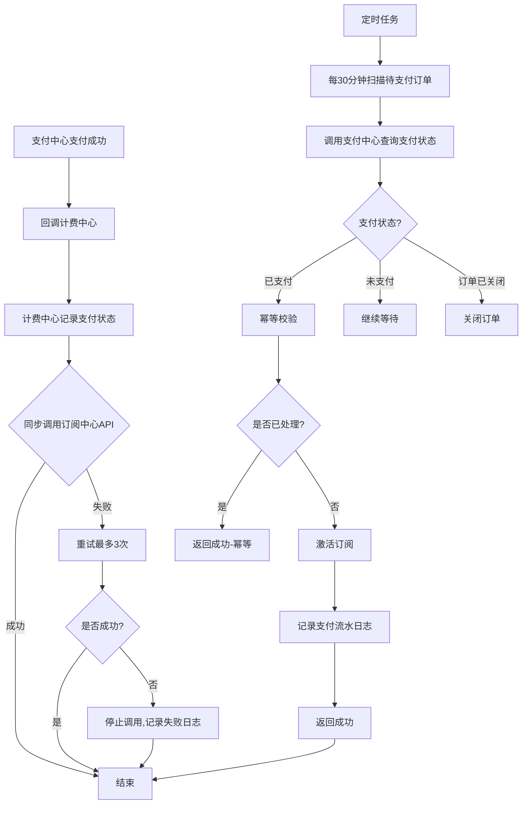
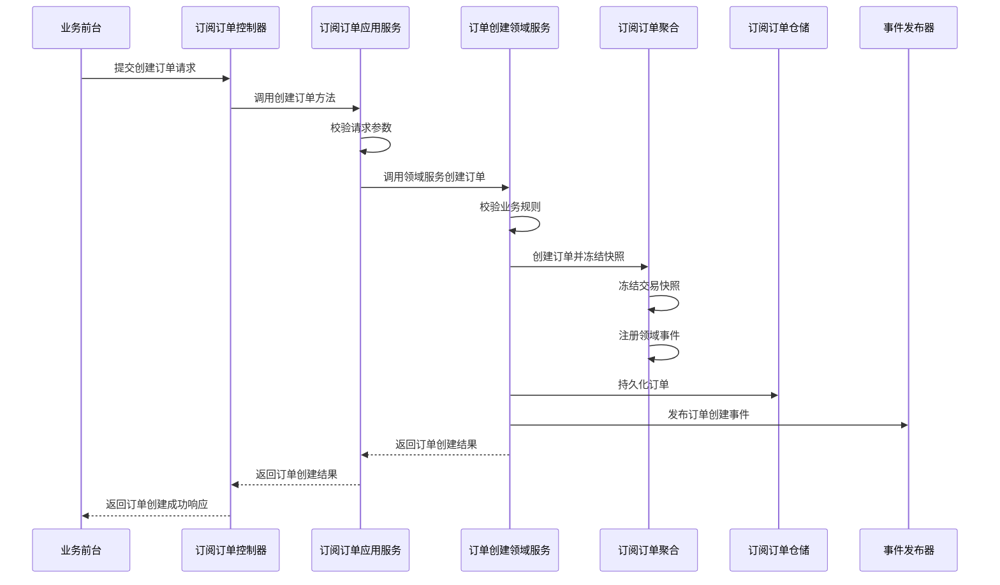
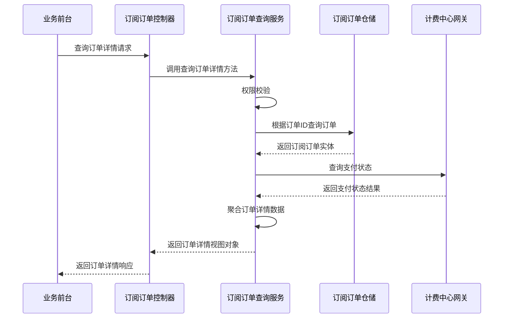
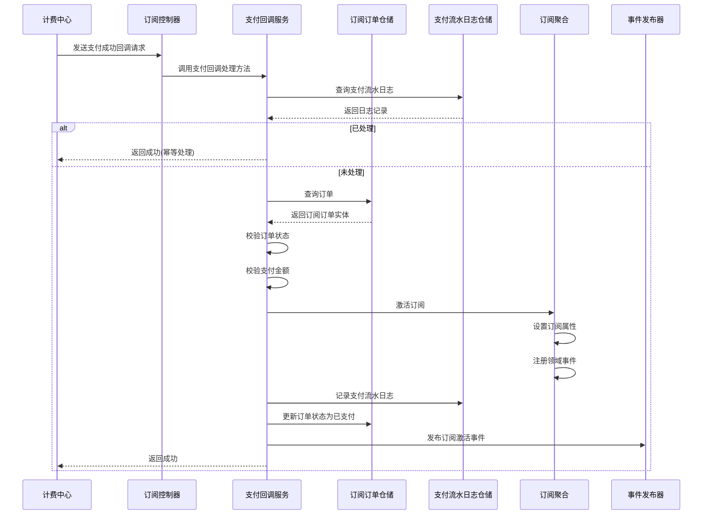
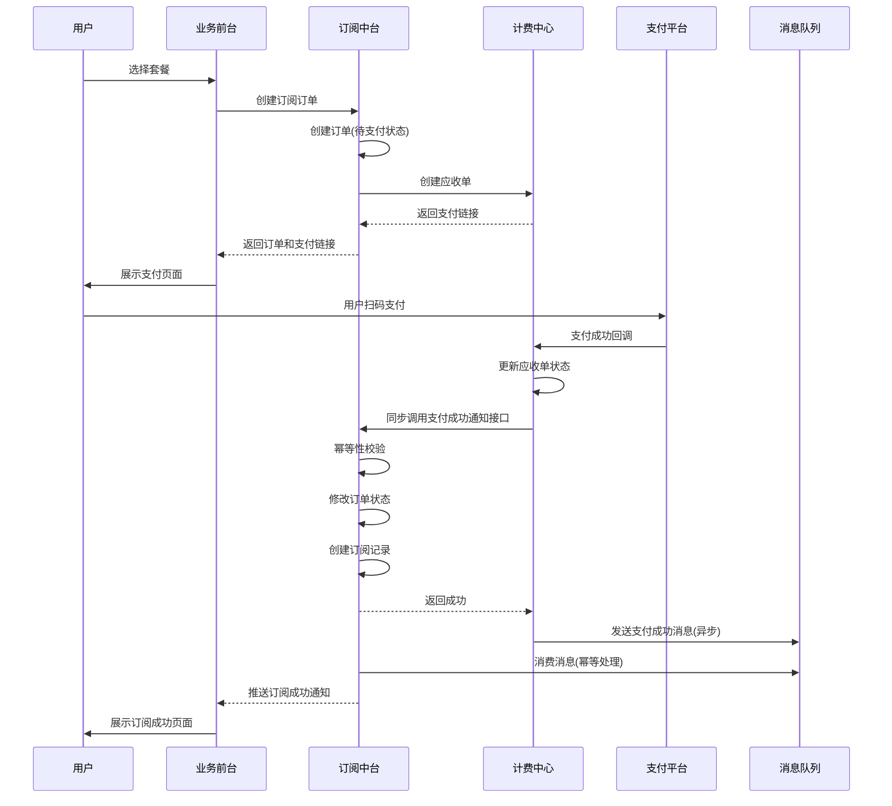
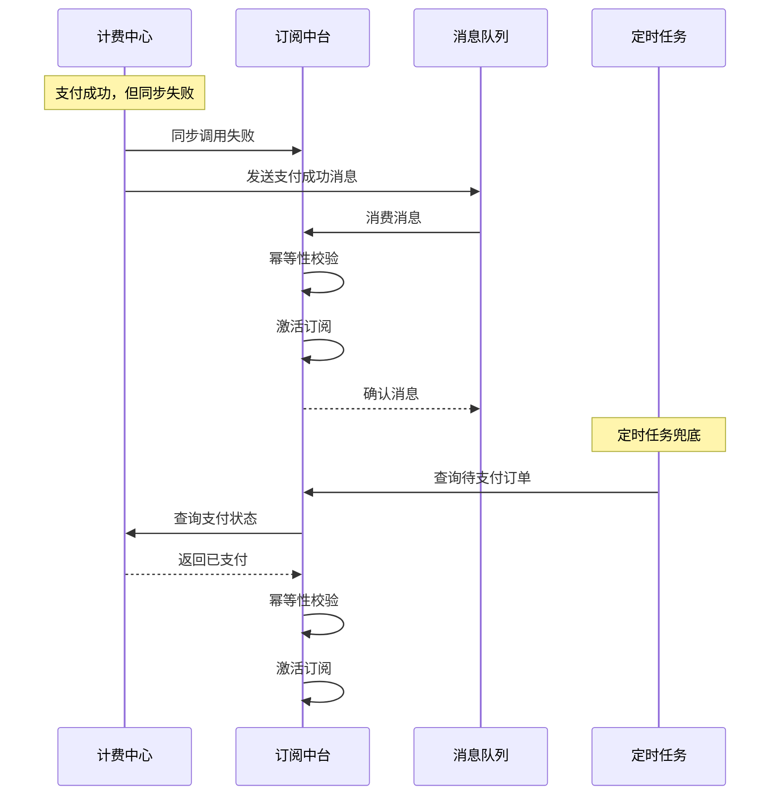
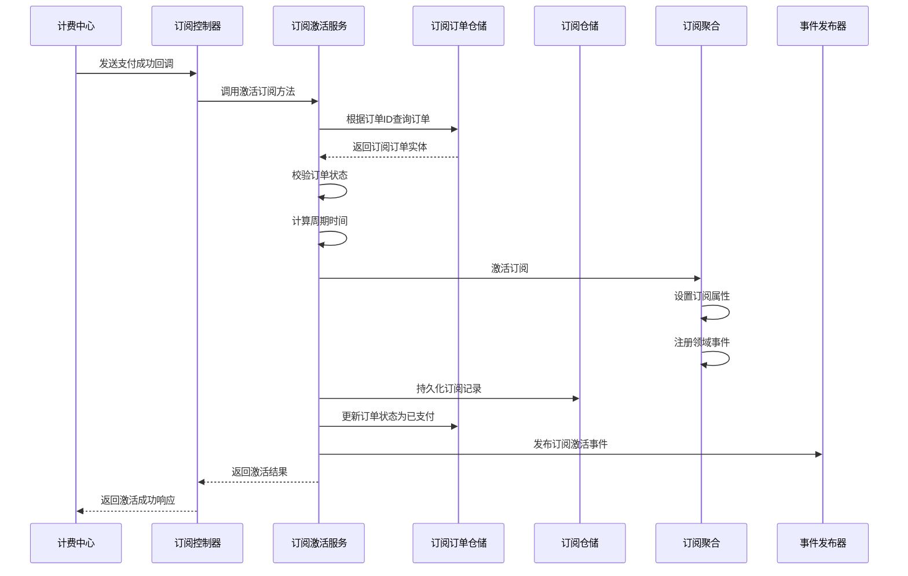
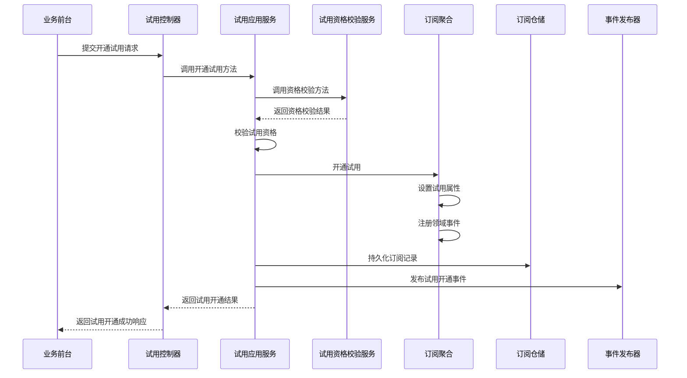
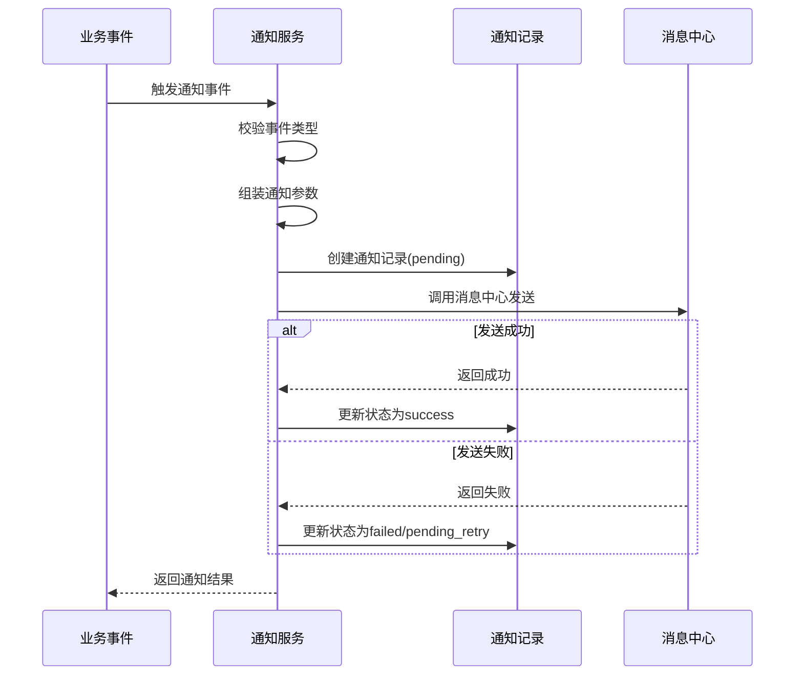

# 订阅管理中台详细设计文档

---
```plaintext
document_id: "DD001"
document_type: "detailed_design"
document_title: "订阅管理中台详细设计文档"
version: "1.0"
status: "draft"
project_id: "A001"
project_name: "华宽通订阅管理中台"
business_domain: "订阅管理"
business_requirement: "FR010"
functional_requirement: "FR010"
summary_design: "SD001"
detailed_design: "DD001"
microservice: "subscription-service"
author: "周未"
owner: "技术负责人"
created_date: "2026-04-21"
file_path: "订阅管理中台详细设计文档.md"
tags: ["详细设计", "订阅管理", "DDD", "微服务"]
keywords: ["订阅订单", "订阅记录", "SKU", "试用", "生命周期管理"]
```

# 详细设计文档

## 文档修订历史

| 版本 | 日期 | 修订人 | 修订内容 |
| --- | --- | --- | --- |
| 1.0 | 2026-04-21 | 周未 | 初始版本 |

## 文档目录

*   [1. 概述](#1-%E6%A6%82%E8%BF%B0)
    
*   [2. 程序结构设计总表](#2-%E7%A8%8B%E5%BA%8F%E7%BB%93%E6%9E%84%E8%AE%BE%E8%AE%A1%E6%80%BB%E8%A1%A8)
    
*   [3. 业务流程设计](#3-%E4%B8%9A%E5%8A%A1%E6%B5%81%E7%A8%8B%E8%AE%BE%E8%AE%A1)
    
    *   [3.1 订阅购买完整流程](#31-%E8%AE%A2%E9%98%85%E8%B4%AD%E4%B9%B0%E5%AE%8C%E6%95%B4%E6%B5%81%E7%A8%8B)
        
    *   [3.2 支付回调处理流程](#32-%E6%94%AF%E4%BB%98%E5%9B%9E%E8%B0%83%E5%A4%84%E7%90%86%E6%B5%81%E7%A8%8B)
        
    *   [3.3 数据同步方案设计](#33-%E6%95%B0%E6%8D%AE%E5%90%8C%E6%AD%A5%E6%96%B9%E6%A1%88%E8%AE%BE%E8%AE%A1)
        
*   [4. 详细设计说明](#4-%E8%AF%A6%E7%BB%86%E8%AE%BE%E8%AE%A1%E8%AF%B4%E6%98%8E)
    
    *   [4.1 订阅订单管理模块](#41-%E8%AE%A2%E9%98%85%E8%AE%A2%E5%8D%95%E7%AE%A1%E7%90%86%E6%A8%A1%E5%9D%97)
        
    *   [4.2 订阅管理模块](#42-%E8%AE%A2%E9%98%85%E7%AE%A1%E7%90%86%E6%A8%A1%E5%9D%97)
        
    *   [4.3 试用管理模块](#43-%E8%AF%95%E7%94%A8%E7%AE%A1%E7%90%86%E6%A8%A1%E5%9D%97)
        
    *   [4.4 SKU管理模块](#44-sku%E7%AE%A1%E7%90%86%E6%A8%A1%E5%9D%97)
        
    *   [4.5 通知管理模块](#45-%E9%80%9A%E7%9F%A5%E7%AE%A1%E7%90%86%E6%A8%A1%E5%9D%97)
        
    *   [4.6 自动任务模块](#46-%E8%87%AA%E5%8A%A8%E4%BB%BB%E5%8A%A1%E6%A8%A1%E5%9D%97)
        
    *   [4.7 外部服务集成](#47-%E5%A4%96%E9%83%A8%E6%9C%8D%E5%8A%A1%E9%9B%86%E6%88%90)
        
    *   [4.8 数据同步实现](#48-%E6%95%B0%E6%8D%AE%E5%90%8C%E6%AD%A5%E5%AE%9E%E7%8E%B0)
        
*   [5. 非功能设计](#5-%E9%9D%9E%E5%8A%9F%E8%83%BD%E8%AE%BE%E8%AE%A1)
    

---

## 1. 概述

### 1.1 文档目的

本文档是订阅管理中台的详细设计文档,基于《FR010\_订阅管理.md》功能需求规格说明书和《订阅管理中台\_DDD领域划分分析报告》进行详细设计,旨在为开发团队提供具体的实现指导。

### 1.2 系统概述

订阅管理中台是面向多个业务子系统(智慧畜牧、防霉管控等)的统一订阅能力中心,负责沉淀通用的订阅交易模型、生命周期规则、自动化任务、通知触发与审计追踪能力。

### 1.3 设计原则

1.  **DDD分层架构**:严格遵循领域驱动设计的分层架构原则
    
2.  **聚合设计**:一个事务只修改一个聚合,聚合之间通过ID引用
    
3.  **防腐层设计**:外部系统通过防腐层隔离,防止模型污染
    
4.  **统一语言**:使用领域统一语言进行命名和沟通
    

### 1.4 技术栈

*   **后端框架**:Spring Boot
    
*   **数据库**:PostgreSQL
    
*   **缓存**:Redis
    
*   **消息队列**:RocketMQ
    
*   **ORM框架**:MyBatis
    

---

## 2. 程序结构设计总表

### 2.1 功能模块清单

| 详细设计ID | 概要设计ID | 名称 | 类名 | 方法名 | 输入参数 | 输出结果 | 关联功能需求 | 代码文件路径 | 设计状态 | 设计人 | 评审日期 |
| --- | --- | --- | --- | --- | --- | --- | --- | --- | --- | --- | --- |
| DD-SUB-ORDER-001 | SD-SUB-001 | 创建订阅订单 | SubscriptionOrderApplicationService | createOrder | CreateOrderCommand | OrderCreationResult | FR-PLATFORM-001 | subscription-service/application/SubscriptionOrderApplicationService.java | 已完成 | 周未 | 2026-04-21 |
| DD-SUB-ORDER-002 | SD-SUB-001 | 查询订阅订单 | SubscriptionOrderQueryService | queryOrderDetail | QueryOrderDetailCommand | OrderDetailVO | FR-PLATFORM-002 | subscription-service/application/SubscriptionOrderQueryService.java | 已完成 | 周未 | 2026-04-21 |
| DD-SUB-001 | SD-SUB-002 | 查询订阅详情 | SubscriptionQueryService | querySubscriptionDetail | QuerySubscriptionDetailCommand | SubscriptionDetailVO | FR-PLATFORM-003 | subscription-service/application/SubscriptionQueryService.java | 已完成 | 周未 | 2026-04-21 |
| DD-SUB-003 | SD-SUB-002 | 激活订阅 | SubscriptionActivationService | activateSubscription | ActivateSubscriptionCommand | ActivationResult | FR-PLATFORM-003 | subscription-service/application/SubscriptionActivationService.java | 已完成 | 周未 | 2026-04-21 |
| DD-SUB-004 | SD-SUB-002 | 查询支付记录 | PaymentRecordQueryService | queryPaymentRecords | QueryPaymentRecordsCommand | PageResult | FR-PLATFORM-011 | subscription-service/application/PaymentRecordQueryService.java | 已完成 | 周未 | 2026-04-21 |
| DD-TRIAL-001 | SD-TRIAL-001 | 开通试用 | TrialApplicationService | openTrial | OpenTrialCommand | TrialOpenResult | FR-PLATFORM-004 | subscription-service/application/TrialApplicationService.java | 已完成 | 周未 | 2026-04-21 |
| DD-TRIAL-002 | SD-TRIAL-001 | 校验试用资格 | TrialEligibilityService | checkEligibility | CheckEligibilityCommand | EligibilityResult | FR-PLATFORM-004 | subscription-service/application/TrialEligibilityService.java | 已完成 | 周未 | 2026-04-21 |
| DD-TRIAL-003 | SD-TRIAL-001 | 试用转付费 | TrialConversionService | convertTrialToPaid | ConvertTrialCommand | ConversionResult | FR-PLATFORM-005 | subscription-service/application/TrialConversionService.java | 已完成 | 周未 | 2026-04-21 |
| DD-SKU-001 | SD-SKU-001 | 创建SKU | SKUApplicationService | createSKU | CreateSKUCommand | SKUCreationResult | FR-PLATFORM-009 | subscription-service/application/SKUApplicationService.java | 已完成 | 周未 | 2026-04-21 |
| DD-SKU-002 | SD-SKU-001 | 更新SKU | SKUApplicationService | updateSKU | UpdateSKUCommand | SKUUpdateResult | FR-PLATFORM-009 | subscription-service/application/SKUApplicationService.java | 已完成 | 周未 | 2026-04-21 |
| DD-SKU-003 | SD-SKU-001 | 上架SKU | SKUApplicationService | onShelfSKU | OnShelfSKUCommand | SKUOperationResult | FR-PLATFORM-009 | subscription-service/application/SKUApplicationService.java | 已完成 | 周未 | 2026-04-21 |
| DD-SKU-004 | SD-SKU-001 | 下架SKU | SKUApplicationService | offShelfSKU | OffShelfSKUCommand | SKUOperationResult | FR-PLATFORM-009 | subscription-service/application/SKUApplicationService.java | 已完成 | 周未 | 2026-04-21 |
| DD-SKU-005 | SD-SKU-001 | 归档SKU | SKUApplicationService | archiveSKU | ArchiveSKUCommand | SKUOperationResult | FR-PLATFORM-009 | subscription-service/application/SKUApplicationService.java | 已完成 | 周未 | 2026-04-21 |
| DD-SKU-006 | SD-SKU-001 | 查询SKU详情 | SKUQueryService | querySKUDetail | QuerySKUDetailCommand | SKUDetailVO | FR-PLATFORM-009 | subscription-service/application/SKUQueryService.java | 已完成 | 周未 | 2026-04-21 |
| DD-SKU-007 | SD-SKU-001 | 查询SKU列表 | SKUQueryService | querySKUList | QuerySKUListCommand | PageResult | FR-PLATFORM-009 | subscription-service/application/SKUQueryService.java | 已完成 | 周未 | 2026-04-21 |
| DD-NOTIFY-001 | SD-NOTIFY-001 | 通知触发 | NotificationApplicationService | triggerNotification | TriggerNotificationCommand | NotificationResult | FR-PLATFORM-006 | subscription-service/application/NotificationApplicationService.java | 已完成 | 周未 | 2026-04-23 |
| DD-TASK-001 | SD-TASK-001 | 通知补偿任务 | NotificationCompensationTask | execute | TaskExecutionContext | TaskExecutionResult | FR-PLATFORM-008 | subscription-service/task/NotificationCompensationTask.java | 已完成 | 周未 | 2026-04-21 |
| DD-TASK-002 | SD-TASK-001 | 失效待支付状态同步任务 | ExpiredPaymentSyncTask | execute | TaskExecutionContext | TaskExecutionResult | FR-PLATFORM-010 | subscription-service/task/ExpiredPaymentSyncTask.java | 已完成 | 周未 | 2026-04-21 |
| DD-TASK-003 | SD-TASK-001 | 进入宽限期扫描任务 | GracePeriodScanTask | execute | TaskExecutionContext | TaskExecutionResult | \- | subscription-service/task/GracePeriodScanTask.java | 已完成 | 周未 | 2026-04-21 |
| DD-TASK-004 | SD-TASK-001 | API窗口到期失效任务 | APIWindowExpiryTask | execute | TaskExecutionContext | TaskExecutionResult | \- | subscription-service/task/APIWindowExpiryTask.java | 已完成 | 周未 | 2026-04-21 |
| DD-TASK-005 | SD-TASK-001 | 宽限期结束扫描任务 | GracePeriodEndTask | execute | TaskExecutionContext | TaskExecutionResult | \- | subscription-service/task/GracePeriodEndTask.java | 已完成 | 周未 | 2026-04-21 |

### 2.2 聚合设计清单

| 聚合名称 | 聚合根 | 所属上下文 | 一致性边界 | 说明 |
| --- | --- | --- | --- | --- |
| 订阅订单聚合 | SubscriptionOrder | 订阅上下文 | 一个订阅订单对应一次购买交易 | 承载一次购买交易 |
| 订阅记录聚合 | Subscription | 订阅上下文 | 一个订阅记录对应一组订阅对象的服务权益 | 承载一组对象的服务权益记录 |
| SKU聚合 | SKU | 商品上下文 | SKU是统一商品定义 | 承载统一订阅商品、价格与试用策略 |
| API订阅账户聚合 | APISubscriptionAccount | 订阅上下文 | 一个API订阅账户对应一个客户在一个业务系统下的一个API产品 | 承载API场景下按客户与API产品编码聚合的订阅主视图 |

### 2.3 领域服务清单

| 服务名称 | 英文名称 | 所属上下文 | 职责 |
| --- | --- | --- | --- |
| 订单创建服务 | OrderCreationService | 订阅上下文 | 创建订阅订单,调用计费中心计算金额 |
| 订阅激活服务 | SubscriptionActivationService | 订阅上下文 | 支付成功后激活订阅 |
| 试用资格校验服务 | TrialEligibilityService | 试用上下文 | 校验试用资格 |
| 试用开通服务 | TrialOpeningService | 试用上下文 | 开通试用订阅 |
| 试用转付费服务 | TrialConversionService | 试用上下文 | 试用转付费 |
| 价格计算服务 | PricingService | 商品上下文 | 计算订单金额 |
| 通知触发服务 | NotificationTriggerService | 通知上下文 | 触发订阅生命周期事件通知 |
| 通知参数组装服务 | NotificationPayloadBuilder | 通知上下文 | 组装通知消息参数 |

---

## 3. 业务流程设计

### 3.1 订阅购买完整流程

#### 3.1.1 流程概述

订阅购买流程涉及用户、业务前台、订阅中心、计费中心、支付中心等多个参与方。流程明确三个中心的职责边界:计费中心负责金额计算,订阅中心负责生成订单和订阅记录,支付中心负责支付。通过同步API调用和异步消息队列双重保障机制,确保支付结果准确同步到订阅中心。

#### 3.1.2 完整流程图



#### 3.1.3 关键节点说明

| 节点 | 参与方 | 说明 | 数据流向 |
| --- | --- | --- | --- |
| 1. 进入套餐选择页面 | 用户 | 用户进入业务前台的套餐选择页面 | \- |
| 2. 查询可用套餐列表 | 订阅中心 | 业务前台调用订阅中心查询可用套餐列表 | Frontend→SubService |
| 3. 返回套餐列表(SKU信息) | 订阅中心 | 订阅中心返回可购买的套餐列表 | SubService→Frontend |
| 4. 展示套餐选择页面 | 业务前台 | 向用户展示套餐选择页面 | \- |
| 5. 选择套餐 | 用户 | 用户在业务前台页面选择订阅套餐 | \- |
| 6. 预计算金额 | 计费中心 | 业务前台调用计费中心预计算金额 | Frontend→BillingService |
| 7. 返回金额信息 | 计费中心 | 计费中心返回金额明细 | BillingService→Frontend |
| 8. 展示价格确认页 | 业务前台 | 向用户展示价格确认页面 | \- |
| 9. 确认购买 | 用户 | 用户确认购买 | \- |
| 10. 创建订阅订单 | 订阅中心 | 业务前台调用订阅中心创建订单 | Frontend→SubService |
| 11. 创建订单(待支付) | 订阅中心 | 订单状态为awaiting\_payment | \- |
| 12. 创建应收单(生成账单) | 计费中心 | 订阅中心调用计费中心创建应收单，计费中心生成账单记录 | SubService→BillingService |
| 13. 生成账单记录 | 计费中心 | 计费中心生成应收单账单记录 | \- |
| 14. 返回应收单ID | 计费中心 | 计费中心返回应收单ID给订阅中心 | BillingService→SubService |
| 15. 返回订单信息 | 订阅中心 | 返回订单ID等信息 | SubService→Frontend |
| 16. 展示订单确认页面 | 业务前台 | 向用户展示订单确认页面 | \- |
| 17. 点击支付按钮 | 用户 | 用户点击支付按钮 | \- |
| 18. 发起支付请求 | 支付中心 | 业务前台调用支付中心发起支付 | Frontend→PaymentService |
| 19. 返回支付链接 | 支付中心 | 返回支付链接或二维码 | PaymentService→Frontend |
| 20. 展示支付链接 | 业务前台 | 向用户展示支付链接 | \- |
| 21. 完成扫码支付 | 用户 | 用户完成支付操作 | \- |
| 22. 支付成功回调 | 支付中心 | 支付中心回调计费中心 | PaymentService→BillingService |
| 23. 记录支付状态 | 计费中心 | 计费中心记录支付状态 | \- |
| 24. 同步调用订阅中心API | 计费中心 | 计费中心调用订阅中心API | BillingService→SubService |
| 25. 幂等校验 | 订阅中心 | 使用支付流水号进行幂等校验 | \- |
| 26. 修改订单状态 | 订阅中心 | 订单状态改为paid | \- |
| 27. 创建订阅记录 | 订阅中心 | 创建active状态的订阅记录 | \- |
| 28. 推送订阅成功通知 | 订阅中心 | 推送订阅成功通知给业务前台 | SubService→Frontend |
| 29. 展示订阅成功页面 | 业务前台 | 向用户展示订阅成功页面 | \- |

### 3.2 支付回调处理流程

#### 3.2.1 流程概述

支付回调处理流程采用支付中心→计费中心→订阅中心的链式调用模式,通过同步API调用机制,确保支付结果准确同步到订阅中心。如果同步调用失败,则停止调用,由定时任务查询支付中心获取最终状态。

#### 3.2.2 流程图



#### 3.2.3 异常处理机制

| 异常场景 | 处理方式 |
| --- | --- |
| 同步API调用超时 | 计费中心记录失败日志,重试最多3次 |
| 同步API调用失败 | 计费中心记录失败日志,重试最多3次,停止后等待定时任务处理 |
| 重试3次仍失败 | 计费中心记录失败日志,停止调用,等待定时任务查询支付中心 |
| 订阅激活失败 | 订阅中心记录失败日志,等待人工处理 |
| 重复消息 | 通过支付流水号幂等键去重 |

### 3.3 数据同步方案设计

#### 3.3.1 支付状态同步(计费中心→订阅中心)

**同步方式:**

1.  **同步API调用(主流程)**
    
    *   计费中心支付成功后,立即调用订阅中心的支付成功通知接口
        
    *   接口路径: `POST /api/v1/subscription/payment/callback`
        
    *   超时时间: 5秒
        
    *   重试策略: 失败后立即重试最多3次,每次间隔1秒
        
    *   如果重试3次仍失败,则停止调用,记录失败日志
        
2.  **定时任务查询支付中心(兜底)**
    
    *   任务名称: `PaymentSyncTask`
        
    *   执行频率: 每30分钟执行一次
        
    *   处理逻辑:
        
        *   查询订阅中心中"待支付"状态的订单
            
        *   调用支付中心接口查询这些订单的支付状态
            
        *   如果支付中心显示已支付,则激活订阅
            
        *   如果支付中心显示未支付,则继续等待
            
        *   如果支付中心显示订单已关闭,则关闭订阅订单
            

**同步数据内容:**

```json
{
  "order_id": "订单ID",
  "payment_transaction_id": "支付流水号",
  "payment_amount": "支付金额",
  "payment_time": "支付成功时间",
  "payment_method": "支付方式",
  "payment_status": "支付状态"
}

```

#### 3.3.2 数据一致性保证

**最终一致性方案:**

1.  **计费中心侧:**
    
    *   支付成功后,先记录支付状态
        
    *   然后同步调用订阅中心API
        
    *   如果调用失败,重试最多3次
        
    *   如果重试3次仍失败,停止调用
        
2.  **订阅中心侧:**
    
    *   接收支付成功通知
        
    *   然后修改订单状态和创建订阅记录
        
    *   保证本地事务的原子性
        
    *   定时任务查询支付中心作为兜底
        

#### 3.3.3 幂等性设计

**幂等键设计:**

*   使用支付流水号(payment\_transaction\_id)作为幂等键
    
*   订阅中心维护已处理的支付流水号表
    
*   表结构:
    

**幂等处理逻辑:**

1.  接收到支付成功通知
    
2.  查询payment\_transaction\_log表
    
3.  如果已存在,直接返回成功(幂等)
    
4.  如果不存在,开启事务处理:
    
    *   插入payment\_transaction\_log记录
        
    *   修改订单状态
        
    *   创建订阅记录
        
    *   提交事务
        

---

## 4. 详细设计说明

### 4.1 订阅订单管理模块

#### 4.1.1 功能模块概述

**详细设计ID: DD-SUB-ORDER-MODULE**

**详细设计名称: 订阅订单管理模块**

订阅订单管理模块负责处理订阅订单的创建、查询等核心功能,是订阅管理中台的核心交易入口。

#### 4.1.2 创建订阅订单

**详细设计ID: DD-SUB-ORDER-001**

**详细设计名称: 创建订阅订单**

##### 3.1.2.1 功能

创建订阅订单接口接收业务前台提交的购买请求,生成待支付订阅订单,冻结交易快照,为后续支付中心支付和订阅统一激活提供基础数据。

**业务规则:**

1.  同一订单内的订阅对象必须属于同一用户、同一业务子系统、同一SKU、同一计费周期
    
2.  创建付费订单时,系统先生成待支付订单并冻结交易快照,订单金额由业务前台从计费中心预计算获得
    
3.  业务前台必须先调用计费中心预计算金额,再调用订阅中心创建订单
    
4.  订单创建成功后,系统仅冻结订单快照;支付成功后再创建active订阅记录并写入对象集合
    

##### 3.1.2.2 流程逻辑



##### 3.1.2.3 设计实现

**应用服务层**

```plaintext
class SubscriptionOrderApplicationService {
    function createOrder(CreateOrderCommand command) {
        // 1. 参数校验
        // 2. 幂等性检查
        // 3. 调用领域服务创建订单
        // 4. 返回结果
    }
}

```

**领域服务层**

```plaintext
class OrderCreationService {
    @Transactional
    function createOrder(CreateOrderCommand command) {
        // 1. 查询SKU信息
        // 2. 校验SKU销售状态
        // 3. 创建订单聚合根(金额从command中获取)
        // 4. 持久化订单
        // 5. 发布领域事件
        // 6. 返回结果
    }
}

```

**聚合根**

```plaintext
class SubscriptionOrder {
    // 订单ID、用户ID、业务系统编码、SKU编码、计费周期等属性
    
    function createAndFreeze(...) {
        // 校验业务规则
        // 设置订单属性
        // 注册领域事件
    }
    
    function markAsPaid(DateTime paymentTime) {
        // 支付成功处理
    }
    
    function close(CloseReason closeReason) {
        // 关闭订单
    }
}

```

##### 3.1.2.4 输入输出设计

**输入参数:**

| 参数名 | 类型 | 必填 | 说明 |
| --- | --- | --- | --- |
| user\_id | String | 是 | 订阅所属用户 |
| business\_system\_code | String | 是 | 发起交易的业务系统标识 |
| sku\_code | String | 是 | 订阅类SKU编码 |
| billing\_cycle | String | 是 | 计费周期:monthly/yearly |
| subscription\_duration\_months | Integer | 条件必填 | 月付场景的订阅时长(月),最小1 |
| targets | Array | 是 | 本次交易的订阅对象集合 |
| amount | Decimal | 是 | 订单金额(从计费中心预计算获得) |
| request\_id | String | 是 | 请求幂等键 |
| timezone | String | 否 | 订阅时区,IANA时区标识 |

**输出结果:**

| 参数名 | 类型 | 说明 |
| --- | --- | --- |
| order\_id | String | 订阅订单唯一标识 |
| order\_status | String | 订单状态:awaiting\_payment/paid/closed |
| amount\_snapshot | Decimal | 本次交易金额快照 |
| expired\_at | Datetime | 订单有效截止时间 |

##### 3.1.2.5 异常处理

| 异常场景 | 异常类型 | 错误码 | 处理方式 |
| --- | --- | --- | --- |
| SKU不存在 | BusinessException | E-SKU-001 | 返回错误提示,建议检查SKU编码 |
| SKU未上架 | BusinessException | E-SKU-001 | 返回错误提示,建议选择其他SKU |
| 订阅对象不合法 | BusinessException | E-TARGET-001 | 返回错误提示,建议校验对象 |
| 重复请求 | BusinessException | \- | 幂等返回已有订单结果 |

---

#### 4.1.3 查询订阅订单

**详细设计ID: DD-SUB-ORDER-002**

**详细设计名称: 查询订阅订单详情**

##### 3.1.3.1 功能

为业务前台、中台运营和系统补偿任务提供订单级查询能力,支持按订单号查看交易详情、支付进度、关联订阅记录和审计摘要。

**业务规则:**

1.  业务前台仅可查看本用户、本业务系统范围内的订单数据
    
2.  已关闭、已支付、异常补偿中的订单都必须可查询
    
3.  返回结果需进行字段脱敏,避免泄露支付敏感信息
    

##### 3.1.3.2 流程逻辑



##### 3.1.3.3 设计实现

```plaintext
class SubscriptionOrderQueryService {
    function queryOrderDetail(QueryOrderDetailCommand command) {
        // 1. 查询订单
        // 2. 权限校验
        // 3. 查询关联订阅记录
        // 4. 查询支付状态
        // 5. 聚合订单详情
    }
}

```

##### 3.1.3.4 输入输出设计

**输入参数:**

| 参数名 | 类型 | 必填 | 说明 |
| --- | --- | --- | --- |
| order\_id | String | 是 | 订单ID |

**输出结果:**

| 参数名 | 类型 | 说明 |
| --- | --- | --- |
| order\_id | String | 订单ID |
| user\_id | String | 用户ID |
| business\_system\_code | String | 业务系统编码 |
| sku\_code | String | SKU编码 |
| billing\_cycle | String | 计费周期 |
| target\_count | Integer | 订阅对象数量 |
| amount\_snapshot | Decimal | 金额快照 |
| order\_status | String | 订单状态 |
| payment\_status | String | 支付状态 |
| subscription\_id | String | 关联订阅ID |
| created\_at | Datetime | 创建时间 |

---

#### 4.1.4 支付成功回调接口

**详细设计ID: DD-SUB-ORDER-004**

**详细设计名称: 支付成功回调接口**

##### 3.1.4.1 功能

接收计费中心的支付成功通知,通过幂等性设计避免重复处理,修改订单状态并创建订阅记录。

**业务规则:**

1.  使用支付流水号作为幂等键,避免重复处理
    
2.  校验订单状态,只有待支付状态的订单才能激活
    
3.  校验支付金额,确保与订单金额一致
    
4.  在一个事务中完成订单状态修改和订阅记录创建
    

##### 3.1.4.2 流程逻辑



##### 3.1.4.3 设计实现

```plaintext
class PaymentCallbackService {
    @Transactional
    function handlePaymentCallback(PaymentCallbackCommand command) {
        // 1. 幂等性检查（支付流水号）
        // 2. 查询订单
        // 3. 校验订单状态
        // 4. 校验支付金额
        // 5. 修改订单状态为已支付
        // 6. 创建订阅记录
        // 7. 记录支付流水日志
        // 8. 发布领域事件
        // 9. 返回结果
    }
}

```

##### 3.1.4.4 输入输出设计

**输入参数:**

| 参数名 | 类型 | 必填 | 说明 |
| --- | --- | --- | --- |
| order\_id | String | 是 | 订阅订单ID |
| payment\_transaction\_id | String | 是 | 支付流水号 |
| payment\_amount | Decimal | 是 | 支付金额 |
| payment\_time | Datetime | 是 | 支付成功时间 |
| payment\_method | String | 是 | 支付方式 |

**输出结果:**

| 参数名 | 类型 | 说明 |
| --- | --- | --- |
| success | Boolean | 处理是否成功 |
| subscription\_id | String | 生成的订阅ID |
| message | String | 响应消息 |

##### 3.1.4.5 异常处理

| 异常场景 | 异常类型 | 错误码 | 处理方式 |
| --- | --- | --- | --- |
| 订单不存在 | BusinessException | E-ORDER-001 | 返回错误提示 |
| 订单状态不正确 | BusinessException | E-ORDER-003 | 返回错误提示,订单已支付 |
| 支付金额不一致 | BusinessException | E-PAYMENT-001 | 记录日志,等待人工处理 |
| 重复支付流水号 | \- | \- | 幂等返回成功 |

---

#### 4.1.5 正常支付流程时序图


---

#### 4.1.6 异常补偿流程时序图


---

### 4.2 订阅管理模块

#### 4.2.1 功能模块概述

**详细设计ID: DD-SUB-MODULE**

**详细设计名称: 订阅管理模块**

订阅管理模块负责订阅记录的查询、激活、生命周期管理等核心功能。

#### 4.2.2 激活订阅

**详细设计ID: DD-SUB-003**

**详细设计名称: 支付成功后激活订阅**

##### 3.2.2.1 功能

在计费中心回传支付成功结果后,基于订单快照创建并生效active订阅记录,写入周期信息、权益生效时间和来源订单,确保服务权益准确生效。

**业务规则:**

1.  仅已支付且尚未完成订阅落库的订单允许触发该动作
    
2.  周期开始与结束时间必须依据交易场景和原订阅状态计算
    
3.  激活失败时需进入一致性补偿,避免状态不一致
    

##### 3.2.2.2 流程逻辑



##### 3.2.2.3 设计实现

```plaintext
class SubscriptionActivationService {
    @Transactional
    function activateSubscription(ActivateSubscriptionCommand command) {
        // 1. 查询订单
        // 2. 校验订单状态
        // 3. 幂等性检查
        // 4. 计算周期时间
        // 5. 创建订阅记录
        // 6. 持久化订阅记录
        // 7. 更新订单状态为已支付
        // 8. 发布领域事件
        // 9. 返回结果
    }
}

```

**聚合根**

```plaintext
class Subscription {
    // 订阅ID、来源订单ID、用户ID、业务系统编码、SKU编码等属性
    
    function activate(...) {
        // 激活订阅(支付成功后)
    }
    
    function enterGracePeriod() {
        // 进入宽限期
    }
    
    function close(CloseReason closeReason) {
        // 关闭订阅
    }
}

```
---

### 4.3 试用管理模块

#### 4.3.1 功能模块概述

**详细设计ID: DD-TRIAL-MODULE**

**详细设计名称: 试用管理模块**

试用管理模块负责试用资格校验、试用开通、试用转付费等功能。

#### 4.3.2 开通试用

**详细设计ID: DD-TRIAL-001**

**详细设计名称: 开通试用**

##### 3.3.2.1 功能

为符合试用策略的客户开通免支付试用权益,直接生成lifecycle\_status=active且entitlement\_type=trial订阅记录,并返回试用起止时间和后续转付费入口信息。

**业务规则:**

1.  试用不创建订阅订单和应收单
    
2.  需按客户、业务系统、SKU维度校验试用资格
    
3.  试用策略受SKU配置限制,不允许业务子系统绕过
    
4.  MVP阶段试用资格采用"同一客户对同一SKU仅可试用一次"口径
    

##### 3.3.2.2 流程逻辑



##### 3.3.2.3 设计实现

```plaintext
class TrialApplicationService {
    @Transactional
    function openTrial(OpenTrialCommand command) {
        // 1. 校验试用资格
        // 2. 查询SKU信息
        // 3. 计算试用周期
        // 4. 创建试用订阅
        // 5. 持久化订阅记录
        // 6. 发布领域事件
        // 7. 返回结果
    }
}

class TrialEligibilityService {
    function checkEligibility(CheckEligibilityCommand command) {
        // 1. 校验SKU是否支持试用
        // 2. 校验客户是否已试用过该SKU
        // 3. 返回校验结果
    }
}

```
---

### 4.4 SKU管理模块

#### 4.4.1 功能模块概述

**详细设计ID: DD-SKU-MODULE**

**详细设计名称: SKU管理模块**

SKU管理模块负责SKU的创建、维护、上下架、归档等管理功能。

#### 4.4.2 创建SKU

**详细设计ID: DD-SKU-001**

**详细设计名称: 创建SKU**

##### 3.4.2.1 功能

由中台统一创建和维护订阅类SKU,管理服务简介、服务介绍、计费周期、计费方式、多档价格与周期、试用策略、销售状态和适用业务系统范围。

**业务规则:**

1.  sku\_code需全局唯一
    
2.  SKU至少需维护一条价格档位
    
3.  API类SKU需配置配额定义
    
4.  价格档位创建后不支持变更
    

##### 3.4.2.2 设计实现

```plaintext
class SKUApplicationService {
    @Transactional
    function createSKU(CreateSKUCommand command) {
        // 1. 校验SKU编码唯一性
        // 2. 校验价格策略
        // 3. 校验配额定义(API类SKU)
        // 4. 创建SKU聚合根
        // 5. 持久化SKU
        // 6. 发布领域事件
        // 7. 返回结果
    }
    
    function onShelfSKU(OnShelfSKUCommand command) {
        // 上架SKU
    }
    
    function offShelfSKU(OffShelfSKUCommand command) {
        // 下架SKU
    }
}

```

**聚合根**

```plaintext
class SKU {
    // SKU ID、SKU编码、SKU名称、SKU类型等属性
    
    function create(...) {
        // 创建SKU
    }
    
    function onShelf() {
        // 上架SKU
    }
    
    function offShelf() {
        // 下架SKU
    }
    
    function supportsTrial() {
        // 是否支持试用
    }
    
    function allowsNewPurchase() {
        // 是否允许新购
    }
}

```
---

### 4.5 通知管理模块

#### 4.5.1 功能模块概述

**详细设计ID: DD-NOTIFY-MODULE**

**详细设计名称: 通知管理模块**

通知管理模块负责订阅生命周期事件的通知触发、通知记录管理和通知补偿等功能。

#### 4.5.2 通知触发

**详细设计ID: DD-NOTIFY-001**

**详细设计名称: 通知触发**

##### 4.5.2.1 功能

为订阅全生命周期提供统一通知出口,在关键业务事件发生时触发通知,组装通知参数并调用消息中心发送通知。

**业务规则:**

1.  仅关键业务事件允许触发通知,不允许任意手工构造
    
2.  通知模板由消息中心承接,中台只负责事件触发和参数透传
    
3.  通知失败必须进入补偿队列
    
4.  同一业务事件重复回放时,通知触发需具备幂等保护
    

##### 4.5.2.2 流程逻辑



##### 4.5.2.3 设计实现

```plaintext
/**
 * 通知应用服务
 * 负责订阅生命周期事件的通知触发
 */
class NotificationApplicationService {
    
    /**
     * 触发通知
     * @param command 通知触发命令
     * @return 通知触发结果
     */
    function triggerNotification(TriggerNotificationCommand command): NotificationResult {
        // 1. 校验事件类型是否支持
        // 2. 幂等性检查(request_id)
        // 3. 组装通知参数
        // 4. 创建通知记录
        // 5. 调用消息中心发送
        // 6. 更新通知状态
        // 7. 返回结果
    }
}

/**
 * 通知领域服务
 * 负责通知参数组装和业务规则校验
 */
class NotificationDomainService {
    
    /**
     * 组装订阅开通通知参数
     * @param subscription 订阅信息
     * @return 通知参数
     */
    function buildSubscriptionOpenedPayload(Subscription subscription): NotificationPayload {
        // 组装服务名称、订阅编号、对象数量、周期等信息
    }
    
    /**
     * 组装试用开通通知参数
     * @param subscription 订阅信息
     * @return 通知参数
     */
    function buildTrialOpenedPayload(Subscription subscription): NotificationPayload {
        // 组装试用相关信息
    }
    
    /**
     * 组装到期提醒通知参数
     * @param subscription 订阅信息
     * @param remainingDays 剩余天数
     * @return 通知参数
     */
    function buildExpiringPayload(Subscription subscription, Integer remainingDays): NotificationPayload {
        // 组装到期提醒信息
    }
}

/**
 * 通知记录实体
 */
class NotificationRecord {
    // 通知ID、事件编码、事件名称、订阅ID、用户ID
    // 事件参数、通知渠道、通知状态、重试次数
    // 发送时间、错误信息
    
    /**
     * 创建通知记录
     */
    function create(CreateNotificationCommand command) {
        // 设置初始状态为pending
    }
    
    /**
     * 标记发送成功
     */
    function markSuccess() {
        // 更新状态为success
    }
    
    /**
     * 标记发送失败
     */
    function markFailed(String errorMessage) {
        // 更新状态为failed或pending_retry
    }
    
    /**
     * 是否可以重试
     */
    function canRetry(): Boolean {
        // 检查重试次数是否超过上限
    }
}

```

##### 4.5.2.4 通知事件清单

| 事件编码 | 事件名称 | 触发时机 | 通知渠道 |
| --- | --- | --- | --- |
| SUB\_OPENED | 订阅开通成功 | 首购支付成功、试用开通成功 | 站内信 |
| SUB\_EXPIRING | 即将到期提醒 | 到期前30天与到期前7天 | 站内信、邮件 |
| TRIAL\_OPENED | 试用开通成功 | 试用开通成功 | 站内信 |
| TRIAL\_EXPIRING | 试用即将到期 | 试用到期前3天 | 站内信、邮件 |

##### 4.5.2.5 输入输出设计

**输入参数:**

| 参数名 | 类型 | 必填 | 说明 |
| --- | --- | --- | --- |
| event\_code | String | 是 | 通知事件编码 |
| subscription\_id | String | 是 | 关联订阅ID |
| user\_id | String | 是 | 用户标识 |
| event\_payload | Object | 否 | 消息变量参数 |
| request\_id | String | 是 | 事件幂等标识 |

**输出结果:**

| 参数名 | 类型 | 说明 |
| --- | --- | --- |
| notify\_record\_id | String | 通知记录标识 |
| notify\_status | String | 通知状态:success/failed/pending\_retry |
| message\_task\_id | String | 消息中心任务标识 |
| retry\_count | Integer | 已重试次数 |

##### 4.5.2.6 异常处理

| 异常场景 | 异常类型 | 错误码 | 处理方式 |
| --- | --- | --- | --- |
| 事件类型不支持 | BusinessException | E-NOTIFY-001 | 返回错误提示 |
| 参数缺失 | BusinessException | E-NOTIFY-002 | 返回错误提示 |
| 消息中心调用失败 | \- | \- | 记录失败状态,进入补偿队列 |
| 重复请求 | \- | \- | 幂等返回已有结果 |

---

### 4.6 自动任务模块

#### 4.6.1 功能模块概述

**详细设计ID: DD-TASK-MODULE**

**详细设计名称: 自动任务模块**

自动任务模块负责通知补偿、失效待支付状态同步、宽限期扫描、API窗口到期失效等后台自动化任务。

#### 4.6.2 通知补偿任务

**详细设计ID: DD-TASK-001**

**详细设计名称: 通知补偿任务**

##### 3.5.2.1 功能

定时扫描通知发送失败或待重试的记录,按照补偿策略重新触发消息发送,确保关键订阅消息尽量送达。

**业务规则:**

1.  仅notify\_status=failed或pending\_retry的记录进入补偿
    
2.  补偿次数与间隔需遵循策略限制
    
3.  达到最大补偿次数后,通知记录需标记为最终失败并触发告警
    

##### 3.5.2.2 设计实现

```plaintext
@Component
class NotificationCompensationTask {
    @Scheduled(cron = "0 0 * * * ?")
    function execute() {
        // 1. 查询待补偿通知记录
        // 2. 逐条处理
        // 3. 重新发送通知
        // 4. 更新记录状态
    }
}

```

#### 4.6.3 失效待支付状态同步任务

**详细设计ID: DD-TASK-002**

**详细设计名称: 失效待支付状态同步任务**

##### 4.6.3.1 功能

定时扫描超过有效期仍未支付的待支付记录,执行关闭、标记失效,避免前台继续使用无效支付信息。

##### 4.6.3.2 设计实现

```plaintext
@Component
class ExpiredPaymentSyncTask {
    @Scheduled(cron = "0 0 2 * * ?")
    function execute() {
        // 1. 查询超时未支付订单
        // 2. 逐条处理
        // 3. 关闭订单
    }
}

```
---

### 4.7 外部服务集成

#### 4.7.1 计费中心集成

**详细设计ID: DD-INTEGRATION-001**

**详细设计名称: 计费中心防腐层设计**

##### 4.7.1.1 功能

通过防腐层集成计费中心,实现金额预计算、支付状态查询等功能。

##### 4.7.1.2 设计实现

```plaintext
interface BillingCenterGateway {
    /**
     * 计算价格
     * @param query 价格查询参数
     * @return 价格计算结果
     * @see EXT-BILLING-001
     */
    function calculatePrice(PricingQuery query): PricingResult
    
    /**
     * 创建应收单
     * @param command 创建应收单命令
     * @return 应收单创建结果
     * @see EXT-BILLING-002
     */
    function createReceivable(CreateReceivableCommand command): ReceivableResult
    
    /**
     * 查询支付状态
     * @param orderId 订单ID
     * @return 支付状态结果
     * @see EXT-BILLING-003
     */
    function queryPaymentStatus(String orderId): PaymentStatusResult
}

@Repository
class BillingCenterGatewayImpl implements BillingCenterGateway {
    // 实现计费中心API调用
}

```

**计算价格接口 (EXT-BILLING-001):**

*   接口路径: `POST /internal/billing/price/calculate`
    
*   请求参数:
    
*   响应结果:
    

**创建应收单接口 (EXT-BILLING-002):**

*   接口路径: `POST /internal/billing/receivable/create`
    
*   请求参数:
    
*   响应结果:
    

**查询支付状态接口 (EXT-BILLING-003):**

*   接口路径: `GET /internal/billing/payment/status/{orderId}`
    
*   响应结果:
    

#### 4.7.2 支付中心集成

**详细设计ID: DD-INTEGRATION-002**

**详细设计名称: 支付中心防腐层设计**

##### 4.7.2.1 功能

通过防腐层集成支付中心,实现发起支付、查询支付状态等功能。

##### 4.7.2.2 设计实现

```plaintext
interface PaymentCenterGateway {
    function createPayment(CreatePaymentCommand command): PaymentCreationResult
    function queryPaymentStatus(String paymentId): PaymentStatusResult
}

@Repository
class PaymentCenterGatewayImpl implements PaymentCenterGateway {
    // 实现支付中心API调用
}

```

**发起支付接口:**

*   接口路径: `POST /api/v1/payment/create`
    
*   请求参数:
    
*   响应结果:
    

#### 4.7.3 消息中心集成

**详细设计ID: DD-INTEGRATION-003**

**详细设计名称: 消息中心防腐层设计**

##### 4.7.3.1 功能

通过防腐层集成外部消息中心,实现通知发送功能。

##### 4.7.3.2 设计实现

```plaintext
interface MessageCenterGateway {
    function sendNotification(SendNotificationCommand command): NotificationSendResult
}

@Repository
class MessageCenterGatewayImpl implements MessageCenterGateway {
    // 实现消息中心API调用
}

```
---

### 4.8 数据同步实现

#### 4.8.1 同步机制实现

数据同步方案详见[3.3 数据同步方案设计](#33-%E6%95%B0%E6%8D%AE%E5%90%8C%E6%AD%A5%E6%96%B9%E6%A1%88%E8%AE%BE%E8%AE%A1),本节补充具体的实现细节。

#### 4.8.2 支付状态同步实现

**定时任务实现:**

```plaintext
@Component
class PaymentSyncTask {
    @Scheduled(cron = "0 */30 * * * ?")
    function execute() {
        // 1. 查询待支付状态的订单
        // 2. 调用支付中心查询支付状态
        // 3. 根据支付状态激活订阅或关闭订单
    }
}

```

**支付流水日志表设计:**

```plaintext
CREATE TABLE payment_transaction_log (
    id BIGSERIAL PRIMARY KEY,
    payment_transaction_id VARCHAR(64) NOT NULL UNIQUE,
    order_id VARCHAR(64) NOT NULL,
    payment_amount DECIMAL(19,2) NOT NULL,
    payment_time TIMESTAMP NOT NULL,
    payment_method VARCHAR(32),
    processed_at TIMESTAMP NOT NULL,
    created_at TIMESTAMP DEFAULT CURRENT_TIMESTAMP
);

CREATE INDEX idx_payment_transaction_id ON payment_transaction_log(payment_transaction_id);
CREATE INDEX idx_order_id ON payment_transaction_log(order_id);

```

## 5. 非功能设计

### 5.1 性能设计

1.  **接口响应时间**:常规查询接口响应时间 < 1秒
    
2.  **并发处理**:支持100 QPS并发请求
    
3.  **数据库优化**:合理使用索引,避免全表扫描
    

### 5.2 安全设计

1.  **身份认证**:所有接口需要进行身份认证
    
2.  **权限校验**:业务前台只能查询本用户数据
    
3.  **SQL注入防护**:使用参数化查询,避免SQL注入
    

### 5.3 可观测性设计

1.  **日志记录**:关键操作记录详细日志
    

### 5.4 一致性设计

1.  **幂等性**:关键操作支持幂等
    
2.  **事务管理**:一个事务只修改一个聚合
    
3.  **最终一致性**:跨聚合操作通过领域事件实现最终一致性
    

---

## 附录

### A. 领域事件清单

| 事件名称 | 英文名称 | 所属聚合 | 触发时机 |
| --- | --- | --- | --- |
| 订单创建事件 | OrderCreatedEvent | 订阅订单聚合 | 订单创建成功 |
| 订单支付成功事件 | OrderPaidEvent | 订阅订单聚合 | 订单支付成功 |
| 订单关闭事件 | OrderClosedEvent | 订阅订单聚合 | 订单关闭 |
| 订阅激活事件 | SubscriptionActivatedEvent | 订阅记录聚合 | 订阅激活成功 |
| 试用开通事件 | TrialOpenedEvent | 订阅记录聚合 | 试用开通成功 |
| SKU创建事件 | SKUCreatedEvent | SKU聚合 | SKU创建成功 |
| 通知触发事件 | NotificationTriggeredEvent | 通知记录聚合 | 通知触发成功 |
| 通知发送成功事件 | NotificationSentEvent | 通知记录聚合 | 通知发送成功 |
| 通知发送失败事件 | NotificationFailedEvent | 通知记录聚合 | 通知发送失败 |

### B. 错误码清单

| 错误码 | 错误信息 | 说明 |
| --- | --- | --- |
| E-ORDER-001 | 订阅订单不存在 | 指定order\_id不存在 |
| E-ORDER-002 | 订阅订单已关闭 | 订单已关闭,不可继续支付 |
| E-ORDER-003 | 订阅订单已支付 | 订单已完成支付,不可重复拉单 |
| E-SUB-001 | 订阅不存在 | 指定subscription\_id不存在 |
| E-TRIAL-001 | 不满足试用资格 | 客户或对象无试用资格 |
| E-SKU-001 | SKU未上架 | SKU下架或归档 |
| E-TARGET-001 | 订阅对象不合法 | 对象不存在或不归属当前客户 |
| E-NOTIFY-001 | 事件类型不支持 | 指定事件编码不在支持列表中 |
| E-NOTIFY-002 | 通知参数缺失 | 必要的通知参数未提供 |
| E-NOTIFY-003 | 通知记录不存在 | 指定notify\_id不存在 |
| E-NOTIFY-004 | 通知已达最大重试次数 | 通知已超过最大重试次数,无法继续补偿 |