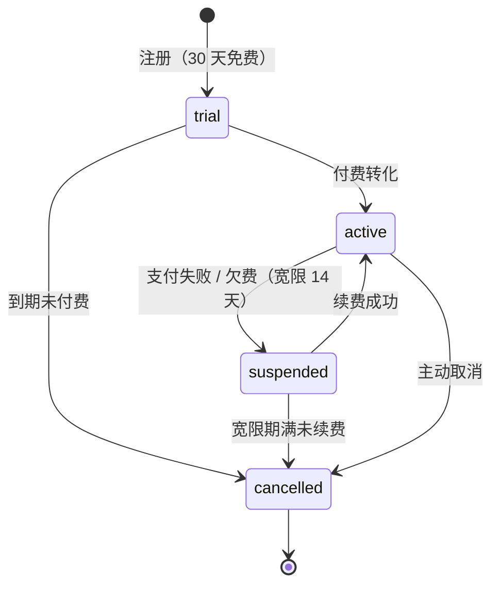
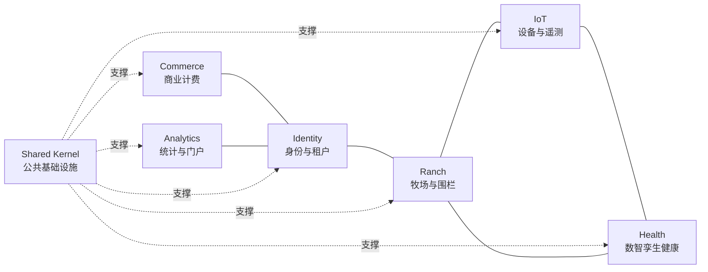
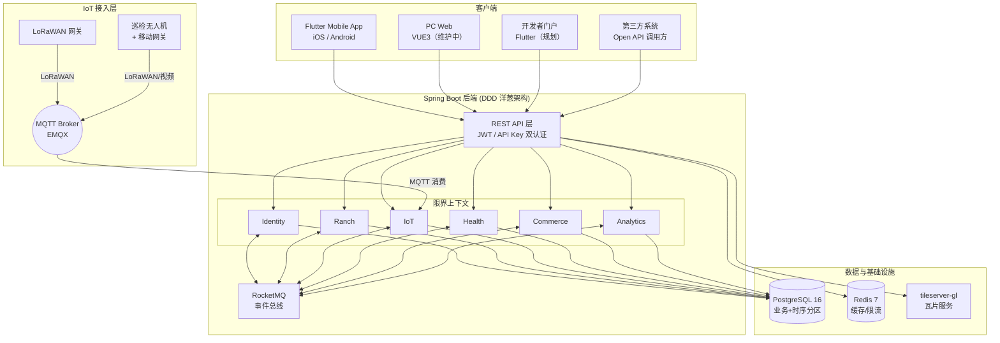
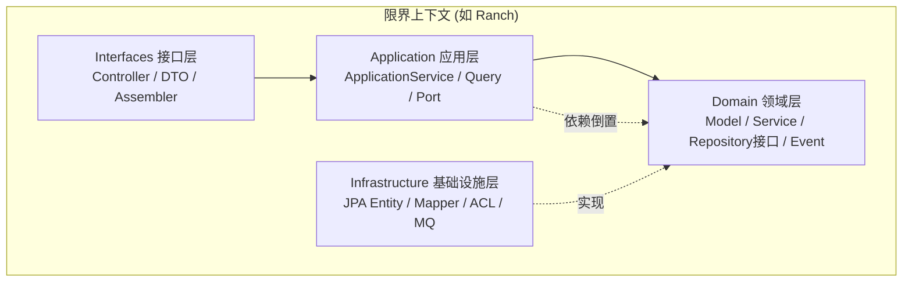
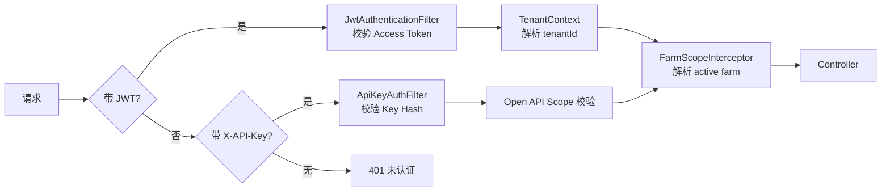
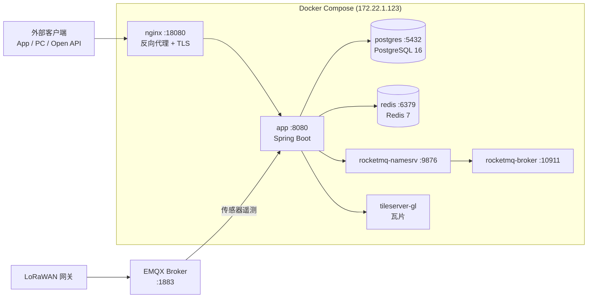
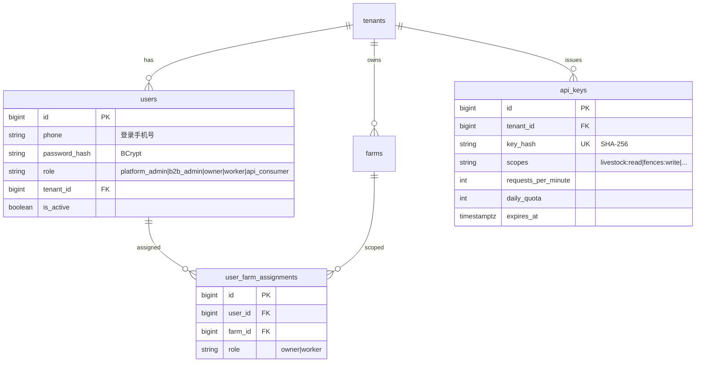
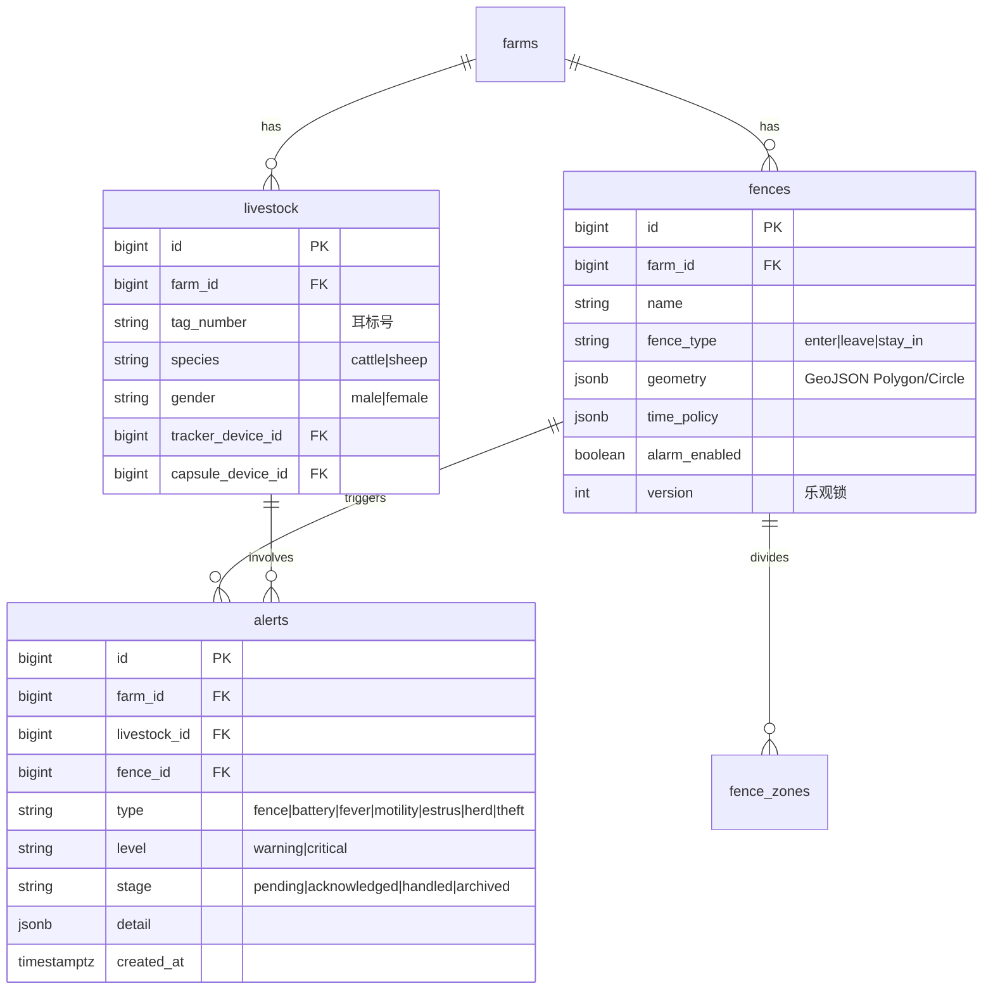
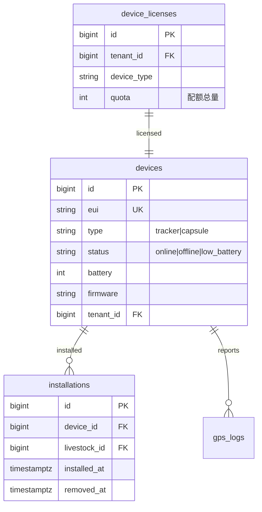
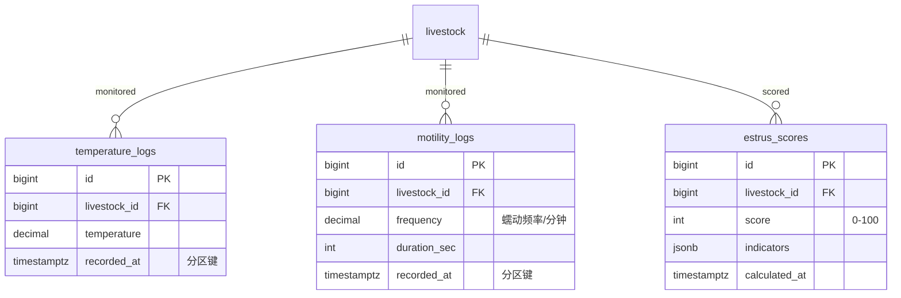

# SmartLivestock 智慧畜牧产品规划

> **版本**：v2.0
> **日期**：2026-06-18
> **状态**：基线
> **替代**：v1.1 及之前全部历史版本
> **范围**：全平台系统（Flutter Mobile App + PC 管理端 + Spring Boot 后端服务 + IoT 设备层 + 无人机巡检 + 商业模式）
> **编制**：基于全量文档分析 + 后端实际实现（7 限界上下文 / 51 Controller / ~186 端点 / V1–V37 迁移） + 智慧停车 PRD v3.0.3 结构借鉴

---

## 修订记录

| 版本 | 日期 | 变更 |
|------|------|------|
| v2.0 | 2026-06-18 | 架构对齐基线：借鉴 SmartPark PRD v3.0.3 结构，全面重写为 DDD 洋葱架构视角；新增限界上下文全景图（7 上下文）、系统架构图、数据架构（ER 图 + 时序分区 + 数据治理）、接口契约规范化（RFC 7807 错误码 + 三端总览）、非功能需求补齐（可靠性/GDPR/颜色规范/可扩展性）、商业模式补单位经济模型 + 三收入线 + 订阅状态机、路线图增准出标准与里程碑；以 smart-livestock-server 实际实现为事实来源（51 Controller、~186 端点、V1–V37 Flyway 迁移） |
| v1.1 | 2026-04-13 | 整合研发项目立项书：无人机巡检模块、移动 LoRaWAN 网关、技术选型更新（SpringCloud/VUE3）、竞品三层分析增强、知识产权规划、收入预测（已被 v2.0 替代） |
| v1.0 | 2026-04-09 | 初始版本，整合 Mobile/docs/ 全部设计文档（已归档） |

---

## 一、产品概述

### 1.1 产品定位

面向牧场主的牲畜智能管理平台，通过 **IoT 设备（GPS 追踪器 + 瘤胃胶囊 + 加速度计）+ AI 数智孪生 + 无人机巡检**，实现牲畜**定位管控**、**健康预警**、**行为分析**和**空地协同巡检**，帮助牧场主从经验养殖转向数据驱动的精准养殖，以低部署成本切入中型及大型牧场市场（50–5,000 头）。

**核心价值主张**：

- **LoRaWAN 低功耗广覆盖**：3 年电池寿命（远超竞品 6 个月–1 年），偏远山区不依赖蜂窝网络，覆盖 5–10 公里
- **数智孪生差异化**：4 大 AI 场景（发热/消化/发情/疫病）覆盖牲畜全生命周期，竞品尚无此能力
- **空地协同**：第三方工业无人机 SDK 集成 + 移动 LoRaWAN 网关补盲，自动巡航 + 告警联动追踪 + 声音驱赶
- **防盗能力**：瘤胃胶囊与追踪器蓝牙关联，链接断开超 5 分钟主动上报丢失告警
- **灵活定价**：一次性设备购买 + 可选订阅增值服务（不强制月费）

### 1.2 目标市场

| 客户类型 | 规模 | 付费能力 | 核心需求 | 优先级 |
|----------|------|----------|----------|--------|
| 小型牧场 | 50–200 头 | 中 | 定位防盗、基础健康 | P1 |
| 中型牧场 | 200–1,000 头 | 较高 | 繁殖管理、疾病预警 | P0 |
| 大型牧场 | 1,000–5,000 头 | 高 | 全面管理、降本增效 | P0 |
| 超大型牧场/集团 | 5,000+ 头 | 很高 | 集团化管理、数据分析 | P1 |

### 1.3 差异化分层

| 时间维度 | 差异化能力 | 说明 |
|----------|-----------|------|
| **当前（MVP / Phase 1–2）** | LoRaWAN 低部署成本 | 免授权频段 + 电池供电（≥3 年），无需布线施工，偏远山区覆盖 |
| **当前（MVP / Phase 1–2）** | 数智孪生 4 场景 | 发热/消化/发情/疫病 AI 分析引擎，竞品无此能力 |
| **当前（MVP / Phase 1–2）** | 实时地图监控 | flutter_map + SmartTileProvider 三级降级 + MBTiles 离线 + WGS-84/GCJ-02 坐标转换 |
| **当前（MVP / Phase 1–2）** | 设备防盗 | 瘤胃胶囊–追踪器蓝牙关联告警 |
| **远期（Phase 3）** | 空地协同巡检 | 无人机 SDK 集成 + 移动 LoRaWAN 网关补盲 + 告警联动追踪 |
| **远期（Phase 3）** | AI 预测增强 | LSTM 轨迹预测、产犊预测、综合诊断 LLM Agent |

### 1.4 多语言国际化

| 语言 | 代码 | 目标市场 | 优先级 |
|------|------|----------|--------|
| 中文 | zh | 国内市场 | P0 |
| 英文 | en | 国际市场 | P0 |
| 西班牙语 | es | 拉美/欧洲市场 | P1 |

**实施方案**：前端 Flutter `AppLocalizations`（`flutter gen-l10n`），文案集中于 `lib/l10n/app_*.arb`；后端 Spring `MessageSource`（`messages_zh/en.properties`），按 `Accept-Language` 协商返回。禁止源码内出现面向用户的字面量字符串。

### 1.5 竞争格局

**直接竞品**：

| 竞品 | 国家 | 技术路线 | 关注点 |
|------|------|----------|--------|
| Halter | 新西兰 | 蜂窝 + 项圈 | 虚拟围栏、健康监测，电池 6 个月 |
| Vence | 美国 | 蜂窝 | 牲畜追踪 + 虚拟围栏，电池 1 年 |
| Nofence | 挪威 | 4G/LTE | 虚拟围栏，面向山羊/绵羊 |
| Digitanimal | 西班牙 | LoRaWAN | 牲畜追踪 + 活动监测，电池 2–3 年 |

**功能对比**：

| 功能 | Halter | Vence | Nofence | Digitanimal | **我方** |
|------|--------|-------|---------|--------------|----------|
| 虚拟围栏 | ✓ | ✓ | ✓ | △ | **核心** |
| GPS 定位 | ✓ | ✓ | ✓ | ✓ | **核心** |
| 越界告警 | ✓ | ✓ | ✓ | ✓ | **核心** |
| 电池寿命 | 6 个月 | 1 年 | 6 个月 | 2–3 年 | **3 年** |
| 通信方式 | 蜂窝 | 蜂窝 | 4G/LTE | LoRaWAN | **LoRaWAN** |
| 强制月费 | ✓ | ✓ | ✓ | ✗ | **可选订阅** |
| 健康监测 | ✓ | ✗ | ✗ | ✓ | **瘤胃胶囊** |
| 数智孪生 | ✗ | ✗ | ✗ | ✗ | **4 场景** |
| 设备防盗 | ✗ | ✗ | ✗ | ✗ | **蓝牙关联** |
| 无人机巡检 | ✗ | ✗ | ✗ | ✗ | **SDK + 移动网关** |

### 1.6 部署模式

| 模式 | 适用场景 | 特点 |
|------|----------|------|
| **区域云端部署** | 中小型养殖户 | 多租户共享，App 公网访问，Docker Compose 部署 |
| **私有化部署** | 大型/超大型养殖场 | 数据完全私有，App 内网/VPN 访问 |

---

## 二、用户与场景

### 2.1 目标角色

| 角色 | 描述 | 核心诉求 | 阶段 |
|------|------|----------|------|
| 牧场主（owner） | 中大型牧场经营者 | 群体概览、异常预警、减少人工巡栏、繁殖管理 | P0 |
| 牧工（worker） | 日常放牧人员 | 实时位置查看、围栏告警处理 | P0 |
| 兽医/技术员 | 兽医站、畜牧技术员 | 个体健康分析、历史数据追溯 | P1 |
| 平台管理员（platform_admin） | SaaS 平台运维 | 租户开通、运行监控、故障处理 | P0 |
| B 端管理员（b2b_admin） | B 端客户管理员 | 牧场创建、用户分配、合同对账 | P1 |
| API 开发者（api_consumer） | 第三方集成商 | Open API 数据接入 | P1 |

### 2.2 核心用户场景

| # | 场景 | 角色 | 描述 | 阶段 |
|---|------|------|------|------|
| US-01 | 实时牲畜监控 | 牧场主 | 地图实时查看牲畜位置与设备状态 | P0 |
| US-02 | 虚拟围栏管理 | 牧场主 | 手绘多边形/模板创建围栏，时间策略 | P0 |
| US-03 | 越界告警处理 | 牧工 | 越界/离群/盗窃告警接收与确认 | P0 |
| US-04 | 发热预警 | 牧场主/兽医 | 瘤胃温度基线偏离检测，72h 趋势 | P0 |
| US-05 | 消化管理 | 牧场主/兽医 | 瘤胃蠕动频率监测，消化健康评分 | P0 |
| US-06 | 发情识别 | 牧场主/兽医 | 多传感器融合评分，配种时机提醒 | P0 |
| US-07 | 疫病防控 | 牧场主 | 群体健康趋势、接触链路追踪 | P0 |
| US-08 | 设备运维 | 牧场主 | 设备状态、电量、信号、绑定管理 | P0 |
| US-09 | 牲畜档案 | 牧场主/兽医 | 耳标、品种、体重、设备绑定、健康档案 | P1 |
| US-10 | 租户开通 | 平台管理员 | 创建租户、分配用户、License 配额 | P0 |
| US-11 | 订阅计费 | B 端管理员 | 订阅层级、合同、分润对账、功能门控 | P1 |
| US-12 | 无人机巡检 | 牧场主/牧工 | 自动巡航、视频回传、告警联动追踪 | P2 |
| US-13 | API 数据接入 | API 开发者 | Open API 查询牲畜/围栏/告警/设备 | P1 |
| US-14 | 历史轨迹回放 | 牧场主 | 24h/7d/30d 轨迹回放、热力图 | P1 |
| US-15 | 多牧场切换 | 牧场主 | 一个账号管理多个牧场，切换刷新 | P0 |
| US-16 | 丢失设备搜寻 | 牧工 | 无人机移动网关主动搜索丢失动物信号 | P2 |

### 2.3 角色旅程链

```
platform_admin → 创建租户 → 进入租户详情 → 新增用户（b2b_admin / owner / worker）
b2b_admin → 创建牧场 → 分配给 owner
owner → 管理牲畜、围栏、告警、牧工、订阅
```

> 牧场不由 owner 自行创建，由 b2b_admin 或 platform_admin 创建并分配。详见 `docs/customer-journey.md`。

---

## 三、商业模式

### 3.0 商业模式总纲

SmartLivestock 的收入由**三条独立产品线**构成，面向不同客户群：

| 收入线 | 产品 | 面向客户 | 计费基础 |
|--------|------|---------|---------|
| **A. SaaS 订阅** | 平台运营能力（定位/围栏/孪生/告警/AI） | 牧场主（中大型牧场） | 头数 × 功能层级 |
| **B. Open API** | 数据访问权（只读） | 集成商/智慧农业平台/政府监管 | API 调用次数 × 数据范围 |
| **C. 硬件** | 追踪器 + 瘤胃胶囊 + 网关（一次性） | 所有客户 | 单价 × 数量 |

### 3.1 套餐分层

```
┌─────────────────────────────────────────────────────────┐
│                 牛羊监测订阅套餐金字塔                    │
├─────────────────────────────────────────────────────────┤
│               Enterprise（企业定制版）                    │
│          集团管理 | 私有部署 | 定制开发 | 专属支持        │
├─────────────────────────────────────────────────────────┤
│                    Plus（专业版）                         │
│        发情检测 | 繁殖管理 | 高级分析 | 优先支持          │
├─────────────────────────────────────────────────────────┤
│                  Standard（标准版）                       │
│         定位追踪 | 健康预警 | 数据查看 | 基础支持         │
├─────────────────────────────────────────────────────────┤
│                  Discovery（体验版）                      │
│              免费 | 功能试用 | 头数限制                   │
└─────────────────────────────────────────────────────────┘
```

> 与后端 `SubscriptionTier` 枚举对齐：basic、standard、premium、enterprise（Discovery 对应 basic 的免费体验）。

### 3.2 套餐详细设计

#### Discovery（体验版）— 免费

| 项目 | 配置 |
|------|------|
| 价格 | 免费（30 天） |
| 头数 | ≤10 头 |
| 网关数 | ≤1 台 |
| 数据保留 | 7 天 |
| SLA | 无保证 |
| 功能 | 定位追踪、基础数据查看 |

#### Standard（标准版）— 定位 + 健康

| 项目 | 配置 |
|------|------|
| 价格 | 按头计费，阶梯价格 |
| 头数 | 不限 |
| 数据保留 | 30 天 |
| SLA | 99.5% |
| 支持 | 工单系统，8 小时响应 |
| 功能 | 定位追踪、轨迹回放、电子围栏、体温监测、健康预警、基础报表 |

#### Plus（专业版）— 繁殖管理

| 项目 | 配置 |
|------|------|
| 价格 | Standard + 增值费 |
| 头数 | 不限 |
| 数据保留 | 90 天 |
| SLA | 99.9% |
| 支持 | 工单系统，4 小时响应 |
| 功能 | Standard 全部 + 发情检测、繁殖管理、配种建议、产犊预测、高级分析 |

#### Enterprise（企业定制版）

| 项目 | 配置 |
|------|------|
| 价格 | 定制（联系销售） |
| 部署方式 | 公有云 / 私有云 / 本地部署 |
| SLA | 99.99%（可定制） |
| 支持 | 专属客户经理 + 7×24 电话 + 现场支持 |
| 功能 | Plus 全部 + 集团管理、多牧场联动、定制开发、API 对接 |

### 3.3 按头计费阶梯价格

#### 动物追踪器订阅（含 GPS 定位 + 活动量监测）

| 头数区间 | Standard 单价 | Plus 单价 |
|----------|--------------|-----------|
| 1–50 | ¥15/头/月 | ¥25/头/月 |
| 51–200 | ¥12/头/月 | ¥20/头/月 |
| 201–500 | ¥10/头/月 | ¥17/头/月 |
| 501–2,000 | ¥8/头/月 | ¥14/头/月 |
| 2,001+ | 定制 | 定制 |

#### 瘤胃胶囊订阅（含温度 + 蠕动监测）

| 头数区间 | Standard 单价 | Plus 单价 |
|----------|--------------|-----------|
| 1–50 | ¥25/头/月 | ¥40/头/月 |
| 51–200 | ¥20/头/月 | ¥32/头/月 |
| 201–500 | ¥17/头/月 | ¥27/头/月 |
| 501–2,000 | ¥14/头/月 | ¥22/头/月 |
| 2,001+ | 定制 | 定制 |

### 3.4 计费周期与折扣

| 周期 | 折扣 | 说明 |
|------|------|------|
| 月付 | 基准价格 | 灵活性高 |
| 年付 | 85 折 | 鼓励长期承诺（约免 2 个月） |
| 两年付 | 75 折 | 深度绑定 |

### 3.5 单位经济模型

| 成本项 | 月成本（¥/头） | 说明 |
|--------|---------------|------|
| LoRaWAN 通信 | 0.05–0.15 | 自建网关摊销或公共网络 |
| 云基础设施 | 0.10–0.30 | 计算 + 存储 + 带宽分摊 |
| 支撑成本 | 0.10–0.30 | 客户支持 + 运维分摊 |
| **合计** | **0.25–0.75** | 目标毛利率 ≥70% |

> 盈亏平衡：Standard 追踪器订阅（201–500 头档 ¥10/头/月）远超单位成本，毛利率 >90%。

### 3.6 订阅状态机



| 状态 | 含义 | 功能访问 | FeatureGate |
|------|------|---------|-------------|
| `trial` | 30 天免费试用 | basic tier 门控 | `subscription-created` 事件 |
| `active` | 正常付费订阅 | 全功能（按 tier） | — |
| `suspended` | 欠费暂停（宽限 14 天） | 只读 + 告警冻结 | `subscription-suspended` 事件 |
| `cancelled` | 终止 | 全部冻结 | `subscription-cancelled` 事件 |

> FeatureGate 引擎（gate_type + QuotaInterceptor）在代码级强制配额拦截，订阅状态联动功能可见性。

### 3.7 硬件定价参考

| 设备类型 | 建议售价 | 寿命 |
|----------|----------|------|
| **动物追踪器（项圈）** | ¥350–500 | 3–5 年 |
| **动物追踪器（耳标）** | ¥280–400 | 2–3 年 |
| **瘤胃胶囊** | ¥600–900 | 2–3 年（一次性） |
| **LoRaWAN 网关** | ¥1,500–3,000 | 1 台覆盖 200–500 头 |
| **巡检无人机（外采）** | ¥10,000–30,000 | 含 SDK 授权 |

### 3.8 设备 + 订阅组合方案

| 方案 | 设备费用 | 订阅费用 | 适用客户 |
|------|----------|----------|----------|
| **买断模式** | 客户一次性购买 | 仅付平台费 | 大型牧场 |
| **租赁模式** | 设备租赁费含在订阅中 | 含设备费的订阅价 | 中小型牧场 |
| **混合模式** | 客户购买设备 | 设备费分摊到订阅 | 灵活选择 |

### 3.9 增值服务包

| 服务包 | 包含服务 | 价格 | 节省 |
|--------|----------|------|------|
| **健康管理包** | 疾病预警 + 营养建议 | ¥6/头/月 | 25% |
| **繁殖管理包** | 发情检测 + 繁殖管理 | ¥10/头/月 | 23% |
| **全方位服务包** | 所有增值服务 | ¥20/头/月 | 40% |

### 3.10 收入预测

#### 单牧场合计（示例：中型牧场 500 头）

| 项目 | 月收入 | 年收入 |
|------|--------|--------|
| Standard 追踪器订阅（500 头） | ¥5,000 | ¥60,000 |
| Standard 胶囊订阅（500 头） | ¥8,500 | ¥102,000 |
| **合计** | **¥13,500** | **¥162,000** |

#### 规模化预测

| 客户规模 | 牧场数 | 牲畜总数 | 年订阅收入（万元） |
|----------|--------|----------|-------------------|
| 100 头 × 10 牧场 | 10 | 1,000 | 54–98 |
| 500 头 × 20 牧场 | 20 | 10,000 | 324–648 |
| 2,000 头 × 5 牧场 | 5 | 10,000 | 324–576 |
| **合计** | **35** | **21,000** | **702–1,322** |

> 注：以上为订阅收入估算，不含设备销售收入与 Open API 收入。

---

## 四、系统架构

> 采用 **DDD 洋葱架构 + 限界上下文 + 事件驱动** 设计，与 SmartPark 技术栈统一，可复用基础设施。

### 4.1 架构设计原则

1. **领域驱动设计（DDD）**：按业务能力划分 7 个限界上下文，每个上下文采用洋葱（分层）架构。
2. **事件驱动解耦**：上下文之间通过 RocketMQ 发布/订阅领域事件，避免直接代码级耦合。
3. **防腐层（ACL）隔离**：跨上下文查询通过 Port/Adapter 端口适配器，不直接引用对方领域模型，无跨上下文外键。
4. **多租户隔离**：基于 JWT 解析的 `tenantId`，通过 `ThreadLocal`（`TenantContext`）在请求生命周期内传递；数据库层通过 `tenant_id` 强制注入隔离。
5. **优雅降级**：RocketMQ 不可用时事件发布静默跳过，保证应用可启动与测试可执行。
6. **配置外置**：数据库、Redis、JWT、RocketMQ 等均通过环境变量注入，提供合理默认值。

### 4.2 限界上下文全景



#### 各上下文功能职责

| 上下文 | 职责 | 核心能力 | 阶段 |
|--------|------|----------|------|
| **Identity** | 多租户隔离、用户、角色权限、认证授权、审计日志、API Key | 登录/Token 刷新、租户管理、用户管理、API Key 生命周期 | P0 |
| **Ranch** | 牧场、牲畜、围栏、围栏区域、告警、看板、地图 | 牧场 CRUD、牲畜档案、虚拟围栏、越界检测、告警状态机 | P0 |
| **IoT** | 设备全生命周期、设备 License、安装记录、GPS 日志、遥测 | 设备注册/绑定、License 配额、GPS 时序数据接入 | P0 |
| **Health** | 数智孪生健康分析（发热/消化/发情/疫病）、时序数据 | 温度基线、蠕动监测、发情评分、群体疫病分析 | P0 |
| **Commerce** | 订阅、合同、分润周期、订阅服务、功能门控、通知 | 订阅结算、Tier 配额、FeatureGate 引擎、合同 CRUD | P1 |
| **Analytics** | API 统计聚合、趋势分析、开发者门户、API Key 自管理 | Open API 用量、API Key 审批、频率限制 | P1 |
| **Shared** | SecurityConfig、JwtAuthenticationFilter、TenantScope、AuditLog、Tile（瓦片） | 安全过滤链、租户上下文、审计、地图瓦片降级 | P0 |

### 4.3 系统全景图



### 4.4 后端分层架构（DDD 洋葱）

每个限界上下文遵循**洋葱架构**四层分层：



| 层 | 职责 |
|----|------|
| **Interfaces** | REST Controller、请求/响应 DTO、组装器 |
| **Application** | 用例编排、事务边界、查询服务、Port 定义 |
| **Domain** | 领域模型、领域服务、仓储接口、领域事件 |
| **Infrastructure** | JPA 持久化、Mapper、ACL 适配器、MQ 消费者、MQTT 接入 |

**分层约束**：
- 依赖方向：Interfaces → Application → Domain ← Infrastructure（依赖倒置）
- Domain 层不依赖任何外部框架（纯 Java）
- 跨上下文交互仅通过 Application 层定义的 Port 接口

### 4.5 技术栈选型

| 层次 | 技术选型 | 版本 | 说明 |
|------|---------|------|------|
| **后端框架** | Spring Boot | 3.3.x | Java 17，Gradle 构建 |
| **持久层** | Spring Data JPA + Hibernate | — | `ddl-auto: none`，结构由 Flyway 管理 |
| **数据库** | PostgreSQL | 16 | 业务 + 时序分区表 |
| **缓存** | Redis | 7 | 会话、热点查询、限流计数 |
| **消息队列** | RocketMQ Spring Boot Starter | 2.3.0 | 事件总线，优雅降级 |
| **数据库迁移** | Flyway | — | V1–V37 版本化管理 |
| **认证** | JJWT | 0.12.5 | JWT 双 Token（Access 1h + Refresh 7d） |
| **安全** | Spring Security | — | RBAC + 多租户隔离 |
| **Lombok** | Lombok | — | 样板代码消除 |
| **测试** | JUnit 5 + Testcontainers | 1.20.6 | 集成测试用真实 PostgreSQL 容器 |
| **实时通信** | MQTT (EMQX) | 5.x | 告警推送、位置更新、设备遥测 |
| **地图服务** | flutter_map + tileserver-gl + MBTiles | — | 三级降级 + 离线瓦片 |
| **前端 Mobile** | Flutter + Riverpod + go_router | — | iOS / Android，29 模块 42 路由 |
| **前端 PC** | VUE3 | — | 维护中（独立模块） |
| **AI 模型** | scikit-learn / TensorFlow / GLM-DeepSeek | — | L1/L2/L3 三层 |
| **无人机** | 大疆 DJI Mobile SDK + Semtech SX1302 | — | 空地协同巡检（P2） |

### 4.6 安全架构



**双轨认证**：

| 认证方式 | 适用场景 | 实现 |
|---------|---------|------|
| **JWT** | Mobile App、PC Web、门户（用户态） | `JwtAuthenticationFilter` + `JwtTokenProvider`（JJWT 0.12.5），Access 1h + Refresh 7d |
| **API Key** | Open API、第三方系统 | `ApiKeyAuthFilter`（SHA-256 hash 校验），独立于 JWT |

**安全配置要点**：
- 无状态 Session（`STATELESS`）
- CSRF 关闭（纯 API 服务）
- BCrypt 密码加密
- 多租户：JWT 解析 `tenantId` → `ThreadLocal`（`TenantContext`）→ 数据库层 `tenant_id` 强制隔离
- Open API：API Key 不设 `TenantContext`，数据隔离由 API Key 关联租户 + 应用层过滤实现

### 4.7 MQTT 主题设计

| 主题 | 方向 | Payload | 说明 |
|------|------|---------|------|
| `livestock/tracker/{eui}/gps` | 设备→平台 | `{lat, lng, ts, accuracy}` | GPS 定位上报（5–15min） |
| `livestock/capsule/{eui}/temp` | 设备→平台 | `{temp, ts}` | 瘤胃温度（30min） |
| `livestock/capsule/{eui}/motility` | 设备→平台 | `{freq, duration, ts}` | 瘤胃蠕动（30min） |
| `livestock/device/{eui}/status` | 设备→平台 | `{battery, rssi, online, ts}` | 设备心跳/状态 |
| `livestock/device/{eui}/event` | 设备→平台 | `{event: "link_lost"/"theft", ts}` | 蓝牙断链/防盗事件 |
| `livestock/gateway/{gwId}/status` | 网关→平台 | `{online, connectedCount, ts}` | 网关心跳 |
| `livestock/device/{eui}/command` | 平台→设备 | `{cmd: "locate"/"ota"/"reboot"}` | 下行指令 |

### 4.8 实时推送事件

| 订阅端 | 事件名 | Payload | 触发条件 |
|--------|--------|---------|---------|
| Mobile App | `alert.new` | `{id, type, level, animalId, message, ts}` | 新告警（越界/健康/行为） |
| Mobile App | `position.update` | `{animalId, lat, lng, ts}` | 牲畜位置更新 |
| Mobile App | `health.update` | `{animalId, scene, score, ts}` | 健康评分更新 |
| Mobile App | `device.offline` | `{deviceId, lastSeen}` | 设备离线 |
| Mobile App | `device.low_battery` | `{deviceId, battery}` | 低电量告警 |
| 后台管理 | `subscription.suspended` | `{tenantId, reason}` | 订阅欠费暂停 |

### 4.9 架构演进路径

采用**单体起步 → 按需拆分**策略：

| 阶段 | 架构形态 | 触发条件 |
|------|---------|---------|
| **Phase 1–2（当前）** | Spring Boot 单体（7 上下文模块化），Docker Compose 部署 | 起步 |
| **Phase 3（规模化）** | 按需拆分高负载上下文（IoT/Health/Analytics）为独立服务 | 牲畜 >50,000 或并发用户 >500 |
| **Phase 4（微服务化）** | 引入 K8s，IoT/Analytics 独立扩缩容 | 多区域部署 |

### 4.10 部署架构（当前）



**配置外置**（`application.yml` + 环境变量）：

| 配置项 | 环境变量 | 默认值 |
|--------|---------|--------|
| 数据库 | `DB_HOST/PORT/NAME/USER/PASSWORD` | localhost:5432/smartlivestock |
| Redis | `REDIS_HOST/PORT/PASSWORD` | localhost:6379 |
| RocketMQ | `ROCKETMQ_NAME_SERVER` | localhost:9876 |
| MQTT Broker | `MQTT_HOST/PORT/USERNAME/PASSWORD` | localhost:1883 |
| JWT 密钥 | `JWT_SECRET` | default-secret-change-in-production |
| Access Token 有效期 | `JWT_ACCESS_EXPIRATION` | 3600000（1h） |
| Refresh Token 有效期 | `JWT_REFRESH_EXPIRATION` | 604800000（7d） |
| LoRaWAN 频段 | `LORA_REGION` | EU868 / AS923 |

### 4.11 地图瓦片基础设施

- **tileserver-gl**：自建瓦片服务，部署在 172.22.1.123:18080，提供 WGS-84 瓦片
- **MBTiles 离线**：原生平台支持离线瓦片（`sample.mbtiles`，长沙 zoom 12–14）
- **SmartTileProvider**：三级降级（tileserver-gl → MBTiles → 高德/OSM），健康检测自动切换
- **坐标转换**：WGS-84 ↔ GCJ-02（`coord_transform.dart`），高德降级时自动转换
- **部署指南**：`docs/tileserver-deployment-guide.md`


---

## 五、数据架构

### 5.1 存储技术选型

> 统一为 PostgreSQL 16 单数据库，时序数据使用声明式分区表，不引入 TimescaleDB/TDengine 等专用存储。

| 数据类型 | 存储 | 说明 |
|---------|------|------|
| 业务实体（租户/牧场/牲畜/围栏/设备/订阅…） | PostgreSQL 16 | 关系型，强一致性 |
| 时序遥测数据（GPS/温度/蠕动日志） | PostgreSQL 分区表 | 按月 RANGE 分区，见 5.4 |
| 空间数据（围栏多边形/坐标） | PostgreSQL JSONB + JTS | 顶点存 JSONB，计算用 JTS |
| 实时状态 / 配额计数 | Redis 7 | 缓存 + 限流（Lua 滑动窗口） |
| 瓦片地图 | tileserver-gl + MBTiles | 离线 + 在线降级 |
| 通知/消息 | PostgreSQL + RocketMQ | 持久化通知 + 事件分发 |

### 5.2 实体关系图（按限界上下文）

```
Tenant (1) ──< (N) Farm (1) ──< (N) Livestock
                                   │
Device (tracker/capsule) ──(绑定)──┘
Device (1) ──< (N) Installation
Livestock (1) ──< (N) GpsLog
Livestock (1) ──< (N) TemperatureLog
Livestock (1) ──< (N) MotilityLog

Farm (1) ──< (N) Fence ──< (N) FenceZone
Fence (1) ──< (N) Alert
Livestock (1) ──< (N) Alert

Tenant (1) ──< (N) User
Tenant (1) ──< (N) UserFarmAssignment (多牧场分配)
User (1) ──< (N) ApiKey

TenantSubscription (1) ──< (N) Contract
TenantSubscription (1) ──< (N) RevenuePeriod
SubscriptionService (1) ──< (N) FeatureGate
```

#### Identity 上下文



> **多牧场**：一个 user 可通过 `user_farm_assignments` 关联多个 farm，前端 `activeFarmId` 切换时刷新 farm-scoped 数据。

#### Ranch 上下文



#### IoT 上下文



#### Health 上下文（时序）



### 5.3 关键实体字段

#### Animal / Livestock（牲畜）

| 字段 | 类型 | 必填 | 说明 |
|------|------|------|------|
| id | BIGINT PK | ✓ | 主键 |
| farm_id | FK(Farm) | ✓ | 所属牧场 |
| tag_number | VARCHAR(50) | ✓ | 耳标号 |
| species | ENUM | ✓ | 物种：cattle/sheep |
| gender | ENUM | ✓ | 性别：male/female |
| birth_date | DATE | | 出生日期 |
| weight | DECIMAL | | 体重（kg） |
| tracker_device_id | FK(Device) | | 动物追踪器 ID |
| capsule_device_id | FK(Device) | | 瘤胃胶囊 ID |

#### Device（设备）

| 字段 | 类型 | 必填 | 说明 |
|------|------|------|------|
| id | BIGINT PK | ✓ | 主键 |
| eui | VARCHAR(16) UK | ✓ | 设备 EUI |
| type | ENUM | ✓ | 类型：tracker/capsule |
| status | ENUM | ✓ | 状态：online/offline/low_battery |
| battery | INT | | 电池电量百分比 |
| firmware | VARCHAR(20) | | 固件版本 |
| tenant_id | FK(Tenant) | ✓ | 多租户隔离 |

#### Fence（围栏）

| 字段 | 类型 | 必填 | 说明 |
|------|------|------|------|
| id | BIGINT PK | ✓ | 主键 |
| farm_id | FK(Farm) | ✓ | 所属牧场 |
| name | VARCHAR(100) | ✓ | 围栏名称 |
| fence_type | ENUM | ✓ | 类型：enter/leave/stay_in |
| geometry | JSONB | ✓ | GeoJSON Polygon/Circle |
| time_policy | JSONB | | 时间策略 |
| alarm_enabled | BOOLEAN | ✓ | 是否启用告警 |
| version | BIGINT | ✓ | 乐观锁 |

#### Alert（告警）

| 字段 | 类型 | 必填 | 说明 |
|------|------|------|------|
| id | BIGINT PK | ✓ | 主键 |
| farm_id | FK(Farm) | ✓ | 所属牧场 |
| type | ENUM | ✓ | 类型：fence/battery/fever/motility/estrus/herd/theft |
| level | ENUM | ✓ | 级别：warning/critical |
| livestock_id | FK(Livestock) | | 关联牲畜 |
| fence_id | FK(Fence) | | 关联围栏 |
| message | VARCHAR(500) | ✓ | 告警消息（i18n key） |
| detail | JSONB | | 告警详情 |
| stage | ENUM | ✓ | 状态：pending/acknowledged/handled/archived |
| created_at | TIMESTAMPTZ | ✓ | 创建时间 |

### 5.4 时序数据分区策略

核心时序表采用 PostgreSQL **声明式 RANGE 分区**（按月）：

| 表 | 分区键 | 数据来源 | 索引策略 |
|----|--------|---------|---------|
| `gps_logs` | `recorded_at` | GPS 追踪器周期上报 | `(livestock_id, recorded_at DESC)` |
| `temperature_logs` | `recorded_at` | 瘤胃温度（30min） | `(livestock_id, recorded_at DESC)` |
| `motility_logs` | `recorded_at` | 瘤胃蠕动（30min） | `(livestock_id, recorded_at DESC)` |
| `accelerometer_logs` | `recorded_at` | 加速度计（步数/行为） | `(livestock_id, recorded_at DESC)` |

**分区设计要点**：
- 每张表预建月度分区 + `default` 兜底分区
- 主键包含分区键：`PRIMARY KEY (id, recorded_at)`
- 历史数据冷热分离：超保留期的分区可归档/删除

### 5.5 数据治理

| 机制 | 实现 | 适用表 |
|------|------|--------|
| **软删除** | `deleted_at TIMESTAMPTZ` + 部分唯一索引 | farms, livestock, devices, users |
| **乐观锁** | `version BIGINT` 列 | fences, subscriptions, feature_gates |
| **审计日志** | `audit_logs` 表（V18） | 全操作可追溯，保留 ≥3 年 |
| **API 调用日志** | `api_call_logs`（逐请求）+ 日聚合 | Open API 用量统计 |
| **枚举约束** | `CHECK` 约束 | 所有状态/类型字段 |
| **多租户隔离** | `tenant_id` 强制注入 + `TenantContext` | 所有业务表 |
| **i18n 消息** | `messages_zh/en.properties` | 告警/错误文案按 Accept-Language 返回 |

### 5.6 用户角色与权限

| 枚举值（`users.role`） | 中文名称 | 说明 | Shell 类型 |
|------|------|------|------|
| `platform_admin` | 平台管理员 | 平台级管理，无租户归属 | 无 Shell，纯 Scaffold |
| `b2b_admin` | B 端管理员 | B 端客户管理员，关联 Demo 租户 | 左侧 NavigationRail |
| `owner` | 牧场主 | 牧场经营者 | 底部导航栏（4–5 Tab） |
| `worker` | 牧工 | 日常放牧人员 | 底部导航栏（4 Tab） |
| `api_consumer` | API 开发者 | 仅 API 访问，无 App 端 | — |

### 5.7 数据库迁移管理

采用 **Flyway** 版本化管理，V1–V37（实际实现）：

| 迁移版本 | 上下文 | 核心内容 |
|---------|--------|--------|
| V1 | Identity | tenants, farms, users, user_farm_assignments, api_keys |
| V2 | Ranch | livestock, fences, alerts |
| V3 | IoT | devices, device_licenses, installations, gps_logs |
| V4–V5 | Seed | 种子数据 + 密码修复 |
| V6 | Commerce | subscriptions, contracts, revenue_periods, subscription_services, feature_gates, notifications |
| V7–V8 | Commerce 修复 | subscription trial period + hash 前缀 |
| V9–V12 | Seed | ranch/iot/commerce/twin 种子数据 |
| V13 | Ranch/Tile | tile 相关表 + fence version |
| V15–V17 | Identity Seed | username 列清理 + b2b_admin/worker/farm2 种子 |
| V18 | Shared | audit_logs |
| V20–V21 | Health | health 时序表 + 种子数据 |
| V22–V23 | Analytics/Portal | analytics_portal 表 + 种子 |
| V24–V28 | Seed/i18n 修复 | tile regions + 坐标修复 + i18n + motility |
| V29–V37 | i18n/Health/Tile | 告警文案翻译 + 健康详情图表种子 + estrus 数据 + tile 任务进度 |

> 种子登录凭据：platform_admin `13800000000` / b2b_admin `13900139000` / owner `13800138000`，密码均为 `123`。Seed hash 严格遵循三步验证（生成时验证 → 写入迁移 → 部署后 `curl` 验证）。

---

## 六、功能需求

### 6.1 功能架构

系统按 **7 个限界上下文** 划分功能边界，上下文间通过事件驱动 + ACL 防腐层解耦（见 4.2）。

#### 功能优先级映射

| 优先级 | 功能模块 | 所属上下文 |
|--------|---------|-----------|
| **P0（MVP）** | 认证、牧场/牲畜、虚拟围栏、告警、GPS 定位、数智孪生（发热/消化/发情/疫病）、租户管理、设备管理、看板/地图 | Identity, Ranch, IoT, Health, Shared |
| **P1（Phase 2）** | 订阅计费、合同管理、分润对账、功能门控、API 开放平台、开发者门户、多牧场切换、牧工管理、B 端后台 | Commerce, Analytics |
| **P2（Phase 3）** | 无人机巡检、移动 LoRaWAN 网关、AI 预测增强、LLM Agent | IoT 扩展, AI |

### 6.2 模块总览

| 模块 | 功能 | 优先级 | 适用角色 |
|------|------|--------|---------|
| **GPS 定位与电子围栏** | 实时定位、虚拟围栏、越界告警、历史轨迹 | P0 | 牧场主、牧工 |
| **数智孪生总览** | 牧场概览、健康统计、场景入口 | P0 | 牧场主、牧工 |
| **发热预警** | 瘤胃温度基线偏离、体温趋势、AI 判断 | P0 | 牧场主、兽医 |
| **消化管理** | 瘤胃蠕动频率监测、消化健康评分 | P0 | 牧场主、兽医 |
| **发情识别** | 多传感器融合评分、配种时机提醒 | P0 | 牧场主、兽医 |
| **疫病防控** | 群体健康趋势、接触链路追踪 | P0 | 牧场主、兽医 |
| **告警中心** | 越界/健康/行为/防盗告警、处理流程 | P0 | 所有角色 |
| **牲畜管理** | 牲畜档案、群组管理、健康档案 | P0 | 牧场主、兽医 |
| **设备管理** | 设备列表、状态监控、绑定管理、License 配额 | P0 | 牧场主 |
| **租户管理后台** | 租户开通/禁用、用户管理、设备 License | P0 | 平台管理员 |
| **B 端管理后台** | 牧场创建、用户分配、合同、分润、牧工管理 | P1 | B 端管理员 |
| **订阅与功能门控** | 订阅层级、合同 CRUD、分润对账、FeatureGate | P1 | 平台/B 端管理员 |
| **API 开放平台** | Open API 数据查询、API Key 自管理、频率限制 | P1 | API 开发者 |
| **多牧场切换** | 多牧场数据隔离切换 | P0 | 牧场主 |
| **无人机巡检监控** | 自动巡航、视频回传、告警联动追踪、移动网关补盲 | P2 | 牧场主、牧工 |
| **我的设置** | 用户信息、告警通知、多语言 | P1 | 所有角色 |

### 6.3 模块 A：GPS 定位与电子围栏

#### 6.3.1 实时地图

| 功能点 | 说明 |
|--------|------|
| 牧群/个体实时位置 | flutter_map 地图显示所有牲畜位置 |
| 设备在线状态 | 在线/离线/低电量状态指示 |
| 地图图层切换 | 卫星图、地形图、牧场边界 |
| 三级瓦片降级 | tileserver-gl → MBTiles → 高德/OSM |
| GPS 上报频率 | 5–15 分钟/次（可配置） |
| 位置精度 | 2–5 米 |

#### 6.3.2 虚拟电子围栏

**围栏创建**：地图手绘多边形；模板（矩形/圆形/沿道路）；围栏分组管理。

| 类型 | 说明 | 典型场景 |
|------|------|----------|
| 进入围栏 | 禁止进入特定区域 | 危险区域、施工区域 |
| 离开围栏 | 禁止离开特定区域 | 牧场边界防盗 |
| 区域限制围栏 | 限定在特定区域内活动 | 放牧区域限定 |

**围栏时间策略**：全天生效或特定时段生效。围栏带 `version` 乐观锁，支持围栏区域（FenceZone）细分。

#### 6.3.3 越界告警

| 功能 | 说明 |
|--------|------|
| 越界告警 | 牲畜离开围栏范围触发（点在多边形内判断，射线法） |
| 告警推送 | App 推送（必选）+ SMS（可选） |
| 告警详情 | 越界个体、时间、位置、围栏信息 |
| 告警处理 | pending → acknowledged → handled → archived（非法跳转返回 409） |
| 离群检测 | 偏离牛群中心超 2km 且超 2 小时 |
| 盗窃预警 | 非放牧时间（22:00–06:00）异常移动 |

#### 6.3.4 历史轨迹

| 功能 | 说明 |
|--------|------|
| 个体/群体轨迹回放 | 24h/7d/30d/自定义时间范围 |
| 轨迹热力图 | 活动密集区域分析 |
| 放牧密度热力图 | 发现过度放牧和未利用区域 |
| 自动归牧提醒 | 设定时间推送牲畜位置汇总 |

### 6.4 模块 B：数智孪生

#### 6.4.1 数智孪生总览（首页）

**页面布局**：牧场头部卡片（名称、天气、同步状态）；4 项核心统计（牲畜总数、健康率、预警数量、设备在线率）；4 个场景入口卡片（发热/消化/发情/疫病）。

#### 6.4.2 发热预警

**数据来源**：瘤胃胶囊温度传感器，每 30 分钟一次。

| 功能 | 说明 |
|--------|------|
| 基线温度自动学习 | 每头牲畜个体基线（7 天均值） |
| 温度异常预警 | 偏离基线 > 0.5°C 或持续上升趋势 |
| 72 小时体温曲线 | 详情页温度趋势图 |
| AI 判断结论 | 多指标融合（温度+活动量+蠕动） |
| 判断逻辑 | 温度升高+活动量下降→高概率感染；温度升高+蠕动下降→消化系统疾病 |

**商业价值**：提前 24 小时发现疾病，千头牧场年减少损失数十万元。

#### 6.4.3 消化管理

**数据来源**：瘤胃胶囊蠕动传感器。

| 功能 | 说明 |
|--------|------|
| 蠕动频率基线 | 正常牛约 1–2 次/分钟，持续 15–20 秒 |
| 蠕动异常预警 | 蠕动下降→瘤胃迟缓；蠕动停止→紧急告警 |
| 24 小时蠕动趋势 | 蠕动频率曲线 |
| 饲料适应性评估 | 换料后观察蠕动变化 |

**商业价值**：消化系统疾病占牛群疾病 30–40%，早期干预可减少 60% 治疗成本。

#### 6.4.4 发情识别

**数据来源**：多传感器融合（GPS 走动距离 + 加速度计步数 + 温度变化）。

| 功能 | 说明 |
|--------|------|
| AI 综合评分 | 0–100 分，超阈值推送配种提醒 |
| 多指标分析 | 步数增加百分比、体温变化、距离变化 |
| 7 天发情指数趋势 | 评分趋势图 |
| 配种建议 | 最佳配种时间推荐 |
| 繁殖管理闭环 | 配种记录 → 受孕判断 → 预产期倒计时 → 产犊预警 |

**商业价值**：一头奶牛每天非产奶损失 30–50 元，延迟 21 天配种损失 630–1050 元。

#### 6.4.5 疫病防控

**数据来源**：群体多维数据聚合。

| 功能 | 说明 |
|--------|------|
| 群体健康指标监控 | 平均体温、平均活动量、异常率、异常个体数 |
| 群体指标偏移预警 | 系统性偏移触发群体预警 |
| 接触链路追踪 | 基于 GPS 数据绘制潜在传播链路 |
| 隔离优先级确定 | 根据接触频率和接近距离排序 |

**商业价值**：疫病爆发可能导致全群扑杀，损失数百万元；检疫隔离成本极低。

### 6.5 模块 C：告警中心

#### 6.5.1 告警类型

| 类型 | 触发条件 | 告警级别 |
|------|----------|----------|
| 越界告警 | 牲畜离开电子围栏 | critical / warning |
| 电池低电 | 设备电量低于阈值（20% 预警 / 15% 严重） | warning |
| 信号丢失 | 设备离线超过阈值（3 个心跳周期） | warning |
| 温度异常 | 瘤胃温度偏离基线 > 0.5°C | critical / warning |
| 蠕动异常 | 蠕动频率显著下降或停止 | critical |
| 发情高分 | 发情评分超过阈值 | warning |
| 群体异常 | 群体体温/活动量系统性偏移 | warning |
| 追踪器丢失 | 蓝牙链接断开超时（>5 分钟） | critical |
| 无人机巡检异常 | 巡检发现异常牲畜/区域 | warning / critical |
| 设备信号搜寻 | 无人机移动网关搜索到丢失设备信号 | warning |

#### 6.5.2 告警状态机

```
pending（待处理） → acknowledged（已确认） → handled（已处理） → archived（已归档）
```

状态只能顺序推进，非法跳转返回 409 CONFLICT。

#### 6.5.3 告警通知

| 渠道 | 说明 | 优先级 |
|------|------|--------|
| App 推送 | 必选，所有告警 | P0 |
| SMS 短信 | 可选，紧急告警 | P1 |
| 邮件 | 可选，告警汇总 | P2 |

### 6.6 模块 D：租户管理后台（Identity）

| 功能 | 说明 | 优先级 |
|------|------|--------|
| 租户列表 | 查看、筛选、搜索租户 | P0 |
| 开通租户 | 初始化配额与管理员账号 | P0 |
| 禁用/启用租户 | 禁用后 5 分钟内 Token 全部失效 | P0 |
| 用户管理 | 创建/停用 b2b_admin / owner / worker | P0 |
| 设备 License 管理 | 按设备类型配置配额（追踪器/胶囊） | P0 |
| License 用量监控 | 查看已用/总量/剩余 | P0 |
| 配额审计 | 追踪每次变更的操作者、时间、变更值 | P1 |

### 6.7 模块 E：牲畜管理（Ranch）

| 功能 | 说明 |
|------|------|
| 牲畜列表 | 按牧场、品种、群组筛选 |
| 牲畜档案 | 耳标号、品种、体重、出生日期、设备绑定 |
| 群组管理 | 按群组分类管理 |
| 健康档案 | 个体历史健康记录、告警历史 |

### 6.8 模块 F：设备管理（IoT）

| 功能 | 说明 |
|------|------|
| 设备列表 | 追踪器/胶囊分类，状态筛选 |
| 设备状态监控 | 电量、信号强度（RSSI）、在线/离线 |
| 设备绑定 | 设备 ↔ 牲畜 1:1 绑定 |
| 安装记录 | 安装/拆除时间记录 |
| License 配额 | 按设备类型配额控制 |
| 固件版本 | OTA 升级（远期） |

### 6.9 模块 G：B 端管理后台（Commerce）

| 功能 | 说明 | 优先级 |
|------|------|--------|
| 牧场创建 | 创建牧场并分配给 owner | P1 |
| 用户分配 | 分配 owner/worker 到牧场 | P1 |
| 合同管理 | 合同 CRUD、有效期管理 | P1 |
| 分润对账 | 分润周期、对账报表 | P1 |
| 牧工管理 | 旗下牧工管理 | P1 |
| 订阅服务管理 | 订阅服务 CRUD、FeatureGate 配置 | P1 |

### 6.10 模块 H：订阅与功能门控（Commerce）

| 功能 | 说明 |
|------|------|
| 订阅层级 | Discovery/Standard/Plus/Enterprise（对应 basic/standard/premium/enterprise） |
| FeatureGate 引擎 | gate_type + QuotaInterceptor 代码级强制配额拦截 |
| 功能门控 | 23 个 feature flag，按 tier 控制功能可见性 |
| 锁定提示 | 锁定功能显示升级提示覆盖层 |
| 订阅状态联动 | trial/active/suspended/cancelled 状态机 |

### 6.11 模块 I：API 开放平台（Analytics）

| 功能 | 说明 | 优先级 |
|------|------|--------|
| Open API 数据查询 | 牲畜/围栏/告警/设备只读查询 | P1 |
| API Key 自管理 | 生命周期（创建/吊销/过期） | P1 |
| 频率限制 | requests_per_minute + daily_quota | P1 |
| 开发者门户 | API 文档、Key 审批 | P1 |
| 统计聚合 | API 用量、日聚合 | P1 |
| 趋势分析 | 牲畜/设备趋势报表 | P1 |

### 6.12 模块 J：无人机巡检（P2）

| 功能 | 说明 |
|------|------|
| 自动巡航 | 第三方工业无人机 SDK 集成，航线规划 |
| 视频回传 | 实时视频流 |
| 告警联动追踪 | 越界告警自动触发无人机起飞追踪 |
| 声音驱赶 | 搭载扩音器远程驱赶越界/迷失牲畜回栏 |
| 移动 LoRaWAN 网关 | Semtech SX1302 轻量化网关补盲 + 主动搜寻丢失动物信号 |
| 孪生融合 | 巡检数据融合到数智孪生平台 |

---

## 七、接口契约

### 7.1 通用规范

**API 风格**：RESTful，三端隔离
- **App API**：`/api/v1/`（~64 端点，JWT 认证）
- **Admin API**：`/api/v1/admin/`（~30 端点，JWT + 平台管理员角色）
- **Open API**：`/api/v1/open/`（~17 端点，API Key 认证 + 频率限制）
- **Portal API**：`/api/v1/portal/`（开发者门户）

**Farm Scope**：所有 farm-scoped 接口路径含 `{farmId}`，由 `FarmScopeInterceptor` 解析 `activeFarmId`。

**分页**：
```
GET /api/v1/farms/{farmId}/livestock?page=1&size=20&species=cattle

Response:
{
  "code": 0,
  "message": "OK",
  "requestId": "uuid",
  "data": {
    "items": [...],
    "page": 1,
    "pageSize": 20,
    "total": 120
  }
}
```

**成功响应**：统一包络 `{ code, message, requestId, data }`，HTTP 200/201。

**错误响应**（错误码）：

| HTTP | code | 说明 |
|------|------|------|
| 400 | VALIDATION_ERROR | 参数校验失败 |
| 401 | AUTH_UNAUTHORIZED | 未认证 |
| 403 | AUTH_FORBIDDEN | 无权限（含租户隔离） |
| 403 | TENANT_DISABLED | 租户已禁用 |
| 404 | RESOURCE_NOT_FOUND | 资源不存在 |
| 409 | CONFLICT | 资源冲突（如告警状态机非法跳转） |
| 422 | VALIDATION_ERROR | 业务校验失败 |
| 429 | RATE_LIMITED | 超出 API 限制 |
| 500 | INTERNAL_ERROR | 服务端错误 |

### 7.2 接口总览

| 模块 | 基路径 | 接口数 | 阶段 |
|------|--------|--------|------|
| 认证 | `/api/v1/auth` | 3 | P0 |
| 当前用户 | `/api/v1/me` | 2 | P0 |
| 租户管理 | `/api/v1/tenants` | 5 | P0 |
| 牧场 | `/api/v1/farms/{farmId}` | 6 | P0 |
| B2B 管理 | `/api/v1/b2b` | 4 | P1 |
| 牲畜 | `/api/v1/farms/{farmId}/livestock` | 6 | P0 |
| 围栏 | `/api/v1/farms/{farmId}/fences` | 5 | P0 |
| 围栏区域 | `/api/v1/farms/{farmId}/fence-zones` | 5 | P0 |
| 告警 | `/api/v1/farms/{farmId}/alerts` | 5 | P0 |
| 看板 | `/api/v1/farms/{farmId}/dashboard` | 3 | P0 |
| 地图 | `/api/v1/farms/{farmId}/map` | 3 | P0 |
| 健康（孪生） | `/api/v1/farms/{farmId}/health` | 8 | P0 |
| 设备 | `/api/v1/farms/{farmId}/devices` | 6 | P0 |
| 设备 License | `/api/v1/device-licenses` | 4 | P0 |
| 安装记录 | `/api/v1/farms/{farmId}/installations` | 4 | P0 |
| GPS 日志 | `/api/v1/farms/{farmId}/telemetry` | 3 | P0 |
| 订阅 | `/api/v1/subscription` | 5 | P1 |
| Open API（只读） | `/api/v1/open/farms/{farmId}/*` | 6 | P1 |
| Open API（设备注册） | `/api/v1/open/devices` | 2 | P1 |
| 开发者门户 | `/api/v1/portal/keys` | 5 | P1 |
| 瓦片 | `/api/v1/farms/{farmId}/tiles` | 3 | P0 |
| 无人机巡检（P2） | `/api/v1/farms/{farmId}/drones` | 5 | P2 |

> 实际 Controller 51 个，端点约 186 个。完整契约见 `docs/api-contracts/`（app-api.md / admin-api.md / open-api.md / api-overview.md）。

### 7.3 核心接口

**认证**：
```
POST /api/v1/auth/login          用户登录（手机号 + 密码）
POST /api/v1/auth/refresh        刷新 Token
GET  /api/v1/me                  当前用户信息与权限
```

**牲畜查询**：
```
GET /api/v1/farms/{farmId}/livestock?species=cattle&page=1&size=20

Response.data:
{
  "items": [
    {
      "id": 1001,
      "tagNumber": "CN-001",
      "species": "cattle",
      "gender": "female",
      "trackerDeviceId": 5001,
      "capsuleDeviceId": 6001,
      "lastPosition": { "lat": 28.2458, "lng": 112.8519, "ts": "..." }
    }
  ],
  "page": 1, "pageSize": 20, "total": 120
}
```

**告警状态推进**：
```
POST /api/v1/farms/{farmId}/alerts/{id}/ack       确认告警
POST /api/v1/farms/{farmId}/alerts/{id}/handle    处理告警
POST /api/v1/farms/{farmId}/alerts/{id}/archive   归档告警
```

非法状态跳转返回 409 CONFLICT。

**健康详情（发热）**：
```
GET /api/v1/farms/{farmId}/health/fever/{livestockId}

Response.data:
{
  "livestockId": 1001,
  "baselineTemp": 38.5,
  "currentTemp": 39.3,
  "deviation": 0.8,
  "trend": "rising",
  "aiConclusion": "high_probability_infection",
  "tempCurve": [ { "ts": "...", "temp": 38.6 }, ... ]
}
```

**Open API 查询（API Key 认证）**：
```
GET /api/v1/open/farms/{farmId}/livestock
Header: X-API-Key: {key}

Response: 同 App API 格式，但按 API Key scope 过滤
```


---

## 八、非功能需求

### 8.1 性能要求

| 指标 | MVP 目标 | 生产目标 |
|------|---------|---------|
| GPS 数据上报频率 | 5–15 分钟/次 | 可配置 |
| 健康数据上报频率 | 10–30 分钟/次 | 可配置 |
| API 响应（P95 常规） | <500ms | <200ms |
| API 响应（P95 聚合） | <1s | <500ms |
| 告警端到端时延（P95） | <60s | <30s |
| MQTT Broker 处理时延（P95） | <1s | <500ms |
| App 启动时间 | <3s | <2s |
| 地图加载时间 | <2s | <1s |
| 支持同时在线牲畜 | 500 头 | 50,000 头 |

### 8.2 可靠性

| 指标 | 目标值 |
|------|-------|
| 系统可用性 | 99.5%（Standard）/ 99.9%（Plus）/ 99.99%（Enterprise） |
| 设备数据上报成功率 | >95%（恶劣天气 >92%） |
| 告警送达率 | >99% |
| 数据持久化 | 告警/牲畜记录保留按 Tier（7/30/90 天/自定义） |
| 断网续传 | 设备本地缓存 ≥24h，网络恢复后补传 |

### 8.3 安全性

| 层面 | 要求 |
|------|------|
| 传输加密 | HTTPS + WSS + MQTT over TLS 1.3 |
| 用户认证 | JWT 双 Token（Access 1h + Refresh 7d），JJWT 0.12.5 |
| 设备认证 | LoRaWAN OTAA + 设备 EUI 唯一标识 |
| 权限控制 | RBAC 五角色：platform_admin / b2b_admin / owner / worker / api_consumer |
| 多租户隔离 | `tenant_id` 强制注入 + `TenantContext`（ThreadLocal） |
| 数据脱敏 | 手机号、敏感字段脱敏存储 |
| API 限流 | 网关层限流（API Key requests_per_minute + daily_quota） |
| 审计日志 | `audit_logs` 表记录关键操作，保留 ≥3 年 |
| 密码加密 | BCrypt |
| 存储加密 | AES-256 |

### 8.4 GDPR 合规

| 要求 | 实施方案 | 验证方式 |
|------|---------|---------|
| 数据最小化 | 仅采集定位/温度/蠕动等业务数据 | 数据分类审计 |
| 被遗忘权 | 数据删除 API + 自动清理 | 功能测试 |
| 数据可携带性 | JSON/CSV 导出 | 功能测试 |
| 数据本地化 | 私有化部署 / 欧盟节点（私有部署客户） | 基础设施审计 |
| DPIA | Phase 3 海外部署前完成 | 文档审查 |
| 审计留痕 | `audit_logs` + Open API 访问审计 | 审计报告 |

> 注：牲畜定位/温度数据通常不构成个人数据（GDPR Art.4）。用户手机号等 PII 字段脱敏存储。

### 8.5 可扩展性

| 维度 | 要求 |
|------|------|
| 牲畜规模 | 500 → 50,000 头水平扩展 |
| 平台接入 | ≥100 个牧场 |
| 并发 | Mobile App ≥1,000 并发；Open API ≥100 并发 |
| 单牧场规模 | ≤5,000 头 |
| 多协议 | 预留 NB-IoT / 蓝牙传感器接入 |

### 8.6 兼容性

| 端 | 平台 | 最低版本 |
|---|--------|---------|
| Mobile App | iOS | iOS 14+ |
| Mobile App | Android | Android 8.0 (API 26)+ |
| Mobile App | Web | Chrome 90+、Edge 90+、Firefox 88+ |
| PC Web | 浏览器 | Chrome 90+、Edge 90+（维护中） |

### 8.7 统一颜色规范

**牲畜/设备状态色**：

| 状态 | 颜色 | Hex | 场景 |
|------|------|-----|------|
| 健康/在线 | 绿色 | `#22c55e` | 健康率、设备在线 |
| 预警 | 黄色 | `#f59e0b` | warning 告警、低电量（20%） |
| 危险/越界 | 红色 | `#fb7185` | critical 告警、越界 |
| 离线 | 灰色 | `#94a3b8` | 设备离线 |
| 严重低电量 | 红色 | `#fb7185` | 电量 <15% |

**地图标记色**：对齐 Tailwind 色板，通过 AppColors/AppSpacing/AppTypography 主题 token，禁止硬编码数值。

### 8.8 离线支持

| 层级 | 策略 |
|------|------|
| 设备端 | 缓存数据，网络恢复后补传（≥24h） |
| App 端 | 显示最近同步数据，标记数据时间 |
| 瓦片离线 | MBTiles 离线瓦片（长沙 zoom 12–14） |
| 围栏/牲畜离线 | offline_fences / offline_livestock 模块 |
| 网络恢复 | 自动同步，增量更新 |

---

## 九、角色与权限

### 9.1 角色权限矩阵

| 权限码 | platform_admin | b2b_admin | owner | worker | api_consumer |
|--------|:-:|:-:|:-:|:-:|:-:|
| `tenant:view` | ✓ | — | — | — | — |
| `tenant:create` | ✓ | — | — | — | — |
| `tenant:toggle` | ✓ | — | — | — | — |
| `farm:create` | ✓ | ✓ | — | — | — |
| `farm:assign` | ✓ | ✓ | — | — | — |
| `user:manage` | ✓ | ✓ | — | — | — |
| `license:manage` | ✓ | ✓ | — | — | — |
| `dashboard:view` | — | ✓ | ✓ | ✓ | — |
| `map:view` | — | — | ✓ | ✓ | — |
| `alert:view` | — | — | ✓ | ✓ | — |
| `alert:ack` | — | — | ✓ | ✓ | — |
| `alert:handle` | — | — | ✓ | — | — |
| `alert:archive` | — | — | ✓ | — | — |
| `fence:manage` | — | — | ✓ | — | — |
| `twin:view` | — | — | ✓ | ✓（只读） | — |
| `livestock:manage` | — | — | ✓ | — | — |
| `device:manage` | — | — | ✓ | — | — |
| `contract:manage` | ✓ | ✓ | — | — | — |
| `subscription:manage` | ✓ | ✓ | — | — | — |
| `openapi:read` | — | — | — | — | ✓ |
| `apikey:manage` | — | — | — | — | ✓ |

### 9.2 导航可见性

| 导航项 | owner | worker | platform_admin | b2b_admin |
|-------|:-:|:-:|:-:|:-:|
| 孪生（首页） | ✓ | ✓ | ✗ | ✓（概览） |
| 地图 | ✓ | ✓ | ✗ | ✗ |
| 告警 | ✓ | ✓ | ✗ | ✗ |
| 围栏 | ✓ | ✓ | ✗ | ✗ |
| 我的 | ✓ | ✓ | ✓ | ✓ |
| 后台管理 | ✓（owner 级） | ✗ | ✓（租户后台） | ✓（NavigationRail） |

### 9.3 鉴权流程

1. 用户登录获取 access_token + refresh_token（JJWT）
2. App 调用 `/api/v1/me` 获取 role + permissions + farms
3. 前端根据权限动态生成菜单和按钮
4. 后端每个 API 做强权限校验 + 租户隔离
5. Token 过期后自动 refresh，失败回登录页
6. Open API 使用 API Key（SHA-256 hash 校验），独立于 JWT

---

## 十、AI 模型算法矩阵

### 10.1 三层架构

```
┌─────────────────────────────────────────────────────┐
│                    L3 认知决策层                      │
│        LLM Agent | 多轮对话 | 工具调用 | 决策建议      │
│        场景：配种建议、综合诊断、方案推荐              │
├─────────────────────────────────────────────────────┤
│                    L2 深度学习层                      │
│        神经网络 | GPU 推理 | 模型 > 10MB              │
│        场景：发情检测、疾病预测、行为识别             │
├─────────────────────────────────────────────────────┤
│                    L1 轻量模型层                      │
│        传统 ML | CPU 推理 | 模型 < 10MB              │
│        场景：实时检测、边缘计算、快速响应             │
└─────────────────────────────────────────────────────┘
```

| 层级 | 技术栈 |
|------|--------|
| **L1** | scikit-learn、NumPy、SciPy、TensorFlow Lite |
| **L2** | TensorFlow、PyTorch、XGBoost |
| **L3** | GLM、DeepSeek（硅基流动） |
| **边缘** | TensorFlow Lite、ONNX Runtime |
| **云端** | Seldon、Triton、vLLM |

### 10.2 场景与算法映射

| 场景 | L1 算法 | L2 模型 | L3 能力 |
|------|---------|---------|---------|
| **定位追踪** | 卡尔曼滤波、DBSCAN 聚类 | LSTM 轨迹预测 | — |
| **电子围栏** | 点在多边形内判断、射线法 | 围栏推荐算法 | — |
| **体温监测** | 统计异常检测、线性回归 | XGBoost 疾病分类 | 综合诊断 |
| **行为分析** | 随机森林、规则引擎 | 1D-CNN 行为识别、发情检测 | 行为解读 |
| **消化监测** | 频域分析、SVM | 营养评估模型 | — |
| **繁殖管理** | 统计方法 | LSTM 产犊预测 | 配种建议 |

### 10.3 模型调用流程

**疾病预警**：
```
边缘端：温度异常检测（L1）→ 触发告警
云端：疾病分类模型（L2）→ 疾病类型
云端：LLM Agent（L3）→ 诊断建议
```

**发情检测**：
```
边缘端：行为识别（L1/L2）→ 活动量异常
云端：发情检测模型（L2）→ 发情概率
云端：LLM Agent（L3）→ 配种建议
```

### 10.4 性能指标

| 场景 | 算法 | 准确率 | 召回率 | 响应时间 |
|------|------|--------|--------|----------|
| 体温异常 | 统计方法 | 85% | 90% | <1s |
| 发情检测 | XGBoost | 85% | 80% | <5s |
| 行为识别 | 1D-CNN | 90% | 88% | <2s |
| 越界检测 | 几何算法 | 99% | 99% | <100ms |

---

## 十一、路线图

### 11.1 阶段总览

| 阶段 | 核心功能 | 限界上下文 | 状态 |
|------|---------|-----------|------|
| **MVP Phase 1** — 核心底座 | 认证(JWT) + 租户/牧场 + 设备/牲畜 + 围栏/告警 + Dashboard/Map + GPS 模拟 | Identity + Ranch + IoT | ✅ 已完成 |
| **MVP Phase 2a** — Commerce | 订阅计费 + 合同管理 + 分润对账 + Tier 配额引擎 + FeatureGate | Commerce | ✅ 已完成 |
| **MVP Phase 2b** — Health | 温度/蠕动/发情/疫病分析引擎 + 时序数据 | Health | ✅ 已完成 |
| **MVP Phase 2c** — Analytics + Portal | API Key 生命周期 + 开发者门户 + 频率限制 + 统计聚合 + 趋势分析 | Analytics | ✅ 已完成 |
| **Phase 3** — IoT 真实接入 + 无人机 | 设备 license 入网 + LoRa/NS 平台对接 + 真实传感器 + 无人机巡检 + 移动网关 + AI 增强 | IoT 扩展 | ⏳ 规划 |

### 11.2 Phase 3 准出标准

| 条件 | 标准 |
|------|------|
| 真实设备接入 | LoRaWAN 网关 + 追踪器/胶囊真实数据上报 |
| 端到端延迟 | GPS → 地图 <60s（P95） |
| 无人机巡检 | 自动巡航 + 视频回传 + 告警联动追踪可用 |
| 移动网关补盲 | 丢失设备信号主动搜寻成功率 ≥80% |
| AI 预测 | 体温异常准确率 ≥85%，发情检测 ≥85% |
| 现场实测 | 试点牧场（≥100 头）连续运行 ≥2 周 |

### 11.3 里程碑

| 里程碑 | 交付物 | 阶段 |
|--------|--------|------|
| M1 | Phase 1 核心（认证 + 牧场 + 牲畜 + 围栏 + 告警 + 地图） | Phase 1 ✅ |
| M2 | Phase 2a Commerce（订阅 + 合同 + 分润 + 功能门控） | Phase 2a ✅ |
| M3 | Phase 2b Health（数智孪生 4 场景） | Phase 2b ✅ |
| M4 | Phase 2c Analytics + Portal（API 开放平台 + 开发者门户） | Phase 2c ✅ |
| M5 | Phase 3 IoT 真实接入 + 无人机巡检试点 | Phase 3 ⏳ |

### 11.4 团队配置

| 角色 | 职责 | Phase 1–2 | Phase 3 |
|------|------|:---------:|:-------:|
| 后端工程师 | Spring Boot（7 限界上下文）、Flyway、RocketMQ | ✓ | ✓ |
| 前端工程师 | Flutter App（Riverpod + go_router） | ✓ | ✓ |
| IoT / 硬件工程师 | LoRaWAN 网关、追踪器/胶囊固件、无人机 SDK | — | ✓ |
| AI/ML 工程师 | L1/L2/L3 模型训练部署 | ✓（兼职） | ✓ |
| 产品经理 | 需求管理、路线图跟踪 | ✓ | ✓ |
| QA 工程师 | 单元/集成/性能/UAT、CI | ✓ | ✓ |
| DevOps | Docker Compose、监控、CI/CD | ✓（兼职） | ✓ |

> 当前阶段核心团队 3–5 人（AI 辅助）。Phase 3 引入 IoT/硬件工程师。

### 11.5 外部依赖

| 依赖项 | 说明 |
|--------|------|
| LoRaWAN 网关硬件 | 外采或自研（Semtech SX1302） |
| 动物追踪器硬件 | 自研（项圈/耳标） |
| 瘤胃胶囊硬件 | 自研 |
| 巡检无人机 | 外采第三方工业无人机（大疆等）+ SDK 授权 |
| tileserver-gl / MBTiles | 开源瓦片服务 |
| 云基础设施 | Docker Compose（当前）/ K8s（Phase 3 规模化） |
| LLM API | GLM / DeepSeek API（硅基流动）调用 |

---

## 十二、法规与合规

| 维度 | 要求 |
|------|------|
| **GDPR 合规** | 本地化数据存储、隐私保护设计、PII 脱敏 |
| **动物福利** | 北欧国家动物福利要求极高，健康监测天然契合 |
| **碳中和** | 欧盟绿色协议下的碳排放管理需求 |
| **精准农业补贴** | 欧盟 CAP 对精准农业技术的补贴支持 |
| **偏远山区覆盖** | LoRaWAN 不依赖蜂窝网络，适合欧洲山区牧场 |
| **无线电认证** | LoRaWAN 设备 CE/RED 认证（海外部署前） |

---

## 十三、知识产权规划

| 类别 | 内容 |
|------|------|
| **发明专利** | 瘤胃胶囊与追踪器蓝牙关联防盗机制、多传感器融合发情检测方法、无人机搭载移动 LoRaWAN 网关的丢失动物主动搜寻方法 |
| **实用新型** | 动物追踪器项圈/耳标结构设计、瘤胃胶囊外壳设计 |
| **软件著作权** | 智慧畜牧 App、后端管理系统、AI 模型服务、无人机巡检调度系统 |
| **商标** | Smart Livestock 品牌商标（中英文） |

---

## 十四、经费预算概要

| 项目 | 年费用（万元） |
|------|---------------|
| 云服务器（开发/测试/生产环境） | 2–5 |
| 瓦片服务（tileserver-gl 自建 / MBTiles） | 0.5–2 |
| 无人机采购（开发/测试用机） | 5–10 |
| 无人机 SDK 授权（大疆开发者计划） | 1–3 |
| LLM API 调用费用 | 2–5 |
| 第三方服务（SMS、邮件推送） | 1–3 |

**基础设施年成本**：约 12–28 万元

---

## 附录 A：术语表

| 术语 | 说明 |
|------|------|
| LoRaWAN | 远距离低功耗广域网协议 |
| MQTT | 轻量级消息传输协议 |
| BLE | 低功耗蓝牙（Bluetooth Low Energy） |
| 瘤胃胶囊 | 口服式瘤胃温度/蠕动监测设备 |
| 动物追踪器 | 佩戴式 GPS 定位 + 加速度计设备 |
| DDD | 领域驱动设计（Domain-Driven Design） |
| ACL | 防腐层（Anti-Corruption Layer），跨上下文 Port/Adapter 适配 |
| RLS | 行级安全（PostgreSQL Row-Level Security） |
| GDPR | 欧盟通用数据保护条例 |
| OTA | 空中升级（Over-The-Air） |
| OTAA | Over-The-Air Activation，LoRaWAN 空中激活入网 |
| 数智孪生 | 数字孪生 + 人工智能融合升级 |
| DBSCAN | 基于密度的空间聚类算法 |
| FeatureGate | 功能门控引擎（gate_type + QuotaInterceptor） |
| FarmScope | 牧场上下文拦截器，解析 activeFarmId |
| TenantContext | 租户上下文（ThreadLocal），传递 tenantId |
| 巡检无人机 | 集成 SDK 的第三方工业无人机，用于牧场自动巡航监控 |
| 移动 LoRaWAN 网关 | 无人机搭载的轻量化 LoRaWAN 网关模块，用于动态补盲和主动搜寻 |
| 告警联动追踪 | 围栏越界告警自动触发无人机起飞追踪越界牲畜 |
| 声音驱赶 | 无人机搭载扩音器，远程驱赶越界/迷失牲畜回栏 |
| Semtech SX1302 | 轻量化 LoRaWAN 网关芯片，用于无人机搭载移动网关 |

---

## 附录 B：参考文档

| 文档 | 路径 | 说明 |
|------|------|------|
| MVP 后端设计规格 | `docs/superpowers/specs/2026-05-06-mvp-backend-design.md` | DDD 限界上下文、DB Schema、洋葱架构、API 总览 |
| Phase 1 实施计划 | `docs/superpowers/plans/2026-05-06-mvp-phase1-implementation.md` | 16 个 Task，TDD 流程 |
| 租户入驻设计 | `docs/superpowers/specs/2026-05-13-tenant-onboarding-design.md` | TenantPhase + Farm 创建向导 |
| 多区域地图瓦片设计 | `docs/superpowers/specs/2026-05-15-multi-region-map-tiles-design.md` | tileserver-gl + SmartTileProvider 三级降级 |
| Commerce 设计规格 | `docs/superpowers/specs/2026-05-18-commerce-context-design.md` | 订阅/合同/分润/配额引擎 |
| Commerce 实施计划 | `docs/superpowers/plans/2026-05-18-commerce-context-plan.md` | 11 个 Task |
| 前端适配计划 | `docs/superpowers/plans/2026-05-12-flutter-frontend-adaptation.md` | Flutter 对接 Spring Boot 后端 |
| Health 设计规格 | `docs/superpowers/specs/2026-05-31-health-context-design.md` | 温度/蠕动/发情/疫病分析引擎 |
| Analytics + Portal 设计规格 | `docs/superpowers/specs/2026-05-31-analytics-portal-context-design.md` | API Key 自管理 + 频率限制 + 统计聚合 |
| API 契约总览 | `docs/api-contracts/api-overview.md` | 三端隔离、通用约定、Farm Scope |
| App API | `docs/api-contracts/app-api.md` | `/api/v1/` 端点 |
| Admin API | `docs/api-contracts/admin-api.md` | `/api/v1/admin/` 端点 |
| Open API | `docs/api-contracts/open-api.md` | `/api/v1/open/` 端点 |
| 客户旅程 | `docs/customer-journey.md` | 角色旅程链 |
| App 设计规格 v3.0 | `Mobile/docs/superpowers/specs/2026-03-26-smart-livestock-app-design.md` | 完整功能模块、数据模型 |
| 数智孪生移动端扩展设计 | `Mobile/docs/superpowers/specs/2026-04-07-digital-twin-mobile-design.md` | 4 大孪生场景详细规格 |
| AI 模型算法矩阵 | `Mobile/docs/2026-04-02-牛羊追踪与健康监测AI模型算法矩阵.md` | 三层模型架构 |
| 研发项目立项书 v1.2 | `Mobile/docs/2026-04-10-研发项目立项书.md` | 项目立项、技术路线、资源规划 |
| 结构借鉴 | `04-smart-parking/docs/plans/2026-06-15-智慧停车产品PRD-v3.0.3.md` | DDD 洋葱架构 PRD 结构参考 |

---

## 附录 C：关键 KPI 指标

| 类别 | 指标 | 目标 |
|------|------|------|
| 产品质量 | 体温异常准确率 | ≥85% |
| 产品质量 | 发情检测准确率 | ≥85% |
| 产品质量 | 端到端告警延迟 | <60s（P95，MVP）/ <30s（生产） |
| 系统稳定性 | 系统可用性 | 99.5%–99.99%（按 Tier） |
| 系统稳定性 | 设备数据上报成功率 | >95% |
| 系统稳定性 | 告警送达率 | >99% |
| 商业 | 毛利率 | ≥70% |
| 商业 | 试点客户数 | Phase 3: ≥1 |
| AI（P3） | 体温异常预测准确率 | ≥85% |
| AI（P3） | 行为识别准确率 | ≥90% |

---

## 附录 D：待确认事项

| # | 事项 | 负责方 | 影响 | 截止 |
|---|------|--------|------|------|
| 1 | Phase 3 硬件供应商选型（追踪器/胶囊/网关） | 硬件采购 | Phase 3 试点 | Phase 3 启动前 |
| 2 | 无人机厂商与 SDK 授权 | 硬件采购 | Phase 3 巡检 | Phase 3 启动前 |
| 3 | CE/RED 认证机构（海外部署） | 法务/采购 | 海外商用 | 海外发布前 |
| 4 | 团队规模扩充（IoT/硬件工程师） | 管理层 | Phase 3 | Phase 3 启动前 |
| 5 | LLM 服务商最终选型（GLM/DeepSeek） | AI 团队 | L3 能力 | Phase 3 |

---

*SmartLivestock 智慧畜牧产品规划 v2.0*
*2026-06-18*
*© 2026 HKT Technology*
