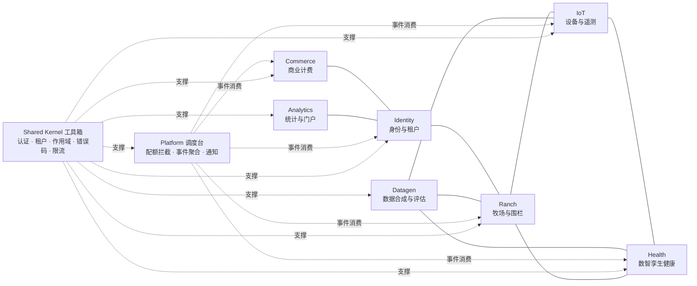
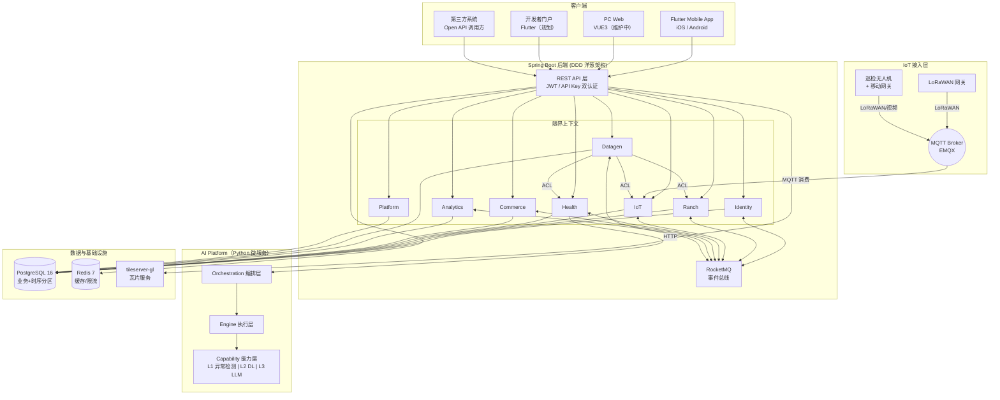
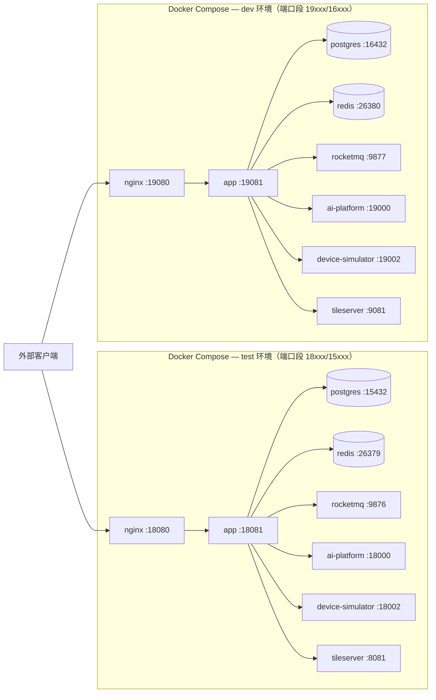
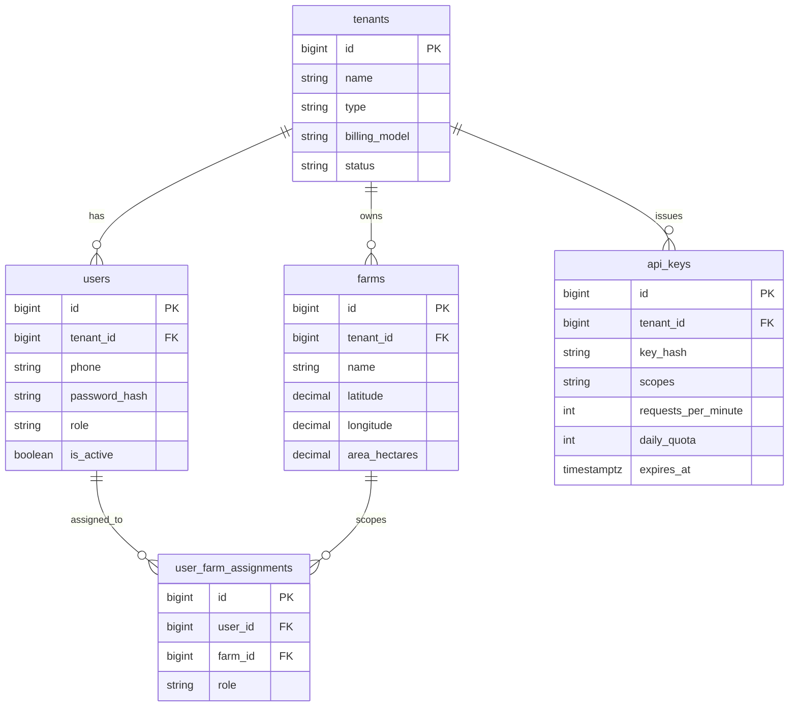
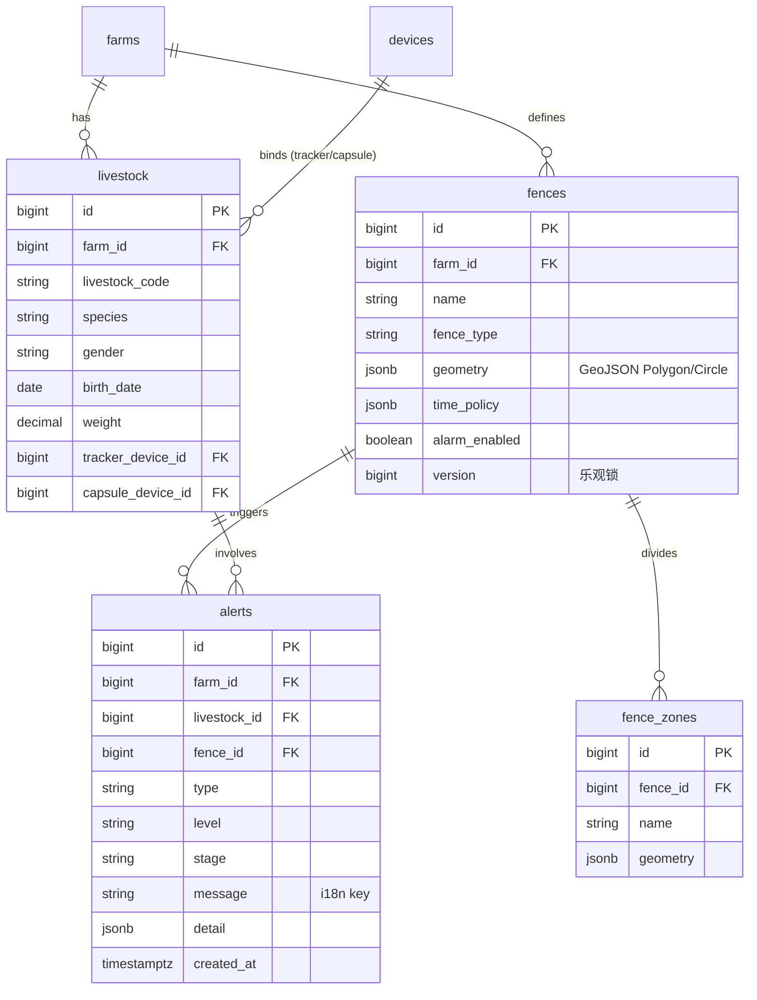
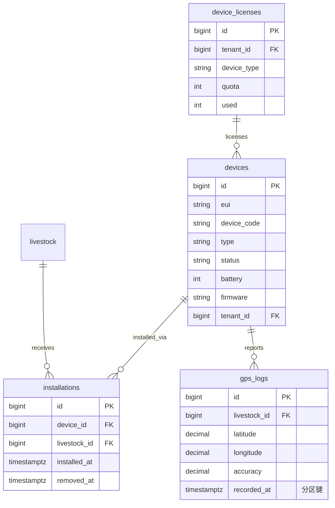
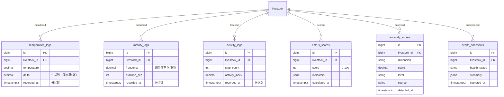
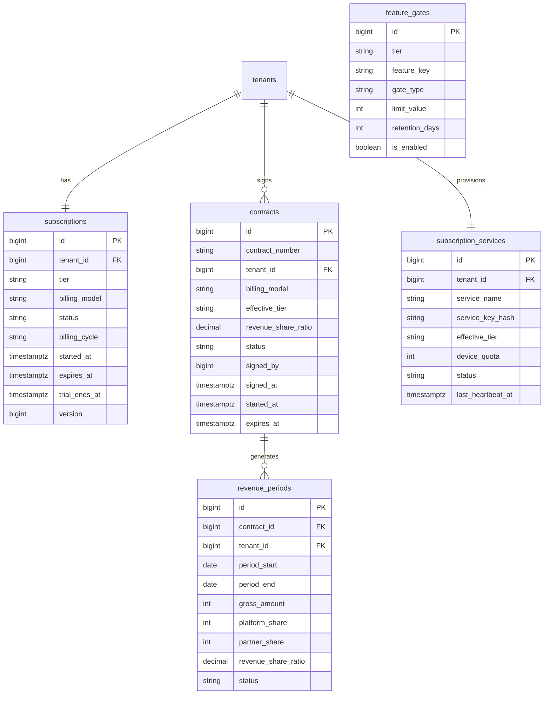
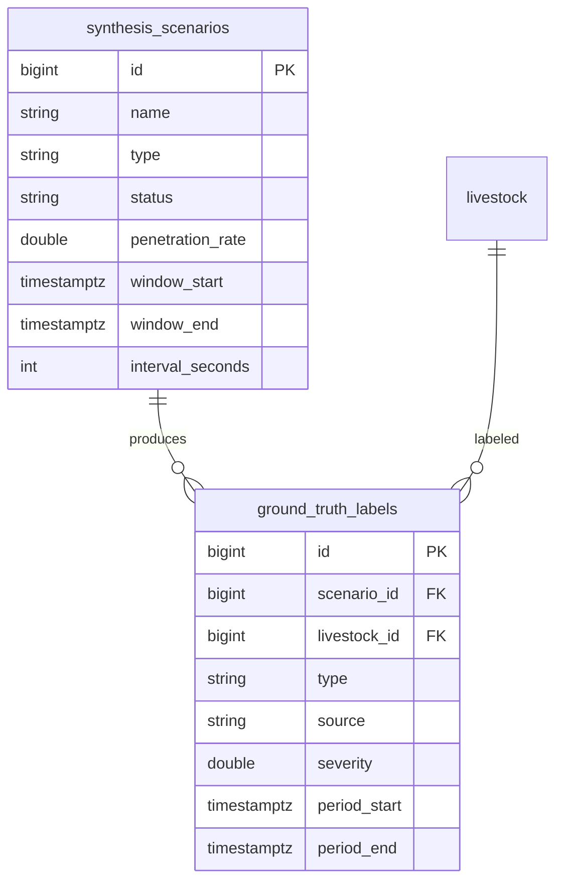
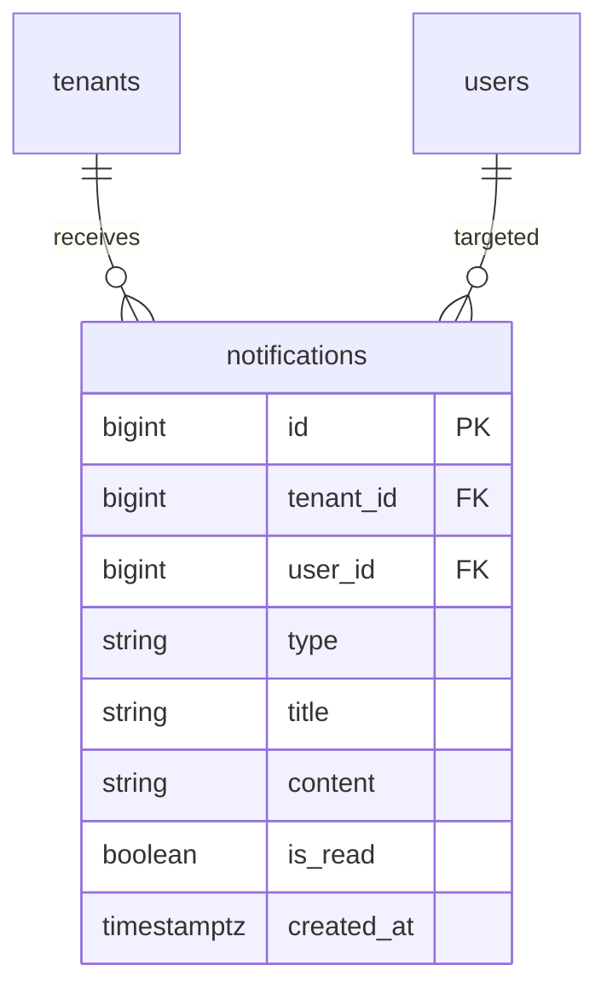

# SmartLivestock 智慧畜牧产品规划

> **版本**：v2.2
> **日期**：2026-07-05
> **状态**：基线
> **替代**：v2.1（2026-07-02）
> **范围**：全平台系统（Flutter Mobile App + PC 管理端 + Spring Boot 后端服务 + AI Platform 微服务 + IoT 设备层 + 无人机巡检 + 商业模式）
> **编制**：基于 v2.1 增量更新 — 地图瓦片架构升级（逐瓦片智能路由替代全局三级降级）、离线瓦片管理完善（流式下载 + 完整管理 UI）、产品定位明确（国际市场优先） — 对齐 2026-06-18 后新增 spec（datagen 限界上下文、AI 健康路线图 Phase A 交付、牲畜/设备管理、dev/test 环境分离、i18n 设计、跨上下文解耦）+ 同步 API 契约 As-Built 端点数据

---

## 修订记录

| 版本 | 日期 | 变更 |
|------|------|------|
| v2.3 | 2026-07-08 | 设备健康管理设计（device_telemetry_logs + 健康评分）、blade 集成用户旅程、datagen 对齐 blade 数据格式、Phase 3 实施设计 spec |
| v2.2 | 2026-07-08 | 新增 §4.13 第三方平台集成（hkt-blade-device），Phase 3 PoC 验证结果，设备管理模块 blade 对接描述 |
| v2.1 | 2026-07-02 |

| 版本 | 日期 | 变更 |
|------|------|------|
| v2.2 | 2026-07-05 | 地图瓦片架构升级：(1) SmartTileProvider 从全局三级降级重写为逐瓦片智能路由（本机mbtiles→OSM在线→tileserver兜底）；(2) 离线瓦片管理完善：流式下载（不OOM）+完整管理UI（下载/进度/存储/删除）+取消能力；(3) MBTilesTileProvider 内存元数据缓存（O(1)瓦片命中判断）；(4) 连通性缓存（30s TTL）；(5) 产品定位明确为国际市场优先，OSM成为默认在线源 |
| v2.1 | 2026-07-02 | 增量更新：(1) API 端点数据按 As-Built 校准（App 117 / Admin 59 / Open 11）；(2) 新增 Datagen + Platform 上下文，限界上下文 7→9；(3) AI 模型章节重写：Phase A 已交付（Python 微服务 67 tests）+ Phase B/C 双轨路线图（datagen × AI 能力）；(4) 新增 §6.13 牲畜/设备/安装管理模块；(5) i18n 扩充为完整实施方案（前端 gen-l10n + 后端 MessageSource + 在线切换）；(6) 补跨上下文解耦原则（RocketMQ pub/sub + ACL 防腐层）；(7) 部署架构补 dev/test 双环境分离；(8) 路线图更新里程碑 |
| v2.0 | 2026-06-18 | 架构对齐基线：借鉴 SmartPark PRD v3.0.3 结构，全面重写为 DDD 洋葱架构视角；新增限界上下文全景图（7 上下文）、系统架构图、数据架构（ER 图 + 时序分区 + 数据治理）、接口契约规范化（RFC 7807 错误码 + 三端总览）、非功能需求补齐（可靠性/GDPR/颜色规范/可扩展性）、商业模式补单位经济模型 + 三收入线 + 订阅状态机、路线图增准出标准与里程碑；以 smart-livestock-server 实际实现为事实来源（51 Controller、~186 端点、V1–V37 Flyway 迁移） |
| v1.1 | 2026-04-13 | 整合研发项目立项书：无人机巡检模块、移动 LoRaWAN 网关、技术选型更新（SpringCloud/VUE3）、竞品三层分析增强、知识产权规划、收入预测（已被 v2.0 替代） |
| v1.0 | 2026-04-09 | 初始版本，整合 Mobile/docs/ 全部设计文档（已归档） |

---

## 一、产品概述

### 1.1 产品定位

面向牧场主的牲畜智能管理平台，通过 **IoT 设备（GPS 追踪器 + 瘤胃胶囊 + 耳标）+ AI 数智孪生 + 无人机巡检**，实现牲畜**定位管控**、**健康预警**、**行为分析**和**空地协同巡检**，帮助牧场主从经验养殖转向数据驱动的精准养殖，以低部署成本切入中型及大型牧场市场（50–5,000 头）。

**核心价值主张**：

- **LoRaWAN 低功耗广覆盖**：3 年电池寿命（远超竞品 6 个月–1 年），偏远山区不依赖蜂窝网络，覆盖 5–10 公里
- **数智孪生差异化**：4 大 AI 场景（发热/消化/发情/疫病）覆盖牲畜全生命周期，竞品尚无此能力
- **AI 异常检测已交付**：Phase A 无监督异常检测（Python 微服务，STL+CUSUM+Mahalanobis/iForest 联合检测），67 tests passed
- **空地协同**：第三方工业无人机 SDK 集成 + 移动 LoRaWAN 网关补盲，自动巡航 + 告警联动追踪 + 声音驱赶
- **防盗能力**：瘤胃胶囊与追踪器蓝牙关联，链接断开超 5 分钟主动上报丢失告警
- **灵活定价**：一次性设备购买 + 可选订阅增值服务（不强制月费）

### 1.2 目标市场

**产品主要面向国际市场**（欧洲、美洲、大洋洲），同时覆盖中国。目标客户集中在阿根廷（潘帕斯草原）、巴西（中南部）、南非、澳大利亚、新西兰及中国内蒙古/新疆等大范围牧场区域。

| 客户类型 | 规模 | 付费能力 | 核心需求 | 优先级 |
|----------|------|----------|----------|--------|
| 小型牧场 | 50–200 头 | 中 | 定位防盗、基础健康 | P1 |
| 中型牧场 | 200–1,000 头 | 较高 | 繁殖管理、疾病预警 | P0 |
| 大型牧场 | 1,000–5,000 头 | 高 | 全面管理、降本增效 | P0 |
| 超大型牧场/集团 | 5,000+ 头 | 很高 | 集团化管理、数据分析 | P1 |

### 1.3 差异化分层

| 时间维度 | 差异化能力 | 说明 |
|----------|-----------|------|
| **当前（MVP / Phase 1–2）** | LoRaWAN 低部署成本 | 免授权频段 + 电池供电（≥3 年），无需布线施工，偏远山区覆盖 |
| **当前（MVP / Phase 1–2）** | 数智孪生 4 场景 | 发热/消化/发情/疫病 AI 分析引擎，竞品无此能力 |
| **当前（MVP / Phase 1–2）** | AI 无监督异常检测 | Phase A 已交付：STL 节律剥离 + CUSUM 突变检测 + 按个体样本量路由算法，三维联合（体温+蠕动+活动） |
| **当前（MVP / Phase 1–2）** | 实时地图监控 | flutter_map + SmartTileProvider 逐瓦片智能路由 + 离线瓦片管理 + WGS-84 全球统一坐标系 |
| **当前（MVP / Phase 1–2）** | 设备防盗 | 瘤胃胶囊–追踪器蓝牙关联告警 |
| **近期（Phase 2d）** | 合成数据引擎 + AI 评估闭环 | datagen 限界上下文：Scenario 驱动合成 + ground-truth 标签 + 评估框架 |
| **远期（Phase 3）** | 空地协同巡检 | 无人机 SDK 集成 + 移动 LoRaWAN 网关补盲 + 告警联动追踪 |
| **远期（Phase 3）** | AI 预测增强 | LSTM 轨迹预测、产犊预测、综合诊断 LLM Agent |

### 1.4 多语言国际化

| 语言 | 代码 | 目标市场 | 优先级 |
|------|------|----------|--------|
| 中文 | zh-CN | 国内市场（默认） | P0 |
| 英文 | en | 国际市场 | P0 |
| 西班牙语 | es | 拉美/欧洲市场 | P1 |

**实施方案（混合分层架构）**：

| 文本类型 | 翻译归属 | 机制 |
|---------|---------|------|
| UI 静态文案（按钮/标题/标签） | 前端 | Flutter `gen-l10n` + `app_zh.arb` / `app_en.arb` |
| 业务枚举显示名（告警类型/设备状态等） | 前端 | 同上 `.arb`，key 格式 `enum.alertType.fenceBreach` |
| 后端动态消息（错误/校验/业务提示） | 后端 | Spring `MessageSource` + `messages_zh.properties` / `messages_en.properties` |

**关键设计决策**：
- **在线切换**：运行时切换语言，无需重启 App、无需重新登录。`LocaleController`（Riverpod）更新 → `MaterialApp.locale` 变化 → 全 UI 即时重渲染
- **后端语言协商**：前端 `ApiClient` 在请求头附带 `Accept-Language: zh-CN` / `en`，后端 `LocaleResolver` 解析后 `MessageSource` 返回对应语言消息
- **枚举不变**：枚举值（如 `FENCE_BREACH`）在前后端传输不变，只有显示名按 locale 翻译。后端枚举与数据库 schema 零改动
- **默认语言**：首次启动跟随系统 locale；用户手动切换后持久化（`shared_preferences`），覆盖系统设置
- **后端 fallback**：不识别的 `Accept-Language` → fallback 到 `zh-CN`
- **扩展性**：加一种语言 = 加一套 `.arb` + `.properties` 文件，不改代码
- **禁止硬编码**：前端禁 `Text("确认")` 等字面量，后端禁源码内面向用户文本，全部走 i18n 资源

### 1.5 竞争格局

**直接竞品**：

| 竞品 | 国家 | 技术路线 | 关注点 |
|------|------|----------|--------|
| Halter | 新西兰 | 蜂窝 + 项圈 | 虚拟围栏、健康监测，电池 6 个月 |
| Vence | 美国 | 蜂窝 | 牲畜追踪 + 虚拟围栏，电池 1 年 |
| Nofence | 挪威 | 4G/LTE | 虚拟围栏，面向山羊/绵羊 |
| Digitanimal | 西班牙 | LoRaWAN | 牲畜追踪 + 活动监测，电池 2–3 年 |

**功能对比**：

| 功能 | Halter | Vence | Nofence | Digitanimal | **我方** |
|------|--------|-------|---------|--------------|----------|
| 虚拟围栏 | ✓ | ✓ | ✓ | △ | **核心** |
| GPS 定位 | ✓ | ✓ | ✓ | ✓ | **核心** |
| 越界告警 | ✓ | ✓ | ✓ | ✓ | **核心** |
| 电池寿命 | 6 个月 | 1 年 | 6 个月 | 2–3 年 | **3 年** |
| 通信方式 | 蜂窝 | 蜂窝 | 4G/LTE | LoRaWAN | **LoRaWAN** |
| 强制月费 | ✓ | ✓ | ✓ | ✗ | **可选订阅** |
| 健康监测 | ✓ | ✗ | ✗ | ✓ | **瘤胃胶囊** |
| AI 异常检测 | ✗ | ✗ | ✗ | ✗ | **无监督 + 三维联合** |
| 数智孪生 | ✗ | ✗ | ✗ | ✗ | **4 场景** |
| 设备防盗 | ✗ | ✗ | ✗ | ✗ | **蓝牙关联** |
| 无人机巡检 | ✗ | ✗ | ✗ | ✗ | **SDK + 移动网关** |

### 1.6 部署模式

| 模式 | 适用场景 | 特点 |
|------|----------|------|
| **区域云端部署** | 中小型养殖户 | 多租户共享，App 公网访问，Docker Compose 部署 |
| **私有化部署** | 大型/超大型养殖场 | 数据完全私有，App 内网/VPN 访问 |

---

## 二、用户与场景

### 2.1 目标角色

| 角色 | 描述 | 核心诉求 | 阶段 |
|------|------|----------|------|
| 牧场主（owner） | 中大型牧场经营者 | 群体概览、异常预警、减少人工巡栏、繁殖管理 | P0 |
| 牧工（worker） | 日常放牧人员 | 实时位置查看、围栏告警处理 | P0 |
| 兽医/技术员 | 兽医站、畜牧技术员 | 个体健康分析、历史数据追溯 | P1 |
| 平台管理员（platform_admin） | SaaS 平台运维 | 租户开通、运行监控、故障处理 | P0 |
| B 端管理员（b2b_admin） | B 端客户管理员 | 牧场创建、用户分配、合同对账 | P1 |
| API 开发者（api_consumer） | 第三方集成商 | Open API 数据接入 | P1 |

### 2.2 核心用户场景

| # | 场景 | 角色 | 描述 | 阶段 |
|---|------|------|------|------|
| US-01 | 实时牲畜监控 | 牧场主 | 地图实时查看牲畜位置与设备状态 | P0 |
| US-02 | 虚拟围栏管理 | 牧场主 | 手绘多边形/模板创建围栏，时间策略 | P0 |
| US-03 | 越界告警处理 | 牧工 | 越界/离群/盗窃告警接收与确认 | P0 |
| US-04 | 发热预警 | 牧场主/兽医 | 瘤胃温度基线偏离检测，72h 趋势 | P0 |
| US-05 | 消化管理 | 牧场主/兽医 | 瘤胃蠕动频率监测，消化健康评分 | P0 |
| US-06 | 发情识别 | 牧场主/兽医 | 多传感器融合评分，配种时机提醒 | P0 |
| US-07 | 疫病防控 | 牧场主 | 群体健康趋势、接触链路追踪 | P0 |
| US-08 | 设备运维 | 牧场主 | 设备状态、电量、信号、绑定管理 | P0 |
| US-09 | 牲畜档案 | 牧场主/兽医 | 耳标、品种、体重、设备绑定、健康档案 | P0 |
| US-10 | 租户开通 | 平台管理员 | 创建租户、分配用户、License 配额 | P0 |
| US-11 | 订阅计费 | B 端管理员 | 订阅层级、合同、分润对账、功能门控 | P1 |
| US-12 | 无人机巡检 | 牧场主/牧工 | 自动巡航、视频回传、告警联动追踪 | P2 |
| US-13 | API 数据接入 | API 开发者 | Open API 查询牲畜/围栏/告警/设备 | P1 |
| US-14 | 历史轨迹回放 | 牧场主 | 24h/7d/30d 轨迹回放、热力图 | P1 |
| US-15 | 多牧场切换 | 牧场主 | 一个账号管理多个牧场，切换刷新 | P0 |
| US-16 | 丢失设备搜寻 | 牧工 | 无人机移动网关主动搜索丢失动物信号 | P2 |
| US-17 | AI 异常检测查看 | 牧场主/兽医 | 双轨展示：规则告警 + AI 异常指数并排 | P1 |
| US-18 | 牧场统计看板 | 牧场主/牧工 | 牧场概览、健康统计、牲畜/设备统计、API 用量趋势 | P0 |
| US-19 | 个人设置与语言切换 | 所有角色 | 个人信息、告警通知偏好、中英文在线切换 | P1 |
| US-20 | 牧工管理 | 牧场主 | 牧工列表、分配牧场、角色权限、启停账号 | P0 |
| US-21 | 审计日志 | 平台管理员 | 全操作审计日志查询、筛选、导出 | P1 |
| US-22 | B 端概览与牧场管理 | B 端管理员 | B 端控制台概览、旗下牧场管理、牧工详情 | P1 |
| US-23 | 离线数据访问 | 牧场主/牧工 | 离线围栏/牲畜/瓦片数据，网络恢复后自动同步 | P1 |
| US-24 | 合成数据场景管理 | 平台管理员 | 创建/启动/停止合成场景、查看 GroundTruth 标签、评估报告 | P1 |

### 2.3 角色旅程链

**概要流程**：

```
platform_admin → 创建租户 → 进入租户详情 → 新增用户（b2b_admin / owner / worker）
b2b_admin → 创建牧场 → 分配给 owner
owner → 管理牲畜、围栏、告警、牧工、订阅
```

> 牧场不由 owner 自行创建，由 b2b_admin 或 platform_admin 创建并分配。

系统定义 5 种角色，分属三个操作端：

| 角色 | 操作端 | Shell 类型 | 说明 |
|------|--------|-----------|------|
| **platform_admin** | 平台后台 `/ops/admin` | 无 Shell，纯 Scaffold | 平台级管理，无租户归属 |
| **b2b_admin** | B 端控制台 `/b2b/admin` | 左侧 NavigationRail | 管理旗下牧场、牧工、合同 |
| **owner** | 移动端 App | 底部导航栏（4–5 Tab） | 管理牧场全部业务 + 后台 + 订阅 |
| **worker** | 移动端 App | 底部导航栏（4 Tab） | 查看告警、围栏，仅确认告警 |
| **api_consumer** | 开发者门户 | — | 仅 API 访问，无 App 端 |

#### 2.3.1 平台入驻旅程（platform_admin）

```
platform_admin 登录（重定向到 /ops/admin）
  → 租户列表：查看、筛选、搜索全部租户
  → 创建租户：填写租户信息，初始化 License 配额
  → 租户详情：查看租户基本信息、配额用量
  → 新增用户：为租户创建 b2b_admin、owner、worker 账号
  → 用户管理：启用/停用账号、修改角色
  → License 管理：按设备类型（追踪器/胶囊/耳标）调整配额
  → 合同管理：查看全部合同 CRUD
  → 分润对账：分润周期管理、对账报表
  → 订阅服务管理：订阅服务 CRUD、FeatureGate 配置
  → API 授权审批：审核 API Key 申请、吊销
  → 审计日志：全操作审计日志查询与导出
  → 合成数据管理：创建/启动/停止合成场景（Phase B）
  → 平台分析：API 用量统计、趋势分析
  → 瓦片管理：地图瓦片任务管理
```

**关键规则**：
- platform_admin 无租户归属，可操作所有租户数据
- 禁用租户后 5 分钟内该租户全部 Token 失效
- 牧场不由 owner 自行创建，由 platform_admin 或 b2b_admin 创建并分配

#### 2.3.2 B 端管理旅程（b2b_admin）

```
b2b_admin 登录（自动重定向到 /b2b/admin）
  → B 端概览看板：旗下牧场、牲畜、设备统计
  → 牧场列表：查看旗下全部牧场
  → 创建牧场：填写牧场信息（名称、坐标、面积）
  → 分配 owner：将牧场分配给指定牧场主
  → 牧工管理：查看/管理旗下全部牧工
  → 牧工详情：查看某牧工在各牧场的分配情况
  → 合同管理：查看合同信息
  → 对账看板：查看分润对账、分润明细
```

**关键规则**：
- b2b_admin 只能访问所属租户下的数据
- 路由守卫：仅允许 `/b2b/admin/*`，其余路径重定向到 `/b2b/admin`
- 牧场创建后可指定 owner，owner 无需自行创建牧场

#### 2.3.3 牧场主旅程（owner）

```
owner 登录（重定向到 /twin 数智孪生首页）
  ┌─ 底部 Tab 导航 ─────────────────────────────────────┐
  │                                                     │
  │  【孪生（首页）】                                     │
  │    → 牧场概览卡片（名称、天气、同步状态）              │
  │    → 4 项核心统计（牲畜总数、健康率、预警数、设备在线率）│
  │    → 4 场景入口：发热预警 / 消化管理 / 发情识别 / 疫病防控│
  │    → AI 异常检测双轨展示（规则告警 + AI 指数）          │
  │                                                     │
  │  【地图】                                            │
  │    → 牧群/个体实时位置（flutter_map）                 │
  │    → 设备在线状态指示（在线/离线/低电量）               │
  │    → 地图图层切换（卫星图/地形图/牧场边界）             │
  │    → 逐瓦片智能路由（本机mbtiles → OSM在线 → tileserver兜底）│
  │    → 历史轨迹回放（24h/7d/30d/自定义）                 │
  │    → 轨迹热力图、放牧密度热力图                        │
  │                                                     │
  │  【告警】                                            │
  │    → 告警列表（按类型/级别/状态筛选）                  │
  │    → 告警详情（越界个体、时间、位置、围栏信息）         │
  │    → 告警处理：确认 → 处理 → 归档                      │
  │    → 告警类型：越界/低电量/信号丢失/温度异常/蠕动异常/   │
  │      发情高分/群体异常/追踪器丢失                        │
  │                                                     │
  │  【围栏】                                            │
  │    → 围栏列表（按类型/状态筛选）                       │
  │    → 围栏创建：地图手绘多边形 / 模板（矩形/圆形）       │
  │    → 围栏编辑：增删移动顶点                              │
  │    → 围栏区域（FenceZone）细分管理                     │
  │    → 时间策略：全天生效或特定时段生效                   │
  │    → 冲突检测（围栏重叠识别）                           │
  │                                                     │
  │  【后台管理】（第 5 Tab）                              │
  │    → 牲畜管理：列表/档案/群组/创建/编辑/删除            │
  │    → 设备管理：追踪器/胶囊/耳标列表、状态监控、绑定     │
  │    → 安装管理：设备安装/卸载/历史记录                   │
  │    → 牧工管理：添加/移除牧工                            │
  │    → 租户信息：当前租户基本信息                          │
  │    → 订阅管理：套餐查看/升级/支付确认                    │
  │    → 离线地图管理：下载/管理/删除离线瓦片                     │
  │    → API 授权管理：管理自己的 API Key（若授权）          │
  │    → 统计分析：牧场维度数据统计                          │
  │                                                     │
  │  【我的】                                            │
  │    → 个人信息：手机号、角色                             │
  │    → 告警通知偏好设置                                  │
  │    → 多语言在线切换（zh-CN / en）                      │
  │    → 多牧场切换：切换当前活跃牧场，页面数据即时刷新       │
  │    → 退出登录                                         │
  └─────────────────────────────────────────────────────┘
```

**关键规则**：
- 牧场主可访问全部 App 页面 + 后台管理 + 牧工管理 + 订阅管理
- 告警状态推进：pending → acknowledged（owner/worker）→ handled（owner only）→ archived（owner only）
- 非法状态跳转返回 409 CONFLICT
- 设备安装约束：每头牲畜每种设备类型最多一个活跃安装；安装前设备必须 ACTIVE
- 牲畜删除：有活跃安装时禁止删除（409 STATE_CONFLICT）
- 牲畜耳标号、设备编号全局唯一

#### 2.3.4 牧工旅程（worker）

```
worker 登录（重定向到 /twin 数智孪生首页）
  ┌─ 底部 Tab 导航（4 Tab） ────────────────────────────┐
  │                                                     │
  │  【孪生】  → 查看地图、牲畜位置、健康概览（只读）     │
  │  【地图】  → 查看实时位置、轨迹（只读）               │
  │  【告警】  → 查看告警列表、确认告警（不可处理/归档）   │
  │  【围栏】  → 仅查看围栏（不可创建/编辑/删除）         │
  │  【我的】  → 个人资料、语言切换、牧场切换、退出登录    │
  │                                                     │
  │  ✗ 不可访问：后台管理、牧工管理、订阅管理、设备管理、  │
  │    牲畜管理、统计分析                                  │
  └─────────────────────────────────────────────────────┘
```

#### 2.3.5 API 开发者旅程（api_consumer）

```
api_consumer 通过开发者门户操作
  → 申请 API Key（提交 scope、频率需求）
  → 等待 platform_admin 审批
  → 审批通过后获取 API Key（仅首次发放时可见明文）
  → 调用 Open API：牲畜/围栏/告警/设备只读查询
  → 设备自注册：通过专用 Key（scope: device:register）批量注册设备
  → 查看 API 用量统计、调用日志
  → Key 过期/吊销后重新申请
```

**关键规则**：
- api_consumer 无 App 端，仅通过开发者门户和 API 访问
- 认证方式：API Key（SHA-256 hash 校验），独立于 JWT
- 速率限制：per-key 默认 60 次/分钟 + daily_quota
- 数据隔离：由 API Key 关联租户 + scope 过滤实现

#### 2.3.6 路由守卫规则

| 条件 | 行为 |
|------|------|
| 未登录 | 所有页面 → `/login` |
| platform_admin | 仅允许 `/ops/admin/*` 和 `/admin/*`，其余重定向到 `/ops/admin` |
| b2b_admin | 仅允许 `/b2b/admin/*`，其余重定向到 `/b2b/admin` |
| owner | 允许所有 App 页面 + `/admin` + `/mine/workers` |
| worker | 允许 App 页面，拒绝 `/admin`、`/mine/workers`（重定向到 `/twin`） |

#### 2.3.7 核心操作权限速览

| 操作 | owner | worker | platform_admin | b2b_admin |
|------|:-----:|:------:|:--------------:|:---------:|
| 创建/编辑/删除围栏 | ✅ | ✗ | ✗ | ✗ |
| 确认告警 | ✅ | ✅ | ✗ | ✗ |
| 处理/归档告警 | ✅ | ✗ | ✗ | ✗ |
| 管理租户（含启停） | ✗ | ✗ | ✅ | ✗ |
| 创建牧场并分配 owner | ✗ | ✗ | ✅ | ✅ |
| 管理牲畜/设备/安装 | ✅ | ✗ | ✗ | ✗ |
| 管理订阅/升级套餐 | ✅ | ✗ | ✗ | ✗ |
| 管理旗下牧工 | ✅ | ✗ | ✗ | ✅ |
| 管理合同 | ✗ | ✗ | ✅ | ✅（只读） |
| 分润对账 | ✗ | ✗ | ✅ | ✅ |
| 管理订阅服务/FeatureGate | ✗ | ✗ | ✅ | ✗ |
| 审批 API 授权 | ✗ | ✗ | ✅ | ✗ |
| 审计日志 | ✗ | ✗ | ✅ | ✗ |
| Open API 访问 | ✗ | ✗ | ✗ | ✗（仅 api_consumer） |

> 详细权限矩阵见 §9 角色与权限。

#### 2.3.8 种子数据登录凭据

| 角色 | 手机号 | 密码 | 说明 |
|------|--------|------|------|
| platform_admin | 13800000000 | 123 | 平台级管理，无租户归属 |
| b2b_admin | 13900139000 | 123 | Demo 租户 B 端管理员 |
| owner | 13800138000 | 123 | Demo 租户 owner，关联主牧场 |
| worker | 13800138001 | 123 | Demo 租户牧工，关联主牧场 |

> 密码通过 BCrypt 哈希存储。Seed 迁移严格遵循三步验证（生成时验证 → 写入 Flyway 迁移 → 部署后 `curl` 登录验证）。

---

## 三、商业模式

### 3.0 商业模式总纲

SmartLivestock 的收入由**三条独立产品线**构成，对应 `Tenant.billingModel` 字段：

| 收入线 | 计费模式 | 面向客户 | 计费基础 |
|--------|---------|---------|---------|
| **A. SaaS 订阅** | `direct`（直订） | 牧场主（中大型牧场） | 固定月费 + 超出头数加价 |
| **B. Open API** | `api_usage`（API 用量） | 集成商/智慧农业平台/政府监管 | API 调用次数 × 数据范围 |
| **C. 硬件** | 一次性销售 | 所有客户 | 单价 × 数量 |

此外支持两种 B2B 模式：

| 计费模式 | 说明 | 典型场景 |
|---------|------|---------|
| `revenue_share`（分润） | 渠道商引入客户，按月分润 | B 端经销商代理销售 |
| `licensed`（独立部署） | 客户购买 License 文件私有化部署 | 大型企业/集团自建 |

租户通过 `Tenant.type` 标识商业角色：`rancher`（牧场主）、`reseller`（经销商）、`enterprise`（企业客户）、`developer`（API 开发者）。`type` 回答"你是谁"，`billingModel` 回答"怎么收钱"，两个维度正交。

### 3.1 套餐分层

```
┌─────────────────────────────────────────────────────────┐
│                 牛羊监测订阅套餐金字塔                    │
├─────────────────────────────────────────────────────────┤
│            ENTERPRISE（企业定制版）                       │
│      集团管理 | 私有部署 | 定制开发 | 专属支持            │
├─────────────────────────────────────────────────────────┤
│               PREMIUM（专业版）$28/月                    │
│    含 1,000 头 | 发情检测 | 繁殖管理 | 高级分析          │
├─────────────────────────────────────────────────────────┤
│              STANDARD（标准版）$14/月                    │
│      含 200 头 | 定位追踪 | 健康预警 | 基础支持          │
├─────────────────────────────────────────────────────────┤
│                BASIC（免费版）$0/月                      │
│        含 50 头 | 定位追踪 | 7 天数据保留                │
└─────────────────────────────────────────────────────────┘
```

> 与后端 `SubscriptionTier` 枚举完全对齐：BASIC、STANDARD、PREMIUM、ENTERPRISE。新用户注册即获 14 天 PREMIUM 全功能试用。

### 3.2 套餐详细设计

#### BASIC（免费版）— $0/月

| 项目 | 配置 |
|------|------|
| 月费 | $0（免费） |
| 含牲畜数 | 50 头 |
| 超出费用 | $0.40/头/月 |
| 数据保留 | 7 天 |
| SLA | 99.5% |
| 功能 | 定位追踪、基础数据查看 |

#### STANDARD（标准版）— $14/月

| 项目 | 配置 |
|------|------|
| 月费 | $14（≈¥100） |
| 含牲畜数 | 200 头 |
| 超出费用 | $0.30/头/月（≈¥2.1） |
| 数据保留 | 30 天 |
| SLA | 99.5% |
| 支持 | 工单系统，8 小时响应 |
| 功能 | 定位追踪、轨迹回放、电子围栏、体温监测、健康预警、基础报表 |

#### PREMIUM（专业版）— $28/月

| 项目 | 配置 |
|------|------|
| 月费 | $28（≈¥200） |
| 含牲畜数 | 1,000 头 |
| 超出费用 | $0.15/头/月（≈¥1.1） |
| 数据保留 | 90 天 |
| SLA | 99.9% |
| 支持 | 工单系统，4 小时响应 |
| 功能 | STANDARD 全部 + 发情检测、繁殖管理、配种建议、产犊预测、高级分析、AI 异常检测 |

#### ENTERPRISE（企业定制版）

| 项目 | 配置 |
|------|------|
| 价格 | 定制（联系销售） |
| 含牲畜数 | 不限 |
| 数据保留 | 3 年 |
| 部署方式 | 公有云 / 私有云 / 本地部署（Licensed 模式） |
| SLA | 99.99%（可定制） |
| 支持 | 专属客户经理 + 7×24 电话 + 现场支持 |
| 功能 | PREMIUM 全部 + 集团管理、多牧场联动、定制开发、API 对接 |

### 3.3 计费公式

月费统一公式（代码中 `SubscriptionTier.calculateMonthlyFee()` 实现）：

```
月费($) = 基准月费 + max(0, 实际牲畜数 - 含免费额) × 超出单价
```

| Tier | 基准月费 | 含免费额 | 超出单价 | 示例：500 头牧场 |
|------|---------|---------|---------|----------------|
| BASIC | $0 | 50 头 | $0.40/头 | $0 + 450×$0.40 = **$180/月** |
| STANDARD | $14 | 200 头 | $0.30/头 | $14 + 300×$0.30 = **$104/月** |
| PREMIUM | $28 | 1,000 头 | $0.15/头 | 500 ≤ 1,000 → **$28/月** |
| ENTERPRISE | 定制 | — | — | — |

> 500 头牧场选 PREMIUM（$28/月）反而比 STANDARD（$104/月）便宜——这是有意设计的升档激励。1,000 头以内的牧场，PREMIUM 均为 $28/月封顶。

### 3.4 试用期

| 项目 | 配置 |
|------|------|
| 时长 | **14 天** |
| 试用 Tier | **PREMIUM**（全功能体验） |
| 到期后 | 自动降为 FREE 状态（tier=BASIC），保留数据，可随时付费激活 |
| 试用期间 | 所有 PREMIUM 功能可用，无头数限制 |

### 3.5 计费周期与折扣

| 周期 | 折扣 | 说明 |
|------|------|------|
| 月付 | 基准价格 | 灵活性高 |
| 年付 | 85 折 | 鼓励长期承诺（约免 2 个月） |
| 两年付 | 75 折 | 深度绑定 |

### 3.6 单位经济模型

| 成本项 | 月成本（$/头） | 说明 |
|--------|---------------|------|
| LoRaWAN 通信 | $0.01–0.02 | 自建网关摊销或公共网络 |
| 云基础设施 | $0.02–0.04 | 计算 + 存储 + 带宽分摊 |
| 支撑成本 | $0.02–0.04 | 客户支持 + 运维分摊 |
| **合计** | **$0.05–0.10** | 目标毛利率 ≥85% |

> 按 STANDARD 的超出单价 $0.30/头/月计算，毛利率 >80%。

### 3.7 订阅状态机

```
                                  ┌──────────────┐
                                  │    TRIAL     │ 注册即获 14 天 PREMIUM
                                  │  (全功能试用)  │
                                  └──┬───┬───┬──┘
                      到期自动降级 ⬇    │   │ 主动取消
                                  ┌──┘   │   └──────────┐
                                  ⬇      ⬇              ⬇
                            ┌────────┐ ┌──────────┐ ┌───────────┐
                            │  FREE  │ │  ACTIVE  │ │ CANCELLED │
                            │(BASIC) │ │ (按tier) │ │  (终止)   │
                            └───┬────┘ └──┬───┬───┘ └───────────┘
                     付费激活 ⬆    │       │   │ 续费失败
                            │        │       │   ⬇
                            └────────┘       │ ┌─────────────────┐
                                             │ │ RENEWAL_FAILED  │
                                     续费成功│ │ (宽限 7 天)     │
                                             │ └───┬─────────────┘
                                             │     │ 宽限期满未续
                                             │     ⬇
                                             │ ┌──────────┐
                                             │ │  EXPIRED │
                                             │ │ (过期)   │
                                             │ └──────────┘
                                             │
                                    ┌────────┘
                                    ⬇
                              ┌───────────┐
                              │ SUSPENDED │  管理员暂停
                              │  (暂停)   │
                              └───────────┘
```

| 状态 | 含义 | tier | 功能访问 |
|------|------|------|---------|
| `TRIAL` | 14 天全功能试用 | PREMIUM | 全功能 |
| `ACTIVE` | 正常付费订阅 | 按套餐 | 全功能（按 tier） |
| `FREE` | 试用到期/降级 | BASIC | 仅免费功能 |
| `RENEWAL_FAILED` | 续费失败，7 天宽限 | 不变 | 全功能（宽限期内） |
| `EXPIRED` | 超宽限期未续费 | BASIC | 降为免费 |
| `SUSPENDED` | 管理员暂停 | 不变 | 只读 + 告警冻结 |
| `CANCELLED` | 主动取消/终止 | — | 全部冻结 |

**状态转换规则**：
- TRIAL → ACTIVE：付费激活任意套餐
- TRIAL → FREE：14 天到期自动降级（`TrialExpiryJob`，每小时检查）
- TRIAL → CANCELLED：用户主动取消
- ACTIVE → RENEWAL_FAILED：到期扣款失败 → 7 天宽限
- RENEWAL_FAILED → ACTIVE：宽限期内续费成功
- RENEWAL_FAILED → EXPIRED：宽限期满未续费（`RenewalFailedExpiryJob`，每天 2:00 检查）
- ACTIVE → SUSPENDED：管理员暂停 → 可恢复
- FREE → ACTIVE：随时升级付费
- 全部状态 → CANCELLED：主动取消（记录 `cancelledAt`）

### 3.8 三种计费模式端到端流程

#### B2C 直订（billingModel=direct）

```
1. 用户注册 → Tenant(type=rancher, billingModel=direct)
2. 自动创建 Subscription(status=TRIAL, tier=PREMIUM, trialEndsAt=now+14d)
3. 14 天后 TrialExpiryJob → expireTrial() → FREE(tier=BASIC)
4. 用户选 STANDARD → POST /subscription/checkout（Mock 支付）
5. 支付成功 → activate(STANDARD, "monthly", expiresAt) → ACTIVE
6. 升降级 → PUT /subscription/tier → changeTier(PREMIUM)
7. 到期 → markRenewalFailed() → RENEWAL_FAILED（7 天宽限）
   ├─ 宽限期内补缴 → recoverFromRenewalFailure() → ACTIVE
   └─ 超宽限期 → downgradeAfterRenewalFailure() → FREE
```

#### B2B 分润（billingModel=revenue_share）

```
1. Admin 创建 Partner Tenant(type=reseller, billingModel=revenue_share)
2. Admin 创建合同草稿 → POST /admin/contracts → DRAFT
3. Admin 签署合同 → POST /admin/contracts/{id}/sign → ACTIVE
4. 每月 1 日 RevenueCalculationJob → 过滤 ACTIVE 合同
   → 按 revenueShareRatio 计算分润 → 生成 RevenuePeriod(PENDING)
5. 平台确认 → PLATFORM_CONFIRMED → Partner 确认 → PARTNER_CONFIRMED → 结算 → SETTLED
```

#### Licensed 独立部署（billingModel=licensed）

```
1. Admin 创建 Enterprise Tenant(type=enterprise, billingModel=licensed)
2. Admin 创建 SubscriptionService → provision() → 生成 License 文件（JWT，含 tenantId + tier + 设备配额 + RSA 签名）
3. 客户拿到 License 文件集成到自己的系统
4. Admin 激活 → activate() → ACTIVE
5. LicenseExpiryJob 每天检查 → expire() → EXPIRED
```

### 3.9 FeatureGate 功能门控

配额引擎由 `QuotaInterceptor` + `FeatureGate` 实体实现，代码级强制拦截。每种功能门控有 4 种类型：

| gateType | 机制 | 示例 |
|----------|------|------|
| **NONE** | 不受限 | GPS 定位（所有 tier 可用） |
| **LOCK** | 功能锁定 | 发情检测（BASIC 不可用，显示升级提示覆盖层） |
| **LIMIT** | 数量上限 | 电子围栏（BASIC≤3, STANDARD≤5, PREMIUM≤10, ENTERPRISE 不限） |
| **FILTER** | 数据裁剪 | 历史数据按 tier 保留天数过滤（7/30/90/1095 天） |

**请求级拦截流程**：

```
HTTP Request → JWT Filter → FarmScope → QuotaInterceptor
  ├─ 第一道：订阅是否活跃？(TRIAL/ACTIVE/FREE → 放行)
  ├─ 第二道：gateType 判断
  │   ├─ LOCK → featureKey 是否启用？
  │   ├─ LIMIT → 当前用量 < 上限？
  │   └─ FILTER → 返回保留天数，Query 层裁剪
  └─ 超出 → 403 QUOTA_EXCEEDED
```

### 3.10 硬件定价参考

| 设备类型 | 建议售价 | 寿命 |
|----------|----------|------|
| **GPS 追踪器（项圈）** | ¥350–500 | 3–5 年 |
| **耳标** | ¥280–400 | 2–3 年 |
| **瘤胃胶囊** | ¥600–900 | 2–3 年（一次性） |
| **LoRaWAN 网关** | ¥1,500–3,000 | 1 台覆盖 200–500 头 |
| **巡检无人机（外采）** | ¥10,000–30,000 | 含 SDK 授权 |

### 3.11 设备 + 订阅组合方案

| 方案 | 设备费用 | 订阅费用 | 适用客户 |
|------|----------|----------|----------|
| **买断模式** | 客户一次性购买 | 仅付平台费 | 大型牧场 |
| **租赁模式** | 设备租赁费含在订阅中 | 含设备费的订阅价 | 中小型牧场 |
| **混合模式** | 客户购买设备 | 设备费分摊到订阅 | 灵活选择 |

### 3.12 增值服务包

| 服务包 | 包含服务 | 价格 | 节省 |
|--------|----------|------|------|
| **健康管理包** | 疾病预警 + 营养建议 | $0.80/头/月 | 25% |
| **繁殖管理包** | 发情检测 + 繁殖管理 | $1.40/头/月 | 23% |
| **全方位服务包** | 所有增值服务 | $2.80/头/月 | 40% |

### 3.13 收入预测

#### 单牧场合计

| 场景 | 月收入 | 年收入 |
|------|--------|--------|
| 小型牧场（100 头，STANDARD） | $14（含 200 头，未超出） | $168 |
| 中型牧场（500 头，PREMIUM） | $28（含 1,000 头，未超出） | $336 |
| 大型牧场（2,000 头，PREMIUM） | $178（=$28 + 1,000×$0.15） | $2,136 |

#### 规模化预测

| 客户规模 | 牧场数 | 牲畜总数 | 年订阅收入（$） |
|----------|--------|----------|-----------------|
| 100 头 × 10 牧场（PREMIUM） | 10 | 1,000 | 3,360 |
| 500 头 × 20 牧场（PREMIUM） | 20 | 10,000 | 6,720 |
| 2,000 头 × 5 牧场（PREMIUM） | 5 | 10,000 | 10,680 |
| **合计** | **35** | **21,000** | **~20,760** |

> 注：以上为 SaaS 订阅收入估算，不含设备销售收入、Open API 收入、B2B 分润收入和 Licensed 部署收入。年付 85 折、两年付 75 折未计入。实际收入随套餐组合和折扣策略变化。

---

## 四、系统架构

> 采用 **DDD 洋葱架构 + 限界上下文 + 事件驱动** 设计，与 SmartPark 技术栈统一，可复用基础设施。

### 4.1 架构设计原则

1. **领域驱动设计（DDD）**：按业务能力划分 9 个上下文（7 个业务限界上下文 + Platform 支撑 + Shared 共享内核），每个上下文采用洋葱（分层）架构。
2. **事件驱动解耦**：上下文之间通过 RocketMQ 发布/订阅领域事件，避免直接代码级耦合。
3. **防腐层（ACL）隔离**：跨上下文查询通过 Port/Adapter 端口适配器，不直接引用对方领域模型，无跨上下文外键。
4. **跨上下文零直接依赖**：所有跨域通信走 RocketMQ pub/sub（写操作副作用）或 ACL 端口 + DTO（读查询）。单体内完成解耦，未来拆分微服务只需改部署方式 + ACL 实现类，领域层代码零改动。
5. **多租户隔离**：基于 JWT 解析的 `tenantId`，通过 `ThreadLocal`（`TenantContext`）在请求生命周期内传递；数据库层通过 `tenant_id` 强制注入隔离。
6. **优雅降级**：RocketMQ 不可用时事件发布静默跳过，保证应用可启动与测试可执行。AI Platform 不可用时健康检测降级到规则引擎。
7. **配置外置**：数据库、Redis、JWT、RocketMQ 等均通过环境变量注入，提供合理默认值。

### 4.2 限界上下文全景



#### 各上下文功能职责

| 上下文 | 职责 | 核心能力 | 阶段 |
|--------|------|----------|------|
| **Identity** | 多租户隔离、用户、角色权限、认证授权、审计日志、API Key | 登录/Token 刷新、租户管理、用户管理、审计日志 CRUD、API Key 生命周期 | P0 |
| **Ranch** | 牧场、牲畜、围栏、围栏区域、告警、看板、地图、瓦片管理 | 牧场 CRUD、牲畜档案、虚拟围栏、越界检测、告警状态机、地图瓦片任务与下载 | P0 |
| **IoT** | 设备全生命周期、设备 License、安装记录、GPS 日志、遥测、事件发布 | 设备注册/绑定、License 配额、GPS 时序数据接入、遥测数据管道、SpringEventPublisher | P0 |
| **Health** | 数智孪生健康分析（发热/消化/发情/疫病）、时序数据、AI 异常分数 | 温度基线、蠕动监测、发情评分、群体疫病分析、AnomalyScore 存储与查询 | P0 |
| **Commerce** | 订阅、合同、分润周期、订阅服务、功能门控 | 订阅结算、Tier 配额、FeatureGate 引擎、合同 CRUD、分润计算 | P1 |
| **Analytics** | API 统计聚合、趋势分析、开发者门户 | Open API 用量、API Key 审批、频率限制、趋势报表 | P1 |
| **Datagen** | 合成数据生成、ground-truth 标签管理、AI 评估框架 | Scenario 驱动合成（健康异常+围栏越界）、评估指标计算、数据管道闭环 | P1（Phase B 前置） |
| **Platform** | 配额拦截、事件消费聚合、平台级统一通知 | QuotaInterceptor（请求级配额拦截）、PlatformEventConsumer（跨域事件→通知/审计）、NotificationService | P0 |
| **Shared** | SecurityConfig、JwtAuthenticationFilter、TenantContext、FarmScope、DomainEvent、ErrorCode、ApiResponse、限流、缓存 | 安全过滤链、租户上下文、牧场作用域、领域事件基类、统一错误码与响应包络 | P0 |

### 4.2A 共享内核（Shared Kernel）

Shared 是 **DDD 共享内核模式**的实现——被所有限界上下文共同依赖的基础设施代码，无独立业务数据，无 DB 表。43 个 Java 文件，按职责分为 8 个子包：

| 子包 | 核心类 | 职责 |
|------|--------|------|
| `security/` | SecurityConfig, JwtAuthenticationFilter, JwtTokenProvider, ApiKeyAuthFilter, PasswordHasher | 双轨认证体系：JWT（用户态）+ API Key（第三方）。SecurityConfig 配置 Spring Security 过滤链（STATELESS + CSRF 关闭），JwtTokenProvider 基于 JJWT 0.12.5 签发/校验 Access Token（1h）+ Refresh Token（7d），ApiKeyAuthFilter 通过 SHA-256 哈希校验 Open API 请求 |
| `tenant/` | TenantContext | 多租户隔离的核心机制：从 JWT `tid` 字段解析租户 ID，存入 `ThreadLocal`，请求生命周期内全局可访问。数据库层通过 `tenant_id` 强制注入，确保所有查询自动过滤到当前租户 |
| `scope/` | FarmScopeInterceptor, FarmScopeResolver | 牧场作用域解析：从请求路径或 `x-active-farm` header 提取 `farmId`，校验 farm 归属当前租户（防跨租户访问），写入请求属性供后续层使用 |
| `domain/` | AggregateRoot, Entity, DomainEvent, DomainEventPublisher | DDD 领域层基类：聚合根/实体的 `id` + `version`（乐观锁），领域事件的 `eventId` + `occurredAt`，进程内同步事件发布器 |
| `domain/event/` | SubscriptionCreatedEvent 等 9 个共享事件 | 跨上下文通信的事件契约（用 String 存储枚举值，避免 shared ↔ 业务上下文的循环依赖）。消费方根据事件名路由到具体处理逻辑 |
| `common/` | ApiResponse, ErrorCode, GlobalExceptionHandler, MessageResolver, RequestIdFilter | 统一 API 契约：`{ code, message, requestId, data }` 包络，ErrorCode 枚举（26 个错误码），GlobalExceptionHandler 集中异常转译，MessageResolver 按 Accept-Language 返回 i18n 消息，RequestIdFilter 支持客户端传入或自动生成 UUID |
| `ratelimit/` | RateLimitInterceptor, RateLimitService | Open API 频率限制：基于 Redis + Lua 滑动窗口，按 API Key 的 `requestsPerMinute` + `dailyQuota` 配置拦截，超限返回 429 |
| `messaging/` | RocketMQEventPublisher, Topics | RocketMQ 事件总线基础设施：Topic 常量定义，事件发布器封装（各上下文通过它发事件到 RocketMQ） |

**设计依据**：这些组件被 **所有 7 个业务上下文**（Identity / Ranch / IoT / Health / Commerce / Analytics / Datagen）无条件依赖。如果每个上下文各自实现安全/租户/异常处理，会导致：
- 重复代码（7 份 SecurityConfig）
- 行为分歧（同一错误码在不同上下文返回不同格式）
- 耦合爆炸（每个上下文都要引入 Spring Security + JJWT + Redis 依赖）

放共享内核中，修改一次，全局生效。**约束**：Shared 不持有业务数据、不定义业务规则、不依赖任何业务上下文——违反此约束会导致循环依赖，破坏 DDD 依赖方向。

### 4.2B 平台支撑上下文（Platform）

Platform 是 **DDD 支撑子域**——不直接创造业务价值，但为所有业务上下文提供横切运营能力。6 个 Java 文件，有独立 DB 表（`notifications`），按职责分为 2 层：

| 子包 | 核心类 | 职责 |
|------|--------|------|
| `web/` | QuotaCheck（注解）, QuotaInterceptor（拦截器） | **请求级配额拦截**：通过 `@QuotaCheck(featureKey)` 注解声明 Controller 方法的门控需求。QuotaInterceptor 在请求进入 Controller 前调用 Commerce 的 `QuotaCheckService` port 执行两道检查——① 订阅是否活跃？② gateType 判断（LOCK 功能开关 / LIMIT 用量上限 / FILTER 保留天数）→ 超限返回 403 `QUOTA_EXCEEDED` |
| `messaging/` | NotificationJpaEntity, NotificationService | **平台级统一通知中心**：`notifications` 表存储所有上下文产生的通知（订阅到期、合同签署、告警触发等），租户+用户双维度索引。前端按 `tenantId` + `userId` 拉取，标记已读 |
| `infrastructure/mq/` | PlatformEventConsumer | **跨域事件聚合器**：以 `@EventListener` 监听 Commerce / Ranch / IoT / Identity 发布的全部跨域事件（9 个 shared 事件 + 内部事件），统一写入 `notifications` 表或触发审计记录。它把"谁需要知道这个事件"的聚合逻辑从各业务上下文中剥离出来 |

**为什么 Platform 不放在 Shared 中**：

| 维度 | Shared Kernel | Platform |
|------|:---:|:---:|
| 有无 DB 表 | 无 | 有（`notifications`） |
| 数据流方向 | 被所有上下文调用（↓） | 消费所有上下文的事件（↑） |
| 依赖关系 | 零业务依赖 | 依赖 Commerce port（QuotaCheckService） |
| 扩展方式 | 修改即全局生效（高风险） | 独立演进，不影响业务上下文 |
| 拆分时机 | 永远不拆（共享内核） | 可独立部署为通知服务 |

核心区别：**Shared 是"工具箱"**（每个上下文都用的锤子扳手），**Platform 是"调度台"**（跨上下文的事件汇聚和策略执行）。二者分离避免了共享内核膨胀——如果 QuotaInterceptor 和 NotificationService 也放进 Shared，Shared 就会开始依赖 Commerce 的 port 和 DB 表，打破"共享内核零业务依赖"的约束，导致循环依赖。

> **v2.1 新增 Datagen**：从 IoT 的 `TelemetrySimulator` 拆分升级为独立洋葱架构上下文。负责可控合成数据生成（Scenario 驱动 + 三维关联调制）+ ground-truth 标签持久化 + 评估框架。通过 ACL 端口（TelemetryIngestionPort / DeviceQueryPort / FenceQueryPort / AnomalyScoreQueryPort）与 IoT / Ranch / Health 协作，上下文间零直接代码依赖。

### 4.3 跨上下文事件流（RocketMQ pub/sub）

```
发布方                        Topic                        消费方
──────────────────────────────────────────────────────────────────
IoT                    telemetry-received        →    Health
IoT                    gps-log-updated           →    Ranch
IoT                    device-activated          →    Platform
IoT                    license-expired           →    Platform
Ranch                  fence-breach-detected     →    Platform
Ranch                  alert-status-changed      →    Platform
Identity               tenant-phase-changed      →    Platform
Commerce               subscription-created      →    Platform
Commerce               subscription-tier-changed →    Platform
Commerce               subscription-suspended    →    Platform
Commerce               subscription-reactivated  →    Platform
Commerce               subscription-expired      →    Platform
Commerce               contract-signed           →    Platform
Commerce               service-degraded          →    Platform
Commerce               service-revoked           →    Platform
Commerce               service-quota-adjusted    →    Platform
```

> 所有跨域事件走 RocketMQ，Consumer 属于消费方上下文的 `infrastructure/mq/` 包。查询类跨域调用通过 ACL 端口隔离。当前已实现完整的 pub/sub 闭环（跨上下文解耦设计，2026-06-04）。

### 4.4 系统全景图



### 4.5 后端分层架构（DDD 洋葱）

每个限界上下文遵循**洋葱架构**四层分层：

| 层 | 职责 |
|----|------|
| **Interfaces** | REST Controller、请求/响应 DTO、组装器 |
| **Application** | 用例编排、事务边界、查询服务、Port 定义 |
| **Domain** | 领域模型、领域服务、仓储接口、领域事件 |
| **Infrastructure** | JPA 持久化、Mapper、ACL 适配器、MQ 消费者、MQTT 接入 |

**分层约束**：
- 依赖方向：Interfaces → Application → Domain ← Infrastructure（依赖倒置）
- Domain 层不依赖任何外部框架（纯 Java）
- 跨上下文交互仅通过 Application 层定义的 Port 接口 + RocketMQ 事件

### 4.6 技术栈选型

| 层次 | 技术选型 | 版本 | 说明 |
|------|---------|------|------|
| **后端框架** | Spring Boot | 3.3.x | Java 17，Gradle 构建 |
| **持久层** | Spring Data JPA + Hibernate | — | `ddl-auto: none`，结构由 Flyway 管理 |
| **数据库** | PostgreSQL | 16 | 业务 + 时序分区表 |
| **缓存** | Redis | 7 | 会话、热点查询、限流计数 |
| **消息队列** | RocketMQ Spring Boot Starter | 2.3.0 | 事件总线，优雅降级 |
| **数据库迁移** | Flyway | — | V1–V40 版本化管理 |
| **认证** | JJWT | 0.12.5 | JWT 双 Token（Access 1h + Refresh 7d） |
| **安全** | Spring Security | — | RBAC + 多租户隔离 |
| **Lombok** | Lombok | — | 样板代码消除 |
| **测试** | JUnit 5 + Testcontainers | 1.20.6 | 集成测试用真实 PostgreSQL 容器 |
| **实时通信** | MQTT (EMQX) | 5.x | 告警推送、位置更新、设备遥测 |
| **地图服务** | flutter_map + tileserver-gl + MBTiles | — | 逐瓦片智能路由 + 离线瓦片管理 |
| **前端 Mobile** | Flutter + Riverpod + go_router | — | iOS / Android / Web，30 模块 42 路由 |
| **前端 PC** | VUE3 | — | 维护中（独立模块） |
| **AI 平台** | Python + FastAPI + scikit-learn | — | ai-platform 微服务，Phase A 已交付（67 tests） |
| **AI 模型** | scikit-learn / TensorFlow / GLM-DeepSeek | — | L1/L2/L3 三层 |
| **无人机** | 大疆 DJI Mobile SDK + Semtech SX1302 | — | 空地协同巡检（P2） |

### 4.7 安全架构

**双轨认证**：

| 认证方式 | 适用场景 | 实现 |
|---------|---------|------|
| **JWT** | Mobile App、PC Web、门户（用户态） | `JwtAuthenticationFilter` + `JwtTokenProvider`（JJWT 0.12.5），Access 1h + Refresh 7d |
| **API Key** | Open API、第三方系统 | `ApiKeyAuthFilter`（SHA-256 hash 校验），独立于 JWT |

**安全配置要点**：
- 无状态 Session（`STATELESS`）
- CSRF 关闭（纯 API 服务）
- BCrypt 密码加密
- 多租户：JWT 解析 `tenantId` → `ThreadLocal`（`TenantContext`）→ 数据库层 `tenant_id` 强制隔离
- Open API：API Key 不设 `TenantContext`，数据隔离由 API Key 关联租户 + 应用层过滤实现

### 4.8 MQTT 主题设计

| 主题 | 方向 | Payload | 说明 |
|------|------|---------|------|
| `livestock/tracker/{eui}/gps` | 设备→平台 | `{lat, lng, ts, accuracy}` | GPS 定位上报（5–15min） |
| `livestock/capsule/{eui}/temp` | 设备→平台 | `{temp, ts}` | 瘤胃温度（30min） |
| `livestock/capsule/{eui}/motility` | 设备→平台 | `{freq, duration, ts}` | 瘤胃蠕动（30min） |
| `livestock/device/{eui}/status` | 设备→平台 | `{battery, rssi, online, ts}` | 设备心跳/状态 |
| `livestock/device/{eui}/event` | 设备→平台 | `{event: "link_lost"/"theft", ts}` | 蓝牙断链/防盗事件 |
| `livestock/gateway/{gwId}/status` | 网关→平台 | `{online, connectedCount, ts}` | 网关心跳 |
| `livestock/device/{eui}/command` | 平台→设备 | `{cmd: "locate"/"ota"/"reboot"}` | 下行指令 |

### 4.9 实时推送事件

| 订阅端 | 事件名 | Payload | 触发条件 |
|--------|--------|---------|---------|
| Mobile App | `alert.new` | `{id, type, level, animalId, message, ts}` | 新告警（越界/健康/行为） |
| Mobile App | `position.update` | `{animalId, lat, lng, ts}` | 牲畜位置更新 |
| Mobile App | `health.update` | `{animalId, scene, score, ts}` | 健康评分更新 |
| Mobile App | `device.offline` | `{deviceId, lastSeen}` | 设备离线 |
| Mobile App | `device.low_battery` | `{deviceId, battery}` | 低电量告警 |
| 后台管理 | `subscription.suspended` | `{tenantId, reason}` | 订阅欠费暂停 |

### 4.10 架构演进路径

采用**单体起步 → 按需拆分**策略：

| 阶段 | 架构形态 | 触发条件 |
|------|---------|---------|
| **Phase 1–2（当前）** | Spring Boot 单体（9 上下文模块化）+ AI Platform Python 微服务，Docker Compose 部署 | 起步 |
| **Phase 3（规模化）** | 按需拆分高负载上下文（IoT/Health/Analytics）为独立服务 | 牲畜 >50,000 或并发用户 >500 |
| **Phase 4（微服务化）** | 引入 K8s，IoT/Analytics 独立扩缩容 | 多区域部署 |

### 4.11 部署架构（当前：dev/test 双环境）

> **v2.1 更新**：2026-07-01 完成 dev/test 环境分离，同一台服务器（172.22.1.123）运行两套完全隔离的 docker-compose stack。



**环境角色**：

| 环境 | 用途 | 入口端口 |
|------|------|---------|
| **test** | 集成验证 + 演示 | 18080 |
| **dev** | 日常开发 | 19080 |

**关键特性**：
- 数据完全隔离（各自独立 PostgreSQL 实例 + volume）
- 部署互不干扰（一套更新时另一套正常运行）
- 能力对等（两套都含完整 10 个服务：app + ai-platform + device-simulator + tile-worker + tileserver + postgres + redis + rocketmq × 3）

**配置外置**（`application.yml` + 环境变量）：

| 配置项 | 环境变量 | 默认值 |
|--------|---------|--------|
| 数据库 | `DB_HOST/PORT/NAME/USER/PASSWORD` | localhost:5432/smartlivestock |
| Redis | `REDIS_HOST/PORT/PASSWORD` | localhost:6379 |
| RocketMQ | `ROCKETMQ_NAME_SERVER` | localhost:9876 |
| MQTT Broker | `MQTT_HOST/PORT/USERNAME/PASSWORD` | localhost:1883 |
| JWT 密钥 | `JWT_SECRET` | default-secret-change-in-production |
| Access Token 有效期 | `JWT_ACCESS_EXPIRATION` | 3600000（1h） |
| Refresh Token 有效期 | `JWT_REFRESH_EXPIRATION` | 604800000（7d） |
| LoRaWAN 频段 | `LORA_REGION` | EU868 / AS923 |
| Datagen 开关 | `DATAGEN_ENABLED` | true |
| AI Platform URL | `AI_PLATFORM_URL` | http://ai-platform:8000 |

### 4.12 地图瓦片基础设施

地图是围栏管理和牲畜定位的基础设施。国内网络无法访问 `tile.openstreetmap.org`，系统通过 **逐瓦片智能路由（本机mbtiles → OSM在线 → tileserver兜底）** 实现全球可用。

#### 4.12.1 架构总览

```
┌─ 海外节点 ─────────────────────────────────────────────────┐
│  OSM Planet .osm.pbf                                        │
│    → download_mbtiles.py (bbox + zoom 11-15)               │
│    → {region}.mbtiles + metadata.json                       │
│    → rsync → 国内服务器 /data/mbtiles/                      │
└──────────────────────┬──────────────────────────────────────┘
                       │
                       ▼
┌─ 国内服务器 172.22.1.123 ──────────────────────────────────┐
│                                                             │
│  nginx :18080                                               │
│    /tiles/ → tileserver-gl:8080 (内部)                       │
│    /api/  → app:8080 (Spring Boot)                          │
│                                                             │
│  tileserver-gl (Docker, maptiler/tileserver-gl)              │
│    ← /data/mbtiles/*.mbtiles                                │
│    ← /data/config.json (import_mbtiles.sh 自动生成)          │
│                                                             │
│  tile-worker (Spring Boot @Scheduled)                        │
│    轮询 tile_generation_tasks → 调 download_mbtiles.py       │
│    → 写入 fileSizeMb/coverageRatio/progress                   │
│                                                             │
│  App 下载离线地图:                                           │
│    GET /farms/{id}/offline-map → MBTiles 文件流              │
│    App 写入本地 → MBTilesTileProvider 读取                   │
└─────────────────────────────────────────────────────────────┘
```

#### 4.12.2 服务端：瓦片生成管线

**区域管理**（`tile_regions` 表 / `TileRegion` 聚合根）：

| 字段 | 说明 |
|------|------|
| name | 区域名称（如"长沙"） |
| minLon, minLat, maxLon, maxLat | 边界框（WGS-84） |
| minZoom, maxZoom | 缩放范围（默认 11–15） |
| fileName | MBTiles 文件名 |
| fileSize, md5 | 文件元数据（完整性校验） |
| status | pending → generated → active |

`TileRegion.containsPoint(lon, lat)` 判断牧场坐标是否落在已生成区域内，决定用自建瓦片还是走 OSM 在线。

**任务管理**（`tile_generation_tasks` 表 / `TileGenerationTask` 聚合根）：

| 字段 | 说明 |
|------|------|
| regionName, minLon/minLat/maxLon/maxLat | 目标区域 |
| minZoom, maxZoom | 缩放范围 |
| status | pending → running → completed / failed |
| tileCount, fileSizeMb | 生成结果 |
| coverageRatio | 覆盖率（已生成瓦片 / 总瓦片数） |
| progress | 进度描述（V37 新增） |
| isCustomRegion | 是否自定义区域（false = 预定义区域） |

任务由 **tile-worker**（Spring Boot `@Scheduled` 定时轮询）消费：发现 `pending` 任务 → 调 `download_mbtiles.py` 生成 MBTiles → 更新 status/fileSizeMb/progress。Worker 使用独立的 API Key（scope: tile-worker，V36 seed）。

**牧场关联**（`farm_tile_tasks` 表 / `FarmTileTask` 实体）：

将 `tile_generation_tasks` 与具体牧场关联，追踪每个牧场的瓦片覆盖状态。牧场主在 App 触发下载时创建 `FarmTileTask` 记录。

**下载日志**（`tile_download_logs` 表 / `TileDownloadLog` 实体）：

记录每次离线地图下载的设备信息、字节数、时间，用于统计和问题排查。

**Admin API**（`TileAdminController`，需 PLATFORM_ADMIN / B2B_ADMIN）：

| 端点 | 说明 |
|------|------|
| `GET /admin/tiles/regions` | 列出全部预定义区域 |
| `POST /admin/tiles/regions` | 新增/更新区域 |
| `GET /admin/tiles/tasks` | 列出生成任务（按 status 过滤） |
| `POST /admin/tiles/tasks` | 创建生成任务（指定 bbox + zoom） |
| `PUT /admin/tiles/tasks/{id}/status` | 更新任务状态、进度、结果 |
| `GET /admin/tiles/farm-tasks` | 列出全部牧场瓦片关联 |

**App API**（`TileController` + `TileAppController`）：

| 端点 | 权限 | 说明 |
|------|------|------|
| `GET /farms/{farmId}/offline-map` | 认证用户 | 下载牧场对应的 MBTiles 文件（按牧场坐标匹配区域） |
| `GET /farms/{farmId}/tile-source` | 认证用户 | 获取当前牧场的瓦片源 URL 列表（`TileSourceResolver` 消费） |
| `GET /farms/{farmId}/tile-status` | 认证用户 | 查询牧场的瓦片覆盖状态（coverageRatio、文件大小、MD5） |
| `POST /farms/{farmId}/tile-tasks` | owner | 触发离线瓦片生成（后端自动按牧场坐标 + 16km buffer 算 bbox） |
| `POST /farms/{farmId}/tile-download-log` | 认证用户 | 记录下载日志 |

**tileserver-gl 部署**（Docker Compose）：

```yaml
tileserver:
  image: maptiler/tileserver-gl:latest
  volumes:
    - /home/agentic/tileserver-data:/data
  ports:
    - "8081:8080"
  command: --port 8080 /data/config.json
```

`config.json` 由 `import_mbtiles.sh` 自动扫描 `/data/mbtiles/*.mbtiles` 生成，含瓦片源列表。nginx 反向代理 `/tiles/` → tileserver-gl:8080，附加 30 天 `Cache-Control`。

#### 4.12.3 客户端：逐瓦片智能路由

Flutter 端通过 `SmartTileProvider` 实现**逐瓦片智能路由**——每个瓦片请求独立判断来源，无全局模式切换：

```
TileRequest (z, x, y)
  │
  ├─ 1. 本机已下载的 mbtiles (WGS-84, 原生平台)
  │     offline_tile_manager 管理的 .mbtiles 文件
  │     MbtilesMeta 内存判断 bounds + zoom range → 命中则读取
  │     └─ 有瓦片 → 本地读取（零延迟、零网络）
  │     └─ 无瓦片 → 继续 ↓
  │
  ├─ 2. OSM 在线 (WGS-84, 全缩放全球覆盖)
  │     在线可达 → 渲染
  │     └─ 连续 3 次失败 → 切 offline 模式
  │
  └─ 3. tileserver-gl 兜底 (WGS-84, 服务器端)
        无网时通过局域网访问服务器（覆盖 z12-15）
```

**核心机制**：

- **零启动阻塞**：`create()` 直接返回，不等待健康检查。OSM 作为默认在线源立即开始渲染。
- **连通性缓存**：30s TTL。连续 3 次 OSM 请求失败 → 标记离线，跳过后续 OSM 请求直接走 tileserver。后台每 30s 探测恢复。
- **MBTiles 内存元数据**：`MbtilesMeta` 缓存 zoom range + bounds 到内存，`getImage()` 先做 O(1) 内存判断再查 SQLite，避免逐瓦片数据库查询。
- **多文件支持**：用户可下载多个区域的 mbtiles，SmartTileProvider 遍历所有文件的 meta 找到匹配的瓦片。
- **坐标自适应**：国际市场默认用 OSM（WGS-84），无需坐标转换。中国场景可通过 REGION dart-define 切换为高德（GCJ-02），`shouldTransformCoordinates()` 在在线+高德模式时启用转换。

**MBTiles 离线模块**（`offline_tiles` feature）：

| 类 | 职责 |
|------|------|
| `OfflineTileManager` | 流式下载 MBTiles（`http.Client().send()` 分块写盘，大文件不 OOM）、MD5 校验、多文件管理、取消能力 |
| `MBTilesTileProvider` | 从 SQLite 读取瓦片 + `MbtilesMeta` 内存边界缓存（O(1) 命中判断） |
| `OfflineTileManagementPage` | 离线地图管理页：可用区域下载、已下载区域管理、存储用量、进度条、删除 |

`MBTilesTileProvider` 仅在原生平台（iOS/Android）可用——Flutter Web 不支持 `sqlite3` 插件，Web 端跳过 MBTiles 直接用 OSM 在线。

**瓦片源解析**（`TileSourceResolver`）：

地图页通过 `loadSmartTileProvider()` 工厂方法统一创建，内部调用 `GET /farms/{farmId}/tile-source` 获取 tileserver URL。6 处地图页（ranch_page / fence_page / fence_form_page / wizard_step_basic_info / wizard_step_fence_drawing / b2b_worker_detail_page）共享此工厂方法。


#### 4.12.4 坐标体系

系统涉及三种坐标体系，以 WGS-84 为基准，仅在渲染层做必要转换。

**三种坐标体系**：

| 坐标系统 | 全称 / EPSG | 使用方 | 相对 WGS-84 偏移 | 系统内用途 |
|---------|------------|--------|:--:|------|
| **WGS-84** | World Geodetic System 1984 / EPSG:4326 | GPS 设备、OSM、tileserver-gl、MBTiles | 0（基准） | 数据库存储、API 输入输出、所有瓦片源（除高德）、GPS 数据 |
| **GCJ-02** | 国测局坐标系（火星坐标系） | 高德地图、腾讯地图 | 50–500m（非线性） | 高德瓦片（中国场景）的渲染对齐 |
| **BD-09** | 百度坐标系 | 百度地图 | GCJ-02 + 二次加密 | 系统未使用 |

> GCJ-02 是中国法律要求的坐标加密标准。BD-09 是百度在 GCJ-02 基础上的私有加密，本项目不涉及百度地图，故不实现 BD-09 转换。

**坐标体系选择逻辑**：

系统根据**瓦片源**动态决定当前有效坐标系，而非根据 IP 或用户设置：

```
SmartTileProvider.shouldTransformCoordinates()
  → return _online && isGcj02Online
```


|-----------|:---:|---------|------|
| tileserver-gl（主源） | — | WGS-84 | 无需转换 |
| MBTiles（离线） | — | WGS-84 | 无需转换 |
| 高德（降级，国内） | `true` | GCJ-02 | WGS-84 → GCJ-02（渲染前） |
| OSM CDN（降级，海外） | `false` | WGS-84 | 无需转换 |

> 在线源通过 `REGION` dart-define 在编译时决定（默认 `overseas` → OSM/WGS-84，设为 `china` → 高德/GCJ-02）。`shouldTransformCoordinates()` 仅在在线且使用高德时返回 true。

**WGS-84 ↔ GCJ-02 转换算法**（`coord_transform.dart`）：

转换基于 GCJ-02 官方算法，核心是**多项式 + 正弦函数扰动**：

1. **中国境内判定**（`_outOfChina`）：
   - 仅当坐标落在 `lng ∈ [72.004, 137.8347]` 且 `lat ∈ [0.8293, 55.8271]` 时才施加偏移
   - 境外坐标直接原值返回，零转换开销

2. **正向转换**（WGS-84 → GCJ-02, `wgs84ToGcj02`）：
   ```
   dLat = transformLat(lng - 105, lat - 35)    // 纬度偏移量
   dLng = transformLng(lng - 105, lat - 35)    // 经度偏移量
   // 偏移量经椭球参数 (a=6378245, ee=0.00669342) 校正
   // 校正后的 dLat/dLat 加到原始 WGS-84 坐标上
   gcjLat = lat + dLat_corrected
   gcjLng = lng + dLng_corrected
   ```

   `transformLat` / `transformLng` 是两个**扰动函数**，包含线性项（`2.0*x + 3.0*y`）、二次项（`0.2*y²`）、交叉项（`0.1*x*y`）和多项正弦分量（`sin(6πx)`, `sin(2πx)`, `sin(πy)`, `sin(y/3*π)`, `sin(y/12*π)`, `sin(y/30*π)` 等）。两个函数合计约 20 个项，偏移量在 50–500 米之间，非线性且不可逆推。

3. **逆向转换**（GCJ-02 → WGS-84, `gcj02ToWgs84`）：
   - 无闭合解析解，使用**迭代逼近法**（牛顿法变体）：
   ```
   guess = gcj                            // 初始猜测 = GCJ-02 坐标
   for i in 0..9:                         // 最多 10 次迭代
       transformed = wgs84ToGcj02(guess)   // 正向转换当前猜测
       error = gcj - transformed           // 计算残差
       if |error| < 1e-8: break            // 精度 < 0.1mm 即停止
       guess = guess + error               // 牛顿步：用误差修正猜测
   ```
   10 次迭代内收敛至 **< 0.1mm** 精度，满足牧场围栏（米级精度）需求。

**转换在渲染管线中的位置**：

```
GPS 设备 / API 响应
  → WGS-84 LatLng（统一数据格式）
  → 渲染前检查 shouldTransformCoordinates()
     ├─ false → 直接传入 flutter_map Layer（WGS-84 瓦片对齐）
     └─ true  → CoordTransform.wgs84ToGcj02() → GCJ-02 传入 Layer
```

所有需要坐标的地理元素统一经此判断：

| 元素 | 文件 | 转换 |
|------|------|------|
| 牲畜 GPS 标记 | `ranch_page.dart` | `wgs84ToGcj02(marker)` |
| 围栏多边形（展示） | `ranch_page.dart`, `fence_page.dart` | `wgs84ToGcj02All(vertices)` |
| 围栏缓冲区 | `fence_buffer_layer.dart` | `wgs84ToGcj02All(buffer)` |
| 牧场中心标记 | `b2b_worker_detail_page.dart` | `wgs84ToGcj02(center)` |
| 地图初始中心 | `b2b_farm_creation_page.dart` | `wgs84ToGcj02(center)` |

**围栏编辑的逆向写入**：

围栏绘制时用户在 GCJ-02 瓦片上操作，提交到后端前必须**逆向转回 WGS-84**：

```
用户手指在屏幕绘制
  → flutter_map 返回 GCJ-02 坐标（因瓦片是 GCJ-02）
  → gcj02ToWgs84All(drawnVertices) → WGS-84
  → POST /fences → 数据库存储 WGS-84
```

此逆向转换用于 `fence_form_page.dart` 和 `wizard_step_fence_drawing.dart` 的围栏保存环节。**数据库和 API 始终存储 WGS-84**，前端 GCJ-02 转换仅影响渲染和用户交互，不污染数据层。


### 4.13 第三方平台集成（hkt-blade-device 设备管理平台）

智慧畜牧系统自身不直接接入 LoRaWAN 网关和物理设备，而是通过 **hkt-blade-device 第三方设备管理平台**（Spring Cloud 微服务，不可改代码）获取真实设备数据。2026-07-07 完成 PoC 全链路验证。

#### 4.13.1 集成架构

```
┌──────────────────────────┐         ┌──────────────────────────┐
│   hkt-blade-device        │         │  smart-livestock-server   │
│   （第三方，不可改代码）     │         │                           │
│                           │         │                           │
│   hkt-blade-auth:8108     │  OAuth2 │  ★ Feign Client (url模式)  │
│   hkt-blade-device:8100   │  ←────  │  ★ OAuth2 换票 + 缓存       │
│   hkt-blade-system:8106   │  Feign  │  ★ Device 模型扩展          │
│                           │         │  ★ 轮询数据采集 Job         │
│   ThingsBoard 接入层       │         │                           │
│   LoRa NS + 真实传感器     │         │                           │
└──────────────────────────┘         └──────────────────────────┘
```

- smart-livestock 只作为 blade Feign 端点的**消费方**，不要求 blade 新增任何代码
- 采用 **方案 B（Feign + url 直连）**，不引入 Nacos，不改变 smart-livestock 的独立架构

#### 4.13.2 服务拓扑（实测地址）

| 服务 | 开发机地址 | 用途 |
|------|-----------|------|
| hkt-blade-auth | `172.22.4.17:8108` | OAuth2 换票（`/oauth2/token`） |
| hkt-blade-device | `172.22.4.17:8100` | 设备 + 遥测 + 历史数据 |
| hkt-blade-system | `172.22.4.17:8106` | 用户管理（feign 端点无需 token） |
| Nacos 注册中心 | `172.22.3.16:8848` | namespace `c47123d9-...` |

#### 4.13.3 认证链路

blade 使用自定义 OAuth2 grant type（`grant_type=openapi`），与标准 OAuth2 有关键差异：

| 标准 OAuth2 | blade 约定 |
|-------------|-----------|
| `Authorization: Bearer {token}` | `token: {token}`（裸值，无 Bearer） |
| 无租户概念 | 所有请求必须带 `Tenant-Id: 000000` |
| `/oauth/token` | `/oauth2/token` |
| `grant_type=client_credentials` | `grant_type=openapi`（按 userId 换票） |

**服务账号**：通过 blade-system feign 端点自建（user/create + enable），获取 userId 后即可用 `openapi` grant 换票，不需要用户密码。Token 有效期 12 小时，进程内缓存 + 提前 120s 刷新。

#### 4.13.4 数据采集方式

blade 不可改代码，无法实现 Webhook 推送。改为 **smart-livestock 主动轮询** 上行历史记录端点：

```
定时任务（每 5-30 min）:
  1. 查本地 devices WHERE blade_device_id IS NOT NULL
  2. 对每个设备调 GET /device/report-record/page?deviceId={id}
  3. 解析 decodeData（嵌套 JSON，含全部传感器属性）
  4. 逐条灌入 TelemetryIngestionService → Health 分析引擎
  5. 更新同步游标
```

#### 4.13.5 CATTLE_TRACKER 设备数据维度

| 分类 | 属性 | 说明 |
|------|------|------|
| 运维 | battery, rssi, snr, lastGateway, onlineStatus, lastActiveTime | 设备健康监控 |
| 定位 | latitude, longitude | GPS 坐标（物模型 scale=1e-06） |
| 活动 | stepNumber | 累计步数（活动量分析） |
| 安全 | antiDisassemblyStatus | 防拆卸告警 |
| 加速度 | x/y/zAxisDirectionAccelerationValue | 三轴加速度（2026-07-08 起已纳入物模型） |
| 配置 | workMode, fixedReportInterval, segment1-2 时间段 | 工作模式参数 |

#### 4.13.6 已验证端点清单

| 端点 | 方法 | 用途 | 状态 |
|------|------|------|------|
| `/oauth2/token` | POST | OAuth2 换票 | ✅ |
| `/feign/v1/device/lifecycle/registerDevice` | POST | 设备注册（单个） | ✅ |
| `/feign/v1/device/lifecycle/batchRegisterDevices` | POST | 设备注册（批量） | ✅ |
| `/feign/v1/device/lifecycle/removeDevice` | POST | 设备删除（软删除） | ✅ |
| `/feign/v1/device/lifecycle/updateDeviceInfo` | POST | 更新设备信息 | ✅ |
| `/feign/v1/device/lifecycle/pageDevices` | POST | 设备列表 | ✅ |
| `/feign/v1/device/lifecycle/getDeviceDetailWithTelemetry` | GET | 设备 + 遥测快照 | ✅ |
| `/feign/v1/device/telemetry/history/latest` | POST | 最新遥测 | ✅ |
| `/device/report-record/page` | GET | **上行历史记录（推荐时序数据源）** | ✅ |
| `/feign/v1/device/type/findById` | GET | 设备物模型 | ✅ |
| `/feign/v1/device-license/control/by-sn` | GET | License 查询 | ⏳ 服务未注册 |

> 完整设计文档：`docs/superpowers/specs/2026-07-07-phase-c-blade-device-integration.md`
> PoC 工程：`business-platform/hkt-blade-device-docking/`（单元测试 6/6 + 真实联通性 13/13）

### 4.14 设备健康管理（Phase 3 实施设计）

接入真实 blade 设备数据后，设备自身的可维护性成为关键运营指标。新增设备健康管理体系：

#### 4.14.1 新增表结构

**devices 表扩展**（新增 blade 对接 + 运维指标字段）：

| 新增字段 | 类型 | 说明 |
|---------|------|------|
| `blade_device_id` | VARCHAR(64) | blade 侧设备 ID（唯一索引） |
| `rssi` | INTEGER | LoRa 信号强度（dBm） |
| `snr` | NUMERIC(4,1) | 信噪比 |
| `last_gateway` | VARCHAR(128) | 网关 ID |
| `anti_disassembly_status` | INTEGER | 防拆卸状态（0=正常） |
| `software_version` / `hardware_version` | VARCHAR(50) | 软硬件版本 |
| `work_mode` | VARCHAR(20) | 工作模式 |
| `last_telemetry_synced_at` | TIMESTAMP | 轮询同步游标 |

**新增 device_telemetry_logs 表**（设备运维指标时序，按月分区）：

存储每次 blade 上报的完整运维快照（battery 趋势、信号质量趋势、加速度等），用于电池寿命预测、信号质量监控、设备健康评分。

#### 4.14.2 设备健康评分模型

| 维度 | 权重 | 评分依据 |
|------|------|---------|
| 电量健康 | 30% | battery 等级（≥80→100, 50-79→70, 20-49→40, <20→10） |
| 信号质量 | 25% | RSSI + SNR 综合评估 |
| 在线状态 | 25% | 最近活跃时间（<1h→100, <6h→70, <24h→40, >24h→10） |
| 防拆卸 | 10% | antiDisassemblyStatus=0→100, 否则→0（触发告警） |
| 数据上报 | 10% | 最近 3 个周期上报完整性 |

健康等级：HEALTHY(80-100) / WARNING(60-79) / CRITICAL(<60)。

#### 4.14.3 设备入网用户旅程（blade 集成）

```
采购设备 → blade License 校验 → blade 设备注册 → 绑定 bladeDeviceId
→ 本地设备创建(INVENTORY) → 激活(ACTIVE) → 安装到牲畜 → 遥测采集启动
```

支持批量入网：CSV 导入 SN 列表 → blade batchRegisterDevices → 成功/已存在/失败分类返回。

#### 4.14.4 数据采集与分流

轮询 blade `report-record/page` 后，解析 `decodeData` 并分流：
1. 设备运维指标 → `device_telemetry_logs`（battery/rssi/snr/accel 时序）
2. GPS 定位 → `gps_logs`（复用现有表）
3. 牲畜活动量 → `activity_logs`（stepNumber 累计值转增量）
4. 设备实时状态 → `devices` 表更新（快照）
5. 告警检测 → 防拆卸/低电量 → RocketMQ 事件

#### 4.14.5 datagen 适配

合成数据对齐 blade CATTLE_TRACKER 真实上报格式，新增 rssi/snr/stepNumber/accel/antiDisassembly 字段。新增设备故障合成场景（低电量、信号劣化、防拆卸触发、离线模拟）。

> 完整实施设计：`docs/superpowers/specs/2026-07-08-phase3-blade-integration-device-health-spec.md`

---

## 五、数据架构

### 5.1 存储技术选型

> 统一为 PostgreSQL 16 单数据库，时序数据使用声明式分区表，不引入 TimescaleDB/TDengine 等专用存储。

| 数据类型 | 存储 | 说明 |
|---------|------|------|
| 业务实体（租户/牧场/牲畜/围栏/设备/订阅…） | PostgreSQL 16 | 关系型，强一致性 |
| 时序遥测数据（GPS/温度/蠕动日志） | PostgreSQL 分区表 | 按月 RANGE 分区 |
| 合成数据场景与标签 | PostgreSQL 16 | datagen 上下文（V38–V40） |
| AI 异常分数 | PostgreSQL 16 | `anomaly_scores` 表（Health 上下文） |
| 空间数据（围栏多边形/坐标） | PostgreSQL JSONB + JTS | 顶点存 JSONB，计算用 JTS |
| 实时状态 / 配额计数 | Redis 7 | 缓存 + 限流（Lua 滑动窗口） |
| 瓦片地图 | tileserver-gl + MBTiles + OSM | 逐瓦片智能路由 + 离线管理 |
| 通知/消息 | PostgreSQL + RocketMQ | 持久化通知 + 事件分发 |

### 5.2 实体关系图（按限界上下文）

#### Identity 上下文 — 租户 · 用户 · 牧场 · API Key



> **字段取值**：`tenants.type` = rancher / reseller / enterprise / developer；`tenants.billing_model` = direct / revenue_share / licensed / api_usage。`users.phone` + `api_keys.key_hash` 均唯一约束。`users.role` = platform_admin / b2b_admin / owner / worker / api_consumer。多牧场机制：一个 user 可通过 `user_farm_assignments` 关联多个 farm，前端 `activeFarmId` 切换时刷新 farm-scoped 数据。

#### Ranch 上下文 — 牲畜 · 围栏 · 告警



> **字段取值**：`livestock.species` = cattle / sheep；`livestock.gender` = male / female；`livestock.livestock_code` 全局唯一。`fences.fence_type` = enter / leave / stay_in；`fences.geometry` 为 GeoJSON Polygon 或 Circle；`fences.version` 乐观锁。`alerts.type` = fence / battery / fever / motility / estrus / herd / theft；`alerts.level` = warning / critical；`alerts.stage` 状态机：pending → acknowledged（owner / worker）→ handled（owner only）→ archived（owner only），非法跳转返回 409。

#### IoT 上下文 — 设备 · License · 安装 · GPS



> **字段取值**：`devices.type` = EAR_TAG / TRACKER / CAPSULE；`devices.status` = online / offline / low_battery；`devices.eui` 和 `devices.device_code` 均全局唯一。安装约束：每头牲畜每种设备类型最多一个活跃安装；安装前设备必须 ACTIVE。GPS 日志（`gps_logs`）按月 RANGE 分区。

#### Health 上下文 — 时序数据 · 健康评分



> **字段取值**：`anomaly_scores.dimension` = temperature / motility / activity；`anomaly_scores.level` = NORMAL / WARNING / CRITICAL；`anomaly_scores.source` = RULES / AI；`health_snapshots.health_status` = healthy / warning / critical。时序表（temperature_logs / motility_logs / activity_logs）按月 RANGE 分区，PRIMARY KEY 含分区键。`temperature_logs.delta` 为生成列（当前温度 − 个体基线）。anomaly_scores 存储规则引擎 + AI 双轨检测结果。

#### Commerce 上下文 — 订阅 · 合同 · 分润 · 门控



> **字段取值说明**：`subscriptions.tier` = BASIC / STANDARD / PREMIUM / ENTERPRISE（租户唯一约束）；`subscriptions.status` = TRIAL → ACTIVE → RENEWAL_FAILED → EXPIRED / FREE / SUSPENDED / CANCELLED；`contracts.status` = draft → active → suspended → expired → terminated；`revenue_periods.status` = pending → platform_confirmed → partner_confirmed → settled；`subscription_services.status` = provisioned → active → degraded → expired；`feature_gates.gate_type` = NONE / LOCK / LIMIT / FILTER。`feature_gates` 是全局配置表（独立于租户），按 tier + feature_key 唯一，与 subscriptions 无物理外键——通过 tier 字段逻辑关联。`gross_amount` / `platform_share` / `partner_share` 以美分为单位。`revenue_share_ratio` 在 revenue_periods 中为签约时的快照值。

#### Datagen 上下文 — 合成场景 · 标签



> **字段取值**：`synthesis_scenarios.type` = NORMAL / LOW_GRADE_FEVER / HIGH_FEVER / CHRONIC_MOTILITY_DROP / ACUTE_MOTILITY_DROP / ESTRUS / LAMENESS / FENCE_BREACH / FENCE_APPROACH；`synthesis_scenarios.status` = draft / running / paused / completed；`ground_truth_labels.source` = SYNTHETIC / MANUAL。

#### Platform 上下文 — 通知



> `notifications` 是平台级统一通知表，所有上下文（Commerce/Ranch/IoT/Identity）均可写入。前端按 tenant_id + user_id 拉取，按 is_read 筛选未读。

### 5.3 关键实体字段

#### Animal / Livestock（牲畜）

| 字段 | 类型 | 必填 | 说明 |
|------|------|------|------|
| id | BIGINT PK | ✓ | 主键 |
| farm_id | FK(Farm) | ✓ | 所属牧场 |
| tag_number | VARCHAR(50) | ✓ | 耳标号 |
| species | ENUM | ✓ | 物种：cattle/sheep |
| gender | ENUM | ✓ | 性别：male/female |
| birth_date | DATE | | 出生日期 |
| weight | DECIMAL | | 体重（kg） |
| tracker_device_id | FK(Device) | | 动物追踪器 ID |
| capsule_device_id | FK(Device) | | 瘤胃胶囊 ID |

#### Device（设备）

| 字段 | 类型 | 必填 | 说明 |
|------|------|------|------|
| id | BIGINT PK | ✓ | 主键 |
| eui | VARCHAR(16) UK | ✓ | 设备 EUI |
| type | ENUM | ✓ | 类型：tracker/capsule/ear_tag |
| status | ENUM | ✓ | 状态：online/offline/low_battery |
| battery | INT | | 电池电量百分比 |
| firmware | VARCHAR(20) | | 固件版本 |
| tenant_id | FK(Tenant) | ✓ | 多租户隔离 |

#### Fence（围栏）

| 字段 | 类型 | 必填 | 说明 |
|------|------|------|------|
| id | BIGINT PK | ✓ | 主键 |
| farm_id | FK(Farm) | ✓ | 所属牧场 |
| name | VARCHAR(100) | ✓ | 围栏名称 |
| fence_type | ENUM | ✓ | 类型：enter/leave/stay_in |
| geometry | JSONB | ✓ | GeoJSON Polygon/Circle |
| time_policy | JSONB | | 时间策略 |
| alarm_enabled | BOOLEAN | ✓ | 是否启用告警 |
| version | BIGINT | ✓ | 乐观锁 |

#### Alert（告警）

| 字段 | 类型 | 必填 | 说明 |
|------|------|------|------|
| id | BIGINT PK | ✓ | 主键 |
| farm_id | FK(Farm) | ✓ | 所属牧场 |
| type | ENUM | ✓ | 类型：fence/battery/fever/motility/estrus/herd/theft |
| level | ENUM | ✓ | 级别：warning/critical |
| livestock_id | FK(Livestock) | | 关联牲畜 |
| fence_id | FK(Fence) | | 关联围栏 |
| message | VARCHAR(500) | ✓ | 告警消息（i18n key） |
| detail | JSONB | | 告警详情 |
| stage | ENUM | ✓ | 状态：pending/acknowledged/handled/archived |
| created_at | TIMESTAMPTZ | ✓ | 创建时间 |

### 5.4 时序数据分区策略

核心时序表采用 PostgreSQL **声明式 RANGE 分区**（按月）：

| 表 | 分区键 | 数据来源 | 索引策略 |
|----|--------|---------|---------|
| `gps_logs` | `recorded_at` | GPS 追踪器周期上报 | `(livestock_id, recorded_at DESC)` |
| `temperature_logs` | `recorded_at` | 瘤胃温度（30min） | `(livestock_id, recorded_at DESC)` |
| `motility_logs` | `recorded_at` | 瘤胃蠕动（30min） | `(livestock_id, recorded_at DESC)` |
| `activity_logs` | `recorded_at` | 活动量（步数/行为） | `(livestock_id, recorded_at DESC)` |

**分区设计要点**：
- 每张表预建月度分区 + `default` 兜底分区
- 主键包含分区键：`PRIMARY KEY (id, recorded_at)`
- 历史数据冷热分离：超保留期的分区可归档/删除

### 5.5 数据治理

| 机制 | 实现 | 适用表 |
|------|------|--------|
| **软删除** | `deleted_at TIMESTAMPTZ` + 部分唯一索引 | farms, livestock, devices, users |
| **乐观锁** | `version BIGINT` 列 | fences, subscriptions, feature_gates |
| **审计日志** | `audit_logs` 表（V18） | 全操作可追溯，保留 ≥3 年 |
| **API 调用日志** | `api_call_logs`（逐请求）+ 日聚合 | Open API 用量统计 |
| **枚举约束** | `CHECK` 约束 | 所有状态/类型字段 |
| **多租户隔离** | `tenant_id` 强制注入 + `TenantContext` | 所有业务表 |
| **i18n 消息** | `messages_zh/en.properties` | 告警/错误文案按 Accept-Language 返回 |

### 5.6 用户角色与权限

| 枚举值（`users.role`） | 中文名称 | 说明 | Shell 类型 |
|------|------|------|------|
| `platform_admin` | 平台管理员 | 平台级管理，无租户归属 | 无 Shell，纯 Scaffold |
| `b2b_admin` | B 端管理员 | B 端客户管理员，关联 Demo 租户 | 左侧 NavigationRail |
| `owner` | 牧场主 | 牧场经营者 | 底部导航栏（4–5 Tab） |
| `worker` | 牧工 | 日常放牧人员 | 底部导航栏（4 Tab） |
| `api_consumer` | API 开发者 | 仅 API 访问，无 App 端 | — |

### 5.7 数据库迁移管理

采用 **Flyway** 版本化管理，V1–V40（实际实现）：

| 迁移版本 | 上下文 | 核心内容 |
|---------|--------|--------|
| V1 | Identity | tenants, farms, users, user_farm_assignments, api_keys |
| V2 | Ranch | livestock, fences, alerts |
| V3 | IoT | devices, device_licenses, installations, gps_logs |
| V4–V5 | Seed | 种子数据 + 密码修复 |
| V6 | Commerce | subscriptions, contracts, revenue_periods, subscription_services, feature_gates, notifications |
| V7–V12 | Commerce 修复 + Seed | subscription trial period + hash 前缀 + ranch/iot/commerce/twin 种子 |
| V13 | Ranch/Tile | tile 相关表 + fence version |
| V15–V17 | Identity Seed | username 列清理 + b2b_admin/worker/farm2 种子 |
| V18 | Shared | audit_logs |
| V20–V21 | Health | health 时序表 + 种子数据 |
| V22–V23 | Analytics/Portal | analytics_portal 表 + 种子 |
| V24–V28 | Seed/i18n 修复 | tile regions + 坐标修复 + i18n + motility |
| V29–V37 | i18n/Health/Tile | 告警文案翻译 + 健康详情图表种子 + estrus 数据 + tile 任务进度 |
| V38–V40 | **Datagen** | synthesis_scenarios + ground_truth_labels（V38–V39），ScenarioType 枚举统一（V40） |

> 种子登录凭据：platform_admin `13800000000` / b2b_admin `13900139000` / owner `13800138000`，密码均为 `123`。Seed hash 严格遵循三步验证（生成时验证 → 写入迁移 → 部署后 `curl` 验证）。

---

## 六、功能需求

### 6.1 功能架构

系统按 **9 个上下文**（7 业务 + Platform + Shared）划分功能边界，上下文间通过事件驱动 + ACL 防腐层解耦（见 §4.2–4.3）。

#### 功能优先级映射

| 优先级 | 功能模块 | 所属上下文 |
|--------|---------|-----------|
| **P0（MVP）** | 认证、牧场/牲畜、虚拟围栏、告警、GPS 定位、数智孪生（发热/消化/发情/疫病）、租户管理、设备管理、安装管理、看板/地图、牲畜/设备 CRUD | Identity, Ranch, IoT, Health, Shared |
| **P1（Phase 2）** | 订阅计费、合同管理、分润对账、功能门控、API 开放平台、开发者门户、多牧场切换、牧工管理、B 端后台、AI 异常检测展示、合成数据引擎 | Commerce, Analytics, Datagen |
| **P2（Phase 3）** | 无人机巡检、移动 LoRaWAN 网关、AI 预测增强、LLM Agent、真实遥测接入 | IoT 扩展, AI Platform |

### 6.2 模块总览

| 模块 | 功能 | 优先级 | 适用角色 |
|------|------|--------|---------|
| **GPS 定位与电子围栏** | 实时定位、虚拟围栏、越界告警、历史轨迹 | P0 | 牧场主、牧工 |
| **数智孪生总览** | 牧场概览、健康统计、场景入口 | P0 | 牧场主、牧工 |
| **发热预警** | 瘤胃温度基线偏离、体温趋势、AI 判断 | P0 | 牧场主、兽医 |
| **消化管理** | 瘤胃蠕动频率监测、消化健康评分 | P0 | 牧场主、兽医 |
| **发情识别** | 多传感器融合评分、配种时机提醒 | P0 | 牧场主、兽医 |
| **疫病防控** | 群体健康趋势、接触链路追踪 | P0 | 牧场主、兽医 |
| **AI 异常检测** | 无监督三维联合异常检测、双轨展示（规则+AI 指数） | P1 | 牧场主、兽医 |
| **告警中心** | 越界/健康/行为/防盗告警、处理流程 | P0 | 所有角色 |
| **牲畜管理** | 牲畜档案、品种/性别/体重/出生日期完整字段、耳标号全局唯一 | P0 | 牧场主 |
| **设备管理** | 设备列表、状态监控、绑定管理、License 配额、deviceCode 全局唯一 | P0 | 牧场主 |
| **安装管理** | 设备安装/卸载、同类型单设备约束、安装前设备状态校验 | P0 | 牧场主 |
| **租户管理后台** | 租户开通/禁用、用户管理、设备 License | P0 | 平台管理员 |
| **B 端管理后台** | 牧场创建、用户分配、合同、分润、牧工管理 | P1 | B 端管理员 |
| **订阅与功能门控** | 订阅层级、合同 CRUD、分润对账、FeatureGate | P1 | 平台/B 端管理员 |
| **数据合成引擎** | Scenario 驱动合成数据生成、健康异常+围栏越界场景、GroundTruth 标签 | P1 | 平台管理员（Admin API） |
| **API 开放平台** | Open API 数据查询、API Key 自管理、频率限制 | P1 | API 开发者 |
| **多牧场切换** | 多牧场数据隔离切换 | P0 | 牧场主 |
| **离线数据访问** | 离线围栏/牲畜/瓦片数据缓存，网络恢复后自动增量同步 | P1 | 牧场主、牧工 |
| **无人机巡检监控** | 自动巡航、视频回传、告警联动追踪、移动网关补盲 | P2 | 牧场主、牧工 |
| **我的设置** | 用户信息、告警通知、多语言在线切换 | P1 | 所有角色 |

### 6.3 模块 A：GPS 定位与电子围栏

#### 6.3.1 实时地图

| 功能点 | 说明 |
|--------|------|
| 牧群/个体实时位置 | flutter_map 地图显示所有牲畜位置 |
| 设备在线状态 | 在线/离线/低电量状态指示 |
| 地图图层切换 | 卫星图、地形图、牧场边界 |
| 逐瓦片智能路由 | 本机mbtiles → OSM在线 → tileserver兜底 |
| GPS 上报频率 | 5–15 分钟/次（可配置） |
| 位置精度 | 2–5 米 |

#### 6.3.2 虚拟电子围栏

**围栏创建**：地图手绘多边形；模板（矩形/圆形/沿道路）；围栏分组管理。

| 类型 | 说明 | 典型场景 |
|------|------|----------|
| 进入围栏 | 禁止进入特定区域 | 危险区域、施工区域 |
| 离开围栏 | 禁止离开特定区域 | 牧场边界防盗 |
| 区域限制围栏 | 限定在特定区域内活动 | 放牧区域限定 |

**围栏时间策略**：全天生效或特定时段生效。围栏带 `version` 乐观锁，支持围栏区域（FenceZone）细分。

#### 6.3.3 越界告警

| 功能 | 说明 |
|--------|------|
| 越界告警 | 牲畜离开围栏范围触发（点在多边形内判断，射线法） |
| 告警推送 | App 推送（必选）+ SMS（可选） |
| 告警详情 | 越界个体、时间、位置、围栏信息 |
| 告警处理 | pending → acknowledged → handled → archived（非法跳转返回 409） |
| 离群检测 | 偏离牛群中心超 2km 且超 2 小时 |
| 盗窃预警 | 非放牧时间（22:00–06:00）异常移动 |

#### 6.3.4 历史轨迹

| 功能 | 说明 |
|--------|------|
| 个体/群体轨迹回放 | 24h/7d/30d/自定义时间范围 |
| 轨迹热力图 | 活动密集区域分析 |
| 放牧密度热力图 | 发现过度放牧和未利用区域 |
| 自动归牧提醒 | 设定时间推送牲畜位置汇总 |

### 6.4 模块 B：数智孪生

#### 6.4.1 数智孪生总览（首页）

**页面布局**：牧场头部卡片（名称、天气、同步状态）；4 项核心统计（牲畜总数、健康率、预警数量、设备在线率）；4 个场景入口卡片（发热/消化/发情/疫病）。

#### 6.4.2 发热预警

**数据来源**：瘤胃胶囊温度传感器，每 30 分钟一次。

| 功能 | 说明 |
|--------|------|
| 基线温度自动学习 | 每头牲畜个体基线（7 天均值） |
| 温度异常预警 | 偏离基线 > 0.5°C 或持续上升趋势 |
| 72 小时体温曲线 | 详情页温度趋势图 |
| AI 判断结论 | 多指标融合（温度+活动量+蠕动） |
| 判断逻辑 | 温度升高+活动量下降→高概率感染；温度升高+蠕动下降→消化系统疾病 |

**商业价值**：提前 24 小时发现疾病，千头牧场年减少损失数十万元。

#### 6.4.3 消化管理

**数据来源**：瘤胃胶囊蠕动传感器。

| 功能 | 说明 |
|--------|------|
| 蠕动频率基线 | 正常牛约 1–2 次/分钟，持续 15–20 秒 |
| 蠕动异常预警 | 蠕动下降→瘤胃迟缓；蠕动停止→紧急告警 |
| 24 小时蠕动趋势 | 蠕动频率曲线 |
| 饲料适应性评估 | 换料后观察蠕动变化 |

**商业价值**：消化系统疾病占牛群疾病 30–40%，早期干预可减少 60% 治疗成本。

#### 6.4.4 发情识别

**数据来源**：多传感器融合（GPS 走动距离 + 活动量 + 温度变化）。

| 功能 | 说明 |
|--------|------|
| AI 综合评分 | 0–100 分，超阈值推送配种提醒 |
| 多指标分析 | 步数增加百分比、体温变化、距离变化 |
| 7 天发情指数趋势 | 评分趋势图 |
| 配种建议 | 最佳配种时间推荐 |
| 繁殖管理闭环 | 配种记录 → 受孕判断 → 预产期倒计时 → 产犊预警 |

**商业价值**：一头奶牛每天非产奶损失 30–50 元，延迟 21 天配种损失 630–1050 元。

#### 6.4.5 疫病防控

**数据来源**：群体多维数据聚合。

| 功能 | 说明 |
|--------|------|
| 群体健康指标监控 | 平均体温、平均活动量、异常率、异常个体数 |
| 群体指标偏移预警 | 系统性偏移触发群体预警 |
| 接触链路追踪 | 基于 GPS 数据绘制潜在传播链路 |
| 隔离优先级确定 | 根据接触频率和接近距离排序 |

**商业价值**：疫病爆发可能导致全群扑杀，损失数百万元；检疫隔离成本极低。

### 6.5 模块 C：告警中心

#### 6.5.1 告警类型

| 类型 | 触发条件 | 告警级别 |
|------|----------|----------|
| 越界告警 | 牲畜离开电子围栏 | critical / warning |
| 电池低电 | 设备电量低于阈值（20% 预警 / 15% 严重） | warning |
| 信号丢失 | 设备离线超过阈值（3 个心跳周期） | warning |
| 温度异常 | 瘤胃温度偏离基线 > 0.5°C | critical / warning |
| 蠕动异常 | 蠕动频率显著下降或停止 | critical |
| 发情高分 | 发情评分超过阈值 | warning |
| 群体异常 | 群体体温/活动量系统性偏移 | warning |
| 追踪器丢失 | 蓝牙链接断开超时（>5 分钟） | critical |
| 无人机巡检异常 | 巡检发现异常牲畜/区域 | warning / critical |
| 设备信号搜寻 | 无人机移动网关搜索到丢失设备信号 | warning |

#### 6.5.2 告警状态机

```
pending（待处理） → acknowledged（已确认） → handled（已处理） → archived（已归档）
```

状态只能顺序推进，非法跳转返回 409 CONFLICT。

#### 6.5.3 告警通知

| 渠道 | 说明 | 优先级 |
|------|------|--------|
| App 推送 | 必选，所有告警 | P0 |
| SMS 短信 | 可选，紧急告警 | P1 |
| 邮件 | 可选，告警汇总 | P2 |

### 6.6 模块 D：租户管理后台（Identity）

| 功能 | 说明 | 优先级 |
|------|------|--------|
| 租户列表 | 查看、筛选、搜索租户 | P0 |
| 开通租户 | 初始化配额与管理员账号 | P0 |
| 禁用/启用租户 | 禁用后 5 分钟内 Token 全部失效 | P0 |
| 用户管理 | 创建/停用 b2b_admin / owner / worker | P0 |
| 设备 License 管理 | 按设备类型配置配额（追踪器/胶囊/耳标） | P0 |
| License 用量监控 | 查看已用/总量/剩余 | P0 |
| 配额审计 | 追踪每次变更的操作者、时间、变更值 | P1 |

### 6.7 模块 E：牲畜管理（Ranch）

| 功能 | 说明 |
|------|------|
| 牲畜列表 | 按牧场、品种、群组筛选，分页查询 |
| 牲畜创建 | 耳标号（全局唯一）、品种、性别、出生日期、体重，完整字段写入 |
| 牲畜编辑 | 支持全部字段更新（品种/性别/出生日期/体重） |
| 牲畜删除 | 校验无活跃安装记录 → 允许删除；有活跃安装 → 409 STATE_CONFLICT |
| 牲畜档案 | 耳标号、品种、体重、出生日期、设备绑定 |
| 群组管理 | 按群组分类管理 |
| 健康档案 | 个体历史健康记录、告警历史 |

> **v2.1 更新**：牲畜管理已从骨架 CRUD 升级为完整功能实现（2026-07-01）。`livestockCode` 全局唯一约束，create 接受全部字段，update 不再是 no-op，delete 需校验活跃安装。

### 6.8 模块 F：设备管理（IoT）

| 功能 | 说明 |
|------|------|
| 设备列表 | 追踪器/胶囊分类，状态筛选 |
| 设备注册 | deviceCode（全局唯一，必填）+ deviceType（必填，不可变）+ devEui（可选） |
| 设备编辑 | deviceCode、devEui 可修改，deviceType 不可变 |
| 设备状态监控 | 电量、信号强度（RSSI）、在线/离线 |
| 设备绑定 | 设备 ↔ 牲畜通过 Installation 绑定 |
| 安装记录 | 安装/拆除时间记录 |
| 安装约束 | 每头牲畜每种设备类型最多一个活跃安装；安装前设备必须 ACTIVE |
| License 配额 | 按设备类型配额控制 |
| **blade 同步注册** | **Phase 3：注册设备时同步调 blade registerDevice，获取 bladeDeviceId** |
| **blade 遥测采集** | **Phase 3：轮询 blade report-record/page 拉取 GPS/步数/电量等真实传感器数据** |
| **blade 设备类型** | **CATTLE_TRACKER（typeId=2049031246054559744），含 19 个物模型属性（含三轴加速度）** |

### 6.9 模块 G：安装管理（Ranch/IoT 协作）

| 功能 | 说明 |
|------|------|
| 设备安装 | 设备 ACTIVE + 同类型无活跃安装 → 创建安装记录 |
| 设备卸载 | 卸载不影响设备状态（设备保持 ACTIVE，可重新安装） |
| 安装历史 | 查询牲畜的全部安装/卸载历史 |
| 跨聚合校验 | ApplicationService 编排：查设备状态 → 查已有安装 → 创建/删除 |

> **v2.1 新增**：安装管理从骨架升级为完整功能。跨 Ranch/IoT 聚合的校验规则在 ApplicationService 层编排，通过 Port 接口调用 IoT 上下文，不直接引用 IoT 领域模型。

### 6.10 模块 H：B 端管理后台（Commerce）

| 功能 | 说明 | 优先级 |
|------|------|--------|
| 牧场创建 | 创建牧场并分配给 owner | P1 |
| 用户分配 | 分配 owner/worker 到牧场 | P1 |
| 合同管理 | 合同 CRUD、有效期管理 | P1 |
| 分润对账 | 分润周期、对账报表 | P1 |
| 牧工管理 | 旗下牧工管理 | P1 |
| 订阅服务管理 | 订阅服务 CRUD、FeatureGate 配置 | P1 |

### 6.11 模块 I：订阅与功能门控（Commerce）

| 功能 | 说明 |
|------|------|
| 订阅层级 | Discovery/Standard/Plus/Enterprise（对应 basic/standard/premium/enterprise） |
| FeatureGate 引擎 | gate_type + QuotaInterceptor 代码级强制配额拦截 |
| 功能门控 | 23 个 feature flag，按 tier 控制功能可见性 |
| 锁定提示 | 锁定功能显示升级提示覆盖层 |
| 订阅状态联动 | trial/active/suspended/cancelled 状态机 |

### 6.12 模块 J：API 开放平台（Analytics）

| 功能 | 说明 | 优先级 |
|------|------|--------|
| Open API 数据查询 | 牲畜/围栏/告警/设备只读查询 | P1 |
| API Key 自管理 | 生命周期（创建/吊销/过期） | P1 |
| 频率限制 | requests_per_minute + daily_quota | P1 |
| 开发者门户 | API 文档、Key 审批 | P1 |
| 统计聚合 | API 用量、日聚合 | P1 |
| 趋势分析 | 牲畜/设备趋势报表 | P1 |

### 6.13 模块 K：数据合成引擎（Datagen）

> **v2.1 新增**：datagen 限界上下文，Phase B 前置基础设施。

| 功能 | 说明 |
|------|------|
| **Scenario 驱动合成** | 创建合成场景（指定类型、渗透率、时间窗、目标牲畜），定时触发数据生成 |
| **健康异常注入** | 6 种异常模式（低热/高热/慢性蠕动下降/急性蠕动停滞/发情/跛行），三维关联调制（温度+蠕动+活动+步数同步偏离） |
| **围栏越界模拟** | FENCE_BREACH（GPS 移到围栏外）/ FENCE_APPROACH（移到 buffer zone），触发标准围栏检测管道 |
| **GroundTruth 标签** | 合成数据生成时同步写入标签（`LabelSource.SYNTHETIC`），含牲畜 ID、异常类型、时间窗、严重度 |
| **评估框架** | 对比 AI 预测（`anomaly_scores`）vs GroundTruth 标签，计算精确率/召回率/F1 |
| **数据管道闭环** | 合成数据经 ACL（TelemetryIngestionPort）写入 IoT → 标准遥测管道 → ai-platform 检测 → Java 写 anomaly_scores → 前端展示 |

**Admin API**：
```
POST   /api/v1/admin/datagen/scenarios          — 创建合成场景
GET    /api/v1/admin/datagen/scenarios          — 列出场景
POST   /api/v1/admin/datagen/scenarios/{id}/start — 启动
POST   /api/v1/admin/datagen/scenarios/{id}/stop  — 停止
GET    /api/v1/admin/datagen/labels             — 查 ground-truth 标签
GET    /api/v1/admin/datagen/evaluation         — 查评估指标
```

**上下文协作**（全部通过 ACL 端口，零直接依赖）：
```
[datagen] ──TelemetryIngestionPort──→ [IoT]      （喂合成数据进遥测管道）
[datagen] ──DeviceQueryPort─────────→ [IoT]      （查活跃安装列表）
[datagen] ──FenceQueryPort──────────→ [Ranch]    （查围栏几何）
[datagen] ──AnomalyScoreQueryPort───→ [Health]   （读 AI 预测，评估用）
```

### 6.14 模块 L：无人机巡检（P2）

| 功能 | 说明 |
|------|------|
| 自动巡航 | 第三方工业无人机 SDK 集成，航线规划 |
| 视频回传 | 实时视频流 |
| 告警联动追踪 | 越界告警自动触发无人机起飞追踪 |
| 声音驱赶 | 搭载扩音器远程驱赶越界/迷失牲畜回栏 |
| 移动 LoRaWAN 网关 | Semtech SX1302 轻量化网关补盲 + 主动搜寻丢失动物信号 |
| 孪生融合 | 巡检数据融合到数智孪生平台 |

---

## 七、接口契约

### 7.1 通用规范

**API 风格**：RESTful，三端隔离
- **App API**：`/api/v1/`（**117 端点**，JWT 认证）
- **Admin API**：`/api/v1/admin/`（**59 端点**，JWT + 平台管理员角色）
- **Open API**：`/api/v1/open/`（**11 端点**，API Key 认证 + 频率限制）
- **Portal API**：`/api/v1/portal/`（开发者门户）

> ⚠️ **v2.1 校准**：以上端点数为 As-Built 实际实现（含 Phase 1 + 2a + 2b + 2c + Datagen Admin），与 `docs/api-contracts/` 对齐。v2.0 中的 "~64 / ~30 / ~17" 已过时。

**Farm Scope**：所有 farm-scoped 接口路径含 `{farmId}`，由 `FarmScopeInterceptor` 解析 `activeFarmId`。

**分页**：
```
GET /api/v1/farms/{farmId}/livestock?page=1&size=20&species=cattle

Response:
{
  "code": "OK",
  "message": "success",
  "requestId": "uuid",
  "data": {
    "items": [...],
    "page": 1,
    "pageSize": 20,
    "total": 120
  }
}
```

**成功响应**：统一包络 `{ code, message, requestId, data }`，code 为字符串枚举 `"OK"`。

**错误响应**（错误码全集）：

| HTTP | code | 说明 |
|------|------|------|
| 400 | `VALIDATION_ERROR` | 参数校验失败 |
| 401 | `AUTH_TOKEN_EXPIRED` | JWT 已过期 |
| 401 | `AUTH_INVALID_TOKEN` | Token 无效 |
| 401 | `AUTH_API_KEY_INVALID` | API Key 无效 |
| 401 | `AUTH_API_KEY_EXPIRED` | API Key 已过期 |
| 403 | `AUTH_FORBIDDEN` | 权限不足（含租户隔离） |
| 403 | `TENANT_DISABLED` | 租户已禁用 |
| 403 | `QUOTA_EXCEEDED` | 超出配额 |
| 403 | `LICENSE_EXPIRED` | 设备许可证过期 |
| 404 | `RESOURCE_NOT_FOUND` | 资源不存在 |
| 409 | `STATE_CONFLICT` | 状态冲突（告警非法跳转/删除有活跃安装的牲畜） |
| 409 | `DUPLICATE_RESOURCE` | 资源重复（耳标号/设备编号重复） |
| 409 | `DEVICE_NOT_ACTIVE` | 设备未激活时尝试安装 |
| 410 | `RESOURCE_DELETED` | 资源已删除 |
| 422 | `FARM_SCOPE_CONFLICT` | Farm Scope 冲突 |
| 429 | `RATE_LIMIT_EXCEEDED` | 速率限制 |
| 500 | `INTERNAL_ERROR` | 服务端内部错误 |

### 7.2 接口总览（As-Built 端点分布）

| 模块 | 基路径 | 所在 API | 说明 |
|------|--------|---------|------|
| 认证 | `/api/v1/auth` | App | 登录/刷新/登出（3 端点） |
| 当前用户 | `/api/v1/me` | App | 用户信息与权限 |
| 租户管理 | `/api/v1/tenants` | App | 租户 CRUD |
| 牧场 | `/api/v1/farms` | App | 牧场列表/创建 |
| Farm-Scoped | `/api/v1/farms/{farmId}/*` | App | 牲畜/围栏/告警/设备/健康/地图等 |
| B2B 管理 | `/api/v1/b2b` | App | B 端控制台 |
| 订阅 | `/api/v1/subscription` | App | 订阅查询 |
| Admin | `/api/v1/admin/*` | Admin | 租户/用户/牧场/合同/订阅/API Key/数据合成管理 |
| Open | `/api/v1/open/*` | Open | 牲畜/围栏/告警/设备只读查询 |
| Portal | `/api/v1/portal/*` | Portal | 开发者门户 |

| 前缀 | 端点数 |
|------|--------|
| App (`/api/v1/`) | **117** |
| Admin (`/api/v1/admin/`) | **59** |
| Open (`/api/v1/open/`) | **11** |
| **合计** | **187** |

> 实际 Controller 51 个。完整契约见 `docs/api-contracts/`（app-api.md / admin-api.md / open-api.md / api-overview.md）。

### 7.3 核心接口示例

**牲畜创建**：
```
POST /api/v1/farms/{farmId}/livestock

Request:
{
  "livestockCode": "CN-001",
  "breed": "荷斯坦",
  "gender": "female",
  "birthDate": "2024-03-15",
  "weight": 550.0
}

Response 201:
{ "code": "OK", "message": "success", "requestId": "...", "data": { "id": "1001", ... } }

Error 409 DUPLICATE_RESOURCE: 耳标号已存在
```

**设备安装**：
```
POST /api/v1/farms/{farmId}/installations

Request:
{ "deviceId": "5001", "livestockId": "1001" }

Response 201: 安装成功
Error 409 DEVICE_NOT_ACTIVE: 设备未激活
Error 409 DUPLICATE_RESOURCE: 该牲畜已有同类型设备活跃安装
```

**告警状态推进**：
```
POST /api/v1/farms/{farmId}/alerts/{id}/ack       确认告警
POST /api/v1/farms/{farmId}/alerts/{id}/handle    处理告警
POST /api/v1/farms/{farmId}/alerts/{id}/archive   归档告警
```

非法状态跳转返回 409 STATE_CONFLICT。

**AI 异常检测（ai-platform）**：
```
POST /api/v1/ai/health/analyze

Request:
{ "livestockId": "1001", "windowHours": 24 }

Response 200:
{
  "code": "OK",
  "data": {
    "anomalyScores": [
      { "dimension": "temperature", "score": 0.82, "level": "WARNING" },
      { "dimension": "motility", "score": 0.15, "level": "NORMAL" },
      { "dimension": "activity", "score": 0.08, "level": "NORMAL" }
    ],
    "overallScore": 0.82,
    "detectedAt": "2026-07-02T10:30:00.000Z"
  }
}
```

---

## 八、非功能需求

### 8.1 性能要求

| 指标 | MVP 目标 | 生产目标 |
|------|---------|---------|
| GPS 数据上报频率 | 5–15 分钟/次 | 可配置 |
| 健康数据上报频率 | 10–30 分钟/次 | 可配置 |
| API 响应（P95 常规） | <500ms | <200ms |
| API 响应（P95 聚合） | <1s | <500ms |
| 告警端到端时延（P95） | <60s | <30s |
| AI 异常检测时延（P95） | <5s | <2s |
| MQTT Broker 处理时延（P95） | <1s | <500ms |
| App 启动时间 | <3s | <2s |
| 地图加载时间 | <2s | <1s |
| 支持同时在线牲畜 | 500 头 | 50,000 头 |

### 8.2 可靠性

| 指标 | 目标值 |
|------|-------|
| 系统可用性 | 99.5%（Standard）/ 99.9%（Plus）/ 99.99%（Enterprise） |
| AI Platform 可用性 | 不可用时降级到规则引擎，不影响核心健康检测 |
| 设备数据上报成功率 | >95%（恶劣天气 >92%） |
| 告警送达率 | >99% |
| 数据持久化 | 告警/牲畜记录保留按 Tier（7/30/90 天/自定义） |
| 断网续传 | 设备本地缓存 ≥24h，网络恢复后补传 |

### 8.3 安全性

| 层面 | 要求 |
|------|------|
| 传输加密 | HTTPS + WSS + MQTT over TLS 1.3 |
| 用户认证 | JWT 双 Token（Access 1h + Refresh 7d），JJWT 0.12.5 |
| 设备认证 | LoRaWAN OTAA + 设备 EUI 唯一标识 |
| 权限控制 | RBAC 五角色：platform_admin / b2b_admin / owner / worker / api_consumer |
| 多租户隔离 | `tenant_id` 强制注入 + `TenantContext`（ThreadLocal） |
| 数据脱敏 | 手机号、敏感字段脱敏存储 |
| API 限流 | 网关层限流（API Key requests_per_minute + daily_quota） |
| 审计日志 | `audit_logs` 表记录关键操作，保留 ≥3 年 |
| 密码加密 | BCrypt |
| 存储加密 | AES-256 |

### 8.4 国际化（i18n）

> **v2.1 扩充**：基于 `2026-06-11-i18n-design.md` 补充完整实施方案。

| 层面 | 要求 | 实现 |
|------|------|------|
| **前端 UI** | 所有面向用户文本走 i18n 资源，禁硬编码 | Flutter `gen-l10n` + `app_zh.arb` / `app_en.arb` |
| **前端枚举** | 枚举显示名按 locale 翻译 | `.arb` key `enum.alertType.fenceBreach` |
| **后端消息** | 动态消息（错误/校验/提示）双语 | Spring `MessageSource` + `messages_zh.properties` / `messages_en.properties` |
| **语言切换** | 在线切换，无需重启 | `LocaleController`（Riverpod）→ `MaterialApp.locale` 即时重渲染 |
| **语言协商** | 标准 HTTP `Accept-Language` header | `ApiClient` 附带 → 后端 `LocaleResolver` 解析 |
| **默认语言** | 首次启动跟随系统，手动切换后持久化 | `shared_preferences` 存储 |
| **fallback** | 不识别的语言 → `zh-CN` | 后端 `MessageSource` 配置 |
| **扩展性** | 加语言 = 加文件，不改代码 | 平铺 `.arb` + `.properties` 结构 |

**专业翻译要求**：畜牧/IoT 领域术语需人工校对（不机翻凑数）。首发 zh-CN + en，架构预留西班牙语扩展。

### 8.5–8.8 GDPR / 可扩展性 / 兼容性 / 离线支持 / 颜色规范

### 8.5 GDPR 合规

| 要求 | 实施方案 | 验证方式 |
|------|---------|---------|
| 数据最小化 | 仅采集定位/温度/蠕动等业务数据 | 数据分类审计 |
| 被遗忘权 | 数据删除 API + 自动清理 | 功能测试 |
| 数据可携带性 | JSON/CSV 导出 | 功能测试 |
| 数据本地化 | 私有化部署 / 欧盟节点（私有部署客户） | 基础设施审计 |
| DPIA | Phase 3 海外部署前完成 | 文档审查 |
| 审计留痕 | `audit_logs` + Open API 访问审计 | 审计报告 |

> 注：牲畜定位/温度数据通常不构成个人数据（GDPR Art.4）。用户手机号等 PII 字段脱敏存储。

### 8.6 可扩展性

| 维度 | 要求 |
|------|------|
| 牲畜规模 | 500 → 50,000 头水平扩展 |
| 平台接入 | ≥100 个牧场 |
| 并发 | Mobile App ≥1,000 并发；Open API ≥100 并发 |
| 单牧场规模 | ≤5,000 头 |
| 多协议 | 预留 NB-IoT / 蓝牙传感器接入 |

### 8.7 兼容性

| 端 | 平台 | 最低版本 |
|---|--------|---------|
| Mobile App | iOS | iOS 14+ |
| Mobile App | Android | Android 8.0 (API 26)+ |
| Mobile App | Web | Chrome 90+、Edge 90+、Firefox 88+ |
| PC Web | 浏览器 | Chrome 90+、Edge 90+（维护中） |

### 8.8 统一颜色规范

**牲畜/设备状态色**：

| 状态 | 颜色 | Hex | 场景 |
|------|------|-----|------|
| 健康/在线 | 绿色 | `#22c55e` | 健康率、设备在线 |
| 预警 | 黄色 | `#f59e0b` | warning 告警、低电量（20%） |
| 危险/越界 | 红色 | `#fb7185` | critical 告警、越界 |
| 离线 | 灰色 | `#94a3b8` | 设备离线 |
| 严重低电量 | 红色 | `#fb7185` | 电量 <15% |

**地图标记色**：对齐 Tailwind 色板，通过 AppColors/AppSpacing/AppTypography 主题 token，禁止硬编码数值。

### 8.9 离线支持

| 层级 | 策略 |
|------|------|
| 设备端 | 缓存数据，网络恢复后补传（≥24h） |
| App 端 | 显示最近同步数据，标记数据时间 |
| 瓦片离线 | 用户可下载离线瓦片（按牧场区域，zoom 11–15），逐瓦片路由优先本地 |
| 围栏/牲畜离线 | offline_fences / offline_livestock 模块 |
| 网络恢复 | 自动同步，增量更新 |

---

## 九、角色与权限

### 9.1 角色权限矩阵

| 权限码 | platform_admin | b2b_admin | owner | worker | api_consumer |
|--------|:-:|:-:|:-:|:-:|:-:|
| `tenant:view` | ✓ | — | — | — | — |
| `tenant:create` | ✓ | — | — | — | — |
| `tenant:toggle` | ✓ | — | — | — | — |
| `farm:create` | ✓ | ✓ | — | — | — |
| `farm:assign` | ✓ | ✓ | — | — | — |
| `user:manage` | ✓ | ✓ | — | — | — |
| `license:manage` | ✓ | ✓ | — | — | — |
| `dashboard:view` | — | ✓ | ✓ | ✓ | — |
| `map:view` | — | — | ✓ | ✓ | — |
| `alert:view` | — | — | ✓ | ✓ | — |
| `alert:ack` | — | — | ✓ | ✓ | — |
| `alert:handle` | — | — | ✓ | — | — |
| `alert:archive` | — | — | ✓ | — | — |
| `fence:manage` | — | — | ✓ | — | — |
| `twin:view` | — | — | ✓ | ✓（只读） | — |
| `livestock:manage` | — | — | ✓ | — | — |
| `device:manage` | — | — | ✓ | — | — |
| `contract:manage` | ✓ | ✓ | — | — | — |
| `subscription:manage` | ✓ | ✓ | — | — | — |
| `openapi:read` | — | — | — | — | ✓ |
| `apikey:manage` | — | — | — | — | ✓ |

### 9.2 导航可见性

| 导航项 | owner | worker | platform_admin | b2b_admin |
|-------|:-:|:-:|:-:|:-:|
| 孪生（首页） | ✓ | ✓ | ✗ | ✓（概览） |
| 地图 | ✓ | ✓ | ✗ | ✗ |
| 告警 | ✓ | ✓ | ✗ | ✗ |
| 围栏 | ✓ | ✓ | ✗ | ✗ |
| 我的 | ✓ | ✓ | ✓ | ✓ |
| 后台管理 | ✓（owner 级） | ✗ | ✓（租户后台） | ✓（NavigationRail） |

### 9.3 鉴权流程

1. 用户登录获取 access_token + refresh_token（JJWT）
2. App 调用 `/api/v1/me` 获取 role + permissions + farms
3. 前端根据权限动态生成菜单和按钮
4. 后端每个 API 做强权限校验 + 租户隔离
5. Token 过期后自动 refresh，失败回登录页
6. Open API 使用 API Key（SHA-256 hash 校验），独立于 JWT

---

## 十、AI 健康智能

### 10.1 产品定位与用户价值

智慧畜牧的 AI 能力不是替代现有规则引擎，而是与之形成**双轨互补**：规则引擎覆盖已知模式（体温 > 39.5°C → 发热告警），AI 异常检测发现规则覆盖不到的**隐性问题**——节律紊乱、多维度联合偏离、渐进式恶化。

**用户感知**：牧场主在健康详情页看到每头牲畜的 AI 异常指数（0–1 分），与规则告警并排展示。高分（≥0.7）自动触发 AI 告警，推送至告警中心，与围栏越界、低电量等传统告警同台呈现。

**已监测维度**：

| 维度 | 数据来源 | 监测窗口 | AI 能发现什么 |
|------|---------|---------|-------------|
| 体温 | 瘤胃胶囊（30min 间隔） | 24h 滑动窗口 | 节律破坏型发热（规则看绝对值，AI 看模式） |
| 蠕动 | 瘤胃胶囊（30min 间隔） | 24h 滑动窗口 | 渐进式蠕动下降（规则阈值触发时往往已严重） |
| 活动量 | 追踪器加速度传感器 | 24h 滑动窗口 | 活动量骤降/骤升（疾病或发情的早期信号） |

**双轨互补机制**：

```
IoT 遥测数据 ──┬──→ 规则引擎（阈值判断）────→ 规则告警
               │        例：temp > 39.5°C → FEVER_ALERT
               │
               └──→ AI 异常检测（模式识别）──→ AI 异常指数
                        例：体温 + 蠕动 + 活动三维联合偏离 → score 0.82
                        若 score ≥ 0.7 → AI 告警
```

> 规则引擎保证**不漏**（高召回），AI 保证**不错**（高精准）。两者可同时触发——规则告警和 AI 告警可能指向同一头牲畜、同一时段，前端去重展示。

### 10.2 Phase A — 无监督异常检测（✅ 已交付）

- **交付日期**：2026-06-26（commit `79c5fd22`）
- **交付物**：Python 微服务，14 task TDD，67 tests passed
- **数据流**：`TelemetrySimulator` 产出时序数据 → ai-platform 检测 → Java 写 `anomaly_scores` / `health_snapshots`
- **算法**：
  1. **STL 分解**（Seasonal-Trend decomposition using Loess）：剥离昼夜节律（牛体温有正常昼夜波动，STL 分离节律成分后只看残差）
  2. **CUSUM**（Cumulative Sum）：检测突变成分（累积微小偏离，一旦突破阈值即标记）
  3. **Router 按 N_eff 分档**：每头牲畜的有效样本量决定算法档位——N_eff < 30 → 规则引擎兜底；30–200 → Mahalanobis 距离（稳健，适合中等样本）；≥200 → iForest（高维，适合大样本）
  4. **三维联合检测**：体温 + 蠕动 + 活动量在第 4 步融合，综合评分。单维度偏高可能只是噪声，三维同步偏离才是真异常
- **基线**：14 天个体基线 + 群体兜底（新牲畜冷启动时用同品种/同牧场群体基线替代）
- **降级**：ai-platform 不可用时 → Java 端 `HealthAnomalyService` 跳过 AI 调用，规则引擎照常运行，不影响核心健康检测

### 10.3 API 端点

**ai-platform（Python）对外端点**：

```
POST /analyze              批量检测（最多 100 头，24h 窗口）
POST /analyze/{livestockId}  单头检测
GET  /health                 健康检查
```

请求体示例：
```json
{
  "tenant_id": 1,
  "farm_id": 1,
  "livestock_ids": [1001, 1002],
  "window_hours": 24
}
```

响应体（`PredictResponse`）：
```json
{
  "livestock_id": 1001,
  "anomaly_score": 0.82,
  "anomaly_type": "multivariate",
  "contributions": { "stl": 0.45, "cusum": 0.60, "joint": 0.82 },
  "capability_used": "health_l1",
  "n_eff": 156
}
```

| 字段 | 含义 |
|------|------|
| `anomaly_score` | 0–1 综合异常指数，≥0.7 触发告警 |
| `anomaly_type` | normal / circadian_disruption / abrupt_change / multivariate |
| `contributions` | STL / CUSUM / 联合检测各自的分量 |
| `capability_used` | 实际调用的能力层（Phase A 固定为 health_l1） |
| `n_eff` | 有效样本量（决定算法档位；0 = 数据不足走规则兜底） |

**Java 后端（AnomalyController）查询端点**：

```
GET /api/v1/farms/{farmId}/health/anomaly/{livestockId}            最新异常分数
GET /api/v1/farms/{farmId}/health/anomaly/{livestockId}/history    历史异常记录（默认 20 条）
```

### 10.4 技术架构

```
ai-platform（Python 微服务，FastAPI）
├── orchestration（编排层·对外入口）
│   端点：POST /analyze、POST /analyze/{id}
│   [Phase A: Workflow 透传 — 请求→TaskPlan→engine]
├── engine（执行层）
│   会话/上下文/agent 调度
│   [Phase A: 透传]
└── capability（能力层）
    ├── registry + router（门面）
    │   双维度路由：① 能力可用性降级（L3→L2→L1）② per-individual N_eff 分档选算法
    ├── L1 health_anomaly（STL+CUSUM+按规模路由的联合检测）[Phase A 实心 ★核心]
    ├── L2 深度学习 [Phase A 接口占位]
    └── L3 LLM [Phase A 接口占位]

Java 后端 ──HTTP──→ orchestration 端点
Java 写 anomaly_scores / health_snapshots / alerts
```

**端到端数据流**：

```
TelemetrySimulator / 真实设备
  → IoT 上下文（遥测管道）
  → HealthApplicationService.processTelemetry()
  → HealthAnomalyService.analyze()
       ├─ Redis 去重（同一牲畜 60 分钟内不重复检测）
       ├─ HTTP → ai-platform /analyze
       ├─ 写入 anomaly_scores 表（score + type + contributions）
       ├─ 更新 health_snapshots（AI 字段）
       └─ score ≥ 0.7 → RanchCommandPort.createAlert() → 告警中心
```

**熔断降级**：`RestAnomalyScoreClient` 在 ai-platform 不可用（超时 30s / 连续失败 5 次）时返回空结果，不阻塞遥测处理主流程。`HealthAnomalyService` 收到空结果后跳过 AI 写入，规则引擎照常运行。

### 10.5 与规则引擎的关系

AI 不替代规则引擎，二者并列运行、互补协同：

| 维度 | 规则引擎 | AI 异常检测 |
|------|---------|-----------|
| **原理** | 固定阈值（temp > 39.5°C） | 统计模式（基线偏离 + 节律破坏 + 多维联合） |
| **优势** | 确定性、可解释、零延迟 | 发现隐含模式、自适应个体差异 |
| **劣势** | 只能检测已知问题 | 需要 ≥14 天基线数据（冷启动用群体兜底） |
| **告警来源** | `source=RULES` | `source=AI` |
| **触发时机** | 遥测数据到达即时判断 | 遥测处理尾部异步调用（30–60min 批次窗口） |
| **不可用影响** | 核心健康检测停止 | 规则引擎照常运行 |

**告警去重**：同一牲畜、同一时段，规则和 AI 可能同时触发（如体温 39.8°C + AI 评分 0.85）。`HealthAnomalyService` 在创建 AI 告警前检查近期是否已有同类型规则告警，如有则合并展示而非重复推送。

### 10.6 演进路线

**Phase B — L1 端到端集成（进行中）**

**目标**：AI 检测从孤岛 Python 服务变为完整端到端产品。

**交付物**：

| # | 交付物 | 上下文 | 说明 |
|---|--------|--------|------|
| 1 | datagen-v1 | Datagen | 合成引擎（Scenario 驱动 + 三维调制）+ GroundTruth 标签 + 评估框架 |
| 2 | Java 后端集成 | Health | `anomaly_scores` 表 + `HealthAnomalyService` + `AnomalyScoreClient`（HTTP 熔断降级）+ `TelemetryEventConsumer` 下游接入 |
| 3 | Flutter 双轨前端 | Mobile | 规则告警 + AI 异常指数并排展示 |
| 4 | 评估报告 | Datagen | EvaluationService 消费 datagen 标签 × AI 预测 |

**关键数据策略决策（#10）**：合成数据升为一等公民。Phase B 不再阻塞于 #55 真实遥测——合成数据的已知异常标签本身就是 ground-truth，使标注/评估/训练全链路在合成数据上闭环。#55 降为 Phase C 增强项。

**Phase C — 监督模型 + 行为识别（规划中）**

| 交付物 | 说明 |
|--------|------|
| datagen-v2 | 行为波形合成（反刍/进食/躺卧）+ 多分类评估 + 真实数据适配层 |
| 监督式健康分类器 | 合成标注数据训练分类（发热/消化/正常），真实数据迁移重训练 |
| 行为识别 | 反刍/进食/躺卧/行走/产犊；协议层 0x40 + 合成行为数据 + 先规则后 ML |
| 发情模式识别 | 从异常检测升级为模式识别 |
| 真实数据迁移（#55） | datagen 切换数据源 + ai-platform 重训练 |
| L2/L3 激活 | orchestration 从 Workflow 升级为 Agent（多 agent 协同） |
| 标注基础设施（#56） | 真实数据到来后兽医标注：标注 UI + `source=MANUAL` + 主动学习候选池 |

**双轨制演进路线**：

```
datagen 轨道:  v1 ────────────────────── v2 ────────────── v3
                  │                        │                  │
Phase A (done)    │                        │                  │
Phase B ◄─────────┘                        │                  │
Phase C ◄──────────────────────────────────┘                  │
未来 ◄────────────────────────────────────────────────────────┘
```

> **关键认知**：阶段边界是"AI 能做什么"，不是"数据从哪来"。datagen 负责数据可用性（合成→真实无缝切换），AI capability 负责检测/分类/预测能力。两者解耦演进。

### 10.7 技术栈

| 层级 | 技术栈 |
|------|--------|
| **L1** | scikit-learn（STL/CUSUM/Mahalanobis/iForest）、NumPy、SciPy |
| **L2** | TensorFlow、PyTorch、XGBoost（Phase A 占位，Phase C 启用） |
| **L3** | GLM、DeepSeek（硅基流动，Phase A 占位，Phase C 启用） |
| **平台** | Python + FastAPI + Docker |
| **集成** | Java 后端 HTTP 调用（`RestAnomalyScoreClient`）+ 熔断降级（超时 30s，连续失败 5 次断路） |

### 10.8 性能基准

| 场景 | 算法 | 准确率 | 召回率 | 响应时间 |
|------|------|--------|--------|----------|
| 体温异常 | STL+CUSUM+Mahalanobis | ≥85% | ≥90% | <5s |
| 三维联合 | STL+CUSUM+JointFusion | —（无监督，无标注评估） | — | <5s |
| 发情检测 | XGBoost（Phase C 规划） | ≥85% | ≥80% | <5s |
| 行为识别 | 1D-CNN（Phase C 规划） | ≥90% | ≥88% | <2s |

> Phase A 为无监督方法，准确率/召回率需标注数据才能评估。Phase B 通过 datagen 合成 ground-truth 标签后产出首份评估报告。三维联合检测当前无独立评估指标——效果通过告警触发率和牧场主反馈间接验证。

---

## 十一、路线图

### 11.1 阶段总览

| 阶段 | 核心功能 | 限界上下文 | 状态 |
|------|---------|-----------|------|
| **MVP Phase 1** — 核心底座 | 认证(JWT) + 租户/牧场 + 设备/牲畜 + 围栏/告警 + Dashboard/Map + GPS 模拟 | Identity + Ranch + IoT | ✅ 已完成 |
| **MVP Phase 2a** — Commerce | 订阅计费 + 合同管理 + 分润对账 + Tier 配额引擎 + FeatureGate | Commerce | ✅ 已完成 |
| **MVP Phase 2b** — Health | 温度/蠕动/发情/疫病分析引擎 + 时序数据 | Health | ✅ 已完成 |
| **MVP Phase 2c** — Analytics + Portal | API Key 生命周期 + 开发者门户 + 频率限制 + 统计聚合 + 趋势分析 | Analytics | ✅ 已完成 |
| **MVP Phase 2d** — AI + Datagen + 管理完善 | AI 无监督异常检测（Phase A）+ 数据合成引擎（datagen）+ 牲畜/设备/安装管理完善 + 跨上下文解耦 + dev/test 环境分离 + i18n 设计 | AI Platform + Datagen + Ranch + IoT | 🔄 进行中 |
| **Phase 3** — IoT 真实接入 + 无人机 | 设备 license 入网 + **blade 平台对接（PoC 已验证）** + 真实传感器数据采集 + AI Phase B/C + 无人机巡检 + 移动网关 | IoT 扩展 + AI Platform | 📐 PoC 已验证 |

### 11.2 里程碑

| 里程碑 | 交付物 | 阶段 | 状态 |
|--------|--------|------|------|
| M1 | Phase 1 核心（认证 + 牧场 + 牲畜 + 围栏 + 告警 + 地图） | Phase 1 | ✅ |
| M2 | Phase 2a Commerce（订阅 + 合同 + 分润 + 功能门控） | Phase 2a | ✅ |
| M3 | Phase 2b Health（数智孪生 4 场景） | Phase 2b | ✅ |
| M4 | Phase 2c Analytics + Portal（API 开放平台 + 开发者门户） | Phase 2c | ✅ |
| M5 | **AI Phase A**（无监督异常检测 Python 微服务，67 tests） | Phase 2d | ✅ |
| M5.5 | **智能瓦片路由**（逐瓦片路由 + 离线瓦片管理 + 流式下载） | Phase 2d | ✅ |
| M6 | **Datagen v1 + 牲畜/设备管理**（合成引擎 + 完整 CRUD + dev/test 环境） | Phase 2d | 🔄 |
| M7 | **AI Phase B**（端到端集成：datagen → AI → Java → Flutter → 评估报告） | Phase 2d | ⏳ |
| M8 | Phase 3 IoT 真实接入（blade 对接迁移 + 轮询采集 + 无人机巡检试点） | Phase 3 | 📐 PoC 已验证 |

### 11.3 Phase 3 准出标准

| 条件 | 标准 | 状态 |
|------|------|------|
| blade 平台对接 | OAuth2 换票 + Feign Client + 设备注册 + 遥测采集 | ✅ PoC 已验证 |
| 真实设备接入 | LoRaWAN 网关 + CATTLE_TRACKER 真实数据上报 | ✅ blade 中已有 120 台设备 |
| 端到端延迟 | GPS → 地图 <60s（P95） | ⏳ 取决于轮询间隔 |
| 无人机巡检 | 自动巡航 + 视频回传 + 告警联动追踪可用 | ⏳ |
| 移动网关补盲 | 丢失设备信号主动搜寻成功率 ≥80% | ⏳ |
| AI 预测 | 体温异常准确率 ≥85%，发情检测 ≥85% | ⏳ |
| 现场实测 | 试点牧场（≥100 头）连续运行 ≥2 周 | ⏳ |

### 11.4 团队配置

| 角色 | 职责 | Phase 1–2d | Phase 3 |
|------|------|:---------:|:-------:|
| 后端工程师 | Spring Boot（9 上下文）、Flyway、RocketMQ | ✓ | ✓ |
| 前端工程师 | Flutter App（Riverpod + go_router） | ✓ | ✓ |
| AI/ML 工程师 | Python ai-platform、L1/L2/L3 模型、datagen | ✓ | ✓ |
| IoT / 硬件工程师 | LoRaWAN 网关、追踪器/胶囊固件、无人机 SDK | — | ✓ |
| 产品经理 | 需求管理、路线图跟踪 | ✓ | ✓ |
| QA 工程师 | 单元/集成/性能/UAT、CI | ✓ | ✓ |
| DevOps | Docker Compose、双环境、监控、CI/CD | ✓ | ✓ |

> 当前阶段核心团队 3–5 人（AI 辅助）。Phase 3 引入 IoT/硬件工程师。

---

## 十二、法规与合规

| 维度 | 要求 |
|------|------|
| **GDPR 合规** | 本地化数据存储、隐私保护设计、PII 脱敏 |
| **动物福利** | 北欧国家动物福利要求极高，健康监测天然契合 |
| **碳中和** | 欧盟绿色协议下的碳排放管理需求 |
| **精准农业补贴** | 欧盟 CAP 对精准农业技术的补贴支持 |
| **偏远山区覆盖** | LoRaWAN 不依赖蜂窝网络，适合欧洲山区牧场 |
| **无线电认证** | LoRaWAN 设备 CE/RED 认证（海外部署前） |

---

## 十三、知识产权规划

| 类别 | 内容 |
|------|------|
| **发明专利** | 瘤胃胶囊与追踪器蓝牙关联防盗机制、多传感器融合发情检测方法、无人机搭载移动 LoRaWAN 网关的丢失动物主动搜寻方法 |
| **实用新型** | 动物追踪器项圈/耳标结构设计、瘤胃胶囊外壳设计 |
| **软件著作权** | 智慧畜牧 App、后端管理系统、AI 模型服务、无人机巡检调度系统 |
| **商标** | Smart Livestock 品牌商标（中英文） |

---

## 十四、经费预算概要

| 项目 | 年费用（万元） |
|------|---------------|
| 云服务器（dev/test/prod 环境） | 2–5 |
| 瓦片服务（tileserver-gl 自建 / MBTiles） | 0.5–2 |
| 无人机采购（开发/测试用机） | 5–10 |
| 无人机 SDK 授权（大疆开发者计划） | 1–3 |
| LLM API 调用费用 | 2–5 |
| 第三方服务（SMS、邮件推送） | 1–3 |

**基础设施年成本**：约 12–28 万元

---

## 附录 A：术语表

| 术语 | 说明 |
|------|------|
| LoRaWAN | 远距离低功耗广域网协议 |
| MQTT | 轻量级消息传输协议 |
| BLE | 低功耗蓝牙（Bluetooth Low Energy） |
| 瘤胃胶囊 | 口服式瘤胃温度/蠕动监测设备 |
| 动物追踪器 | 佩戴式 GPS 定位 + 活动量监测设备 |
| 耳标 | 低功耗牲畜身份标识设备，支持蓝牙关联防盗 |
| DDD | 领域驱动设计（Domain-Driven Design） |
| ACL | 防腐层（Anti-Corruption Layer），跨上下文 Port/Adapter 适配 |
| RLS | 行级安全（PostgreSQL Row-Level Security） |
| GDPR | 欧盟通用数据保护条例 |
| OTA | 空中升级（Over-The-Air） |
| OTAA | Over-The-Air Activation，LoRaWAN 空中激活入网 |
| 数智孪生 | 数字孪生 + 人工智能融合升级 |
| DBSCAN | 基于密度的空间聚类算法 |
| STL | Seasonal-Trend decomposition using Loess（时序节律剥离） |
| CUSUM | Cumulative Sum（累积和突变检测） |
| N_eff | 有效样本量（per-individual），决定算法路由档位 |
| FeatureGate | 功能门控引擎（gate_type + QuotaInterceptor） |
| FarmScope | 牧场上下文拦截器，解析 activeFarmId |
| TenantContext | 租户上下文（ThreadLocal），传递 tenantId |
| Datagen | 数据合成与评估限界上下文（Data Generation） |
| GroundTruth | 合成数据的已知真实标签，用于 AI 评估 |
| Scenario | 合成数据场景（指定异常类型、渗透率、目标牲畜） |
| ai-platform | Python 微服务，三层架构（orchestration/engine/capability） |
| 巡检无人机 | 集成 SDK 的第三方工业无人机，用于牧场自动巡航监控 |
| 移动 LoRaWAN 网关 | 无人机搭载的轻量化 LoRaWAN 网关模块，用于动态补盲和主动搜寻 |
| 告警联动追踪 | 围栏越界告警自动触发无人机起飞追踪越界牲畜 |
| 声音驱赶 | 无人机搭载扩音器，远程驱赶越界/迷失牲畜回栏 |
| Semtech SX1302 | 轻量化 LoRaWAN 网关芯片，用于无人机搭载移动网关 |

---

## 附录 B：参考文档

| 文档 | 路径 | 说明 |
|------|------|------|
| MVP 后端设计规格 | `docs/superpowers/specs/2026-05-06-mvp-backend-design.md` | DDD 限界上下文、DB Schema、洋葱架构、API 总览 |
| Phase 1 实施计划 | `docs/superpowers/plans/2026-05-06-mvp-phase1-implementation.md` | 16 个 Task，TDD 流程 |
| 租户入驻设计 | `docs/superpowers/specs/2026-05-13-tenant-onboarding-design.md` | TenantPhase + Farm 创建向导 |
| 多区域地图瓦片设计 | `docs/superpowers/specs/2026-05-15-multi-region-map-tiles-design.md` | tileserver-gl + SmartTileProvider（已被逐瓦片路由替代） |
| 智能瓦片路由设计 | `docs/superpowers/specs/2026-07-04-smart-tile-routing-design.md` | 逐瓦片智能路由（本机→OSM→tileserver）
| Commerce 设计规格 | `docs/superpowers/specs/2026-05-18-commerce-context-design.md` | 订阅/合同/分润/配额引擎 |
| Commerce 实施计划 | `docs/superpowers/plans/2026-05-18-commerce-context-plan.md` | 11 个 Task |
| 前端适配计划 | `docs/superpowers/plans/2026-05-12-flutter-frontend-adaptation.md` | Flutter 对接 Spring Boot 后端 |
| Health 设计规格 | `docs/superpowers/specs/2026-05-31-health-context-design.md` | 温度/蠕动/发情/疫病分析引擎 |
| Analytics + Portal 设计 | `docs/superpowers/specs/2026-05-31-analytics-portal-context-design.md` | API Key 自管理 + 频率限制 + 统计聚合 |
| 跨上下文解耦设计 | `docs/superpowers/specs/2026-06-04-cross-context-decoupling-design.md` | RocketMQ pub/sub 闭环 + ACL 防腐层 |
| i18n 设计规格 | `docs/superpowers/specs/2026-06-11-i18n-design.md` | 中英文在线切换，混合分层架构 |
| AI 健康路线图 | `docs/superpowers/specs/2026-06-19-ai-health-roadmap.md` | Phase A/B/C 演进路线 + 决策链 |
| AI 异常检测设计 | `docs/superpowers/specs/2026-06-19-ai-health-anomaly-detection-design.md` | Phase A 详细设计 |
| Datagen 上下文设计 | `docs/superpowers/specs/2026-06-26-datagen-context-design.md` | 数据合成与评估限界上下文 |
| 牲畜/设备管理设计 | `docs/superpowers/specs/2026-07-01-livestock-device-management-design.md` | 后端完整 CRUD + 业务规则 |
| 牲畜/设备管理前端设计 | `docs/superpowers/specs/2026-07-01-livestock-device-frontend-design.md` | Flutter 前端实现 |
| Dev/Test 环境分离设计 | `docs/superpowers/specs/2026-07-01-dev-test-env-isolation-design.md` | 双 Docker Compose stack 隔离 |
| API 契约总览 | `docs/api-contracts/api-overview.md` | 三端隔离、通用约定、Farm Scope |
| App API | `docs/api-contracts/app-api.md` | `/api/v1/` 117 端点 |
| Admin API | `docs/api-contracts/admin-api.md` | `/api/v1/admin/` 59 端点 |
| Open API | `docs/api-contracts/open-api.md` | `/api/v1/open/` 11 端点 |
| 客户旅程 | `docs/customer-journey.md` | 角色旅程链 |
| 系统架构文档 | `docs/system-architecture.md` | 架构全景 |
| **Phase C blade 对接设计** | `docs/superpowers/specs/2026-07-07-phase-c-blade-device-integration.md` | **第三方平台集成设计（OAuth2 + Feign + 设备注册 + 遥测采集），PoC 已验证** |
| **Phase 3 实施设计** | `docs/superpowers/specs/2026-07-08-phase3-blade-integration-device-health-spec.md` | **设备健康管理 + blade 集成用户旅程 + datagen 适配 + 数据采集分流** |

---

## 附录 C：关键 KPI 指标

| 类别 | 指标 | 目标 |
|------|------|------|
| 产品质量 | 体温异常准确率 | ≥85% |
| 产品质量 | 发情检测准确率 | ≥85% |
| 产品质量 | 端到端告警延迟 | <60s（P95，MVP）/ <30s（生产） |
| AI | AI 异常检测准确率（Phase A） | —（无监督，无标注评估） |
| AI | AI 评估 F1（Phase B，合成数据） | ≥0.70 |
| 系统稳定性 | 系统可用性 | 99.5%–99.99%（按 Tier） |
| 系统稳定性 | 设备数据上报成功率 | >95% |
| 系统稳定性 | 告警送达率 | >99% |
| 商业 | 毛利率 | ≥70% |
| 商业 | 试点客户数 | Phase 3: ≥1 |
| AI（P3） | 体温异常预测准确率 | ≥85% |
| AI（P3） | 行为识别准确率 | ≥90% |

---

## 附录 D：待确认事项

| # | 事项 | 负责方 | 影响 | 截止 |
|---|------|--------|------|------|
| 1 | Phase 3 硬件供应商选型（追踪器/胶囊/网关）— blade 已接入 CATTLE_TRACKER 设备 | 硬件采购 | Phase 3 试点 | Phase 3 启动前 |
| 2 | 无人机厂商与 SDK 授权 | 硬件采购 | Phase 3 巡检 | Phase 3 启动前 |
| 3 | CE/RED 认证机构（海外部署） | 法务/采购 | 海外商用 | 海外发布前 |
| 4 | 团队规模扩充（IoT/硬件工程师） | 管理层 | Phase 3 | Phase 3 启动前 |
| 5 | LLM 服务商最终选型（GLM/DeepSeek） | AI 团队 | L3 能力 | Phase C |
| 6 | 西班牙语翻译资源（人工校对畜牧术语） | 产品 | 拉美/欧洲市场 | 海外发布前 |

---

*SmartLivestock 智慧畜牧产品规划 v2.3*
*2026-07-08*
*© 2026 HKT Technology*
