# 智慧畜牧系统架构说明（Smart Livestock System Architecture）

> 版本：v1.0　生成日期：2026-06-15
> 信息来源：`smart-livestock-server/`（Spring Boot 后端）、`Mobile/mobile_app/`（Flutter 前端）源码与 Flyway 迁移脚本核实
> 维护原则：本文档与代码同步演进，数字与结构均来自实际代码核查，非概述性描述。

---

## 目录

1. [总体架构概览](#1-总体架构概览)
2. [业务架构](#2-业务架构)
3. [功能架构](#3-功能架构)
4. [数据架构](#4-数据架构)
5. [集成架构](#5-集成架构)
6. [技术架构](#6-技术架构)
7. [附录](#7-附录)

---

## 1. 总体架构概览

### 1.1 系统定位

智慧畜牧系统是面向**牧场主**的牲畜管理 SaaS 平台，通过物联网设备（GPS 追踪器、瘤胃胶囊、加速度计、耳标）实现：

- **实时定位与电子围栏**守护
- **健康预警**（体温/瘤胃蠕动/发情/疫病）
- **行为分析**（活动量、运动距离）
- **商业化运营**（多级订阅、分润对账、API 开放能力）

系统以 **多租户（Multi-Tenant）** 形式提供，支持直营、经销商（Reseller）、企业、开发者四类租户。

### 1.2 系统全景图

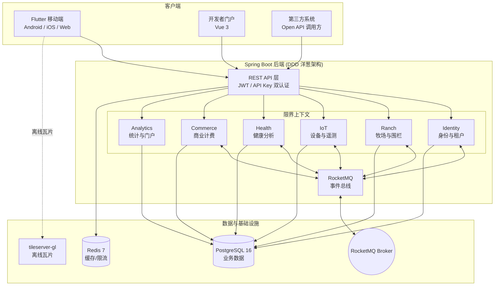

### 1.3 技术栈总览

| 端 | 技术栈 | 版本 | 说明 |
|----|--------|------|------|
| **后端** | Spring Boot | 3.3.0 | Java 17，Gradle 构建 |
| **持久层** | Spring Data JPA + Hibernate | — | `ddl-auto: none`，结构由 Flyway 管理 |
| **数据库** | PostgreSQL | 16 | 含时序分区表 |
| **缓存** | Spring Data Redis | 7 | 限流 + 缓存 |
| **消息队列** | RocketMQ | 5.1.0（`rocketmq-spring-boot-starter:2.3.0`） | 跨上下文事件分发 |
| **数据库迁移** | Flyway | — | 30 个版本脚本（V1–V30） |
| **认证** | JJWT | 0.12.5 | JWT 双 Token |
| **空间计算** | JTS Topology Suite | 1.19.0 | 围栏多边形/缓冲区计算 |
| **安全** | Spring Security + BCrypt | — | 无状态 Session |
| **移动端** | Flutter | SDK ≥3.3.0 | Riverpod + Go Router |
| **开发者门户** | Vue 3 + Vite | — | API Consumer 使用 |
| **PC 端** | Angular 19 | — | 归档，不随主流程迭代 |
| **离线地图** | tileserver-gl | latest | MBTiles 瓦片服务 |
| **部署** | Docker Compose | — | nginx :18080 → app :8080 |

### 1.4 架构设计原则

1. **领域驱动设计（DDD）**：按业务能力划分 7 个限界上下文，每个上下文采用洋葱（分层）架构。
2. **事件驱动解耦**：上下文之间通过 RocketMQ 发布/订阅领域事件，避免直接代码级耦合。
3. **防腐层（ACL）隔离**：跨上下文查询通过 Port/Adapter 端口适配器，不直接引用对方领域模型。
4. **多租户隔离**：基于 JWT 解析的 `tenantId`，通过 `ThreadLocal` 在请求生命周期内传递。
5. **优雅降级**：RocketMQ 不可用时事件发布静默跳过，保证应用可启动与测试可执行。
6. **配置外置**：数据库、Redis、JWT、模拟器等均通过环境变量注入，提供合理默认值。

---

## 2. 业务架构

### 2.1 业务领域与核心价值

```
智慧畜牧平台
├── 牲畜数字孪生      一畜一档，实时位置 + 健康画像
├── 围栏守护          电子围栏 + 缓冲区预警，越界即时告警
├── 健康监测          体温/蠕动/发情/活动多维分析，提前发现异常
├── 设备全生命周期    注册→激活→安装→退役，License 管理
└── 商业化运营        多级订阅、功能门控、分润对账、API 开放
```

### 2.2 利益相关者与角色体系

系统内置 **5 种角色**，角色决定前端 Shell 形态与可访问功能：

| 角色 | 定位 | 权限范围 | 移动端 Shell |
|------|------|---------|-------------|
| `PLATFORM_ADMIN` | 平台管理员 | 租户/用户/合同/分润/订阅服务/API Key 全量管理 | 纯 Scaffold |
| `B2B_ADMIN` | B 端经销商 | 概览 + 牧场管理 + 合同 + 对账 + 牧工管理 | NavigationRail |
| `OWNER` | 牧场主 | 全部业务页面 + 后台 + 牧工 + 订阅管理 | 底部导航栏 |
| `WORKER` | 牧工 | 看板/地图/告警/我的/围栏，仅确认告警 | 底部导航栏 |
| `API_CONSUMER` | 开发者 | 通过 API Key 访问 Open API | — |

租户（Tenant）分为两个演进阶段与四种业务类型：

- **阶段**：`SAMPLE`（试点）→ `BATCH`（批量）
- **类型**：`rancher`（牧场主）、`reseller`（经销商）、`enterprise`（企业）、`developer`（开发者）

### 2.3 核心业务流程

#### 流程一：实时定位与围栏守护

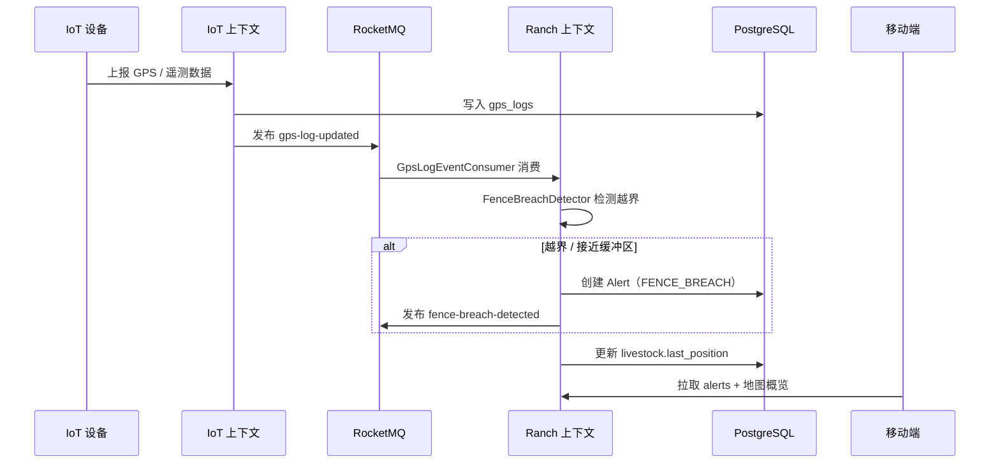

**围栏检测算法**（`FenceBreachDetector`）：
- **Safe**：点在围栏内且在缓冲区外
- **Approaching**：点在缓冲区环带内（接近边界预警）
- **Breach**：点在围栏外（越界告警）

缓冲区通过 `buffer_distance`（默认 50m）+ `buffer_polygon`（预计算）实现。

#### 流程二：健康监测与预警

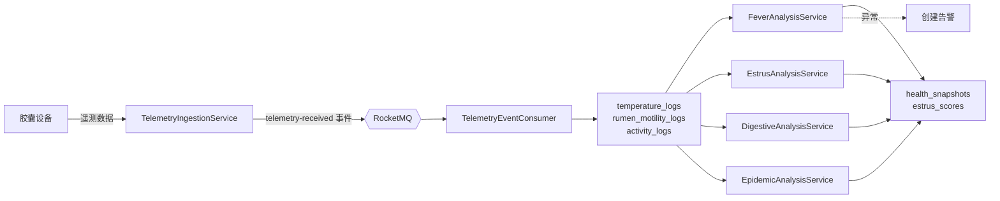

**发热检测规则**（`FeverAnalysisService`，基于实际代码阈值）：

| 条件 | 判定状态 |
|------|---------|
| `delta < 1.0°C` | NORMAL |
| `1.0 ≤ delta < 1.5°C`（持续 < 2h） | ELEVATED |
| `delta ≥ 1.5°C` 或持续 > 2h | FEVER |
| `delta ≥ 2.0°C` 或 `temp ≥ 41.0°C` | CRITICAL |

> `delta` 为生成列（`temperature - baseline_temp`），基线体温默认 38.50°C。

#### 流程三：商业化运营（订阅 → 配额 → 功能门控）

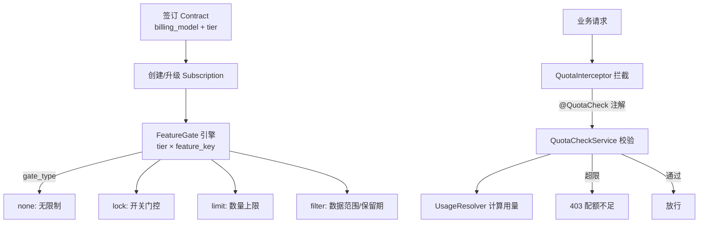

### 2.4 商业模型

**4 种计费模式**（`billing_model`）：

| 模式 | 说明 |
|------|------|
| `direct` | 直营直接计费 |
| `revenue_share` | 分润模式（经销商），按 `revenue_share_ratio` 分配 |
| `licensed` | 买断授权 |
| `api_usage` | 按 API 用量计费 |

**4 级套餐**（`tier`）与功能门控矩阵（来自 `feature_gates` 种子数据，7 个 feature key）：

| Feature Key | basic | standard | premium | enterprise |
|-------------|:-----:|:--------:|:-------:|:----------:|
| livestock_management | limit(50) | limit(200) | limit(1000) | 无限 |
| fence_management | limit(5) | limit(20) | limit(100) | 无限 |
| alert_management | ❌ lock | ✅ | ✅ | ✅ |
| advanced_analytics | ❌ lock | filter(30天) | ✅ | ✅ |
| api_access | ❌ lock | ❌ lock | ✅ | ✅ |
| worker_management | limit(3) | limit(10) | limit(50) | 无限 |
| health_monitoring | ❌ lock | ✅ | ✅ | ✅ |

> 门控类型：`none`（无限制）、`lock`（布尔开关）、`limit`（数量上限）、`filter`（数据范围/保留天数）。

**分润对账**：`revenue_periods` 按 `合同 × 周期` 记录流水，状态流转：`pending → platform_confirmed → partner_confirmed → settled`。

---

## 3. 功能架构

### 3.1 限界上下文全景

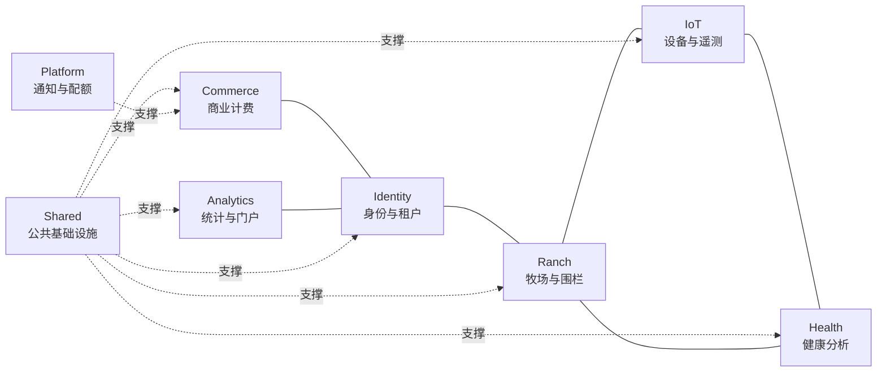

### 3.2 各上下文功能职责

| 上下文 | 职责 | Controller 数 | 核心能力 |
|--------|------|:---:|---------|
| **Identity** | 多租户隔离、用户、角色权限、认证授权、牧场归属、审计日志 | 9 | 登录/Token 刷新、租户管理、用户管理、API Key、审计日志 |
| **Ranch** | 牲畜、围栏、告警、仪表盘、地图、离线瓦片 | 8 | 牲畜 CRUD、围栏管理（含缓冲区）、告警处理流、瓦片下载 |
| **IoT** | 设备全生命周期、License、安装、GPS/遥测数据接入 | 7 | 设备注册/激活/退役、License 管理、GPS 日志、遥测接入、Open API |
| **Health** | 体温/蠕动/发情/疫病/活动多维分析 | 5 | 发热检测、消化分析、发情评分、疫病分析、健康概览 |
| **Commerce** | 订阅、合同、分润、Tier 配额、功能门控 | 7 | 订阅结算、合同签约、分润对账、配额校验、服务心跳 |
| **Analytics** | API 用量统计、调用日志、开发者门户 | 4 | 用量概览/趋势、调用日志查询、门户 API |
| **Shared** | 认证、安全、多租户、限流、缓存、异常处理、事件发布 | 1 | JWT/API Key 认证、CORS、Rate Limit、统一响应包络 |
| **Platform** | 通知中心、配额拦截 | — | 通知服务、设备激活监听、配额拦截器 |

### 3.3 前后端功能矩阵

> 详细端点级对接状态见 [`system-feature-document.md`](./system-feature-document.md)。下表为模块级概览。

| 上下文 | 后端状态 | 移动端对接 | 备注 |
|--------|:---:|:---:|------|
| Identity（登录/用户/租户/API Key） | ✅ | ✅ | Token 自动刷新前端未实现 |
| Ranch（牲畜/围栏/告警/仪表盘/地图） | ✅ | ✅ | 围栏 force 更新、瓦片 Admin 前端缺失 |
| IoT（设备/安装/GPS） | ✅ | ✅ | License 创建/撤销、安装操作前端未对接 |
| Health（体温/发情/消化/疫病） | ✅ | ✅ | 全面对接 |
| Commerce（订阅/合同/分润） | ✅ | ✅ | B2B 管理 + 订阅管理已对接 |
| Analytics（用量/门户） | ✅ | 部分 | 分析事件上报前端未调用 |

### 3.4 移动端功能模块

移动端采用 **Feature-First** 组织，`lib/features/` 下约 **40 个功能模块**：

```
lib/
├── app/                      # 路由、Session、Shell（角色化导航）
│   ├── app_route.dart        # AppRoute 枚举 — 36 路由单一来源
│   ├── app_router.dart       # GoRouter + 认证重定向守卫
│   └── session/              # AppSession + SessionController
├── core/                     # 跨功能基础设施
│   ├── api/                  # ApiClient 单例（JWT + farm-scoped CRUD）
│   ├── models/               # 共享数据模型 + ViewState
│   ├── map/                  # flutter_map 封装
│   ├── database/             # 本地离线缓存
│   └── l10n/                 # 国际化
├── features/                 # 按业务划分
│   ├── auth, ranch, fence, livestock, alerts
│   ├── dashboard, mine, stats, devices
│   ├── fever_warning, estrus, digestive, epidemic
│   ├── subscription, contract_management, revenue
│   ├── b2b_admin, admin, worker_management, tenant
│   ├── farm_creation, farm_switcher
│   ├── offline_tiles, offline_fences, offline_livestock
│   └── api_authorization, twin_overview, highfi, ...
└── widgets/                  # 通用组件
```

**Feature 内部分层**（渐进式）：
- `data/` — API Repository 实现，调用 `ApiClient`
- `domain/` — 领域模型（部分模块采用）
- `presentation/` — Riverpod Controller + Widget

**状态管理**：`flutter_riverpod` 独占，`Provider`（只读依赖）+ `NotifierProvider`（可变状态），无 `setState`/`ChangeNotifier`。

---

## 4. 数据架构

### 4.1 存储技术选型

| 数据类型 | 存储 | 说明 |
|---------|------|------|
| 业务实体（租户/牧场/牲畜/设备/订阅…） | PostgreSQL 16 | 关系型，强一致性 |
| 时序遥测数据（体温/蠕动/活动/GPS） | PostgreSQL **分区表** | 按月 RANGE 分区，见 4.3 |
| 空间围栏数据 | PostgreSQL JSONB + JTS | 顶点存 JSONB，计算用 JTS |
| 配额/限流计数 | Redis 7 | Lua 脚本滑动窗口 |
| 通知/消息 | PostgreSQL + RocketMQ | 持久化通知 + 事件分发 |
| 离线瓦片 | MBTiles 文件 | tileserver-gl 提供 |

### 4.2 核心数据模型

#### Identity 上下文

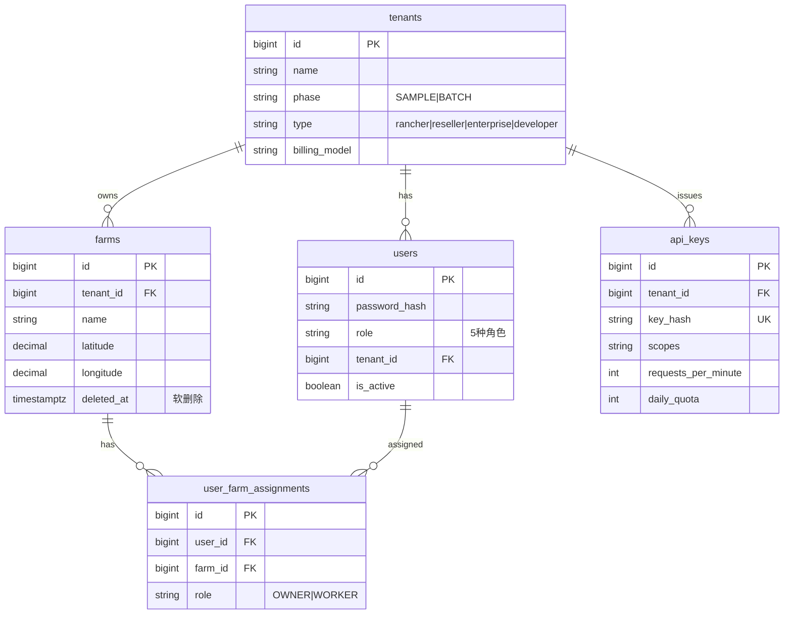

#### Ranch 上下文

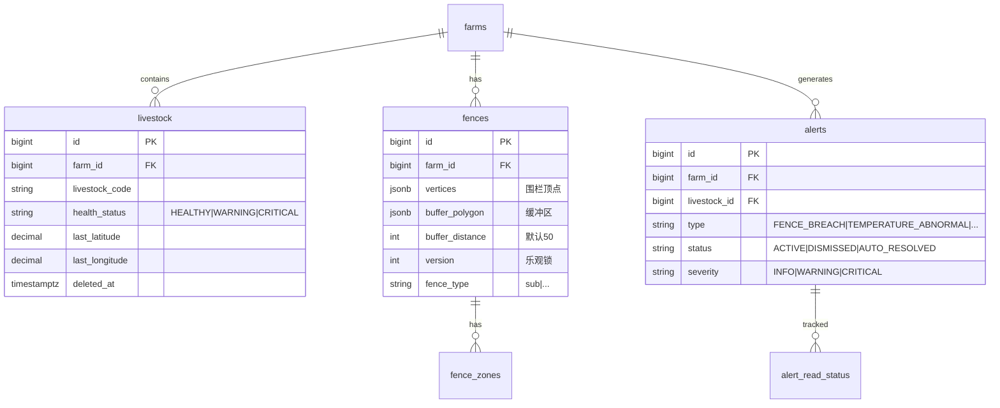

#### IoT 上下文（跨上下文引用）

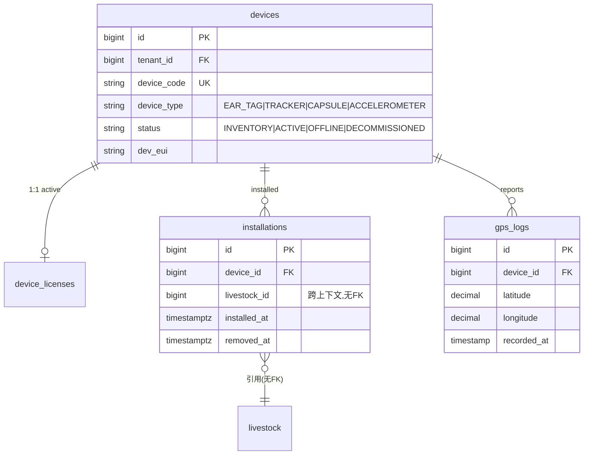

#### Health 上下文（时序分区）

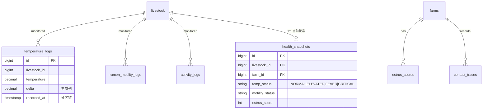

#### Commerce 上下文

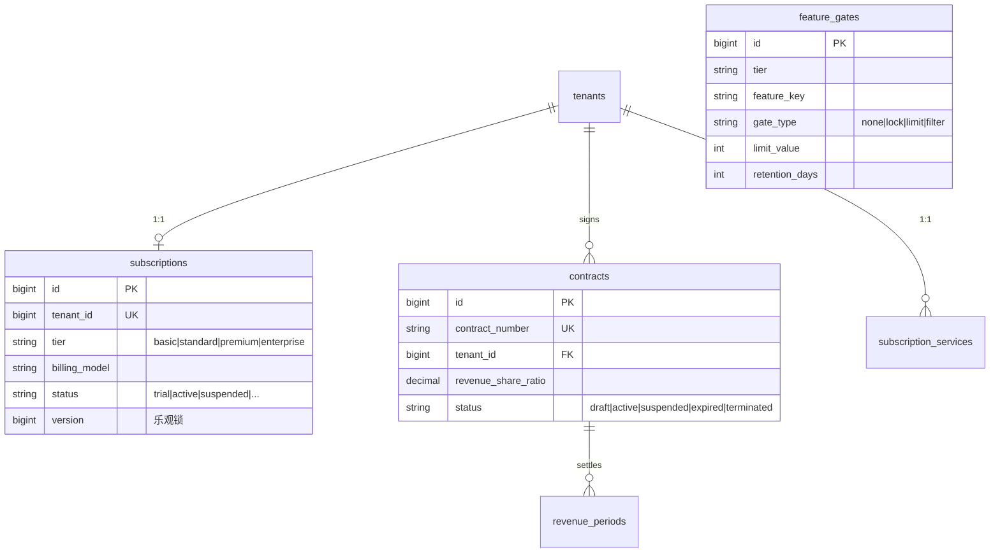

### 4.3 时序数据分区策略

三张核心时序表采用 PostgreSQL **声明式 RANGE 分区**（按月）：

| 表 | 分区键 | 采样间隔 | 数据源设备 | 索引策略 |
|----|--------|---------|-----------|---------|
| `temperature_logs` | `recorded_at` | ~30min | CAPSULE | `(livestock_id, recorded_at DESC)` + 部分索引 `WHERE delta > 1.0` |
| `rumen_motility_logs` | `recorded_at` | ~30min | CAPSULE | `(livestock_id, recorded_at DESC)` |
| `activity_logs` | `recorded_at` | ~1h | TRACKER + ACCELEROMETER | `(livestock_id, recorded_at DESC)` |

分区设计要点：
- 每张表预建 `2026_03` ~ `2026_08` 月度分区 + `default` 兜底分区
- 主键包含分区键：`PRIMARY KEY (id, recorded_at)`
- `temperature_logs.delta` 为 `GENERATED ALWAYS AS (temperature - baseline_temp) STORED` 生成列，免维护

### 4.4 跨上下文数据一致性

**关键设计：跨限界上下文的引用不使用外键约束，由应用层保证一致性。**

典型场景 — `installations.livestock_id`：
```sql
-- V3 注释原文：
-- NOTE: livestock_id is a cross-context reference (Ranch Context) with NO FK constraint.
-- Data consistency is enforced at the application layer only.
```

GPS 位置到牲畜的 JOIN 路径：
```
gps_logs → devices → installations (WHERE removed_at IS NULL) → livestock
```

一致性保障机制：
1. **应用层校验**：写操作时通过 ACL Port 查询关联实体是否存在
2. **唯一性约束**：`installations` 上 `CREATE UNIQUE INDEX ... WHERE removed_at IS NULL`（一台设备仅一个活跃安装）
3. **事件驱动同步**：上下文状态变更通过 RocketMQ 事件广播

### 4.5 数据治理

| 机制 | 实现 | 示例 |
|------|------|------|
| **软删除** | `deleted_at TIMESTAMPTZ` + 部分唯一索引 | `farms`, `livestock`, `devices` |
| **乐观锁** | `version BIGINT` 列 | `subscriptions`, `contracts`, `revenue_periods` |
| **审计日志** | `audit_logs` 表（V18） | 全操作可追溯 |
| **API 调用日志** | `api_call_logs`（逐请求）+ `api_usage_daily`（日聚合） | V22 |
| **告警已读追踪** | `alert_read_status`（用户×告警） | V26 |
| **枚举约束** | `CHECK` 约束 | 所有状态/类型字段 |
| **部分索引** | 条件索引优化查询 | `WHERE deleted_at IS NULL`、`WHERE score >= 70` |

### 4.6 数据库表清单

| 迁移版本 | 上下文 | 表 |
|---------|--------|-----|
| V1 | Identity | tenants, farms, users, user_farm_assignments, api_keys |
| V2 | Ranch | livestock, fences, alerts |
| V3 | IoT | devices, device_licenses, installations, gps_logs |
| V6 | Commerce | subscriptions, contracts, revenue_periods, subscription_services, feature_gates, notifications |
| V13 | Ranch | tile_regions, tile_generation_tasks, farm_tile_tasks, tile_download_logs（+ fences 扩展 version/fence_type） |
| V18 | Shared | audit_logs |
| V20 | Health | temperature_logs, rumen_motility_logs, activity_logs, estrus_scores, health_snapshots, contact_traces |
| V22 | Analytics | api_call_logs, api_usage_daily（+ api_keys 扩展 scopes/quota） |
| V26 | Ranch | alert_read_status, fence_zones（+ fences 扩展 buffer, alerts 状态迁移） |

> V4–V12、V15–V17、V19、V21、V23–V25、V27–V30 为种子数据与修复脚本。

---

## 5. 集成架构

### 5.1 事件驱动总线

系统通过 **RocketMQ** 实现限界上下文之间的异步解耦，事件中心注册在 `Topics.java`。

#### 事件 Topic 生态

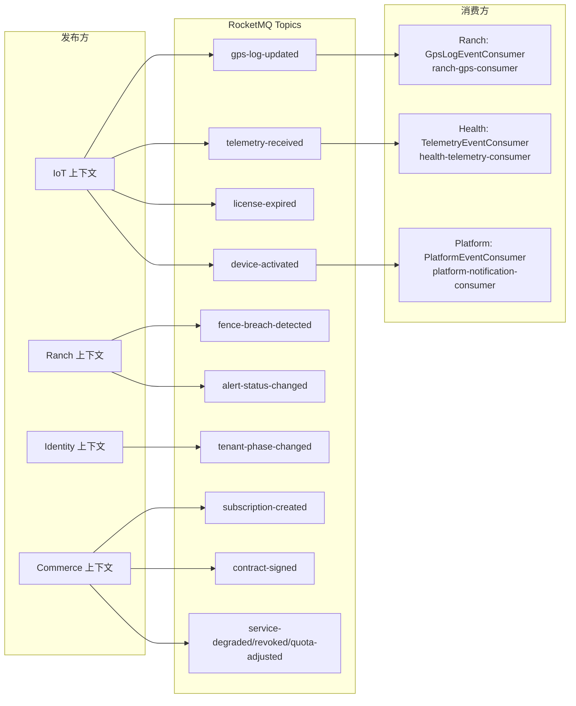

| Topic | 发布方 | 消费方 | 业务作用 |
|-------|--------|--------|---------|
| `gps-log-updated` | IoT | Ranch | 触发围栏越界检测 + 更新牲畜位置 |
| `telemetry-received` | IoT | Health | 触发体温/蠕动/活动分析 |
| `device-activated` | IoT | Platform | 发送设备激活通知 |
| `fence-breach-detected` | Ranch | —（预留） | 围栏越界事件 |
| `alert-status-changed` | Ranch | —（预留） | 告警状态流转 |
| `subscription-created/...` | Commerce | —（预留） | 订阅生命周期事件 |

**事件基础设施**：
- 所有领域事件继承 `DomainEvent`（含 `eventId` UUID + `occurredAt`）
- `RocketMQEventPublisher` 统一发布，**优雅降级**：RocketMQ 不可用时静默跳过，不阻断主流程
- 消费者使用 `@RocketMQMessageListener` 注解，独立 `consumerGroup` 隔离

### 5.2 ACL 防腐层（端口/适配器）

限界上下文之间**禁止直接引用对方领域模型**，一律通过 Port（接口）+ Adapter（实现）隔离。

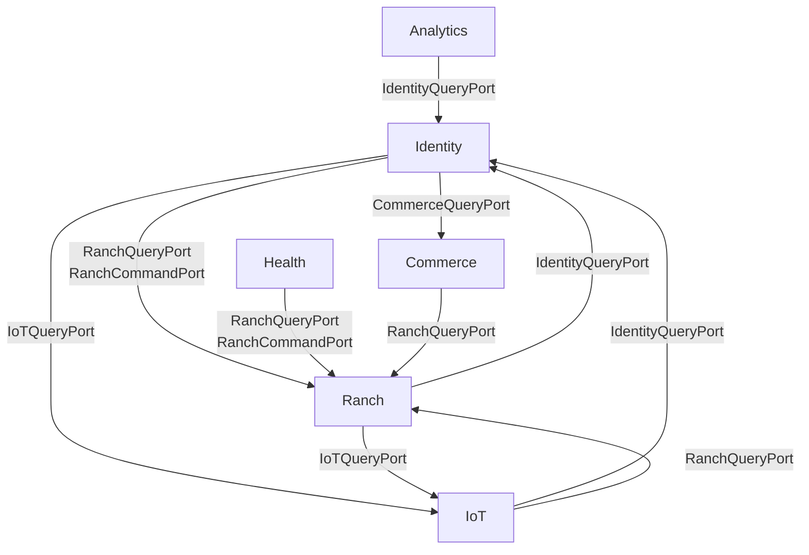

ACL 实现清单（`infrastructure/acl/` 下）：

| 消费方上下文 | 提供方上下文 | Port | 用途 |
|------------|------------|------|------|
| Identity | Commerce | CommerceQueryPort | B2B 查询订阅/合同信息 |
| Identity | IoT | IoTQueryPort | 查询设备/安装信息 |
| Identity | Ranch | RanchQueryPort / RanchCommandPort | 牧场归属、牲畜引用 |
| Ranch | Identity | IdentityQueryPort | 用户/租户信息 |
| Ranch | IoT | IoTQueryPort | GPS 数据、设备状态 |
| Health | Ranch | RanchQueryPort / RanchCommandPort | 牲畜信息、回写健康状态 |
| Commerce | Ranch | RanchQueryPort | 计算用量（牲畜/围栏数） |
| Analytics | Identity | IdentityQueryPort | 用量统计关联租户 |
| IoT | Identity | IdentityQueryPort | 租户归属 |
| IoT | Ranch | RanchQueryPort | 牲畜/牧场关联 |

### 5.3 外部系统与第三方集成

| 外部系统 | 集成方式 | 用途 |
|---------|---------|------|
| **tileserver-gl** | HTTP（挂载 MBTiles 卷） | 离线地图瓦片服务，移动端按需下载 |
| **开发者门户（Vue 3）** | REST API（API Key 认证） | API Consumer 查看用量、管理 Key |
| **第三方业务系统** | Open API（`/api/v1/open/**`，API Key 认证） | 设备注册、GPS 查询、牲畜/围栏只读访问 |
| **IoT 设备（真实）** | 遥测上报（TelemetryController） | GPS、体温、蠕动、活动数据接入 |
| **IoT 设备（模拟）** | 内置 Simulator（可配置开关） | `GpsSimulator` + `TelemetrySimulator`，开发/演示用 |

**Open API 能力**（API Key 认证，独立于 JWT）：
- 设备列表 / 设备注册（`OpenDeviceController`、`OpenDeviceRegisterController`）
- GPS 查询（`OpenGpsController`）
- 牲畜 / 围栏 / 告警只读（`OpenLivestockController`、`OpenFenceController`、`OpenAlertController`）

### 5.4 客户端集成

**移动端 ↔ 后端**：
- 协议：REST + JSON，统一响应包络 `{ code, message, requestId, data }`
- 认证：JWT Bearer Token（Access + Refresh 双 Token）
- 作用域：`ApiClient.setActiveFarmId()` 自动注入 `/farms/{farmId}` 前缀
- 容错：401 自动触发 Token 刷新 + 重试（`_withRefreshRetry`）
- 离线：本地 SQLite 缓存牲畜位置、围栏数据，支持离线查看

---

## 6. 技术架构

### 6.1 后端分层架构（DDD 洋葱）

每个限界上下文遵循**洋葱架构**四层分层：

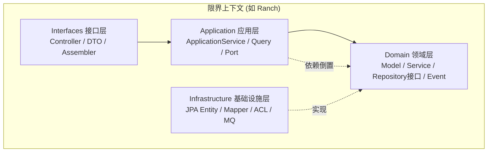

| 层 | 职责 | 代码位置示例（Ranch） |
|----|------|---------------------|
| **Interfaces** | REST Controller、请求/响应 DTO、组装器 | `ranch/interfaces/`（LivestockController、FenceController…） |
| **Application** | 用例编排、事务边界、查询服务、Port 定义 | `ranch/application/`（FenceApplicationService、LivestockApplicationService） |
| **Domain** | 领域模型、领域服务、仓储接口、领域事件 | `ranch/domain/`（Fence、FenceBreachDetector、FenceRepository） |
| **Infrastructure** | JPA 持久化、Mapper、ACL 适配器、MQ 消费者 | `ranch/infrastructure/`（FenceJpaEntity、JpaFenceRepositoryImpl、GpsLogEventConsumer） |

**分层约束**：
- 依赖方向：Interfaces → Application → Domain ← Infrastructure（依赖倒置）
- Domain 层不依赖任何外部框架（纯 Java）
- 跨上下文交互仅通过 Application 层定义的 Port 接口

### 6.2 安全架构

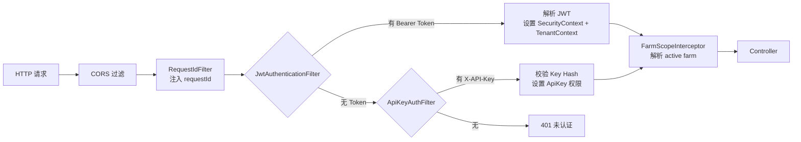

**双轨认证**：

| 认证方式 | 适用场景 | 实现 |
|---------|---------|------|
| **JWT** | 移动端、门户（用户态） | `JwtAuthenticationFilter` + `JwtTokenProvider`（JJWT 0.12.5） |
| **API Key** | Open API、第三方系统 | `ApiKeyAuthFilter` + `ApiKeyAuthService`（SHA-256 hash 校验） |

**安全配置要点**（`SecurityConfig`）：
- 无状态 Session（`STATELESS`）
- CSRF 关闭（纯 API 服务）
- BCrypt 密码加密
- CORS 白名单：`localhost:*`、`127.0.0.1:*`、`172.22.1.123:*`
- 开放端点：`/auth/login`、`/auth/refresh`、`/auth/logout`、`/health`
- 方法级权限：`@EnableMethodSecurity`

### 6.3 多租户与数据隔离

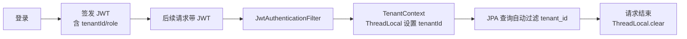

**作用域解析**（`FarmScopeResolver`）：
- **写操作**（`WRITE`）：必须通过 path `/farms/{farmId}/...` 指定，禁止 header 冲突
- **读操作**（`READ`）：path 或 header `x-active-farm` 二选一，禁止同时提供
- **无作用域**（`NONE`）：租户级操作

### 6.4 限流、配额与缓存

#### 限流（Redis 滑动窗口）

`RateLimitService` 使用 **Redis Lua 脚本**实现原子滑动窗口：
- 数据结构：Sorted Set（ZSET）
- 原子操作：`ZREMRANGEBYSCORE`（清除过期）→ `ZADD`（记录）→ `ZCARD`（计数）
- 应用：API Key 按分钟限流（`requests_per_minute`，默认 60）

#### 配额拦截（Tier 门控）

`QuotaInterceptor` 通过 `@QuotaCheck` 注解声明式拦截：
1. 请求到达 Controller 方法前拦截
2. 读取注解声明的 `featureKey`
3. `UsageResolver`（按 featureKey 分发）计算当前用量
4. `QuotaCheckService` 比对 `feature_gates.limit_value`
5. 超限返回 `403`，否则放行

**已实现的 UsageResolver**：
- `FarmLivestockUsageResolver`（livestock_management）
- `FarmFenceUsageResolver`（fence_management）

#### 缓存（Redis）

`RedisCacheService` 提供通用缓存能力，`CacheKeys` 统一管理 key 命名空间。

### 6.5 部署架构

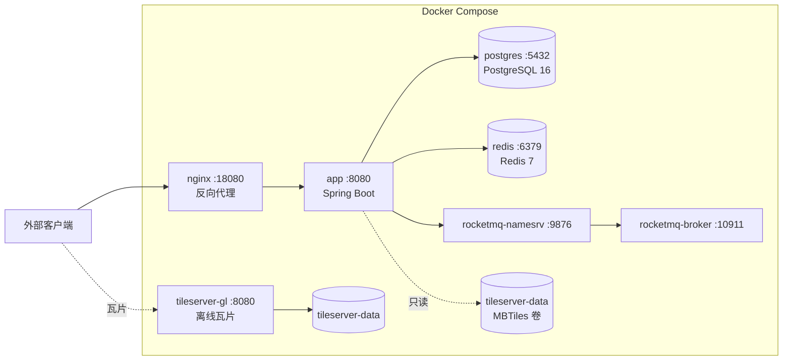

**Docker Compose 服务清单**：

| 服务 | 镜像 | 端口映射 | 依赖 |
|------|------|---------|------|
| `app` | 自构建（Spring Boot） | 18081:8080 | postgres、redis、rocketmq-broker |
| `postgres` | 自构建（含自定义 pg_hba.conf） | 15432:5432 | — |
| `redis` | redis:7-alpine | 26379:6379 | — |
| `rocketmq-namesrv` | apache/rocketmq:5.1.0 | 19876:9876 | — |
| `rocketmq-broker` | apache/rocketmq:5.1.0 | 10911:10911 | rocketmq-namesrv |
| `tileserver` | maptiler/tileserver-gl | 8081:8080 | — |

**生产部署**：`172.22.1.123:18080`（nginx 反代到 app :8080）。

**配置外置**（`application.yml` + 环境变量）：

| 配置项 | 环境变量 | 默认值 |
|--------|---------|--------|
| 数据库 | `DB_HOST/PORT/NAME/USER/PASSWORD` | localhost:5432/smart_livestock |
| Redis | `REDIS_HOST/PORT/PASSWORD` | localhost:6379 |
| RocketMQ | `ROCKETMQ_NAME_SERVER` | localhost:9876 |
| JWT 密钥 | `JWT_SECRET` | default-secret-change-in-production |
| Access Token 有效期 | `JWT_ACCESS_EXPIRATION` | 3600000（1h） |
| Refresh Token 有效期 | `JWT_REFRESH_EXPIRATION` | 604800000（7d） |
| GPS 模拟器 | `GPS_SIMULATOR_ENABLED/INTERVAL_MS` | false / 30000 |
| 遥测模拟器 | `TELEMETRY_SIMULATOR_ENABLED/INTERVAL_MS` | true / 30000 |

### 6.6 前端架构（Flutter）

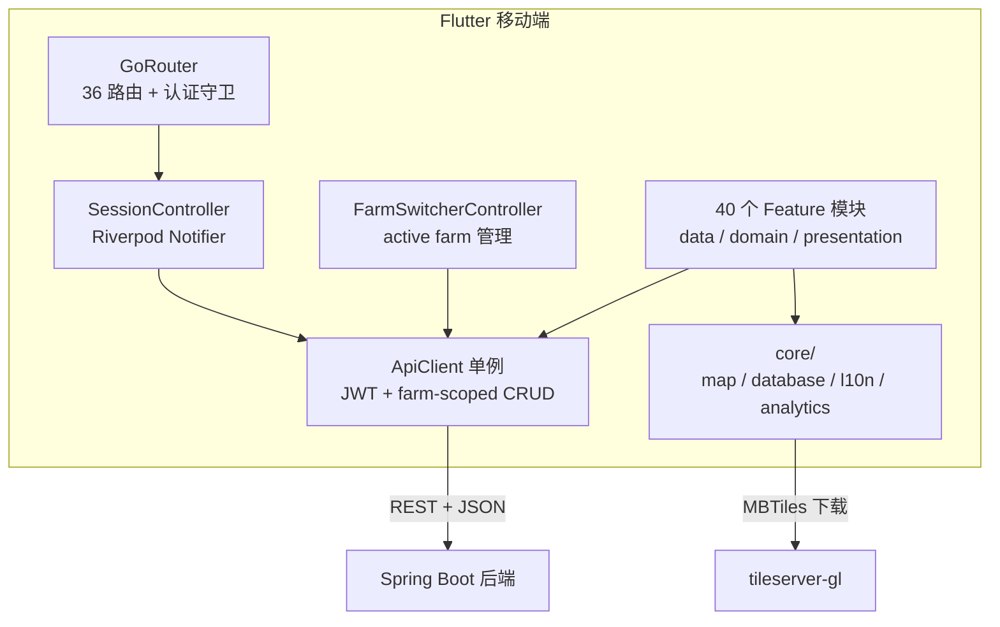

**关键设计**：
- **路由单一来源**：`AppRoute` 枚举定义全部 36 路由，`GoRouter` 配置认证重定向
- **角色化 Shell**：根据用户角色渲染不同导航（底部导航 / NavigationRail / Scaffold）
- **ApiClient 单例**：管理 baseUrl、JWT、activeFarmId，提供 `farmGet/farmPost/farmPut/farmDelete` 农场作用域方法
- **自动刷新**：401 时自动调用 `/auth/refresh`，单飞防并发（`_refreshInProgress` + `_refreshFuture`）
- **离线能力**：`offline_tiles`（瓦片）、`offline_fences`（围栏）、`offline_livestock`（牲畜缓存）
- **国际化**：`app_en.arb` + `app_zh.arb`，支持中英双语

---

## 7. 附录

### 7.1 关键文件索引

| 领域 | 文件 |
|------|------|
| 安全配置 | `shared/config/SecurityConfig.java`（注：部分版本在 `shared/security/`） |
| 多租户上下文 | `shared/tenant/TenantContext.java` |
| 牧场作用域 | `shared/scope/FarmScopeResolver.java` |
| 事件 Topic 注册 | `shared/messaging/Topics.java` |
| 事件发布器 | `shared/messaging/RocketMQEventPublisher.java` |
| 限流服务 | `shared/ratelimit/RateLimitService.java` |
| 配额拦截器 | `platform/web/QuotaInterceptor.java` |
| 发热分析算法 | `health/domain/service/FeverAnalysisService.java` |
| 围栏检测算法 | `ranch/domain/service/FenceBreachDetector.java` |
| 数据库迁移 | `src/main/resources/db/migration/V1–V30` |
| 应用配置 | `src/main/resources/application.yml` |
| 部署编排 | `smart-livestock-server/docker-compose.yml` |
| 构建配置 | `smart-livestock-server/build.gradle` |

### 7.2 相关文档

| 文档 | 说明 |
|------|------|
| [`system-feature-document.md`](./system-feature-document.md) | 端点级功能清单与前后端对接矩阵 |
| [`system-feature-list.md`](./system-feature-list.md) | 功能列表概览 |
| [`backend-feature-list.md`](./backend-feature-list.md) | 后端功能清单 |
| [`frontend-feature-list.md`](./frontend-feature-list.md) | 前端功能清单 |
| [`customer-journey.md`](./customer-journey.md) | 客户旅程 |
| [`seed-data-landscape.md`](./seed-data-landscape.md) | 种子数据全景 |
| [`subscription-guide.md`](./subscription-guide.md) | 订阅功能指南 |
| [`tileserver-deployment-guide.md`](./tileserver-deployment-guide.md) | 瓦片服务部署指南 |
| [`LoRaWAN 牛羊追踪器上行 Payload 解析协议定义.md`](./LoRaWAN%20牛羊追踪器上行%20Payload%20解析协议定义.md) | LoRaWAN 协议 |

### 7.3 术语表

| 术语 | 含义 |
|------|------|
| **限界上下文（Bounded Context）** | DDD 中特定业务领域的边界，本系统有 7 个 |
| **ACL（防腐层）** | Anti-Corruption Layer，隔离外部上下文的适配层 |
| **FeatureGate** | 功能门控，按 Tier 控制功能可用性与配额 |
| **缓冲区（Buffer Zone）** | 围栏边界的预警环带，默认 50m |
| **数字孪生** | 牲畜在系统中的数字化档案（一畜一档） |
| **Open API** | 面向第三方系统的 API Key 认证接口 |

---

*本文档基于 2026-06-15 代码状态生成，后续架构演进请同步更新。*
