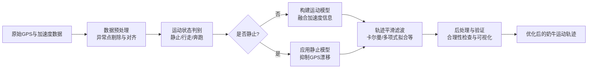

您遇到的GPS轨迹“抖动”和偏差问题，在动物追踪、车辆导航等领域非常普遍。核心原因是**GPS测量噪声**（设备误差、信号反射、卫星几何构形等）与**低采样频率**（每30分钟一次）叠加，使得直接连接坐标点无法还原真实运动轨迹。
好消息是，您拥有**加速度计数据**，这是改善轨迹的关键。通过数据融合与轨迹优化，可以显著提升轨迹的合理性和连续性。下面我将系统介绍解决方案，并提供一个可操作的技术路线。
---
### 🧠 先理解问题：GPS轨迹抖动的根源
您的项圈每30分钟上报一次GPS位置和加速度值，但GPS数据存在固有误差和“漂移”。当直接连接这些离散点时，误差会被放大，轨迹呈现锯齿状或跳跃，无法反映奶牛平滑、连续的运动路径。
**关键挑战**：
- **采样间隔长（30分钟）**：两次定位之间，奶牛可能已移动了较长距离，插值或直接连线都会偏离实际。
- **GPS测量噪声**：包括随机误差和系统误差（如多径效应），导致轨迹点抖动。
- **缺乏运动模型**：仅凭稀疏GPS点，难以判断奶牛在两点之间的运动路径（是直线、徘徊还是静止？）。
---
### 🧭 整体解决方案框架
以下流程图概括了从原始数据到优化轨迹的核心步骤：

---
### 🔧 详细技术方案
#### 1. 数据预处理：清洗与对齐
**目标**：剔除异常点，并将GPS（30分钟间隔）与加速度数据（通常更高频）在时间上对齐。
- **异常点剔除**：检查GPS点的速度是否合理（例如奶牛速度通常低于一定阈值）。如果两点间速度超过阈值，则可能为异常点，可剔除或标记。
- **时间对齐**：加速度计采样率通常更高，需要将其数据重采样或平均，与GPS时间戳对齐，以便后续融合。
#### 2. 运动状态判别：利用加速度计
**核心思路**：加速度计能反映奶牛的运动状态（静止、行走、奔跑），这对解释GPS点之间的运动至关重要。
- **静止检测**：如果在两个GPS点之间，加速度计读数几乎为零（或方差极小），则可认为奶牛静止。此时，GPS显示的位置漂移应为噪声，**位置应视为不变**。
- **活动强度分类**：根据加速度计的x、y、z值（或合成加速度），可以计算活动指数，将时间段划分为“高活动”、“低活动”、“静止”等。这有助于判断GPS点之间的运动模式。
> 💡 **小贴士**：加速度计数据本身也可能有漂移，但用于判断“动/静”状态已经非常可靠。
#### 3. 数据融合与轨迹平滑算法
这是解决轨迹偏差的核心。您有以下几种算法可选，复杂度递增：
##### **方案A：基于规则的初步平滑（简单快速）**
- **适用场景**：对精度要求不高，或作为后续算法的预处理。
- **方法**：
    1. **速度阈值过滤**：计算相邻GPS点的距离和时间，得到瞬时速度。如果速度超过奶牛的合理移动速度（如15 km/h），则认为该点异常，用前一个点或插值替代。
    2. **停留点识别**：如果奶牛在某位置附近停留（加速度计显示静止），则将该区域内的所有GPS点聚类，取中心点作为停留点，轨迹在停留点之间用直线连接。
##### **方案B：卡尔曼滤波（Kalman Filter）及扩展（推荐）**
- **原理**：卡尔曼滤波是一种最优估计算法，它结合**预测模型**（根据上一状态预测当前位置）和**观测模型**（GPS测量值），递归地估计系统状态（位置、速度等），从而平滑噪声。
- **在GPS轨迹平滑中的应用**：
    - **状态向量**：可设计为 `[经度, 纬度, 速度, 方向]` 或更复杂的形式。
    - **预测步骤**：假设奶牛匀速运动，预测下一个位置。
    - **更新步骤**：当新的GPS点到来时，用观测值修正预测值。
- **如何融入加速度数据？**
    - 加速度可以作为**控制输入**或**状态向量的一部分**。如果加速度计数据质量好，可以将其积分得到速度变化，从而更好地预测位置。
    - 更实用的方法是：**先用加速度判别运动状态，再调整过程噪声**。例如，当加速度计显示静止时，减小过程噪声，使滤波更信任GPS观测；当活动剧烈时，增大过程噪声，使轨迹更响应GPS变化。
<details>
<summary><strong>📖 卡尔曼滤波参数设置示意（概念性）</strong></summary>
卡尔曼滤波需要定义过程噪声协方差矩阵（Q）和测量噪声协方差矩阵（R）。对于GPS轨迹，可以这样理解：
- **测量噪声（R）**：来自GPS的误差。您可以从项圈在静止状态下收集的GPS数据中，计算经纬度的方差来估计。
- **过程噪声（Q）**：代表运动模型的不可预测性。如果奶牛运动规律（如放牧时缓慢移动），Q可设小；如果运动突变（如惊吓奔跑），Q需设大。
一个简化的状态转移模型（假设匀速）：
```
x_k = A * x_{k-1} + B * u_k + w_k
z_k = H * x_k + v_k
```
其中：
- `x_k` 是状态向量（如 `[经度, 纬度, v经度, v纬度]`），
- `A` 是状态转移矩阵（匀速模型），
- `u_k` 可选来自加速度的控制输入，
- `w_k` 是过程噪声，
- `z_k` 是GPS观测值，
- `v_k` 是测量噪声。
在您的场景中，**由于GPS更新频率极低（30分钟）**，卡尔曼滤波的预测步长时间很长，不确定性会显著增加。因此，**必须依赖加速度数据来约束预测**。
</details>
##### **方案C：扩展卡尔曼滤波（EKF）进行传感器融合**
- **适用场景**：当系统模型非线性时，需要使用EKF。对于GPS+加速度计的融合，EKF是更标准的方法。
- **方法**：将加速度计测量值（包括重力）作为输入，积分得到位置和速度，并与GPS测量融合。EKF可以同时估计位置、速度、加速度计偏差等状态。
- **挑战**：需要准确设置加速度计和GPS的噪声参数，以及初始状态和协方差。
##### **方案D：轨迹分段与多项式拟合**
- **思路**：根据加速度计判别的运动状态，将轨迹分成不同段落（如静止段、行走段、奔跑段）。对每一段，用多项式曲线（或样条曲线）拟合GPS点，使轨迹平滑。
- **优点**：直观，易于实现，尤其适合处理“停留点”和“徘徊轨迹”。
- **缺点**：缺乏物理运动模型的约束，可能产生不合理的运动（如奶牛“飞”起来）。
#### 4. 后处理与验证
- **轨迹合理性检查**：计算平滑后轨迹的速度、加速度，检查是否在奶牛生理极限内。
- **可视化对比**：将原始GPS轨迹与平滑后轨迹叠加在地图上，直观评估效果。
- **地面真值验证（可选）**：在短时间段内使用高频GPS（如1Hz）作为真值，对比不同算法的误差。
---
### 📊 算法选择与对比
| 方法                      | 优点                       | 缺点                          | 推荐度                     |
| ------------------------- | -------------------------- | ----------------------------- | -------------------------- |
| **速度阈值+停留点聚类**   | 实现简单，计算量小         | 无法处理复杂运动，精度有限    | ★★☆☆☆ 适合快速原型         |
| **卡尔曼滤波（KF）**      | 有理论支撑，能有效平滑噪声 | 需要调整参数，低频GPS下预测难 | ★★★☆☆ 需配合加速度状态判别 |
| **扩展卡尔曼滤波（EKF）** | 能融合多传感器，精度高     | 实现复杂，需深入理解          | ★★★★☆ 推荐，但开发成本高   |
| **分段多项式拟合**        | 直观，对停留点效果好       | 无物理约束，可能过平滑        | ★★★☆☆ 适合特定行为分析     |
---
### 🚀 推荐实施路线
鉴于您的数据频率较低（30分钟），建议采用 **“加速度状态判别 + 卡尔曼滤波”** 的组合方案：
1. **数据预处理**：清洗GPS异常点，将加速度数据重采样至GPS时间戳。
2. **运动状态识别**：使用加速度数据将每个时间间隔标记为“静止”、“低活动”、“高活动”。
3. **静止段处理**：对于静止段，**直接锁定位置**（取该段时间内GPS点的中心），不进行插值，有效抑制漂移。
4. **运动段平滑**：对于非静止段，实施卡尔曼滤波：
    - 状态向量：`[经度, 纬度]`（简单起见可忽略速度）。
    - 测量噪声：根据GPS设备精度设定。
    - 过程噪声：根据运动状态动态调整（静止时小，活动时大）。
5. **轨迹输出**：输出平滑后的轨迹点，并可进一步用样条曲线插值，使轨迹更平滑。
---
### 💻 简单代码示例（Python伪代码）
以下是一个非常简化的卡尔曼滤波平滑GPS轨迹的示例（未包含加速度融合，仅供思路参考）：
```python
import numpy as np
import matplotlib.pyplot as plt
# 假设我们有一系列GPS点：lon_list, lat_list, time_list
# 以及对应的加速度数据：acc_x_list, acc_y_list, acc_z_list (已对齐时间)
# 1. 简单的速度阈值过滤
def filter_by_speed(lon, lat, time, max_speed=15.0):
    # max_speed 单位：m/s
    filtered_lon, filtered_lat, filtered_time = [lon[0]], [lat[0]], [time[0]]
    for i in range(1, len(lon)):
        dt = (time[i] - time[i-1]).total_seconds()
        if dt == 0:
            continue
        # 计算两点间距离（简化的球面距离计算）
        dlon = np.radians(lon[i] - lon[i-1])
        dlat = np.radians(lat[i] - lat[i-1])
        a = np.sin(dlat/2)**2 + np.cos(np.radians(lat[i-1])) * np.cos(np.radians(lat[i])) * np.sin(dlon/2)**2
        c = 2 * np.arctan2(np.sqrt(a), np.sqrt(1-a))
        distance = 6371000 * c  # 地球平均半径，米
        speed = distance / dt
        if speed < max_speed:
            filtered_lon.append(lon[i])
            filtered_lat.append(lat[i])
            filtered_time.append(time[i])
    return filtered_lon, filtered_lat, filtered_time
# 2. 简化的卡尔曼滤波（假设匀速模型）
def kalman_smooth(lon, lat, process_noise=1e-5, measure_noise=10.0):
    n = len(lon)
    # 状态：[lon, lat, vlon, vlat]
    x = np.array([[lon[0]], [lat[0]], [0.0], [0.0]])  # 初始状态
    P = np.eye(4) * 1000.0  # 初始协方差，很大，表示不确定
    A = np.array([[1, 0, 1, 0],
                  [0, 1, 0, 1],
                  [0, 0, 1, 0],
                  [0, 0, 0, 1]])  # 状态转移矩阵，假设dt=1单位时间
    H = np.array([[1, 0, 0, 0],
                  [0, 1, 0, 0]])  # 观测矩阵，只观测位置
    Q = np.eye(4) * process_noise  # 过程噪声
    R = np.eye(2) * measure_noise    # 测量噪声
    smoothed_lon, smoothed_lat = [], []
    for i in range(n):
        # 预测
        x_pred = A @ x
        P_pred = A @ P @ A.T + Q
        # 更新
        if i < n:  # 有观测值
            z = np.array([[lon[i]], [lat[i]]])
            y = z - H @ x_pred
            S = H @ P_pred @ H.T + R
            K = P_pred @ H.T @ np.linalg.inv(S)
            x = x_pred + K @ y
            P = (np.eye(4) - K @ H) @ P_pred
        else:
            x = x_pred
            P = P_pred
        smoothed_lon.append(x[0, 0])
        smoothed_lat.append(x[1, 0])
    return smoothed_lon, smoothed_lat
# 使用流程
# lon, lat, time = load_data()
# lon_f, lat_f, time_f = filter_by_speed(lon, lat, time)
# lon_s, lat_s = kalman_smooth(lon_f, lat_f)
# plot_trajectory(lon, lat, lon_s, lat_s)
```
> ⚠️ **注意**：上述卡尔曼滤波代码高度简化，未考虑时间间隔、地球曲率、加速度融合等。实际实现需根据您的数据特性调整。
---
### 📈 预期效果与局限
- **预期效果**：
    - 轨迹锯齿状减少，更平滑、连续。
    - 静止段的GPS漂移被有效抑制。
    - 能够区分“移动”和“停留”，轨迹更合理。
- **局限性**：
    - **无法完全恢复两点之间的精确路径**：30分钟的间隔内，奶牛可能走了复杂路径，任何算法都无法100%还原，只能基于模型推断。
    - **依赖运动模型假设**：如果奶牛运动模式与假设不符（如突然急转弯），平滑后轨迹可能偏离实际。
    - **加速度积分误差**：若尝试将加速度积分用于位置预测，会累积误差，需谨慎使用。
---
### 🔬 高级选项与未来方向
如果需要更高精度，可以考虑：
1. **结合地图信息（地图匹配）**：如果牧场有道路或围栏，可将轨迹匹配到地图上，进一步纠正。
2. **使用更高频率的GPS（实验阶段）**：在短时间实验中，使用1Hz或更高频率的GPS采集数据，用于验证和优化算法。
3. **机器学习方法**：如果有大量标注数据，可以训练模型根据加速度和GPS历史预测更合理的轨迹。
---
### 总结
您的问题核心是**低频GPS测量噪声**导致的轨迹失真。解决方案是：
1. **利用加速度数据判别运动状态**，尤其是**静止检测**，以抑制漂移。
2. **采用卡尔曼滤波或其扩展形式**，融合GPS和加速度信息，进行轨迹平滑。
3. **根据应用场景选择合适复杂度的算法**，从简单的速度阈值到复杂的EKF。
推荐起步方案：**加速度状态判别 + 静止锁定 + 卡尔曼滤波**。这能在实现复杂度和效果间取得良好平衡。
希望以上方案对您有帮助！如果您能提供一小段示例数据，我可以帮助您设计更具体的算法流程。