# iOS App 用户旅程实测报告（模拟器）

> 日期：2026-09-15 凌晨 ｜ 测试人：Agent（idb UI 自动化驱动真实 App）
> 被测对象：`hkt-smartlivestock-0.3.2-b600.ipa` 同源码构建（含当日修复：告警卡 IntrinsicHeight、枚举码本地化 ×2）
> 环境：iPhone 17 Pro 模拟器（iOS 26.5，402×874pt）＋ test 后端 `https://ah.hkttech.cn`（58.20.27.224，公网直连无 VPN）
> 账号：13800138000（Rancher Zhang / OWNER，HKT Main Ranch + Pampas Steppe）
> 方式说明：真机 IPA 为 arm64 设备切片不能装模拟器，故以同源码同 `--dart-define` 的 debug 构建运行（本 Flutter 版本模拟器仅支持 debug）；每步操作均有落盘截图为证。
> 截图目录：`docs/testing/ios-journey-2026-09-15/`

## 一、结论

**17 条旅程全部可走通（15 PASS + 2 项带备注 PASS），主链路健康**。发现 3 个新缺陷（DEF-4/5/6）、确认 1 个遗留缺陷（DEF-3 循环依赖 transient 红屏，复现率约 1/2）；此前两处已修缺陷（告警卡崩溃、枚举码泄露）回归验证通过。

| 编号 | 旅程 | 结果 | 证据 |
|---|---|---|---|
| UJ-M01 | 冷启动＋会话恢复直进牧场 | ✅ PASS | UJ-M01_01 |
| UJ-M02 | 登出→确认→登录→订阅提醒→牧场 | ✅ PASS（附 transient 红屏观察→DEF-3） | UJ-M02_01~06 |
| UJ-M03 | 牧场概览（标题/切换器/4 统计卡/3 页签） | ✅ PASS | UJ-M03_01 |
| UJ-M04 | 地图瓦片源（时区启发→高德＋水印） | ✅ PASS | UJ-M01_01（右上"高德"水印） |
| UJ-M05 | 地图标记→快捷卡→牲畜详情（主数据/设备/曲线/位置） | ✅ PASS | UJ-M05_01~03 |
| UJ-M06 | 告警中心（统计/页签/筛选/已处理列表/详情时间线） | ✅ PASS（修复后卡片渲染正常） | UJ-M06_01~03 |
| UJ-M07 | 牧场页告警页签（空态） | ✅ PASS | UJ-M07_01 |
| UJ-M08 | 围栏页签（列表/编辑/删除/新增入口） | ✅ PASS（未实际提交增删） | UJ-M08_01 |
| UJ-M09 | 牲畜管理（列表 9 条/分页/搜索过滤） | ✅ PASS | UJ-M09_01~02 |
| UJ-M10 | 设备管理（概览 195/20/0、卡片、分页 10 页） | ✅ PASS（附 DEF-4） | UJ-M10_01~02 |
| UJ-M11 | 牧工管理（负责人卡/添加入口） | ✅ PASS | UJ-M11_01（同 M12_01 图） |
| UJ-M12 | API 授权管理 | ❌ FAIL（→ DEF-6） | UJ-M12_02 |
| UJ-M13 | 离线地图管理（可用区域/已下载空态） | ✅ PASS（返回缺失→DEF-5） | UJ-M13_01 |
| UJ-M14 | 帮助与支持 | ✅ PASS（功能未实现，有"开发中"提示） | UJ-M14_01 |
| UJ-M15 | 语言切换 中文↔English（实时生效） | ✅ PASS | UJ-M15_01~02 |
| UJ-M16 | 时区设置（跟随系统↔纽约，瓦片源联动） | ✅ PASS | UJ-M16_01~02 |
| UJ-M17 | 牧场切换 HKT↔Pampas（farm-scoped 数据联动） | ✅ PASS | UJ-M17_01~03 |

## 二、旅程明细（关键证据）

### UJ-M01/M03/M04 冷启动、概览与地图
冷启动后凭 Keychain 会话直进 HKT Main Ranch：高德瓦片＋右上"高德"水印（时区 UTC+8 启发→GCJ-02 源）、牲畜标记聚类（ST-8ab…/ST-11）、统计卡（围栏告警 0/健康告警 0/设备告警 0/牲畜总数 9）。
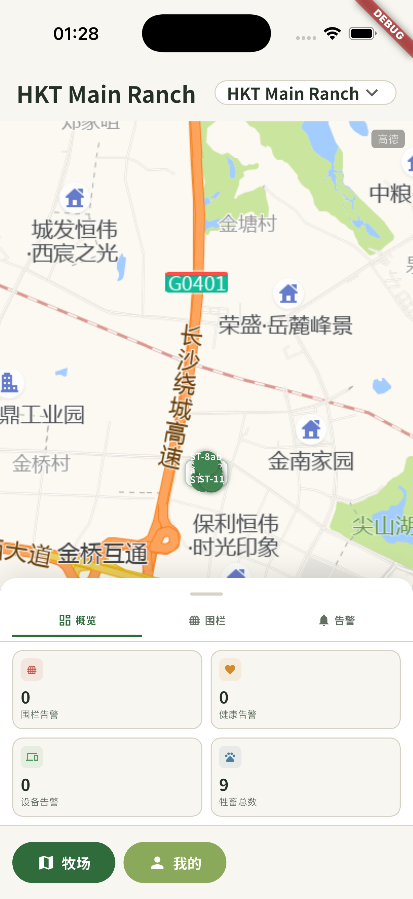

### UJ-M02 登出→登录闭环
退出需二次确认；登出回到登录页（"云端托管版"徽标 = deployment-info 链路正常）；凭据登录成功后落地牧场页，同时弹出「订阅即将到期 1 天」提醒（licensing 提醒链路工作正常，test 租户订阅数据即将到期，需运维续期或接受提醒）。
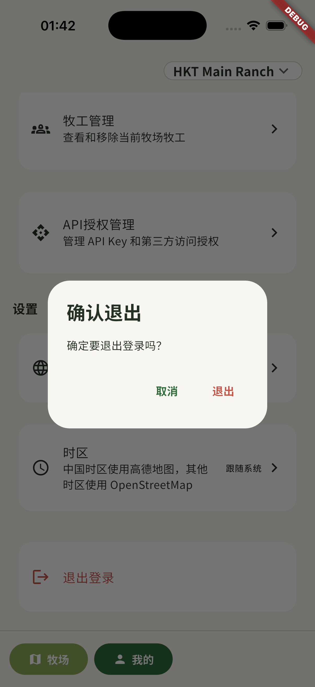
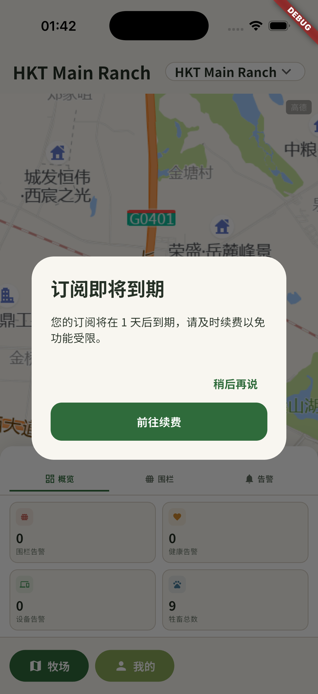
⚠️ DEF-3：登录后 bottom sheet 区域出现 transient 红屏（CircularDependencyError: FarmSwitcherController，本轮 2 次登录复现 1 次，关弹窗后自愈，见 UJ-M02_05 / UJ-M02_06）。

### UJ-M05 牲畜标记→详情
点击地图标记弹出快捷卡（编号/实时定位/健康状态/查看轨迹/地图定位/详情入口）；详情页含主数据（利木赞/24 月龄/200kg/雄/2024-01-01）、绑定设备（GPS＋瘤胃胶囊，解绑/绑定按钮）、健康数据（蠕动曲线实测 vs 基线、7 天发情评分 vs 配种阈值、位置信息＋完整轨迹入口，数据更新至 9/15 01:26）。
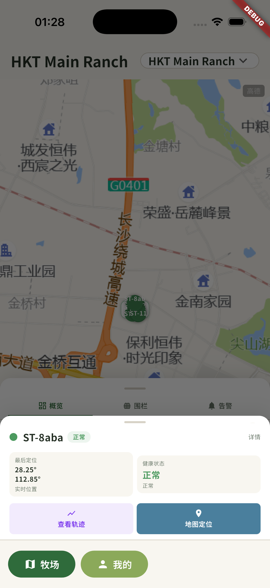
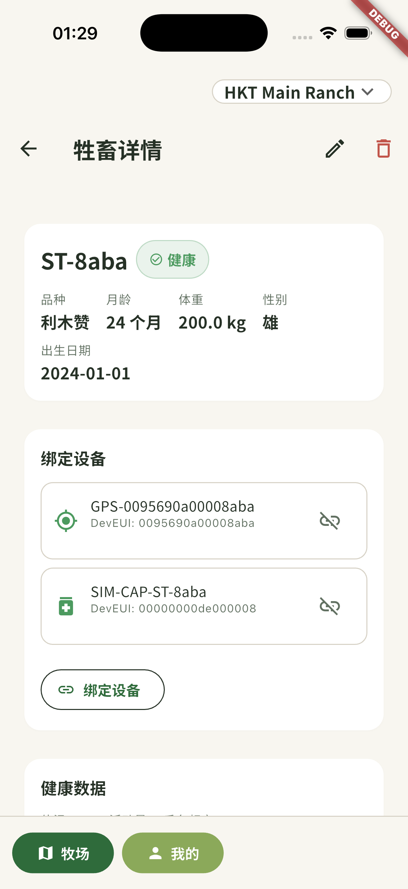
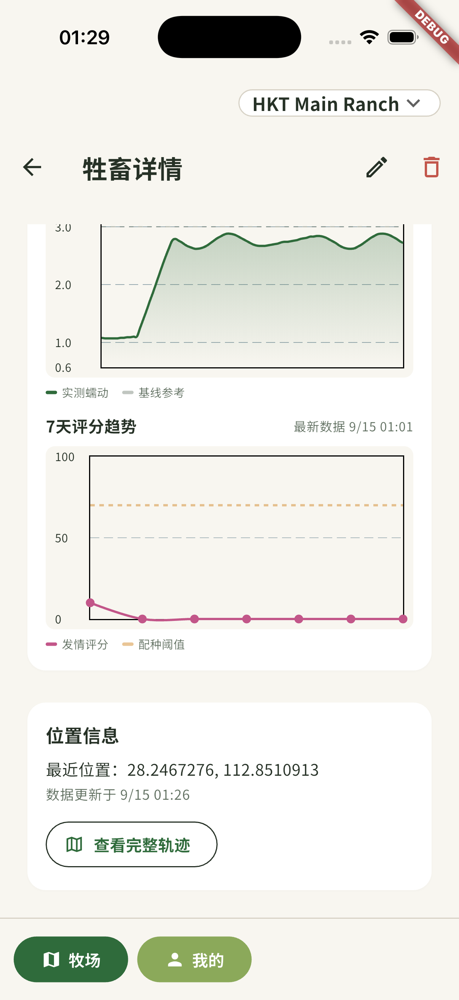

### UJ-M06 告警中心（修复后回归）
统计行（0 严重/0 警告/0 待处理）、全部/活跃/已处理三页签、类型筛选 chips；"已处理"列表按日期分组（今天 2 条/昨天 28 条），告警卡片完整渲染（severity 通高色条/图标/标题/元信息/接近围栏+自动恢复+AI检测徽章）——**此前该列表因布局崩溃全空白，本轮确认修复生效**。卡片详情含本地化标签（接近围栏/警告/自动恢复/规则触发）、处置时间线（规则引擎触发→自动恢复）、地图定位/查看轨迹。
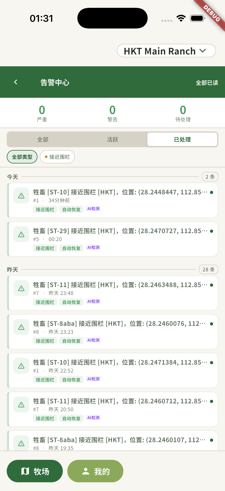
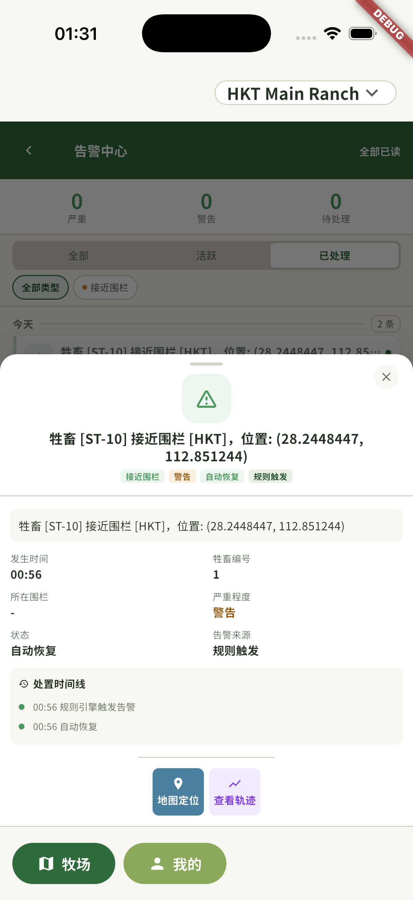

### UJ-M09~M10 牲畜与设备管理
牲畜列表 9 条（品种/双设备标签/健康章/编辑），搜索 "ST-2" 精确过滤 3 条；设备概览 195/20/0（与 86 web 端一致），设备卡含在线状态/RSSI/电量/平台注册 ID 与安装到牲畜/查看轨迹/删除操作，翻页 1→2/10 正常。
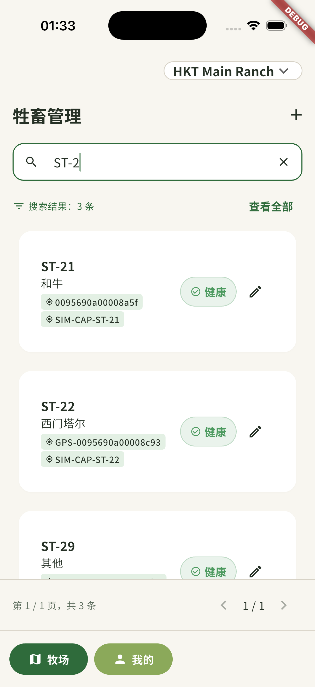
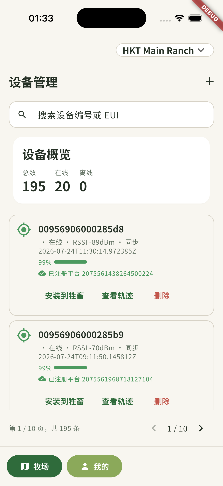

### UJ-M11~M14 我的页各入口
牧工管理（负责人卡/在岗章/添加入口）✅；离线地图管理（已用空间 0B/可用区域 changsha、changsha-demo/已下载空态）✅；帮助与支持为"开发中"提示（未实现但反馈正确）；**API 授权管理页持续空转加载（FAIL，见 DEF-6）**。
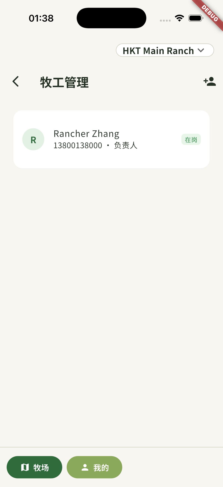

### UJ-M15/M16 语言与时区
语言切换实时生效（底部导航/设置区/说明文案全部本地化）；时区对话框 7 选项齐全，改"跟随系统"后地图从 OSM 灰瓦片恢复为高德（选源联动正确）。
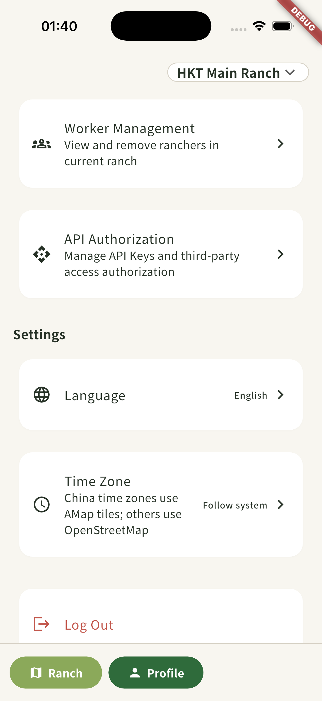
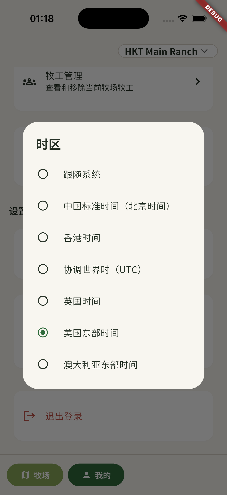

### UJ-M17 牧场切换
切换菜单列出两个牧场；切 Pampas Steppe 后标题/统计全零联动，切回 HKT 数据恢复（9 头）。
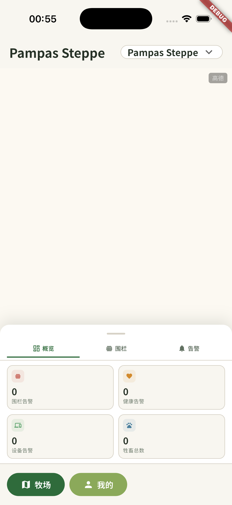

## 三、缺陷清单

| ID | 级别 | 状态 | 描述 | 证据 |
|---|---|---|---|---|
| DEF-1 | High | ✅ 已修（本日） | 告警中心列表全空白：AlertCard 外层 Row `CrossAxisAlignment.stretch` 在 SliverList 无界高度下布局断言崩溃（NIX-52 引入，b600 已发 4 环境全平台）。修法=IntrinsicHeight 包裹 | 修复前 UJ-M06_03（活跃页签空）、修复后 UJ-M06_01 |
| DEF-2 | Med | ✅ 已修（本日） | 枚举码泄露 ×2：牧场页告警列表副标题、健康弹层围栏详情"类型"行裸显 `FENCE_APPROACH`。已接既有 arb key | （上轮 sim_06；本轮 UJ-M06_02 详情已全本地化） |
| DEF-3 | High | ⏳ 遗留 | 登出→登录初始化链路触发 `FarmSwitcherController` CircularDependencyError，bottom sheet transient 红屏（debug）/灰块（release），数秒自愈。复现 1/2 次。**需设计裁决依赖序，非一行可修** | UJ-M02_05（红屏）、UJ-M02_06（自愈后） |
| DEF-4 | Low | 🆕 新发现 | 设备卡"同步"时间显示 ISO 原文（`2026-07-24T11:30:14.972385Z`），未按 26dccd9d 的时间本地化约定处理 | UJ-M10_01 |
| DEF-5 | Med | 🆕 新发现 | 离线地图管理页无任何可见返回途径（无返回箭头、无底部导航栏）；idb 边缘右滑亦未能返回（真机系统手势待人工复核）。用户可能被卡在该页 | UJ-M13_01 |
| DEF-6 | Med | 🆕 新发现 | API 授权管理页持续空转加载（>6s 无内容、无超时、无错误/空态提示）；同环境 web 端该页正常 | UJ-M12_02 |

**观察项（不建单）**：① 帮助与支持点击弹"开发中…"提示——功能未实现但反馈正确；② 告警卡"AI检测"来源徽章与详情"规则触发"并存，source 字段取值口径疑点，建议核对数据侧；③ 牲畜管理/设备管理子页无返回箭头，依赖底部"我的"tab 返回（可用但与离线地图页不一致，建议统一导航模式）。

## 四、未覆盖项（如实声明)

- 围栏**新增/编辑边界/删除**未实际提交（避免污染 test 数据；入口与列表已验证）。
- 告警批量已读、忽略、地图内定位/轨迹回放按钮未点（涉及写路径，本轮以只读走查为主）。
- iOS 系统级边缘右滑返回手势是否对离线地图页生效，需真机人工确认（idb 合成手势未能触发，不能证伪）。
- 前台/后台切换、弱网、断网离线回落 tileserver 场景未覆盖。

## 五、测试资产

- 截图 32 张：`docs/testing/ios-journey-2026-09-15/`
- 模拟器：iPhone 17 Pro（5C468BE8-5F4B-4025-83EA-A9F9436301EA），App 会话保持登录态（13800138000）
- 关联修复（未提交 git，待验收）：`lib/features/alerts/presentation/widgets/alert_card.dart`、`lib/features/pages/ranch_page.dart`、`lib/features/ranch/presentation/widgets/health_bottom_sheet.dart`
