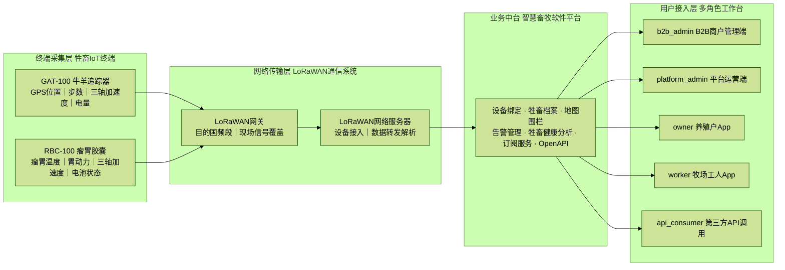
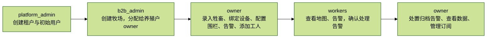

# 智慧畜牧解决方案赋能手册

> 版本：v0.7（2026-08-26）
> 适用对象：海外售前/商务人员、售后支持人员、参与客户技术澄清的研发代表
> 定位：智慧畜牧解决方案总纲，统一 GAT-100 牛羊追踪器、RBC-100 瘤胃胶囊、LoRaWAN 网络和智慧畜牧软件平台的产品事实、方案组合、术语和承诺边界。售前话术见《海外解决方案售前实战手册》，售后流程见《解决方案售后支持实战手册》。

## 1. 使用原则

海外售前和售后面对的是同一个客户的两个阶段。如果能力、术语和边界理解不一致，最容易出现售前过度承诺、售后无法交付，或同一功能被讲成三个名字。

面向客户时遵循三条原则：

1. **事实一致**：能力、状态、限制必须来自本文列出的事实源。
2. **场景翻译**：对商务客户讲价值和结果，对技术客户讲架构和边界，但事实不能变。
3. **不确定就升级**：没有书面依据的信息不承诺、不猜测、不口头补齐。

维护规则：产品能力、商务政策或合规口径发生重大变化时，变更提出人需同步更新本文并提升版本号。本文不能替代合同、报价单、SLA 附件或技术协议。

## 2. 解决方案定位

### 一句话定位

HKT-Smart-Livestock is an end-to-end livestock management solution that combines GAT-100 trackers, RBC-100 rumen capsules, LoRaWAN connectivity, and a software platform to help farms track animals, monitor health, respond to alerts, and use operational data to reduce loss and manual work.

HKT-Smart-Livestock 是一套端到端的畜牧业管理系统，结合了 GAT-100 跟踪器、RBC-100 瘤胃胶囊、LoRaWAN 连接性和软件平台，帮助农场追踪动物、监测健康状况、响应警报，并利用运营数据减少损失和人工操作。

### 解决方案架构



```text
GAT-100 牛羊追踪器
  -> GPS 位置、步数、三轴加速度、电量
RBC-100 瘤胃胶囊
  -> 瘤胃温度、胃动力、三轴加速度、电池状态
LoRaWAN 网关 / 网络服务器
  -> 目的国频段、现场覆盖、数据转发
智慧畜牧软件平台
  -> 设备绑定、牲畜档案、地图、围栏、告警、健康分析、订阅、API
App / 管理端 / Open API
  -> owner、worker、b2b_admin、platform_admin、api_consumer 工作台
```

### 方案组成边界

| 组成部分 | 负责内容 | 不负责内容 | 详细分册 |
|---|---|---|---|
| GAT-100 | 体表佩戴、GPS 定位、步数、三轴加速度、设备状态 | 瘤胃温度、瘤胃胃动力、默认防拆/温湿度 | 《GAT-100 牛羊追踪器培训手册》 |
| RBC-100 | 瘤胃温度、胃动力、三轴加速度、体内长期监测 | GPS 定位、回收复用、电池更换 | 《RBC-100 瘤胃胶囊培训手册》 |
| 网关/网络 | LoRaWAN 频段匹配、覆盖、数据转发 | 业务告警规则和健康算法判断 | 硬件分册 + 现场勘测清单 |
| 软件平台 | 数据解析、牲畜档案、围栏、告警、健康分析、订阅、API | 设备硬件维修、现场兽医操作、网络施工 | 《智慧畜牧软件平台培训手册》 |
| 实施与服务 | 开通、设备绑定、佩戴/投服指导、培训、支持 | 未经合同确认的动物医疗责任 | 售前/售后手册 |

### 客户价值地图

| 客户目标 | 解决方案能力 | 售前表达重点 | 售后确认重点 |
|---|---|---|---|
| 减少牲畜丢失 | GAT-100、LoRaWAN 网关、平台围栏与越界告警 | 及时发现离开围栏的牲畜 | 设备在线状态、GPS 时间窗、网关覆盖、告警状态 |
| 降低巡查人力 | 地图、历史轨迹、告警工作台 | 用优先级代替盲目巡场 | 数据是否可用、客户是否理解设备和网络限制 |
| 更早发现健康风险 | RBC-100 温度/胃动力、GAT-100 活动趋势、平台健康预警 | 辅助个体健康决策 | 是否配备对应传感器、数据量是否充分、订阅层级是否开放 |
| 多角色协作 | owner/worker 分权、告警流程 | 牧场主与现场人员分工清楚 | 角色权限是否符合预期 |
| 企业集成 | Open API、API Key、统计与门户 | 接入客户既有系统 | scope、限流、兼容承诺是否确认 |
| 控制经营成本 | 订阅层级、配额、功能门控 | 分阶段采购和扩展 | 配额、升级、功能不可见原因 |

### 主要功能清单

| 功能域 | 客户看到的能力 | 培训讲解重点 | 依赖与边界 |
|---|---|---|---|
| 地图与定位 | 地图概览、牲畜位置、GPS 日志、历史轨迹、离线瓦片管理 | 从“找牛”变成“在地图上确认位置和行动优先级” | 依赖设备、网络、数据保留策略和地图资源 |
| 电子围栏 | 围栏创建、编辑、删除、越界检测、告警 | 围栏是业务规则，不只是地图图形 | 围栏数量受订阅层级影响 |
| 告警工作台 | 告警列表、确认、处理、归档 | 展示从发现到闭环的协作过程 | worker 只能确认；处理和归档由 owner 执行 |
| 健康分析 | 发热、消化、发情、疫病预警、异常检测 | 用个体遥测辅助健康与繁殖决策 | 需要对应传感器、足量数据、匹配订阅；不能替代兽医诊断 |
| 设备管理 | 设备、安装关系、License、设备状态和遥测链路 | 设备生命周期可追踪，减少“设备在用但不知道状态”的问题 | 具体设备型号和协议需技术评估 |
| 牲畜档案 | 牲畜详情、设备绑定、位置和健康数据 | 一头牲畜形成业务与数据档案 | 档案完整度取决于客户录入和设备覆盖 |
| 组织与权限 | 租户、牧场、owner/worker 分权、多牧场切换 | 集团和牧场各自看到该看的范围 | 权限边界以系统矩阵为准 |
| 订阅与配额 | basic/standard/premium/enterprise、Feature Gate、用量与升级 | 按阶段采购，避免一次性过度投入 | 海外报价和商务政策另行确认 |
| 企业集成 | Open API、API Key、scope、限流、调用统计 | 将位置、告警、设备等授权数据接入客户系统 | API 范围、频率和兼容承诺需技术确认 |
| 运营与分析 | Dashboard、统计聚合、趋势分析、审计日志 | 支持经营复盘和管理留痕 | 部分能力主要在管理端或 API 侧，讲解前确认客户可见范围 |

> 培训时不要把功能清单从头念到尾。先问客户目标，再选择 2-3 个功能域演示完整工作流。

### 客户价值分层

| 价值层 | 客户关心的问题 | 我们的价值表达 | 需要收集的证据 |
|---|---|---|---|
| 损失控制 | 牲畜走失、越界、异常停留 | 更快识别风险位置，让人员带着明确目标出动 | 历史丢失率、单头价值、搜寻成本 |
| 人力效率 | 巡查范围大、人员少、响应慢 | 用地图、告警和历史轨迹减少盲目巡查 | 巡查人数、耗时、响应时长 |
| 健康与繁殖 | 疾病发现晚、发情观察不稳定 | 通过体温、蠕动、活动等数据辅助个体决策 | 兽药成本、空怀天数、繁殖流程 |
| 管理透明 | 多牧场、多角色、数据分散 | 统一档案、权限、告警闭环和管理看板 | 牧场数量、组织角色、报表流程 |
| 系统集成 | 数据孤岛、ERP/管理软件割裂 | 通过 Open API 按授权范围接入客户系统 | 对接系统、数据对象、频率、安全要求 |
| 投资节奏 | 一次性预算有限 | 订阅、设备、集成可分阶段验证和扩展 | 预算、设备现状、试点成功标准 |

价值量化公式：

```text
业务价值 =
  减少丢失损失
  + 降低巡查和搜寻人力
  + 提前健康干预带来的损失减少
  + 繁殖效率提升
  + 管理和集成效率提升
  - 设备与网络投入
  - 订阅与服务成本
```

售前可以用客户自己的数字填入这个公式，但不能替客户承诺固定回报率。POC 成功标准应写成可验证指标，例如告警送达率、轨迹完整率、试点动物覆盖率、响应流程闭环率。

### 禁止的表达

| 禁止表达 | 原因 | 替代表达 |
|---|---|---|
| Real-time 100% positioning | GPS、设备、网络都会影响效果 | Near-real-time tracking, subject to device and network conditions |
| AI can diagnose disease | 当前是辅助预警，不是兽医诊断 | AI-assisted anomaly detection to support decisions |
| Offline tracking always works | 离线地图不等于设备无网仍可上传数据 | Offline map support is available; data availability depends on devices and connectivity |
| Any device can be integrated | 设备型号、协议、供应商平台需评估 | Device compatibility needs technical assessment |
| Simulation proves production performance | 仿真数据只用于研发和评估 | Production performance must be validated with real telemetry |

## 3. 模块地图

| 模块 | 当前事实 | 售前关注 | 售后关注 |
|---|---|---|---|
| 租户与用户 | 租户、用户、牧场、角色、JWT 认证、多租户隔离 | 集团与多牧场管控 | 登录、权限、租户状态 |
| 牧场与牲畜 | 牧场由 b2b_admin 或 platform_admin 创建并分配给 owner | 实施责任分工 | 牧场归属、farm scope、牲畜档案 |
| 设备与安装 | GPS 追踪器、瘤胃胶囊、安装、License、设备健康管理相关能力 | 结合设备采购计划讨论 | 设备状态、安装关系、License、遥测链路 |
| GPS 与地图 | GPS 日志、地图、轨迹、离线地图、瓦片多级降级 | 定位与巡查效率 | 时间窗、坐标、瓦片、离线包、轨迹为空 |
| 围栏与告警 | 电子围栏、越界告警、告警状态流 | 损失控制和响应流程 | 围栏配置、触发条件、状态流转 |
| 健康分析 | 温度、蠕动、发情、疫病预警等健康上下文 | 早发现与个体管理 | 传感器数据、订阅层级、结果解释 |
| 商业与配额 | 订阅、合同、分润、Feature Gate | 分阶段方案 | 配额、功能门控、升级 |
| 开放 API | Open API、API Key、scope、限流、统计聚合 | 企业集成 | Key 状态、scope、限流、requestId |
| AI 与仿真 | datagen 与 AI 异常检测用于研发、评估和管道验证 | 只讲辅助分析和进展 | 数据来源、真实效果验证边界 |

> 功能清单是培训索引，不是客户交付承诺。面向客户输出方案前，仍要按第 8 节确认订阅、设备、部署、SLA 和数据边界。

## 4. 角色与旅程

| 角色 | 英文称呼 | 主要用途 |
|---|---|---|
| platform_admin | Platform Administrator | 平台级租户、用户、合同、订阅服务、API 授权管理 |
| b2b_admin | Enterprise Administrator | 管理旗下牧场、牧工、合同、对账 |
| owner | Farm Owner | 管理牧场业务、牲畜、围栏、告警、设备、订阅 |
| worker | Farm Worker | 查看地图、告警、围栏，可确认告警 |
| api_consumer | API Consumer / Developer | 通过 Open API 访问授权数据 |

实施旅程：



```text
platform_admin creates tenant and initial users
  -> b2b_admin creates farms and assigns them to owners
  -> owner sets up livestock, devices, fences, alerts, workers
  -> workers view maps and alerts, acknowledge alerts
  -> owner handles and archives alerts, reviews data and subscriptions
```

权限速查：

| 操作 | owner | worker | b2b_admin | platform_admin |
|---|---|---|---|---|
| 创建/编辑/删除围栏 | Yes | No | No | No |
| 确认告警 | Yes | Yes | No | No |
| 处理/归档告警 | Yes | No | No | No |
| 创建牧场 | No | No | Yes | Yes |
| 管理订阅 | Yes | No | No | No |
| 查看合同/对账 | No | No | Yes | Yes |

> 权限细节以 `docs/product/customer-journey.md` 和当前代码为准，不承诺矩阵之外的自定义权限。

## 5. 订阅与设备依赖

当前系统定义 `basic`、`standard`、`premium`、`enterprise` 四类订阅层级，通过配额引擎和 Feature Gate 控制功能与数据范围。

### 商业模式总览

系统用 `Tenant.type` 表示客户在生态中的角色，用 `billingModel` 表示收费方式。两者是独立维度：前者回答“客户是谁”，后者回答“怎么收费”。

| 客户角色 | 典型需求 | 适合收费方式 | 售前判断点 |
|---|---|---|---|
| rancher / Farm Owner | 自己牧场使用平台 | direct 订阅，可叠加设备采购 | 牲畜规模、设备需求、付费习惯 |
| reseller / Channel Partner | 代理销售或服务多个牧场 | revenue_share 分润 | 客户归属、服务边界、分润比例 |
| enterprise / Group Customer | 集团管控、集成、定制部署 | licensed 或 enterprise 定制 | 数据驻留、部署方式、集成范围 |
| developer / API Consumer | 接入授权数据 | api_usage 或 enterprise 打包 | 数据 scope、调用量、限流和 SLA |

### 可支撑的收费模式

| 模式 | 计费基础 | 平台已支撑能力 | 商业边界 |
|---|---|---|---|
| SaaS 直订 `direct` | 基础月费 + 牲畜超额费 | 订阅层级、试用、升级、状态机、配额、Feature Gate | 支付、发票、币种、税率和区域价格需商务确认；当前 checkout 属于产品流程，不等同于完整海外收款系统 |
| 渠道分润 `revenue_share` | 合同金额或约定收入按比例分配 | 合同、分润比例、周期计算、平台/合作方确认、结算状态 | 分润口径、结算周期、税费和付款流程须写入合同 |
| 独立部署 `licensed` | 设备License 授权费，可按软件订阅 tier、设备配额、有效期定制 | SubscriptionService、License 签发与校验、设备配额、激活、到期状态 | 私有化交付包、实施责任、升级运维、在线心跳策略、数据驻留和合规需产品/研发确认 |
| API 用量 `api_usage` | 调用量、数据范围、SLA 或包月额度 | API Key、scope、限流、调用日志、日用量聚合和趋势统计 | 计费单价、账单生成、免费额度和超量处理尚未形成完整对外商业模式，需产品/商务确认 |
| 硬件销售 | 设备单价 × 数量，可买断、租赁或混合 | 设备、设备 License、安装关系、配额和状态管理 | 硬件订单、物流、保修、残值和付款由商务/供应链流程处理，平台不等于订单系统 |

### 收费与门控机制

| 机制 | 客户理解方式 | 支撑能力 |
|---|---|---|
| 订阅层级 | 按功能范围和数据保留分档 | basic/standard/premium/enterprise |
| 超额计费 | 超出包含牲畜数量后按头加费 | `基准费用 + 超出头数 × 超额单价` |
| 试用 | 有限时间体验高级能力 | 试用状态和到期降级 |
| 功能开关 | 某功能当前层级是否可用 | LOCK |
| 数量上限 | 围栏、牲畜等资源数量限制 | LIMIT |
| 数据裁剪 | 历史数据保留范围 | FILTER |
| API 限流 | 单位时间调用上限 | API Key 配置和调用统计 |
| 设备配额 | 可启用设备类型和数量 | Device License / SubscriptionService |

> 向客户解释价格前，售前必须先确认币种、税费、付款周期、设备采购、实施、支持服务、SLA 和折扣审批。代码中的金额结构可以说明计费逻辑，但不能直接作为海外公开报价。

### 设备与订阅组合

| 组合 | 收入来源 | 适合客户 | 注意事项 |
|---|---|---|---|
| 设备买断 + 平台订阅 | 硬件一次性收入 + SaaS 订阅 | 有设备采购预算、希望长期使用平台的牧场 | 明确保修、丢失、维修和续费边界 |
| 设备租赁 + 服务订阅 | 设备租赁费和平台费合并报价 | 初期不想投入设备资产的中小牧场 | 租期、退还、损坏赔偿和最低承诺需合同确认 |
| 客户已有设备 + 平台服务 | SaaS 或集成服务收入 | 已有 GPS/传感器资产的客户 | 先评估设备兼容性和数据获取方式 |
| Enterprise 打包 | 订阅、设备、实施、集成、支持打包定制 | 集团或多牧场客户 | 需技术评估后分项报价 |
| API 数据服务 | API 调用、scope、SLA 或包量收入 | 集成商、平台客户、监管或产业方 | API 商业化口径待确认 |

增值服务包（如健康管理、繁殖管理、全方位服务）可作为方案方向讨论，但具体价格、包含范围、是否已被 FeatureGate 配置为可售 SKU，必须由产品和商务确认。

功能门控示例：

| 能力 | 门控逻辑 |
|---|---|
| GPS 定位 | 所有层级可用，效果依赖设备和网络 |
| 电子围栏 | 数量按层级受限，enterprise 可定制 |
| 告警历史、历史轨迹 | basic 不开放，standard 及以上开放 |
| 健康评分、发情检测、疫病预警 | premium 及以上，并依赖对应设备 |
| API 访问 | enterprise 开放，scope 和限流按合同与 Key 配置确认 |

设备依赖：

| 客户想要 | 至少需要 |
|---|---|
| 围栏、轨迹 | GPS 追踪器 |
| 温度、蠕动监测 | 瘤胃胶囊 |
| 健康评分、发情检测、疫病预警 | GPS 追踪器 + 瘤胃胶囊，且订阅层级匹配 |

海外报价必须另行确认币种、税费、区域价格、付款周期、设备采购、实施和支持范围。国内种子配置中的金额只能作为能力参考，不得直接作为海外公开报价。

## 6. 技术事实速查

- Mobile App：Flutter Web/App。
- 后端：Spring Boot 3.3、Java 17。
- 数据库：PostgreSQL 16；缓存与消息：Redis 7、RocketMQ 5.1。
- 数据库迁移：Flyway。
- App/Admin 使用 JWT；Open API 使用 API Key。

| API 类型 | 前缀 | 认证 | 客户理解方式 |
|---|---|---|---|
| App API | `/api/v1/` | JWT | 给移动 App 使用 |
| Admin API | `/api/v1/admin/` | JWT | 给管理后台使用 |
| Open API | `/api/v1/open/` | API Key | 给客户或第三方系统集成 |

运维与数据边界：

1. Farm Scope 用于限定牧场数据范围，读写来源规则不同。
2. 不同来源写入共享表必须保留合法 `source`。
3. GPS 遥测通过 ingestion task 异步写入 `gps_logs`，以 `(device_id, recorded_at)` 幂等。
4. 时序表由分区维护服务管理，不要手工预建分区。
5. dev/test 环境隔离；test 环境部署和集成测试必须遵守公司流程。

## 7. 竞品对比与差异化优势

### 可直接采用的软件平台差异化

| 优势维度 | 我们的可讲事实 | 客户价值 | 注意事项 |
|---|---|---|---|
| 平台级整合 | 将定位、围栏、告警、设备、健康、订阅、API 放在同一业务平台 | 减少多个工具和数据孤岛 | 不贬低竞品，只对比客户目标 |
| 业务闭环 | 告警有状态流，角色有分工，设备与牲畜有关联 | 从“看到数据”走到“处理完成” | 通知渠道和 SLA 需另行确认 |
| 多租户与多牧场 | 租户、牧场、角色、Farm Scope 数据隔离 | 适合集团、经销商和规模化牧场 | 自定义权限不在承诺范围内 |
| 设备数据架构 | GPS 幂等写入、遥测时序存储、分区维护、数据来源标记 | 支撑规模化数据和后续分析 | 现场规模和性能指标需技术评估 |
| 地图能力 | 在线地图、离线瓦片管理、瓦片降级设计 | 支持地图可用性和弱网场景 | 区域瓦片、离线包大小和更新机制需确认 |
| API 与门户 | API Key、scope、限流、统计聚合和趋势分析 | 支持企业集成和使用量管理 | 对外接口范围和兼容期需审批 |
| 研发验证体系 | datagen、GroundTruth、评估闭环、异常检测研发管道 | 说明能力验证方法严谨 | 不能用仿真结果冒充生产效果 |

### 硬件与空地协同差异化口径

仓库内产品研究将 LoRaWAN 低功耗覆盖、瘤胃胶囊、蓝牙关联防盗、无人机移动网关列为核心差异化方向。由于涉及设备型号、指标、认证和交付状态，培训时只能作为“方案方向”讲解，必须经产品、硬件和研发确认后才能写入客户方案：

| 差异化方向 | 历史研究中的优势表述 | 对客户的潜在价值 | 对外前置条件 |
|---|---|---|---|
| LoRaWAN 覆盖 | 偏远牧场可减少对蜂窝网络覆盖的依赖 | 覆盖盲区、功耗和通信成本的改善 | 现场勘测、网关方案、频段法规、电池指标 |
| 瘤胃胶囊 | 采集体内温度和蠕动等数据 | 补充体表设备难以稳定获取的健康信号 | 设备认证、畜种适配、兽医流程、进口合规 |
| 胶囊与追踪器关联（规划中） | 外部设备脱落或被拆除时可形成补充告警 | 提升防盗和设备异常识别能力 | 蓝牙/告警逻辑、误报率、真实场景验证 |
| 无人机协同 | 移动网关补盲和丢失目标搜索 | 扩展巡检和搜寻半径 | 无人机型号、空域法规、保险、安全责任 |

### 竞品研究快照

> 以下内容提炼自 `docs/product/smart-livestock-prd-v2.3.md` 和 `Mobile/docs/product/2026-04-10-研发项目立项书.md`，属于历史市场研究。用于客户材料前必须重新核对竞品官网、公开文档、定价和本地案例，并标注资料日期。

| 竞品 | 国家/地区 | 研究中的定位 | 对方可能强项 | 我方差异化切入点 |
|---|---|---|---|---|
| Halter | 新西兰 | 蜂窝/项圈路线，虚拟围栏和健康监测 | 品牌认知、牧场场景经验、成熟产品化 | 多源健康数据、集团权限、API 集成、分阶段订阅 |
| Vence | 美国 | 蜂窝网络路线，牲畜追踪和虚拟围栏 | 北美市场经验、规模化牧场服务 | 地图与告警闭环、多租户管理、企业集成 |
| Nofence | 挪威 | 4G/LTE 路线，面向山羊/绵羊虚拟围栏 | 小型反刍动物场景、欧洲认知 | 跨畜种方案评估、健康与设备生命周期管理 |
| Digitanimal | 西班牙 | LoRaWAN 路线，追踪与活动监测 | 低功耗广域网经验、拉美/欧洲覆盖 | 平台业务闭环、健康上下文、API 和数据治理 |

竞品沟通三原则：

1. 承认竞品成熟度和区域优势，不贬低对方。
2. 用客户现场条件和使用目标验证差异，不宣称全面领先。
3. 涉及电池寿命、覆盖半径、准确率、找回率、月费对比时，必须有最新公开来源或内部实测报告。

## 8. 承诺边界

### 可按现有事实介绍

1. 多租户、多牧场、多角色牲畜管理。
2. GPS 位置、地图、电子围栏、告警工作台。
3. 设备安装、License、订阅配额、Feature Gate。
4. 健康上下文和开发者门户的已实施能力。
5. Open API 的隔离、认证、scope、限流和统计能力。
6. 离线地图、瓦片服务与多级降级的设计能力。

### 需要技术确认后才能承诺

1. 客户指定设备型号、协议、供应商平台和批量接入。
2. 现场网络覆盖、弱网比例、延迟和数据频率目标。
3. API 集成范围、scope、限流、兼容期和 SLA。
4. 地图区域、瓦片资源、坐标系、离线包大小和更新机制。
5. 数据驻留、合规认证、审计报告和跨境数据要求。
6. 设备规模、并发写入、历史数据迁移量。
7. 告警通知渠道、响应时限和升级机制。

### 禁止承诺

1. 把仿真数据效果说成真实生产效果。
2. AI 可替代兽医诊断或人工决策。
3. 未经确认的设备兼容性和现场网络效果。
4. 向客户公开内部环境、账号、密钥或数据库信息。
5. 绕过合同讨论数据所有权、删除、赔偿、责任限制和合规义务。

## 9. 中英术语表

| 中文 | 英文 | 说明 |
|---|---|---|
| 智慧畜牧解决方案 | HKT-Smart-Livestock solution | GAT-100、RBC-100、网络和软件平台的统称 |
| 智慧畜牧软件平台 | HKT-Smart-Livestock platform | 解决方案中的软件层 |
| 牲畜 | Livestock / Animal | 客户沟通可用 animal，系统模型用 livestock |
| 牧场 | Farm | 不主动用 ranch，除非客户自己使用 |
| 牧场主 | Farm Owner | 对应 owner |
| 牧工 | Farm Worker | 对应 worker |
| 租户 | Tenant | 多租户隔离中的客户组织 |
| 电子围栏 | Geofence | 不说 fence line，避免误解为物理围栏 |
| 越界告警 | Geofence breach alert | 离开电子围栏范围 |
| GPS 追踪器 | GPS tracker | 设备类型 |
| 瘤胃胶囊 | Rumen capsule / bolus | 瘤胃内传感器 |
| 遥测数据 | Telemetry data | 设备上传数据 |
| 历史轨迹 | Location history | 不说 full history，除非保留策略已确认 |
| 健康预警 | Health alert | 辅助管理，不等于诊断 |
| 发情检测 | Estrus detection | 需确认畜种和设备适配 |
| 订阅层级 | Subscription tier | basic/standard/premium/enterprise |
| 功能门控 | Feature gating | 解释功能不可见原因 |
| 开放接口 | Open API | 面向第三方系统 |
| API 密钥 | API Key | 不展示完整值 |
| 速率限制 | Rate limit | API 集成必确认 |
| 数据保留 | Data retention | 与订阅和合同相关 |
| 多租户隔离 | Tenant isolation | 数据与权限边界 |
| 硬件层 | Hardware layer | 设备电量、固件、佩戴/投服、绑定和按键状态 |
| 网络层 | Network layer | 频段、网关、RSSI/SNR、网络服务器和转发 |
| 环境层 | Environment layer | 网络、终端、工具、访问条件 |
| 部署层 | Deployment layer | 服务版本、镜像、前端发布、配置 |
| 数据层 | Data layer | 数据、配置、迁移、设备上传 |
| 代码层 | Code layer | 确认产品缺陷后进入研发 |

## 10. 培训路径

### 售前/商务人员

1. 学习本文第 1-9 节。
2. 学习《智慧畜牧软件平台培训手册》第 1-7 节。
3. 掌握 GAT-100 与 RBC-100 的产品一页纸、核心卖点和前置条件。
4. 完成 10 分钟解决方案介绍演练。
5. 完成 5 个客户目标到解决方案能力的翻译练习。
6. 完成 3 个边界问题升级演练。
7. 学习《海外解决方案售前实战手册》。

### 售后支持人员

1. 学习本文第 1-9 节。
2. 学习《智慧畜牧软件平台培训手册》。
3. 熟悉角色、权限、告警状态和设备依赖。
4. 学习 GAT-100 的上线、按键、离线和轨迹排查要点。
5. 学习 RBC-100 的验活、投服登记、协议版本和温度曲线排查要点。
6. 完成 3 个受理表单练习。
7. 完成硬件、网络、环境、部署、数据、代码六层定位演练。
8. 学习《解决方案售后支持实战手册》。

## 11. 事实源与待确认清单

### 事实源

- `docs/reference/project-overview.md`
- `docs/product/customer-journey.md`
- `docs/product/smart-livestock-prd-v2.3.md`
- `docs/superpowers/specs/2026-05-18-commerce-context-design.md`
- `Mobile/docs/product/2026-04-10-研发项目立项书.md`
- `Mobile/docs/requirements/2026-03-27-虚拟围栏应用需求分析.md`
- `docs/api-contracts/api-overview.md`
- `docs/reference/deployment.md`
- `docs/reference/lessons-learned.md`
- `smart-livestock-server/src/main/java/`
- `Mobile/mobile_app/lib/`
- `docs/training/03-smart-livestock-platform-training.md`
- `docs/training/04-gat-100-cattle-sheep-tracker-training.md`
- `docs/training/05-rbc-100-rumen-capsule-training.md`
- 竞品官网与公开资料（见“外部来源”，需定期复核）

### 行业与竞品公开基准

> 检索时间：2026-08-25 UTC。以下只作为内部决策参考，不代表可直接对外引用的第三方审计结论；面向客户使用前仍需复核原文、区域页面和资料日期。

| 竞品/来源 | 公开商业与产品口径 | 对我们的启发 | 使用限制 |
|---|---|---|---|
| Halter ROI 页 | 官网发布 AgFirst / Transform Agri 对 10 个新西兰奶牛场的研究，宣传平均 pasture eaten +9%、milk solids/ha +9.5%、profit before tax +13%，并强调技术必须与管理改变结合 | 售前材料应把平台价值和牧场管理改变一起讲；POC 指标可覆盖牧草利用、产出、人工和利润，但不能直接套用 Halter 数字 | 新西兰奶牛场样本，不适用于其他畜种、区域或管理系统 |
| Halter 技术页 | 宣传太阳能项圈、直连卫星、Beef 场景无需塔站/蜂窝覆盖、Dairy 动作响应约 90 秒、实时位置/健康/发情信息、每项圈每分钟 6000+ 数据点、累计 70 亿小时动物行为数据 | 竞品已经把“覆盖、数据密度、实时性、AI 数据资产”作为核心卖点；我们应准备对应的能力证据和技术评估表 | "world-first"、90 秒、6000+、70 亿小时均为 Halter 宣传口径，未经我们实测 |
| Halter 联系页 | 未公开标准价格，采用 local rep / Chat with us 的销售流程；公开 Help Centre、support 邮箱、Learning hub，并说明主要支持 NZ/AU/US | 高价值牧场方案可采用 contact-sales 模式；公开 Help Centre、培训中心和支持入口有助于降低海外信任成本 | 无公开价格，不能推断其报价水平 |
| Digitanimal 商城 | GPS tracker、太阳能 tracker、virtual fencing 均公开产品价，展示 VAT excluded：EVO tracker 约 €179.95 起、ECO solar tracker 约 €189.95 起、virtual fencing 约 €339.94 起；服务包含 12 个月、后续有 renewal plans、14 天退款保证、2 年质保；EVO 宣传最长约 2 年电池，virtual fencing 宣传电池保证超过 8 个月 | 硬件 + 12 个月服务 + 到期续费是清晰商业模式；公开设备价、税费口径、退款和质保可降低线上询盘摩擦 | 起价随变体/套餐变化；区域、税、物流、售后责任需另算；不宜直接照抄价格 |
| Digitanimal 设备页 | 公开 NB-IoT/GSM multi-operator 移动网络覆盖、适用 cows/horses/sheep/goats、GPS L1+L5、移动/静止不同采样频率等设备规格 | 设备规格、通信制式、畜种适配和采样频率应成为售前技术评估必填项 | 网络和采样效果依赖当地运营商与牧场环境 |
| Vence 官网 | 定位为 cattle virtual fencing livestock management；公开项圈含 GPS 与 RF transceiver，声音提示加 animal-safe humane electric pulse 控制边界；base station 按地形覆盖 5,000-10,000 英亩；无公开标准价格，导向 GET IN TOUCH | 大牧场可按基础设施覆盖、项圈数量、实施和培训分项报价；传统围栏替代成本是价值论证入口 | 覆盖面积为官网宣传，实际取决于地形；电刺激和动物福利口径需法务/合规审核 |
| Nofence 公开索引 | 搜索索引显示官网定位为 cattle/sheep/goats 的 virtual fencing，并强调 remote livestock management、减少体力劳动；本网络访问官网页面返回 404，未能验证价格 | 多畜种和小反刍动物是重要细分场景，不应只按牛场设计话术 | 未获得官网可访问页面和价格，禁止在客户材料中引用本次搜索摘要 |

行业经验总结：

1. **先判断覆盖，再谈功能**。竞品普遍把卫星、蜂窝、RF 基站、项圈采样和网络覆盖放在技术叙事的前排；我们售前也必须先完成现场网络和设备勘测。
2. **硬件与服务常打包出售，但续费边界要写清**。Digitanimal 公开“设备价 + 12 个月服务 + renewal plan”；我们至少要明确服务包含期、续费单价、断缴后数据访问和设备功能边界。
3. **高价值大牧场倾向 contact sales**。Halter、Vence 未公开标准价格，说明复杂部署、牧场规模和培训实施会影响报价；我们不应只做公开低价询盘。
4. **信任资产需要证据链**。竞品使用独立研究、案例、数据量、技术规格、质保、退款和 Help Centre 建立可信度；我们应准备 ROI 计算器、POC 报告、设备测试记录和支持入口。
5. **动物福利是商业风险**。涉及声音、电刺激、瘤胃胶囊、项圈佩戴时，宣传必须谨慎，应有动物福利说明和合规审核。

### 待确认

| 类别 | 行业/竞品基准 | 内部待确认内容 | 建议负责人 |
|---|---|---|---|
| 海外定价 | Halter/Vence 走 contact sales；Digitanimal 公开设备起价且 VAT excluded | 币种、区域价格、付款、税费、报价模板、是否公开设备价 | 销售/商务 |
| 商业模式 | 设备买断 + 12 个月服务 + renewal；企业方案 contact sales | API 用量计费、增值包、设备租赁、服务包含期、断缴策略、折扣和结算规则 | 产品/商务/财务 |
| 售前 SLA | 竞品普遍提供 local rep/contact form，Halter 明确本地代表流程 | 询盘首响、回访节奏、技术澄清时限、local rep 或 distributor 责任 | 销售/商务 |
| 售后 SLA | Digitanimal 公开 14 天退款、2 年质保；Halter 公开 Help Centre 和支持邮箱 | 严重级别、响应和解决时限、值班窗口、退款、质保、退换和维修流程 | 支持负责人 |
| 合规口径 | 竞品公开 Terms、Privacy、动物福利和技术认证线索 | 数据驻留、隐私、审计、跨境传输、动物福利、电刺激/体内传感器合规 | 法务/合规 |
| 设备兼容 | Halter 卫星/太阳能；Digitanimal NB-IoT/GSM；Vence GPS+RF+base station | 目标市场设备清单、供应商、认证、频段、协议、覆盖评估模板 | 硬件/研发 |
| 演示环境 | 竞品用 App 截屏、技术页、案例和研究建立信任 | 海外可访问 demo、账号、数据、语言、案例截图、POC 数据模板 | 产品/运维 |
| AI 口径 | Halter 宣传实时健康/发情与大规模行为数据；ROI 与管理改变绑定 | 可公开能力、指标口径、真实数据 POC 验证方式、数据资产表述边界 | 产品/研发 |
| 竞品资料 | 本节外部快照可作为初稿 | 逐项复核竞品功能、价格、案例、认证、区域页面和资料日期 | 市场/产品 |
| 硬件指标 | Digitanimal 公开电池、通信、采样和质保；Vence 公开 base station 覆盖 | 电池寿命、覆盖半径、防水等级、防盗告警、找回率、认证和实测报告 | 硬件/研发 |

### 外部来源

- [Halter ROI](https://www.halterhq.com/roi)
- [Halter technology](https://www.halterhq.com/our-technology)
- [Halter contact/support](https://www.halterhq.com/contact)
- [Digitanimal ECO solar tracker](https://digitanimal.com/producto/collar-gps-ganado-panel-solar/)
- [Digitanimal EVO tracker](https://digitanimal.com/producto/dispositivo-gps-para-ganado/)
- [Digitanimal virtual fencing](https://digitanimal.com/producto/dispositivo-de-vallado-virtual-vacas/)
- [Merck Animal Health / Vence](https://www.merck-animal-health-usa.com/hub/vence)
