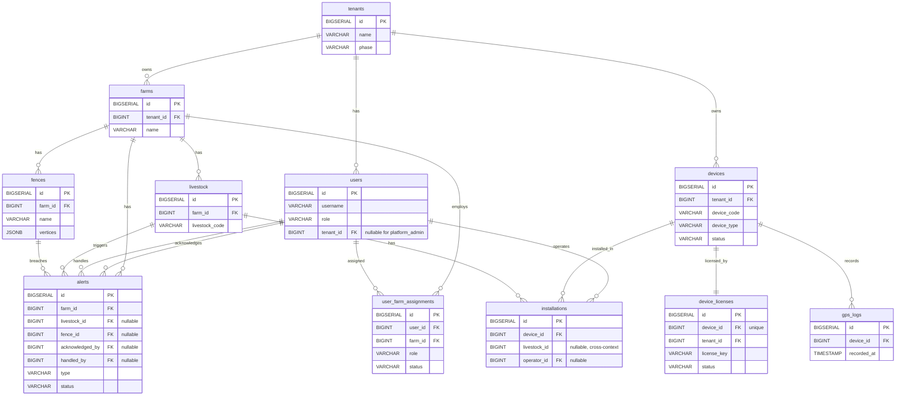

# MVP阶段建议分三期：

### MVP Phase 1 — 核心底座（先让应用"能用"）

认证 + 用户管理（JWT、角色权限）
租户 + 牧场（多租户隔离基础）
设备 + 牲畜（核心领域对象）
围栏 + 告警（用户最需要的核心功能）
Dashboard + Map（组合上述数据展示）
这一期做完，牧场主就能用 App 管理牲畜、看围栏、收告警了。

### MVP Phase 2 — 商业模型（在底座上叠加）

订阅 + 功能门控
合同 + 分润对账
B端管理后台
牧工管理
API 授权 / 开发者门户

### Phase 3: IoT 接入（设备 license、LoRa/NS 平台、真实传感器数据）

TODO：
livestock表中：
| tag_id | VARCHAR(50) | UNIQUE, NOT NULL | 耳标号 | --》已修改为 livestock_code（牲畜终身编号），设备标识通过 installations 关联 devices 获取。

# 第 1 段：限界上下文（Bounded Context）划分

## 1. Identity Context（身份与租户）


| 类型  | 名称          | 对应 Demo 模块    | 说明                                                 |
| --- | ----------- | ------------- | -------------------------------------------------- |
| 聚合根 | Tenant      | tenant        | 租户，含 phase(SAMPLE/BATCH)                           |
| 聚合根 | User        | auth, mine    | 用户，含角色和认证信息                                        |
| 聚合根 | Farm        | farm_switcher | 牧场，归属 Tenant                                       |
| 值对象 | Role        | —             | owner/worker/platform_admin/b2b_admin/api_consumer |
| 值对象 | TenantPhase | —             | SAMPLE（首年免费）/ BATCH（签合同后）                          |


## 2. Ranch Context（牧场管理）


| 类型  | 名称           | 对应 Demo 模块                             | 说明                                                                          |
| --- | ------------ | -------------------------------------- | --------------------------------------------------------------------------- |
| 聚合根 | Livestock    | livestock                              | 牲畜档案，含品种、体重、健康状态                                                            |
| 聚合根 | Fence        | fence                                  | 电子围栏，多边形顶点，关联 Farm                                                          |
| 聚合根 | Alert        | alerts                                 | 告警，状态机(pending→ack→handled→archived)                                        |
| 聚合根 | Worker       | worker_management, b2b_admin(worker部分) | 牧工，通过 user_farm_assignments 表（含 role 字段）关联 User 和 Farm |
| 值对象 | HealthStatus | —                                      | healthy / warning / critical                                                |
| 值对象 | AlertStatus  | —                                      | pending / acknowledged / handled / archived                                 |
| 值对象 | AlertType    | —                                      | FENCE_BREACH / TEMPERATURE_ABNORMAL / BEHAVIOR_ABNORMAL / ESTRUS / EPIDEMIC |


## 3. IoT Context（设备与数据）


| 类型  | 名称               | 对应 Demo 模块    | 说明                                               |
| --- | ---------------- | ------------- | ------------------------------------------------ |
| 聚合根 | Device           | devices       | 设备(ear_tag/tracker/capsule/accelerometer)，含状态、SN、DevEUI 和 LoRa 信息   |
| 聚合根 | DeviceLicense    | — (Issue #33) | 设备许可证，绑定 Device 和 Tenant                         |
| 聚合根 | Installation     | devices       | 安装记录，绑定 Device 和 Livestock                       |
| 实体  | GpsLog           | —             | GPS 时序数据：deviceId, lat, lng, timestamp           |
| 实体  | TemperatureLog   | fever_warning | 温度时序数据：deviceId, temperature, timestamp          |
| 实体  | PeristalticLog   | digestive     | 蠕动时序数据：deviceId, frequency, intensity, timestamp |
| 实体  | AccelerometerLog | —             | 加速度时序数据（Phase 3）                                 |
| 值对象 | DeviceType       | —             | EAR_TAG / TRACKER / CAPSULE / ACCELEROMETER                |
| 值对象 | DeviceStatus     | —             | INVENTORY / ACTIVE / OFFLINE / DECOMMISSIONED    |


## 4. Health Context（健康分析） — 之前遗漏


| 类型  | 名称                  | 对应 Demo 模块    | 说明                             |
| --- | ------------------- | ------------- | ------------------------------ |
| 聚合根 | HealthProfile       | twin_overview | 牲畜健康档案，汇总健康评分                  |
| 实体  | FeverAssessment     | fever_warning | 发热评估：基线温度、阈值、72h 趋势、结论         |
| 实体  | DigestiveAssessment | digestive     | 消化评估：蠕动基线、24h 趋势、建议            |
| 实体  | EstrusAssessment    | estrus        | 发情评估：综合评分(步态+温度+距离)、7d 趋势、配种建议 |
| 实体  | EpidemicAssessment  | epidemic      | 疫情评估：群体健康指标、接触追踪、异常率           |
| 值对象 | HealthScore         | —             | 综合健康评分（温度+蠕动+活动量加权）            |


核心逻辑： Health Context 消费 IoT Context 的遥测数据，通过领域服务计算健康评估，结果可触发 Ranch Context 的告警。

## 5. Commerce Context（商业模型）


| 类型  | 名称                  | 对应 Demo 模块                      | 说明                          |
| --- | ------------------- | ------------------------------- | --------------------------- |
| 聚合根 | Subscription        | subscription                    | 订阅，绑定 Tenant，含 phase 和 tier |
| 聚合根 | SubscriptionService | subscription_service_management | 可订阅的服务目录（围栏服务、健康服务等）        |
| 聚合根 | Contract            | contract_management             | B2B 合同，约定 tier、分润比例、有效期     |
| 聚合根 | Revenue             | revenue                         | 分润记录，关联 Contract，按月结算       |
| 聚合根 | ApiKey              | api_authorization               | API 密钥，含权限范围和调用频率           |
| 值对象 | SubscriptionTier    | —                               | basic / pro / enterprise    |
| 值对象 | SubscriptionPhase   | —                               | SAMPLE / BATCH              |


## 6. Analytics Context（数据洞察） — 之前遗漏


| 类型  | 名称        | 对应 Demo 模块                  | 说明                        |
| --- | --------- | --------------------------- | ------------------------- |
| 聚合根 | Dashboard | dashboard, admin, b2b_admin | 看板数据聚合：牲畜数/健康率/告警数/设备在线率  |
| 聚合根 | MapView   | pages/map                   | 地图视图：牲畜实时位置 + 围栏叠加 + 告警标记 |
| 聚合根 | Stats     | stats                       | 统计分析：健康/告警/设备概览，按时间段聚合    |


核心逻辑： Analytics 是纯读模型（CQRS 的 Query 侧），不持有独立业务规则，而是组合 Identity/Ranch/IoT/Health 的数据生成视图。

## 完整跨上下文映射

```
        ┌─────────────────────────────────────┐
        │         Analytics Context            │
        │  (Dashboard / MapView / Stats)       │
        │         读模型，消费所有上下文数据       │
        └──────▲─────▲──────▲──────▲───────────┘
               │     │      │      │
     ┌─────────┘     │      │      └─────────┐
     │               │      │                │
┌────┴────┐    ┌─────┴──┐   │          ┌─────┴────┐
│ Identity│    │ Ranch  │   │          │Commerce  │
│         │    │        │   │          │          │
│ Tenant  │◄───│Fence   │   │          │Subscription│
│ User    │    │Alert   │   │          │Contract  │
│ Farm    │    │Livestock│  │          │Revenue   │
└────┬────┘    │Worker  │   │          │ApiKey    │
     │         └───┬────┘   │          └────┬─────┘
     │             │        │               │
     │        ┌────┴────────┴────┐          │
     └───────►│   IoT Context    │◄─────────┘
owns          │                  │   gates
              │ Device           │
              │ DeviceLicense    │
              │ Installation     │
              │ TelemetryLogs    │
              └──────┬───────────┘
                     │ 遥测数据
                     ▼
              ┌──────────────┐
              │Health Context│
              │              │
              │ FeverAssess  │
              │ DigestiveAss │
              │ EstrusAssess │
              │ EpidemicAss  │
              └──────────────┘
```


| 上游       | 下游                 | 模式     | 关键关系                         |
| -------- | ------------------ | ------ | ---------------------------- |
| Identity | 所有                 | 共享内核   | Tenant ID 全局隔离键              |
| Commerce | Ranch, IoT, Health | 开放主机服务 | tier/phase 查询，功能门控和配额        |
| IoT      | Health             | 领域事件   | 遥测数据更新 → 触发健康评估              |
| IoT      | Ranch              | 领域事件   | GPS 数据 → 围栏越界检测 → 告警         |
| Health   | Ranch              | 领域事件   | 健康异常 → 告警                    |
| IoT      | Commerce           | 领域事件   | 设备激活/过期 → 计费                 |
| Commerce | Identity           | 领域事件   | 合同签署 → Tenant.phase 转为 BATCH |
| 所有       | Analytics          | 开放主机服务 | 各上下文提供查询接口，Analytics 组合聚合    |


## 客户旅程：

```
                样品单阶段                    批量单阶段
                 ┌─────────────┐            ┌──────────────┐
```

试用/测试 ────▶       │  Free Tier  │ ───────▶│  订阅服务     │
                     │             │  签合同后   │              │
                     │ 围栏：免费   │  转为       │ 按 tier 收费  │
                     │ 告警：免费   │  批量单     │ 功能门控生效  │
                     │ 设备：5-10台 │            │ 配额限制生效  │
                     │ 数据：7天    │            │              │
                     └─────────────┘            └──────────────┘

# 第 2 段：Phase 1 数据库 Schema 设计

Phase 1 覆盖 Identity + Ranch + IoT（Device 聚合）三个上下文，Commerce 和 Health 放 Phase 2，Analytics 是读模型不需要独立表。

## Identity Context

### users — 用户


| 列名            | 类型           | 约束                        | 说明                                                 |
| ------------- | ------------ | ------------------------- | -------------------------------------------------- |
| id            | BIGSERIAL    | PK                        |                                                    |
| username      | VARCHAR(50)  | UNIQUE, NOT NULL          |                                                    |
| password_hash | VARCHAR(100) | NOT NULL                  | BCrypt                                             |
| name          | VARCHAR(100) | NOT NULL                  | 显示名                                                |
| phone         | VARCHAR(20)  |                           | 手机号                                                |
| role          | VARCHAR(30)  | NOT NULL                  | owner/worker/platform_admin/b2b_admin/api_consumer |
| tenant_id     | BIGINT       | FK → tenants.id, NOT NULL | 所属租户（platform_admin 为 NULL）                        |
| is_active     | BOOLEAN      | DEFAULT true              |                                                    |
| last_login_at | TIMESTAMP    |                           |                                                    |
| created_at    | TIMESTAMP    | DEFAULT now()             |                                                    |
| updated_at    | TIMESTAMP    | DEFAULT now()             |                                                    |


### tenants — 租户


| 列名            | 类型           | 约束                         | 说明             |
| ------------- | ------------ | -------------------------- | -------------- |
| id            | BIGSERIAL    | PK                         |                |
| name          | VARCHAR(100) | NOT NULL                   | 租户名称           |
| contact_name  | VARCHAR(100) |                            | 联系人            |
| contact_phone | VARCHAR(20)  |                            | 联系电话           |
| phase         | VARCHAR(10)  | NOT NULL, DEFAULT 'SAMPLE' | SAMPLE / BATCH |
| created_at    | TIMESTAMP    | DEFAULT now()              |                |
| updated_at    | TIMESTAMP    | DEFAULT now()              |                |


### farms — 牧场


| 列名            | 类型            | 约束                        | 说明     |
| ------------- | ------------- | ------------------------- | ------ |
| id            | BIGSERIAL     | PK                        |        |
| tenant_id     | BIGINT        | FK → tenants.id, NOT NULL | 所属租户   |
| name          | VARCHAR(100)  | NOT NULL                  | 牧场名称   |
| latitude      | DECIMAL(10,7) |                           | 中心纬度   |
| longitude     | DECIMAL(10,7) |                           | 中心经度   |
| area_hectares | DECIMAL(10,2) |                           | 面积（公顷） |
| created_at    | TIMESTAMP     | DEFAULT now()             |        |
| updated_at    | TIMESTAMP     | DEFAULT now()             |        |


## Ranch Context

### livestock — 牲畜


| 列名               | 类型            | 约束                          | 说明                       |
| ---------------- | ------------- | --------------------------- | ------------------------ |
| id               | BIGSERIAL     | PK                          |                          |
| farm_id          | BIGINT        | FK → farms.id, NOT NULL     | 所属牧场                     |
| livestock_code   | VARCHAR(50)   | NOT NULL                    | 牲畜编号（终身不变，设备标识通过 installations 关联 devices 获取）|
| breed            | VARCHAR(50)   |                             | 品种                       |
| gender           | VARCHAR(10)   | CHECK IN ('公','母')          |                          |
| birth_date       | DATE          |                             | 出生日期                     |
| weight           | DECIMAL(7,2)  |                             | 体重(kg)                   |
| health_status    | VARCHAR(20)   | NOT NULL, DEFAULT 'healthy' | healthy/warning/critical |
| last_latitude    | DECIMAL(10,7) |                             | 最新纬度（缓存）                 |
| last_longitude   | DECIMAL(10,7) |                             | 最新经度（缓存）                 |
| last_position_at | TIMESTAMP     |                             | 最后定位时间                   |
| created_at       | TIMESTAMP     | DEFAULT now()               |                          |
| updated_at       | TIMESTAMP     | DEFAULT now()               |                          |


### fences — 电子围栏


| 列名         | 类型           | 约束                         | 说明                    |
| ---------- | ------------ | -------------------------- | --------------------- |
| id         | BIGSERIAL    | PK                         |                       |
| farm_id    | BIGINT       | FK → farms.id, NOT NULL    | 所属牧场                  |
| name       | VARCHAR(100) | NOT NULL                   | 围栏名称                  |
| vertices   | JSONB        | NOT NULL                   | 多边形顶点 [{lat,lng},...] |
| color      | VARCHAR(7)   |                            | 显示颜色 #RRGGBB          |
| status     | VARCHAR(20)  | NOT NULL, DEFAULT 'active' | active/disabled       |
| created_at | TIMESTAMP    | DEFAULT now()              |                       |
| updated_at | TIMESTAMP    | DEFAULT now()              |                       |


### alerts — 告警


| 列名              | 类型          | 约束                          | 说明                                                                          |
| --------------- | ----------- | --------------------------- | --------------------------------------------------------------------------- |
| id              | BIGSERIAL   | PK                          |                                                                             |
| farm_id         | BIGINT      | FK → farms.id, NOT NULL     | 所属牧场                                                                        |
| livestock_id    | BIGINT      | FK → livestock.id           | 关联牲畜                                                                        |
| fence_id        | BIGINT      | FK → fences.id              | 关联围栏（越界告警时）                                                                 |
| type            | VARCHAR(30) | NOT NULL                    | FENCE_BREACH / TEMPERATURE_ABNORMAL / BEHAVIOR_ABNORMAL / ESTRUS / EPIDEMIC |
| status          | VARCHAR(20) | NOT NULL, DEFAULT 'pending' | 状态机：pending→acknowledged→handled→archived                                   |
| severity        | VARCHAR(10) | NOT NULL, DEFAULT 'warning' | info/warning/critical                                                       |
| message         | TEXT        |                             | 告警描述                                                                        |
| acknowledged_by | BIGINT      | FK → users.id               | 确认人                                                                         |
| acknowledged_at | TIMESTAMP   |                             | 确认时间                                                                        |
| handled_by      | BIGINT      | FK → users.id               | 处理人                                                                         |
| handled_at      | TIMESTAMP   |                             | 处理时间                                                                        |
| created_at      | TIMESTAMP   | DEFAULT now()               |                                                                             |
| updated_at      | TIMESTAMP   | DEFAULT now()               |                                                                             |


### user_farm_assignments — 用户与牧场的分配关系


| 列名         | 类型          | 约束                         | 说明              |
| ---------- | ----------- | -------------------------- | --------------- |
| id         | BIGSERIAL   | PK                         |                 |
| user_id    | BIGINT      | FK → users.id, NOT NULL    | 用户              |
| farm_id    | BIGINT      | FK → farms.id, NOT NULL    | 牧场              |
| role       | VARCHAR(30) | NOT NULL                   | 在该牧场的角色（owner/worker） |
| status     | VARCHAR(20) | NOT NULL, DEFAULT 'active' | active/disabled |
| created_at | TIMESTAMP   | DEFAULT now()              |                 |

UNIQUE(user_id, farm_id)


## IoT Context（Phase 1）

### devices — 设备


| 列名               | 类型          | 约束                            | 说明                                            |
| ---------------- | ----------- | ----------------------------- | --------------------------------------------- |
| id               | BIGSERIAL   | PK                            |                                               |
| tenant_id        | BIGINT      | FK → tenants.id, NOT NULL     | 所属租户                                          |
| device_code      | VARCHAR(50) | UNIQUE, NOT NULL              | 设备 SN（商品编号） |
| device_type      | VARCHAR(20) | NOT NULL                      | EAR_TAG / TRACKER / CAPSULE / ACCELEROMETER             |
| dev_eui          | VARCHAR(16) |                               | LoRa DevEUI（设备入网号）                                   |
| status           | VARCHAR(20) | NOT NULL, DEFAULT 'INVENTORY' | INVENTORY / ACTIVE / OFFLINE / DECOMMISSIONED |
| battery_level    | INTEGER     |                               | 电量百分比                                         |
| firmware_version | VARCHAR(50) |                               | 固件版本                                          |
| last_online_at   | TIMESTAMP   |                               | 最后在线时间                                        |
| created_at       | TIMESTAMP   | DEFAULT now()                 |                                               |
| updated_at       | TIMESTAMP   | DEFAULT now()                 |                                               |


### device_licenses — 设备许可证


| 列名           | 类型           | 约束                                | 说明                         |
| ------------ | ------------ | --------------------------------- | -------------------------- |
| id           | BIGSERIAL    | PK                                |                            |
| device_id    | BIGINT       | FK → devices.id, UNIQUE, NOT NULL | 一对一绑定设备                    |
| tenant_id    | BIGINT       | FK → tenants.id, NOT NULL         | 购买方                        |
| license_key  | VARCHAR(100) | UNIQUE, NOT NULL                  | 许可证密钥                      |
| status       | VARCHAR(20)  | NOT NULL, DEFAULT 'ACTIVE'        | ACTIVE / EXPIRED / REVOKED |
| activated_at | TIMESTAMP    |                                   | 激活时间                       |
| expires_at   | TIMESTAMP    | NOT NULL                          | 过期时间                       |
| created_at   | TIMESTAMP    | DEFAULT now()                     |                            |


### installations — 安装记录


| 列名           | 类型        | 约束                          | 说明                 |
| ------------ | --------- | --------------------------- | ------------------ |
| id           | BIGSERIAL | PK                          |                    |
| device_id    | BIGINT    | FK → devices.id, NOT NULL   | 设备                 |
| livestock_id | BIGINT    | NOT NULL                    | 牲畜 ID（跨上下文引用，无 FK 约束，应用层保证一致性） |
| installed_at | TIMESTAMP | NOT NULL                    | 安装时间               |
| removed_at   | TIMESTAMP |                             | 拆除时间（NULL = 当前安装中） |
| operator_id  | BIGINT    | FK → users.id               | 操作人                |
| created_at   | TIMESTAMP | DEFAULT now()               |                    |


约束：同一设备不能有两条 removed_at IS NULL 的记录。
跨上下文引用说明：installations.livestock_id 不使用 FK 约束，避免 IoT 和 Ranch 上下文的数据库耦合。一致性由 InstallationApplicationService 在安装时校验。

### gps_logs — GPS 定位日志（Phase 1 用模拟数据）


| 列名          | 类型            | 约束                        | 说明    |
| ----------- | ------------- | ------------------------- | ----- |
| id          | BIGSERIAL     | PK                        |       |
| device_id   | BIGINT        | FK → devices.id, NOT NULL | 设备    |
| latitude    | DECIMAL(10,7) | NOT NULL                  | 纬度    |
| longitude   | DECIMAL(10,7) | NOT NULL                  | 经度    |
| accuracy    | DECIMAL(6,2)  |                           | 精度(m) |
| recorded_at | TIMESTAMP     | NOT NULL                  | 记录时间  |
| created_at  | TIMESTAMP     | DEFAULT now()             |       |


索引：(device_id, recorded_at DESC)

Phase 1 表总览（11 张）


| 上下文      | 表                     | 聚合根           |
| -------- | --------------------- | ------------- |
| Identity | users                 | User          |
| Identity | tenants               | Tenant        |
| Identity | farms                 | Farm          |
| Ranch    | livestock             | Livestock     |
| Ranch    | fences                | Fence         |
| Ranch    | alerts                | Alert         |
| Identity | user_farm_assignments | —（关系表）       |
| IoT      | devices               | Device        |
| IoT      | device_licenses       | DeviceLicense |
| IoT      | installations         | Installation  |
| IoT      | gps_logs              | —（时序实体）       |
| (预留)     | flyway_schema_history | —（迁移管理）       |


Phase 1 ER 图（实体关系图）




┌─────────────────────────────────────────────────────────────────────────────┐

│  Identity Context                                                           │

│                                                                             │

│  ┌──────────────┐       ┌──────────────┐       ┌──────────────┐            │

│  │   tenants     │       │    farms      │       │    users      │            │

│  │──────────────│       │──────────────│       │──────────────│            │

│  │ PK id        │──1:N──│ PK id        │       │ PK id        │            │

│  │    name      │       │ FK tenant_id │──┐    │ FK tenant_id │            │

│  │    phase     │       │    name      │  │    │    username   │            │

│  │    contact_* │       │    lat/lng   │  │    │    password   │            │

│  └──────────────┘       │    area      │  │    │    role       │            │

│       │                 └──────┬───────┘  │    └──────┬───────┘            │

│       │1:N                     │          │         │                     │

│       │              共享内核    │          │         │                     │

│       ▼                   farm_id 引用    │         │                     │

│  ┌──────────────┐           │          │         │                     │

│  │              │           │          │         │                     │

│  └──────────────┘           │          │         │                     │

└─────────────────────────────┼──────────┼─────────┼─────────────────────┘

                              │          │         │

          ┌───────────────────┼──────────┼─────────┼──────────────────┐

          │                   ▼          ▼         ▼                  │

          │  ┌──────────────────────────────────────────────────┐     │

          │  │              Ranch Context                       │     │

          │  │                                                  │     │

          │  │  ┌────────────┐  ┌────────────┐  ┌────────────┐ │     │

          │  │  │  livestock  │  │   fences    │  │   alerts    │ │     │

          │  │  │────────────│  │────────────│  │────────────│ │     │

          │  │  │ PK id      │  │ PK id      │  │ PK id      │ │     │

          │  │  │ FK farm_id │  │ FK farm_id │  │ FK farm_id │ │     │

          │  │  │    livestock_code  │  │    name    │  │ FK livestk │─┘     │

          │  │  │    breed   │  │    vertices│  │ FK fence_id│─┐     │

          │  │  │    weight  │  │    color   │  │    type    │ │     │

          │  │  │    health  │  │    status  │  │    status  │ │     │

          │  │  │    lat/lng │  └────────────┘  │    message │ │     │

          │  │  └──────┬─────┘                  │ ack_by→usr │ │     │

          │  │         │                        │ hdl_by→usr │ │     │

          │  │         │                        └────────────┘ │     │

          │  │         │                                       │     │

          │  │  ┌──────┴─────┐                                │     │

          │  │  │  user_farm    │                                │     │

          │  │  │────────────│                                │     │

          │  │  │ PK id      │                                │     │

          │  │  │ FK user_id │◄───────────────────────────────┘     │

          │  │  │ FK farm_id │                                      │

          │  │  │    status  │                                      │

          │  │  └────────────┘                                      │

          │  └──────────────────────────────────────────────────────┘

          │                                                          │

          │  ┌──────────────────────────────────────────────────────┐

          │  │              IoT Context                             │

          │  │                                                      │

          │  │  ┌────────────┐  ┌────────────────┐                 │

          │  │  │  devices    │  │ device_licenses │                 │

          │  │  │────────────│  │────────────────│                 │

          │  │  │ PK id      │─1│ PK id          │                 │

          │  │  │ FK tennt_id│:1│ FK device_id   │                 │

          │  │  │    dev_code│  │ FK tenant_id   │                 │

          │  │  │    dev_type│  │    license_key │                 │

          │  │  │    status  │  │    status      │                 │

          │  │  │    battery │  │    expires_at  │                 │

          │  │  │    dev_eui │  └────────────────┘                 │

          │  │  └──────┬─────┘                                      │

          │  │         │                                            │

          │  │         │1:N                                         │

          │  │         ▼                                            │

          │  │  ┌────────────────┐  ┌────────────┐                 │

          │  │  │ installations  │  │  gps_logs   │                 │

          │  │  │────────────────│  │────────────│                 │

          │  │  │ PK id          │  │ PK id      │                 │

          │  │  │ FK device_id   │  │ FK device  │                 │

          │  │  │ FK livestock_id│──┼──► 跨上下文 │                 │

          │  │  │    installed_at│  │    lat/lng  │                 │

          │  │  │    removed_at  │  │    accuracy │                 │

          │  │  │ FK operator_id │  │ recorded_at │                 │

          │  │  └────────────────┘  └────────────┘                 │

          │  └──────────────────────────────────────────────────────┘

          │                                                          │

          └──────────────────────────────────────────────────────────┘

 关系汇总：

 ──────────────────────────────────────────────────────────

  tenants ──1:N──▶ farms           租户拥有多个牧场

  tenants ──1:N──▶ users           租户下多个用户

  tenants ──1:N──▶ devices         租户下多个设备

  tenants ──1:N──▶ device_licenses 租户购买多个许可证

  farms   ──1:N──▶ livestock      牧场下多头牲畜  [共享内核引用]

  farms   ──1:N──▶ fences         牧场下多个围栏  [共享内核引用]

  farms   ──1:N──▶ alerts         牧场下多条告警  [共享内核引用]

  farms   ──1:N──▶ user_farm_assignments  牧场下多个成员  [共享内核引用]

  livestock──1:N──▶ alerts        牲畜关联多条告警

  fences  ──1:N──▶ alerts         围栏关联越界告警(可为NULL)

  users   ──1:N──▶ alerts.ack     用户确认告警

  users   ──1:N──▶ alerts.handle  用户处理告警

  users   ──1:N──▶ user_farm_assignments  用户关联牧场成员身份

  users   ──1:N──▶ installations  用户作为安装操作人

  devices ──1:1──▶ device_licenses 设备绑定一个许可证

  devices ──1:N──▶ installations  设备可多次安装/拆除

  devices ──1:N──▶ gps_logs       设备产生GPS时序数据

  livestock──1:N──▶ installations 牲畜可多次安装设备 [跨上下文]

